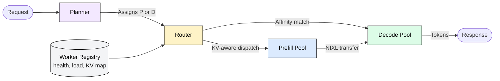
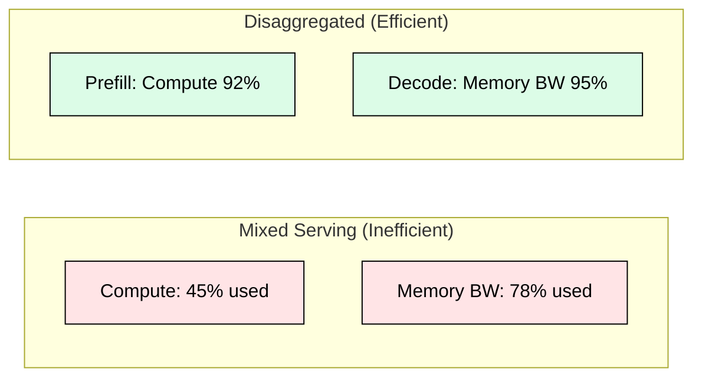
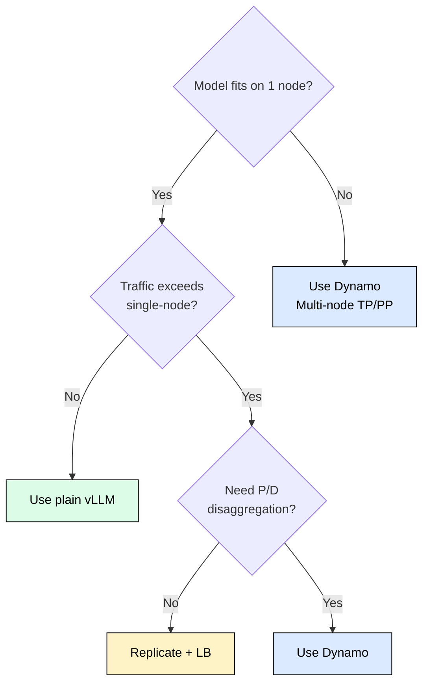

 

# 5.4 NVIDIA Dynamo

## Why Dynamo Exists

Single-node inference engines (vLLM, TensorRT-LLM, SGLang) optimize one model on one machine. When traffic exceeds single-node capacity, or when separating prefill from decode yields better GPU utilization, you need a cluster-level orchestrator. NVIDIA Dynamo is that orchestrator: it coordinates engines across nodes, routes requests based on KV cache location, enables disaggregated prefill/decode serving, and moves KV state between GPUs at hardware speed via NIXL.

Released as open source at GTC 2025, Dynamo does not replace your engine. It wraps it, adding the coordination layer that makes multi-node inference practical.

```mermaid
flowchart LR
    subgraph "Single-Node Engine (vLLM/TRT-LLM)"
        direction TB
        A[Kernel Fusion] --> B[Batching]
        B --> C[KV Cache Mgmt]
        C --> D[One Node]
    end
    subgraph "Dynamo Orchestration Layer"
        direction TB
        E[Cross-Node Routing] --> F[KV Transfer via NIXL]
        F --> G[P/D Disaggregation]
        G --> H[Dynamic Pool Scaling]
    end
    D -->|"Wraps"| E
    style A fill:#dbeafe,stroke:#000,color:#000
    style B fill:#dbeafe,stroke:#000,color:#000
    style C fill:#dbeafe,stroke:#000,color:#000
    style D fill:#dbeafe,stroke:#000,color:#000
    style E fill:#dcfce7,stroke:#000,color:#000
    style F fill:#dcfce7,stroke:#000,color:#000
    style G fill:#dcfce7,stroke:#000,color:#000
    style H fill:#dcfce7,stroke:#000,color:#000
```

## Architecture: Four Components

Dynamo decomposes distributed inference into four cooperating pieces.

**Planner.** Decides whether a request goes to prefill or decode, selects parallelism strategy, and coordinates the P/D handoff. Has global visibility into load, KV state, and hardware topology.

**Router.** Maintains a KV cache location map. Routes multi-turn requests to the worker holding existing KV cache (affinity routing), groups requests sharing system prompts to workers with cached prefixes (prefix routing), and falls back to cost-based decisions when preferred workers are overloaded.

**Workers.** Thin wrappers around vLLM, TRT-LLM, or SGLang. A worker runs one engine, reports metrics to the control plane, and exposes KV cache for NIXL transfers. Engine-agnostic adapter interface means you keep your per-node optimizations.

**NIXL (NVIDIA Inference Transfer Library).** GPU-to-GPU KV cache transfer using RDMA, bypassing CPU entirely. Transfer times for a 10.7 GB KV cache (Llama 70B, 32K context): NVLink ~12ms, InfiniBand GPUDirect ~214ms, CPU-mediated ~548ms. Without NIXL, disaggregation overhead erases its benefits.

## Disaggregated Prefill/Decode

The core insight: prefill is compute-bound (saturates FLOPs), decode is memory-bandwidth-bound (reads entire KV cache per token). Running both on the same GPU pool wastes resources because neither dimension is fully utilized.

The pipeline for one request:

1. **Prefill** on a compute-optimized worker (high TP, moderate batch)
2. **NIXL transfer** of KV cache to decode worker (12ms on NVLink)
3. **Decode** on a bandwidth-optimized worker (large batch, high memory utilization)
4. **Subsequent turns** route directly to the decode worker via affinity

Each pool scales independently. TTFT rising? Add prefill workers. ITL rising? Add decode workers. Prefill idle while decode saturated? Rebalance workers between pools.

## KV-Aware Routing

Traditional load balancers treat requests as stateless. LLM serving breaks this assumption because conversations carry KV cache state. Routing a multi-turn request to a new worker means either re-prefilling the full history (expensive) or transferring the cache (overhead).

Dynamo's Router maintains a global KV location index and supports four strategies:

| Strategy | Behavior | Best For |
|----------|----------|----------|
| Strict Affinity | Always route to KV-holding worker | Long conversations |
| Soft Affinity | Prefer KV holder unless overloaded | Balanced latency |
| Prefix-First | Group by shared system prompt | API platforms |
| Cost-Based | Pick lowest expected latency path | Mixed workloads |

For a 32K-token conversation, affinity routing saves ~800ms of re-prefill latency per turn.

## When to Use Dynamo

**Single node, fits in memory:** plain vLLM. No orchestration needed.
**Single node, traffic overflow:** replicate vLLM instances behind a load balancer.
**Multi-node or P/D disaggregation on NVIDIA hardware:** Dynamo is purpose-built.
**Kubernetes-native P/D:** consider llm-d (K8s AI Working Group project).

## Performance (Llama 70B, 4 nodes of 8xH100)

| Metric | Aggregated | Disaggregated (Dynamo) | Improvement |
|--------|-----------|----------------------|-------------|
| TTFT P50 | 1,200 ms | 450 ms | 2.7x |
| TTFT P95 | 3,800 ms | 980 ms | 3.9x |
| ITL P50 | 28 ms | 22 ms | 1.3x |
| Throughput | 12,400 tok/s | 18,600 tok/s | 1.5x |
| GPU utilization | 58% | 87% | +29pp |
| Cost per 1M tokens | $0.82 | $0.55 | 33% savings |

Source: NVIDIA GTC 2025, Session S72451.

## Limitations

- **NVIDIA-only.** Requires NVLink/InfiniBand for NIXL. Ethernet-only networks lose the primary advantage.
- **Early-stage.** API stability not guaranteed. Limited production deployments outside NVIDIA partners.
- **Not Kubernetes-native.** Manual control plane deployment. llm-d fills the K8s gap.
- **Single-vendor lock-in.** Cannot orchestrate AMD MI300X, TPU, or Trainium hardware.
- **Operational overhead.** Adds a control plane (Planner, Router, Registry) to monitor and maintain.

## FAQ

**Q: Does Dynamo replace vLLM?**
No. Dynamo wraps vLLM (or TRT-LLM, SGLang) and adds cross-node orchestration. Your per-node engine stays unchanged.

**Q: What hardware is required?**
NVIDIA GPUs with NVLink (intra-node) and InfiniBand with GPUDirect RDMA (inter-node) for optimal NIXL performance. It functions on Ethernet but loses the disaggregation latency advantage.

**Q: How does Dynamo compare to Ray Serve?**
Ray Serve is a general ML serving framework. Dynamo is LLM-specific with KV-aware routing and NIXL transfers. Use Ray for polyglot pipelines, Dynamo for multi-node LLM inference with P/D disaggregation.

**Q: What is the minimum cluster size where Dynamo helps?**
Compute-heavy workloads: 2+ nodes. Memory-heavy (long conversations): 3+ nodes. Mixed: 4+ nodes.

**Q: Can I mix engines (prefill on TRT-LLM, decode on vLLM)?**
Technically possible via Dynamo's adapter interface, but cross-engine KV format conversion adds overhead. Not production-ready as of mid-2025.

**Q: What happens if the preferred decode worker fails?**
Router detects the failure, triggers re-prefill of active conversations on healthy workers. KV cache on the failed node is lost. Recovery adds TTFT latency for affected conversations.

**Q: Is Dynamo required for disaggregated serving?**
No. DistServe (OSDI 2024) and Splitwise (ISCA 2024) demonstrate the concept without Dynamo. But Dynamo provides the production-grade implementation with NIXL, autoscaling, and engine adapters.

## References

- NVIDIA Dynamo GitHub: https://github.com/ai-dynamo/dynamo
- NVIDIA NIXL: https://github.com/ai-dynamo/nixl
- GTC 2025 Session S72451: "NVIDIA Dynamo: A Datacenter Scale Distributed Inference Framework"
- Zhong et al., "DistServe: Disaggregating Prefill and Decoding for Goodput-optimized LLM Serving" (OSDI 2024)
- Patel et al., "Splitwise: Efficient Generative LLM Inference Using Phase Splitting" (ISCA 2024)
- Agrawal et al., "Taming Throughput-Latency Tradeoff in LLM Inference with Sarathi-Serve" (OSDI 2024)
