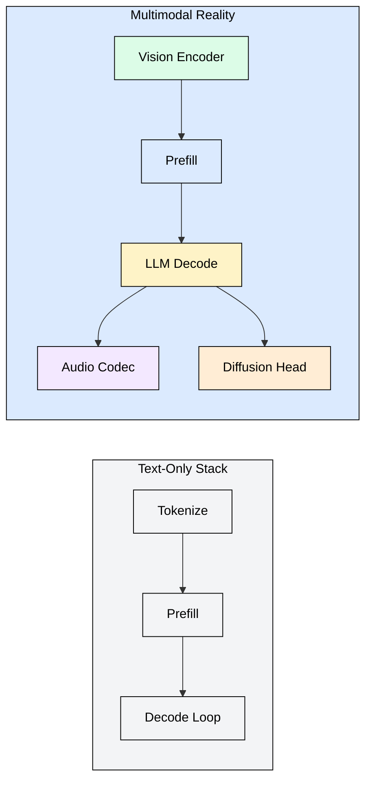
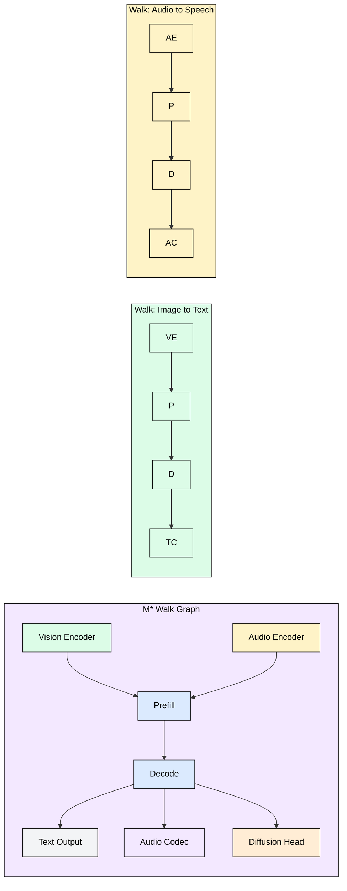
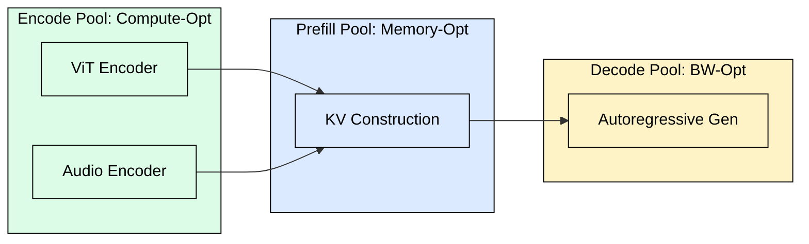
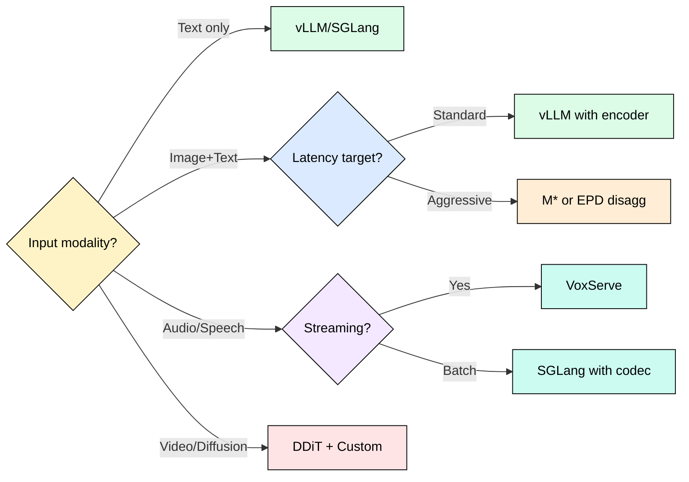

 

# 5.5 Multimodal Serving: Beyond the Autoregressive Loop

vLLM and SGLang assume inference is a single autoregressive loop. Models like BAGEL, Qwen3-Omni, and Orpheus break that assumption with composite architectures that combine encoders, LLM backbones, diffusion heads, and audio codecs wired together in different patterns per request. A user sends an image and asks for a spoken answer: the system must run a vision encoder, prefill the LLM, decode text tokens, then stream those tokens through an audio codec. Each stage has different compute profiles, memory footprints, and latency constraints. Existing serving stacks treat this as a monolithic forward pass and leave performance on the table.

## Why Text Serving Stacks Fall Short

Text-only serving engines optimize for a single pipeline: tokenize, prefill KV cache, decode autoregressively. Every request follows the same path through the same hardware. Continuous batching groups requests at the decode stage because all requests perform identical operations per step.

Multimodal models violate three assumptions that text stacks rely on:

1. **Heterogeneous compute per request.** A vision-language request runs a ViT encoder (compute-bound, no KV cache) then an LLM decoder (memory-bound, KV cache heavy). A text-only request skips the encoder entirely. Batching these together wastes resources.
2. **Non-linear execution graphs.** Speech models like Orpheus run a Thinker LLM that produces semantic tokens, then a Talker codec that converts them to audio frames. These stages cannot overlap in a flat pipeline because the Talker depends on Thinker output.
3. **Variable output modalities.** The same model may produce text, audio chunks, or image patches depending on the prompt. Each output type has different streaming granularity and latency targets.

The flat pipeline forces all requests through identical stages. Multimodal workloads need graph-based scheduling where each request traverses only the nodes it requires.

## The Walk Graph Abstraction

M* (Stanford, June 2026, arXiv:2606.12688) introduces a formal abstraction for multimodal serving: the **walk graph**. Instead of a fixed pipeline, each model is described as a directed graph of compute nodes. Each request specifies a **walk**: the ordered subset of nodes it needs to traverse.

A node represents a compute stage: vision encoder, audio encoder, LLM prefill, LLM decode, diffusion step, or codec decode. Edges represent data dependencies. The serving engine schedules walks across a heterogeneous cluster, placing each node on the hardware best suited to its compute profile.

Key insight: two requests sharing an LLM backbone but using different encoders can share KV cache pages for the backbone while running their encoders on separate accelerators. M* exploits this by decomposing the monolithic "model" into independently schedulable components.

The scheduler maintains a global queue per node type and packs requests from different walks into the same batch when they share a node. This achieves higher utilization than running each walk as an isolated pipeline.

## EPD Disaggregation

EPD (Encode-Prefill-Decode) disaggregation extends the prefill/decode separation from DistServe (arXiv:2401.09670) to multimodal workloads. The core idea from arXiv:2501.05460: split the serving cluster into three pools of workers, each specialized for one stage.

**Encode workers** run vision/audio encoders on compute-optimized GPUs (high FLOPS, less memory). **Prefill workers** handle the KV cache construction for long multimodal contexts. **Decode workers** are memory-bandwidth optimized for autoregressive generation. Intermediate activations transfer between pools via high-bandwidth interconnects.

Benefits over monolithic serving:

- Encode workers batch image/audio inputs independently of text sequence lengths
- Prefill workers handle variable-length multimodal contexts without blocking decode
- Decode workers maintain high batch occupancy because they never stall on encoding

The KV cache transfers from prefill to decode via RDMA or NVLink, adding 1-3ms latency per transfer. For a 3-stage EPD pipeline, total overhead is 3-9ms. This is worthwhile when it enables 2-3x higher throughput per GPU by eliminating pipeline bubbles.

## Speech LLM Serving

Speech LLMs like Orpheus and Qwen2-Audio introduce a streaming challenge: the model generates semantic tokens that must be converted to audio frames in real time. VoxServe (arXiv:2602.00269) addresses this with a chunked streaming policy.

The pipeline has three stages: **Thinker** (LLM generating semantic tokens), **Talker** (lightweight codec converting semantic tokens to audio codes), and **Vocoder** (synthesizing waveforms from codes). VoxServe overlaps these stages: while the Thinker generates the next chunk of semantic tokens, the Talker processes the previous chunk, and the Vocoder synthesizes the chunk before that.

Chunk size trades latency for efficiency. Small chunks (50ms) minimize time-to-first-audio but increase scheduling overhead. Large chunks (500ms) improve GPU utilization but add perceptible delay. VoxServe recommends 200ms chunks as the default, achieving sub-300ms time-to-first-audio while maintaining 85%+ GPU utilization on the Thinker.

RServe (arXiv:2509.24381) extends this to bidirectional speech models where the system must simultaneously listen (encode incoming audio) and speak (decode outgoing audio), requiring duplex scheduling across encoder and decoder pools.

## Video and World Model Serving

Video generation models (Sora, CogVideo, Wan) and world models (GameNGen, Oasis) use iterative diffusion loops rather than autoregressive decoding. Each frame requires 20-50 denoising steps, and temporal consistency demands that the model attend to previous frames via a KV cache analog.

DDiT dynamic allocation (arXiv:2506.13497) addresses the memory challenge: diffusion transformers need different amounts of attention memory at different denoising steps. Early steps (high noise) need less attention precision; later steps (fine detail) need full resolution. DDiT dynamically allocates attention heads per step, reducing peak memory by 30-40% without quality loss.

For real-time world models serving interactive applications, the system must maintain a rolling KV cache of recent frames and generate the next frame within the display budget (16ms for 60fps). This requires aggressive speculative execution: begin denoising the next frame before the current frame is committed, rolling back if the user action invalidates the prediction.

Hybrid disaggregation (arXiv:2505.12658) combines diffusion serving with LLM serving on the same cluster by dynamically reallocating GPU memory between KV cache pages (for LLM decode) and noise tensors (for diffusion steps) based on workload mix.

## Comparison Table

| Capability | vLLM-Omni | SGLang-Omni | M* | VoxServe |
|---|---|---|---|---|
| Multi-encoder batching | Partial | Partial | Full | Audio only |
| Walk graph scheduling | No | No | Yes | No |
| EPD disaggregation | PD only | PD only | EPD | Custom 3-stage |
| Streaming audio output | No | No | Via walks | Native |
| Diffusion head support | No | No | Yes | No |
| KV cache sharing across modalities | Yes | Yes | Yes | Limited |
| Production readiness | High | High | Research | Research |

vLLM and SGLang have added multimodal support (vision encoders, image inputs) but treat them as preprocessing steps bolted onto the text pipeline. M* redesigns the scheduler from scratch for heterogeneous workloads. VoxServe specializes in the speech pipeline with proven streaming latency.

## When to Use What

**Start with vLLM/SGLang** if your workload is primarily text with occasional image inputs. The multimodal extensions handle vision encoders adequately for most production use cases.

**Move to EPD disaggregation** when encoder processing becomes a bottleneck: high image resolution, multiple images per request, or audio inputs that require significant preprocessing.

**Adopt M* style scheduling** when your model has multiple output modalities (text + speech + images) and requests vary widely in which components they need. The walk graph prevents idle hardware from blocking active stages.

**Use VoxServe** for real-time conversational speech where time-to-first-audio matters. The chunked streaming policy is purpose-built for this latency target.

## FAQ

**Q: Can I just add a vision encoder to vLLM and call it multimodal serving?**
Yes, and for most production workloads this is sufficient. The limitations appear at scale: when encoder compute exceeds 20% of total request time, or when different requests need different subsets of model components.

**Q: How does M* handle KV cache sharing between walks that share a backbone?**
Walks sharing the same LLM backbone share KV cache pages for the backbone portion. Each walk maintains separate KV entries for its unique encoder outputs. The scheduler groups walks by backbone to maximize page reuse.

**Q: What is the latency overhead of EPD disaggregation?**
The activation transfer between pools adds 1-3ms per hop. For a 3-stage EPD pipeline, total overhead is 3-9ms. This is worthwhile when it enables 2-3x higher throughput per GPU by eliminating pipeline bubbles.

**Q: Can VoxServe handle multilingual speech?**
Yes. The Thinker generates language-agnostic semantic tokens, and the Talker/Vocoder stages are conditioned on a language embedding. Switching languages mid-stream requires flushing the current chunk buffer.

**Q: How do diffusion models fit into the KV cache paradigm?**
They do not use KV caches in the attention sense. Instead, DDiT maintains "attention maps" across denoising steps that serve a similar role: preserving intermediate state to avoid recomputation. The memory management techniques (paging, eviction) transfer directly.

**Q: Is M* available as open-source software?**
As of June 2026, M* is a research system from Stanford with a reference implementation. It has not been integrated into vLLM or SGLang mainline, though both projects have expressed interest in the walk graph abstraction for their multimodal roadmaps.

## References

1. M*: A Framework for Multimodal LLM Serving. Stanford, June 2026. arXiv:2606.12688
2. EPD Disaggregation for Multimodal Serving. arXiv:2501.05460
3. VoxServe: Efficient Serving of Speech Language Models. arXiv:2602.00269
4. DDiT: Dynamic Diffusion Transformer Scheduling. arXiv:2506.13497
5. Hybrid Disaggregated Serving for Mixed Workloads. arXiv:2505.12658
6. RServe: Real-time Bidirectional Speech Serving. arXiv:2509.24381
7. DistServe: Disaggregating Prefill and Decoding for LLM Serving. arXiv:2401.09670
8. Sarathi-Serve: Efficient LLM Inference via Chunked Prefill. arXiv:2308.16369
