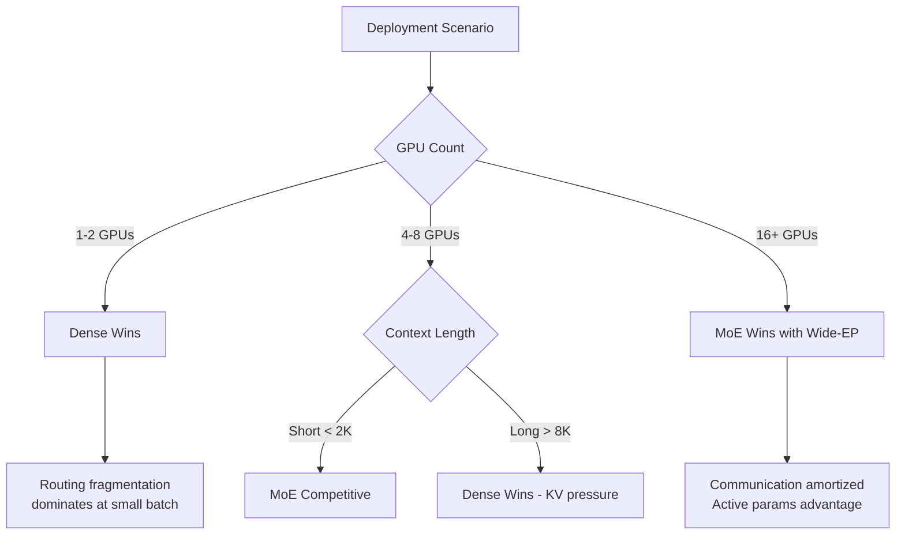
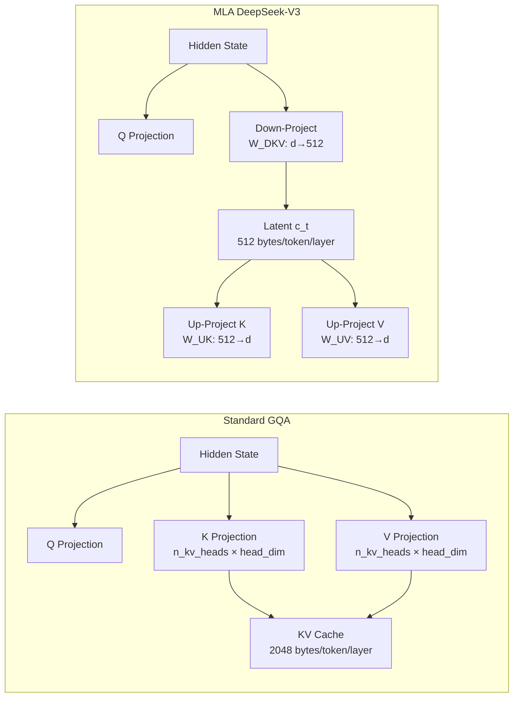
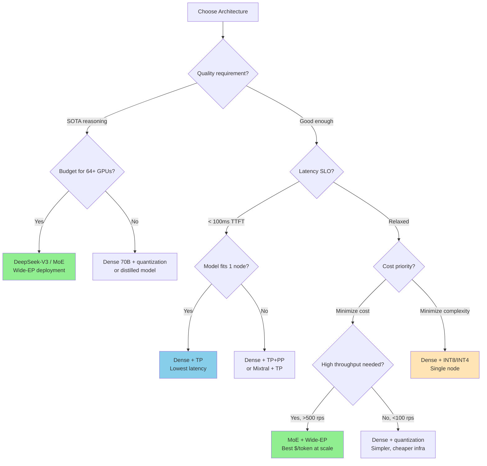

# 6.3 Distillation for Serving

> Understanding when Mixture-of-Experts wins, when it loses, and how distillation unlocks serving efficiency

---

## Learning Objectives

By the end of this module, you will:

- Quantify the MoE "double penalty" and identify when dense models outperform MoE
- Understand DeepSeek-V3's architectural innovations (MLA, 256 experts, DSA)
- Configure Wide-EP and expert parallelism for multi-node MoE serving
- Apply distillation techniques (SwiftKV, Caprese, Llamba) to reduce serving costs
- Deploy MoE models in production with vLLM
- Use a decision framework to choose MoE vs dense at various scales

---

## 1. The MoE Double Penalty

### Why MoE Can Lose to Dense Models

MoE models promise "more parameters, same compute" — but inference tells a different story. Recent analysis (arXiv:2603.08960) identifies a **double penalty** that erodes MoE's efficiency advantage during decoding:

```
┌─────────────────────────────────────────────────────────────────────┐
│                    THE MOE DOUBLE PENALTY                           │
├─────────────────────────────────────────────────────────────────────┤
│                                                                     │
│   Penalty 1: ROUTING FRAGMENTATION                                  │
│   ═══════════════════════════════════                               │
│                                                                     │
│   Dense Model (batch=32):                                           │
│   ┌──────────────────────────────────────────────────────────────┐  │
│   │  All 32 tokens → Same FFN weights → Full weight reuse        │  │
│   │  Arithmetic intensity: HIGH (compute-bound)                  │  │
│   └──────────────────────────────────────────────────────────────┘  │
│                                                                     │
│   MoE Model (batch=32, 8 experts, top-2):                           │
│   ┌──────────────────────────────────────────────────────────────┐  │
│   │  32 tokens × 2 routes = 64 expert assignments                │  │
│   │  Spread across 8 experts → ~8 tokens per expert              │  │
│   │  Each expert: tiny microbatch → memory-bandwidth-bound       │  │
│   │  Arithmetic intensity: LOW (bandwidth-bound)                 │  │
│   └──────────────────────────────────────────────────────────────┘  │
│                                                                     │
│   ─────────────────────────────────────────────────────────────    │
│                                                                     │
│   Penalty 2: KV CACHE PRESSURE                                      │
│   ════════════════════════════                                      │
│                                                                     │
│   Dense 13B model:                                                  │
│   • Model weights: ~26 GB (FP16)                                    │
│   • Remaining HBM for KV cache: ~54 GB (on 80GB GPU)               │
│   • Supports: ~4000 concurrent tokens at 4K context                 │
│                                                                     │
│   MoE 47B model (same active params ~13B):                          │
│   • Model weights: ~94 GB (FP16) — ALL experts resident            │
│   • Remaining HBM for KV cache: ~0 GB on single GPU!               │
│   • Requires multi-GPU just for memory, not compute                 │
│                                                                     │
│   Result: MoE needs MORE GPUs → higher cost per request             │
│                                                                     │
└─────────────────────────────────────────────────────────────────────┘
```

### When MoE Loses: The Crossover Analysis



| Scenario | Winner | Why |
|----------|--------|-----|
| 1-2 GPUs, any context | Dense | MoE can't fit + KV cache on limited HBM |
| 4 GPUs, short context (<2K) | MoE | Active params advantage realized |
| 4 GPUs, long context (>8K) | Dense | KV cache pressure eliminates MoE headroom |
| 16+ GPUs, Wide-EP | MoE | Expert parallelism amortizes communication |
| Fine-grained MoE (256 experts) | Depends | Worse fragmentation but better routing quality |
| Batch size < 16 (decode) | Dense | Microbatch per expert too small for GPU utilization |
| Batch size > 128 (decode) | MoE | Enough tokens per expert for reasonable utilization |

### Quantifying the Penalty

```python
def moe_efficiency_ratio(
    batch_size: int,
    num_experts: int,
    top_k: int,
    expert_size_gb: float,
    total_hbm_gb: float = 80.0,
    dense_model_gb: float = 26.0,
) -> dict:
    """
    Calculate MoE efficiency vs equivalent dense model.
    Returns ratio < 1.0 when MoE is LESS efficient.
    """
    # Penalty 1: Routing fragmentation
    tokens_per_expert = (batch_size * top_k) / num_experts
    # GPU utilization drops below ~16 tokens per expert
    utilization = min(1.0, tokens_per_expert / 16.0)

    # Penalty 2: KV cache pressure
    moe_weights_gb = num_experts * expert_size_gb
    moe_kv_headroom = max(0, total_hbm_gb - moe_weights_gb)
    dense_kv_headroom = total_hbm_gb - dense_model_gb
    kv_ratio = moe_kv_headroom / dense_kv_headroom if dense_kv_headroom > 0 else 0

    # Combined efficiency (MoE active compute advantage = top_k/num_experts)
    compute_advantage = num_experts / top_k  # Fewer FLOPs per token
    effective_efficiency = utilization * kv_ratio * compute_advantage

    return {
        "tokens_per_expert": round(tokens_per_expert, 1),
        "gpu_utilization": round(utilization, 3),
        "kv_headroom_ratio": round(kv_ratio, 3),
        "compute_advantage": round(compute_advantage, 1),
        "net_efficiency_vs_dense": round(effective_efficiency, 3),
        "moe_wins": effective_efficiency > 1.0,
    }

# Mixtral 8x7B vs Llama-13B (single 80GB GPU)
print(moe_efficiency_ratio(batch_size=32, num_experts=8, top_k=2,
                           expert_size_gb=14.0, dense_model_gb=26.0))
# tokens_per_expert=8, utilization=0.5, kv_headroom=0.0 → MoE LOSES

# Same comparison with 4 GPUs (320GB total)
print(moe_efficiency_ratio(batch_size=128, num_experts=8, top_k=2,
                           expert_size_gb=14.0, total_hbm_gb=320.0,
                           dense_model_gb=26.0))
# tokens_per_expert=32, utilization=1.0, kv_headroom=0.74 → MoE WINS
```

---

## 2. DeepSeek-V3 Case Study

### Architecture Overview

DeepSeek-V3 represents the state-of-the-art in MoE inference optimization, combining three innovations that address the double penalty directly:

```
┌─────────────────────────────────────────────────────────────────────┐
│                    DEEPSEEK-V3 ARCHITECTURE                         │
├─────────────────────────────────────────────────────────────────────┤
│                                                                     │
│   Total Parameters: 671B    Active per Token: 37B                   │
│   Experts: 256 (fine-grained)    Top-k: 8                           │
│                                                                     │
│   ┌─────────────────────────────────────────────────────────────┐   │
│   │  INNOVATION 1: Multi-head Latent Attention (MLA)            │   │
│   │  ═══════════════════════════════════════════════             │   │
│   │                                                             │   │
│   │  Standard GQA:                                              │   │
│   │  KV cache per layer = 2 × n_kv_heads × head_dim × seq_len  │   │
│   │  = 2 × 8 × 128 × seq_len = 2048 × seq_len bytes            │   │
│   │                                                             │   │
│   │  MLA (DeepSeek-V3):                                         │   │
│   │  Compress KV into low-rank latent: c_t = W_DKV × h_t        │   │
│   │  Latent dim: 512 (vs 2048 for GQA)                          │   │
│   │  KV cache per layer = 512 × seq_len bytes                   │   │
│   │                                                             │   │
│   │  Result: 75% KV cache reduction vs GQA                      │   │
│   │  → Directly addresses Penalty 2 (KV pressure)              │   │
│   └─────────────────────────────────────────────────────────────┘   │
│                                                                     │
│   ┌─────────────────────────────────────────────────────────────┐   │
│   │  INNOVATION 2: 256 Fine-Grained Experts                     │   │
│   │  ═══════════════════════════════════════                     │   │
│   │                                                             │   │
│   │  Mixtral: 8 experts, top-2 → 4 tokens/expert (batch=16)    │   │
│   │  DeepSeek: 256 experts, top-8 → 0.5 tokens/expert (!)      │   │
│   │                                                             │   │
│   │  Why this works despite worse fragmentation:                │   │
│   │  • Each expert is MUCH smaller (2.6B vs 7B)                 │   │
│   │  • Better routing quality (more specialized experts)        │   │
│   │  • Designed for Wide-EP (experts distributed across nodes)  │   │
│   │  • At scale (batch=512): 16 tokens/expert → full util       │   │
│   └─────────────────────────────────────────────────────────────┘   │
│                                                                     │
│   ┌─────────────────────────────────────────────────────────────┐   │
│   │  INNOVATION 3: DeepSeek Sparse Attention (DSA)              │   │
│   │  ═════════════════════════════════════════════               │   │
│   │                                                             │   │
│   │  Standard attention: O(n²) for sequence length n            │   │
│   │  DSA: Selects relevant KV subset per query head             │   │
│   │  → Reduces long-context compute without quality loss        │   │
│   │  → Complements MLA's memory savings with compute savings    │   │
│   └─────────────────────────────────────────────────────────────┘   │
│                                                                     │
└─────────────────────────────────────────────────────────────────────┘
```

### MLA: How It Works



### Production Performance Numbers

| Configuration | Prefill TGS | Mixed TGS | Per-User Output TPS |
|--------------|-------------|-----------|---------------------|
| DeepSeek-V3 on GB300, NVFP4, TP2 | 7,360/GPU | 2,816/GPU | 230 |
| DeepSeek-V3 on H100×8, FP8, TP8 | ~3,200/GPU | ~1,400/GPU | ~120 |
| Llama-3.1-405B on H100×8, FP8, TP8 | ~2,800/GPU | ~1,100/GPU | ~90 |
| Mixtral-8x7B on A100×2, FP16, TP2 | ~5,500/GPU | ~2,200/GPU | ~180 |

**Key insight**: DeepSeek-V3 achieves 4x the per-user output speed of typical providers despite being 671B parameters — MLA's KV reduction is the primary enabler.

---

## 3. Wide-EP and Expert Parallelism

### The Communication Challenge

Expert Parallelism (EP) distributes experts across GPUs, requiring All-to-All communication to route tokens. Unlike Tensor Parallelism's AllReduce (which sends gradients), EP's All-to-All sends **variable-sized token batches** — making it harder to optimize.

```
┌─────────────────────────────────────────────────────────────────────┐
│              EXPERT PARALLELISM: ALL-TO-ALL ROUTING                 │
├─────────────────────────────────────────────────────────────────────┤
│                                                                     │
│   Step 1: Router assigns tokens to experts                          │
│   ┌─────────────────────────────────────────────────────────────┐   │
│   │  Token 0 → Expert 3, Expert 7                               │   │
│   │  Token 1 → Expert 1, Expert 5                               │   │
│   │  Token 2 → Expert 3, Expert 6                               │   │
│   │  Token 3 → Expert 0, Expert 4                               │   │
│   └─────────────────────────────────────────────────────────────┘   │
│                                                                     │
│   Step 2: All-to-All dispatch (tokens → expert GPUs)                │
│   ┌──────────┐         ┌──────────┐                                 │
│   │  GPU 0   │ ──T0──► │  GPU 1   │  (Expert 3 on GPU 1)           │
│   │  Token 0 │ ──T0──► │          │  (Expert 7 on GPU 3)           │
│   │  Token 1 │ ──T1──► │  GPU 2   │  (Expert 5 on GPU 2)           │
│   └──────────┘         └──────────┘                                 │
│                                                                     │
│   Step 3: Each GPU processes tokens for its local experts           │
│                                                                     │
│   Step 4: All-to-All combine (results → original GPUs)              │
│                                                                     │
│   Communication volume per layer:                                   │
│   = batch_size × top_k × hidden_dim × 2 (dispatch + combine)       │
│   = 512 × 8 × 7168 × 2 × 2 bytes = 117 MB per layer               │
│   × 61 MoE layers = 7.1 GB per forward pass!                       │
│                                                                     │
└─────────────────────────────────────────────────────────────────────┘
```

### Wide-EP: Scaling Expert Parallelism Across Nodes

Wide-EP distributes experts across **many nodes** rather than packing them onto fewer GPUs. This counterintuitively improves performance:

```
┌─────────────────────────────────────────────────────────────────────┐
│              WIDE-EP vs STANDARD EP                                 │
├─────────────────────────────────────────────────────────────────────┤
│                                                                     │
│   Standard EP (DeepSeek-V3, 256 experts on 8 GPUs):                 │
│   ┌─────────────────────────────────────────────────────────────┐   │
│   │  GPU 0: 32 experts  │  GPU 1: 32 experts  │ ...             │   │
│   │  Each GPU: large memory footprint                           │   │
│   │  All-to-All within single node (NVLink)                     │   │
│   │  Bottleneck: 32 experts × batch tokens = high local compute │   │
│   └─────────────────────────────────────────────────────────────┘   │
│                                                                     │
│   Wide-EP (Perplexity approach, 256 experts on 64 GPUs):            │
│   ┌─────────────────────────────────────────────────────────────┐   │
│   │  GPU 0: 4 experts  │  GPU 1: 4 experts  │ ... (64 GPUs)    │   │
│   │  Each GPU: small memory footprint → MORE KV cache room      │   │
│   │  All-to-All across nodes (InfiniBand/EFA)                   │   │
│   │  Advantage: Each GPU processes fewer experts faster          │   │
│   └─────────────────────────────────────────────────────────────┘   │
│                                                                     │
│   Why Wide-EP wins at scale:                                        │
│   1. More KV cache headroom per GPU (fewer expert weights)          │
│   2. Better load balance (more GPUs to spread tokens)               │
│   3. Overlapped communication with computation                      │
│   4. Perplexity achieved 10x faster All-to-All with EFA tuning     │
│                                                                     │
└─────────────────────────────────────────────────────────────────────┘
```

### Perplexity's 10x Communication Optimization

Perplexity's production deployment of MoE models achieves **10x faster** All-to-All communication through:

1. **Custom NCCL kernels** tuned for AWS EFA (Elastic Fabric Adapter)
2. **Topology-aware routing** — minimize cross-rack hops
3. **Pipelining** — overlap layer N communication with layer N-1 compute
4. **Quantized dispatch** — send tokens in FP8 during All-to-All, upcast on arrival

```python
# Ray/Anyscale pattern for Wide-EP deployment
import ray
from vllm import LLM, SamplingParams

# Multi-node MoE with expert parallelism
# Each node handles a subset of experts
@ray.remote(num_gpus=8)
class MoEWorkerNode:
    def __init__(self, node_rank: int, world_size: int):
        self.llm = LLM(
            model="deepseek-ai/DeepSeek-V3",
            tensor_parallel_size=8,
            # Expert parallelism across nodes
            # vLLM handles EP when world_size > TP
            distributed_executor_backend="ray",
        )

# Launch across 8 nodes (64 GPUs total)
# TP=8 within node, EP=8 across nodes
nodes = [MoEWorkerNode.remote(i, 8) for i in range(8)]
```

### Communication Cost Comparison

| Strategy | GPUs | Experts/GPU | All-to-All Volume/Layer | KV Headroom/GPU |
|----------|------|-------------|------------------------|-----------------|
| EP=8 (single node) | 8 | 32 | 14.6 MB (NVLink) | ~5 GB |
| EP=16 (2 nodes) | 16 | 16 | 14.6 MB (IB) | ~20 GB |
| Wide-EP=64 (8 nodes) | 64 | 4 | 14.6 MB (EFA) | ~55 GB |

**Key insight**: All-to-All volume is constant regardless of EP width — it depends only on batch_size × top_k × hidden_dim. The advantage of Wide-EP is purely in memory headroom and load balance.

---

## 4. Distillation for Serving

Distillation traditionally targets training efficiency. A new wave of techniques applies distillation specifically to **reduce inference cost** — either by eliminating redundant computation or by changing the architecture entirely.

### 4.1 SwiftKV: 2x Throughput via Layer Skipping

SwiftKV observes that later transformer layers contribute diminishing returns during prefill. By distilling knowledge from early layers into later layers' KV projections, it skips computation entirely:

```
┌─────────────────────────────────────────────────────────────────────┐
│                    SWIFTKV MECHANISM                                │
├─────────────────────────────────────────────────────────────────────┤
│                                                                     │
│   Standard Prefill (Llama-3.1-70B, 80 layers):                      │
│   ┌─────────────────────────────────────────────────────────────┐   │
│   │  Layer 0  → compute Q,K,V → attention → FFN → KV cached    │   │
│   │  Layer 1  → compute Q,K,V → attention → FFN → KV cached    │   │
│   │  ...                                                        │   │
│   │  Layer 79 → compute Q,K,V → attention → FFN → KV cached    │   │
│   │  Total: 80 layers × full compute = 100% FLOPs              │   │
│   └─────────────────────────────────────────────────────────────┘   │
│                                                                     │
│   SwiftKV Prefill (skip last 40 layers' KV computation):            │
│   ┌─────────────────────────────────────────────────────────────┐   │
│   │  Layer 0-39: Full computation (Q,K,V + attention + FFN)     │   │
│   │  Layer 40-79: KV cache filled from Layer 39's output        │   │
│   │               Only Q projection + attention computed        │   │
│   │  Total: 50% FLOPs for prefill                               │   │
│   └─────────────────────────────────────────────────────────────┘   │
│                                                                     │
│   Decode phase: Unchanged (uses cached KV normally)                 │
│                                                                     │
│   Results:                                                          │
│   • 2x throughput improvement                                       │
│   • 60% lower time-to-first-token                                   │
│   • 560 TFlops/GPU (16K tokens/s for Llama-3.1-70B)                │
│   • Minimal quality degradation on standard benchmarks              │
│                                                                     │
└─────────────────────────────────────────────────────────────────────┘
```

```python
# SwiftKV conceptual implementation
class SwiftKVModel:
    def __init__(self, base_model, skip_start_layer: int = 40):
        self.base_model = base_model
        self.skip_start = skip_start_layer
        # Distilled projection: maps early-layer hidden → later-layer KV
        self.kv_projectors = self._load_distilled_projectors()

    def prefill(self, input_ids, attention_mask):
        hidden = self.base_model.embed(input_ids)

        for i, layer in enumerate(self.base_model.layers):
            if i < self.skip_start:
                # Full computation for early layers
                hidden, kv = layer.full_forward(hidden, attention_mask)
                self.kv_cache[i] = kv
            else:
                # Skip KV computation — project from anchor layer
                projected_kv = self.kv_projectors[i](
                    self.kv_cache[self.skip_start - 1]
                )
                self.kv_cache[i] = projected_kv
                # Only compute attention with projected KV
                hidden = layer.attention_only(hidden, projected_kv)

        return hidden
```

### 4.2 Caprese: Quality Recovery After Aggressive Optimization

When you apply aggressive pruning or quantization, reasoning quality drops. Caprese recovers it via lightweight low-rank distillation:

```
┌─────────────────────────────────────────────────────────────────────┐
│                    CAPRESE PIPELINE                                 │
├─────────────────────────────────────────────────────────────────────┤
│                                                                     │
│   Step 1: Aggressive optimization (pruning/quantization)            │
│   ┌─────────────────────────────────────────────────────────────┐   │
│   │  Llama-3.1-8B (8B params) → Pruned to 6B active params     │   │
│   │  Quality: MMLU 65% → 58% (7% drop)                         │   │
│   └─────────────────────────────────────────────────────────────┘   │
│                                                                     │
│   Step 2: Low-rank distillation (adds ~1% parameters)               │
│   ┌─────────────────────────────────────────────────────────────┐   │
│   │  Add LoRA adapters (rank=64) to FFN blocks                  │   │
│   │  Distill from original 8B model on reasoning data           │   │
│   │  Training: ~1000 steps, 8 GPU-hours                         │   │
│   └─────────────────────────────────────────────────────────────┘   │
│                                                                     │
│   Step 3: Recovered model                                           │
│   ┌─────────────────────────────────────────────────────────────┐   │
│   │  6B active + 80M adapter = 6.08B effective                  │   │
│   │  Quality: MMLU 58% → 63% (recovered 5 of 7 points)         │   │
│   │  Speed: >16% faster time-to-next-token                      │   │
│   │  Tokens: Up to 8.5% fewer generated tokens (more concise)  │   │
│   └─────────────────────────────────────────────────────────────┘   │
│                                                                     │
└─────────────────────────────────────────────────────────────────────┘
```

### 4.3 Llamba: Cross-Architecture Distillation

The most radical approach: distill a Transformer into a completely different architecture (Mamba/SSM) that eliminates the KV cache entirely.

```
┌─────────────────────────────────────────────────────────────────────┐
│              LLAMBA: TRANSFORMER → MAMBA DISTILLATION               │
├─────────────────────────────────────────────────────────────────────┤
│                                                                     │
│   Teacher: Llama-3.x (Transformer)                                  │
│   Student: Mamba (State Space Model)                                │
│                                                                     │
│   Key Difference:                                                   │
│   ┌─────────────────────────────────────────────────────────────┐   │
│   │  Transformer: KV cache grows linearly with sequence         │   │
│   │  • 1K tokens: 256 MB cache                                  │   │
│   │  • 8K tokens: 2 GB cache                                    │   │
│   │  • 128K tokens: 32 GB cache                                 │   │
│   │                                                             │   │
│   │  Mamba: Fixed-size recurrent state (independent of seq len) │   │
│   │  • Any length: ~16 MB state                                 │   │
│   │  • O(1) memory per token during generation                  │   │
│   │  • No quadratic attention computation                       │   │
│   └─────────────────────────────────────────────────────────────┘   │
│                                                                     │
│   MOHAWK Distillation Method:                                       │
│   • Uses <0.1% of typical pretraining data                          │
│   • Produces 1B, 3B, 8B Mamba models                                │
│   • Higher throughput + larger batch sizes than Transformer          │
│                                                                     │
│   Tradeoffs:                                                        │
│   ✅ Eliminates KV cache entirely                                   │
│   ✅ Subquadratic inference (O(n) vs O(n²))                         │
│   ✅ Edge-friendly (small fixed memory)                             │
│   ❌ Quality gap on complex reasoning tasks                         │
│   ❌ Struggles with precise long-range retrieval                    │
│   ❌ Limited model sizes available (max 8B currently)               │
│                                                                     │
└─────────────────────────────────────────────────────────────────────┘
```

### Distillation Techniques Comparison

| Technique | Throughput Gain | Quality Impact | Training Cost | Best For |
|-----------|----------------|----------------|---------------|----------|
| SwiftKV | 2x | Minimal (<1% drop) | Low (few hours) | Prefill-heavy workloads |
| Caprese | 16%+ faster TTNT | Recovers 70%+ of lost quality | Medium (8 GPU-hours) | Post-pruning recovery |
| Llamba | 3-5x (long seq) | 5-10% drop on reasoning | High (days) | Edge, long-context, high-batch |

---

## 5. Production MoE Deployment

### vLLM Configuration for MoE Models

```bash
# Single-node Mixtral 8x7B (requires 2+ GPUs for memory)
vllm serve mistralai/Mixtral-8x7B-Instruct-v0.1 \
    --tensor-parallel-size 2 \
    --max-model-len 32768 \
    --gpu-memory-utilization 0.90

# Multi-node DeepSeek-V3 (8 nodes × 8 GPUs = 64 GPUs)
# Node 0 (head):
vllm serve deepseek-ai/DeepSeek-V3 \
    --tensor-parallel-size 8 \
    --pipeline-parallel-size 8 \
    --distributed-executor-backend ray \
    --quantization fp8 \
    --max-model-len 65536 \
    --gpu-memory-utilization 0.92 \
    --enable-chunked-prefill \
    --max-num-batched-tokens 8192

# DeepSeek-V3 with expert parallelism (vLLM 0.8+)
vllm serve deepseek-ai/DeepSeek-V3 \
    --tensor-parallel-size 8 \
    --expert-parallel-size 8 \
    --distributed-executor-backend ray \
    --quantization fp8 \
    --trust-remote-code
```

### Multi-Node Ray Cluster Setup

```python
# ray_cluster_config.yaml for MoE deployment on AWS
cluster_name: deepseek-v3-serving

provider:
    type: aws
    region: us-east-1

head_node:
    InstanceType: p5.48xlarge  # 8× H100 80GB
    ImageId: ami-deeplearning-2024

worker_nodes:
    InstanceType: p5.48xlarge
    min_workers: 7  # Total 8 nodes = 64 GPUs
    max_workers: 7

setup_commands:
    - pip install vllm[ray] --upgrade
    - pip install deepspeed

# EFA optimization for All-to-All
head_start_ray_commands:
    - >
      ray start --head
      --port=6379
      --resources='{"accelerator_type:H100": 8}'
      --system-config='{"network_interface": "efa0"}'
```

### Cost Comparison: MoE vs Dense

```
┌─────────────────────────────────────────────────────────────────────┐
│              COST COMPARISON: MOE vs DENSE (AWS, per 1M tokens)     │
├─────────────────────────────────────────────────────────────────────┤
│                                                                     │
│   Scenario: Serve 1000 req/min, avg 2K input + 500 output tokens    │
│                                                                     │
│   ┌─────────────────────────────────────────────────────────────┐   │
│   │ Model          │ Instance      │ GPUs │ $/hr  │ $/1M tok   │   │
│   │────────────────┼───────────────┼──────┼───────┼────────────│   │
│   │ Llama-70B FP16 │ p4d.24xlarge  │ 8    │ $32.77│ $0.82      │   │
│   │ Llama-70B INT8 │ p4d.24xlarge  │ 4    │ $32.77│ $0.55      │   │
│   │ Mixtral-8x7B   │ p4d.24xlarge  │ 4    │ $32.77│ $0.41      │   │
│   │ DeepSeek-V3    │ 8×p5.48xlarge │ 64   │ $784  │ $0.65      │   │
│   │ DeepSeek-V3 Q8 │ 4×p5.48xlarge │ 32   │ $392  │ $0.33      │   │
│   └─────────────────────────────────────────────────────────────┘   │
│                                                                     │
│   Key Observations:                                                 │
│   • Mixtral wins on cost/token at moderate scale                    │
│   • DeepSeek-V3 quantized is cheapest per token at HIGH scale       │
│   • Dense Llama-70B is simplest to deploy (single node)             │
│   • MoE cost advantage requires high utilization (>70% GPU)         │
│                                                                     │
│   Break-even: MoE becomes cheaper than dense when:                  │
│   • Sustained throughput > 500 req/min                              │
│   • Average batch utilization > 64 concurrent sequences             │
│   • Infrastructure supports efficient All-to-All (EFA/IB)          │
│                                                                     │
└─────────────────────────────────────────────────────────────────────┘
```

### Monitoring MoE-Specific Metrics

```python
# Key metrics to monitor for MoE serving health
MOE_METRICS = {
    # Expert load balance — skew indicates routing problems
    "expert_load_std": {
        "description": "Std dev of tokens routed per expert",
        "healthy": "< 20% of mean",
        "alert": "> 50% of mean (hot experts)",
    },
    # All-to-All latency — dominates at high EP
    "alltoall_latency_ms": {
        "description": "Per-layer All-to-All communication time",
        "healthy": "< 2ms (NVLink), < 5ms (IB/EFA)",
        "alert": "> 10ms (network congestion)",
    },
    # KV cache utilization — MoE's Achilles heel
    "kv_cache_utilization": {
        "description": "Fraction of available KV cache slots used",
        "healthy": "< 85%",
        "alert": "> 95% (preemption imminent)",
    },
    # Expert cache hit rate (for offloaded experts)
    "expert_cache_hit_rate": {
        "description": "Fraction of expert calls served from GPU memory",
        "healthy": "> 95%",
        "alert": "< 80% (excessive expert swapping)",
    },
}
```

---

## 6. Decision Framework: MoE vs Dense

### Selection Flowchart



### Decision Matrix

| Factor | Favors MoE | Favors Dense | Notes |
|--------|-----------|--------------|-------|
| **Scale** | >500 req/min sustained | <100 req/min | MoE amortizes infra cost at scale |
| **Quality** | Need SOTA (671B active knowledge) | Good-enough (70B sufficient) | MoE stores more knowledge in experts |
| **Latency** | Throughput-optimized (batch) | Latency-optimized (real-time) | Dense has simpler compute path |
| **Context** | Short (<4K tokens) | Long (>32K tokens) | MoE KV pressure worse at long context |
| **Hardware** | Multi-node with EFA/IB | Single node with NVLink | MoE needs fast All-to-All |
| **Ops complexity** | Dedicated ML infra team | Small team, simple ops | MoE requires expert monitoring |
| **Cost at scale** | High utilization (>70%) | Variable/bursty traffic | MoE fixed cost is high |
| **Batch size** | Large (>128 concurrent) | Small (<16 concurrent) | MoE needs tokens to fill experts |

### Hybrid Strategies

For production systems that need both quality and efficiency:

```
┌─────────────────────────────────────────────────────────────────────┐
│              HYBRID DEPLOYMENT PATTERNS                             │
├─────────────────────────────────────────────────────────────────────┤
│                                                                     │
│   Pattern 1: Router-Based (Quality Tiering)                         │
│   ═══════════════════════════════════════════                       │
│   • Simple queries → Dense 8B (fast, cheap)                         │
│   • Complex queries → MoE 671B (high quality)                       │
│   • Router: Lightweight classifier on query complexity              │
│                                                                     │
│   Pattern 2: Cascade (Speculative Quality)                          │
│   ═══════════════════════════════════════════                       │
│   • First attempt: Dense 70B                                        │
│   • If confidence < threshold → Retry with MoE                      │
│   • Saves cost on easy queries (70%+ of traffic)                    │
│                                                                     │
│   Pattern 3: Distilled MoE (Best of Both)                           │
│   ═══════════════════════════════════════════                       │
│   • Deploy MoE for training/distillation                            │
│   • Serve distilled dense model (SwiftKV-style)                     │
│   • Periodic re-distillation as MoE improves                        │
│                                                                     │
└─────────────────────────────────────────────────────────────────────┘
```

### Scale-Based Recommendations

| Monthly Token Volume | Recommended Architecture | Estimated Monthly Cost |
|---------------------|-------------------------|----------------------|
| <1B tokens | Dense 8B-13B, INT8, 1 GPU | $500-1,500 |
| 1-10B tokens | Dense 70B, INT8, TP=4 | $5,000-15,000 |
| 10-100B tokens | Mixtral-8x7B or Dense 70B INT4 | $10,000-40,000 |
| 100B-1T tokens | DeepSeek-V3, Wide-EP, FP8 | $50,000-200,000 |
| >1T tokens | Custom MoE + distilled fleet | $200,000+ |

---

## 7. Key Takeaways

1. **MoE has a double penalty** — Routing fragmentation reduces GPU utilization AND massive expert pools steal KV cache headroom. MoE only wins when you have enough GPUs (Wide-EP) and enough batch size (>128 tokens per expert).

2. **DeepSeek-V3's MLA is transformative** — 75% KV cache reduction via low-rank latent compression directly addresses Penalty 2. This is why DeepSeek-V3 achieves 4x per-user throughput despite 671B parameters.

3. **Wide-EP is the key to MoE at scale** — Distributing experts across many nodes (not packing onto few) gives more KV headroom per GPU. Perplexity's 10x All-to-All optimization on EFA proves this works in production.

4. **Distillation is the new optimization frontier** — SwiftKV (2x throughput by skipping later-layer KV), Caprese (recover quality after pruning), and Llamba (eliminate KV cache entirely) represent three distinct strategies for serving efficiency.

5. **The decision isn't binary** — Hybrid patterns (quality tiering, cascades, distilled MoE) let you get MoE-quality answers at dense-model costs for the majority of traffic.

6. **Monitor expert load balance** — Skewed routing is the #1 production issue with MoE. If >50% of tokens hit the same 20% of experts, you're paying for 256 experts but using 50.

---

## Lab Preview: MoE Deployment

In the associated lab, you will:

- Deploy Mixtral-8x7B with TP=2 and measure expert utilization
- Compare throughput vs Llama-13B (equivalent active params) at various batch sizes
- Identify the crossover point where MoE becomes more efficient
- Configure expert load monitoring and alerting

---

## References

1. "Quantifying the Double Penalty of MoE at Inference" (arXiv:2603.08960, 2026)
2. DeepSeek-V3 Technical Report (arXiv:2512.02556, 2024)
3. Qiao et al. "SwiftKV: Fast Prefill-Optimized Inference" (arXiv:2410.03960, 2025)
4. Bick et al. "Llamba: Cross-Architecture Distillation" (arXiv:2502.14458, 2025)
5. Dong et al. "Caprese: Scalable LLM Reasoning Acceleration" (arXiv:2505.07861, 2025)
6. Fedus et al. "Switch Transformers" (2021)
7. Perplexity Engineering Blog: "Scaling MoE Inference with Wide Expert Parallelism" (2025)
8. vLLM Documentation: Expert Parallelism Configuration
