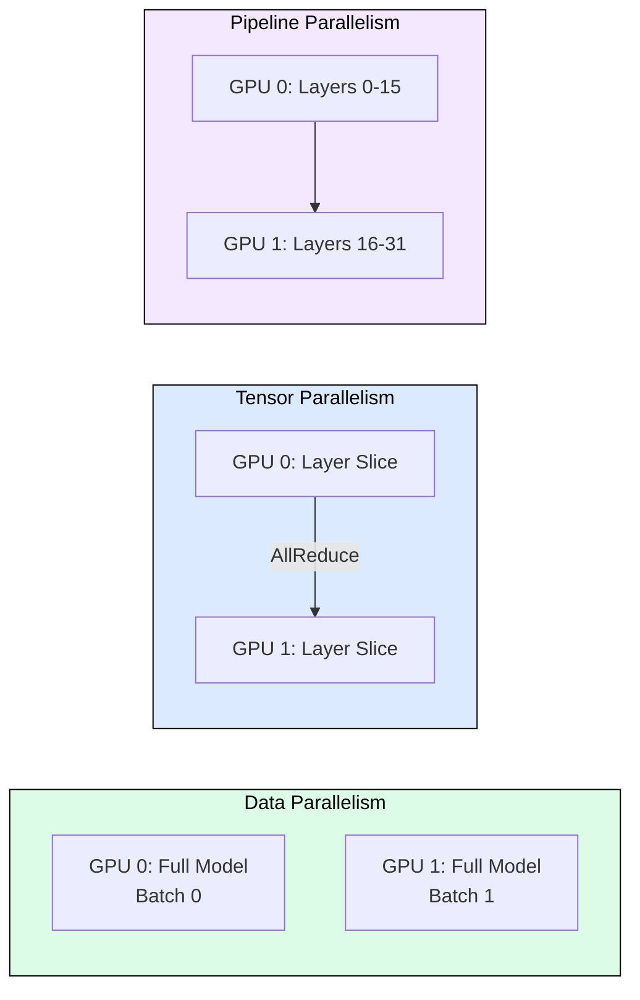
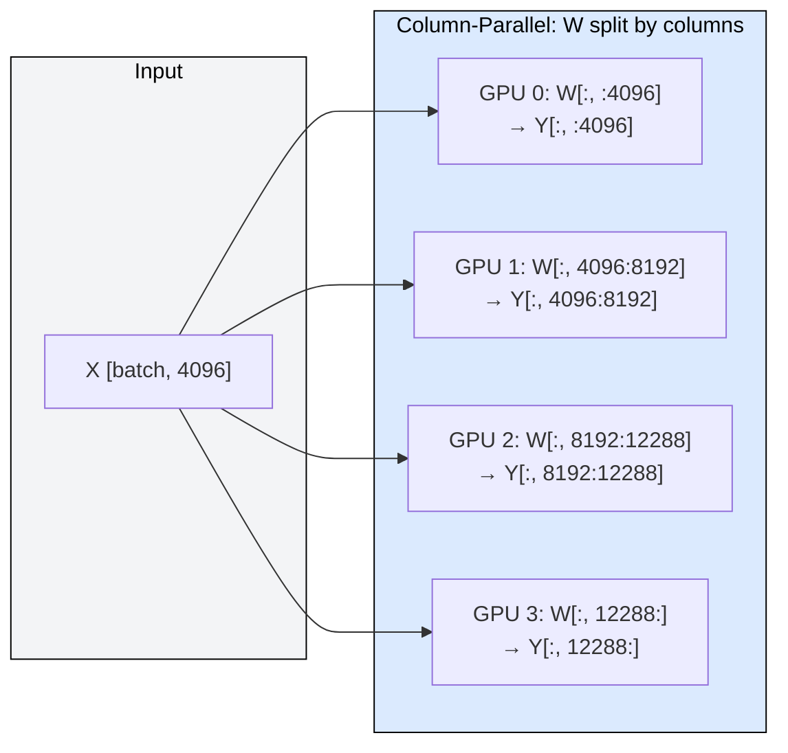
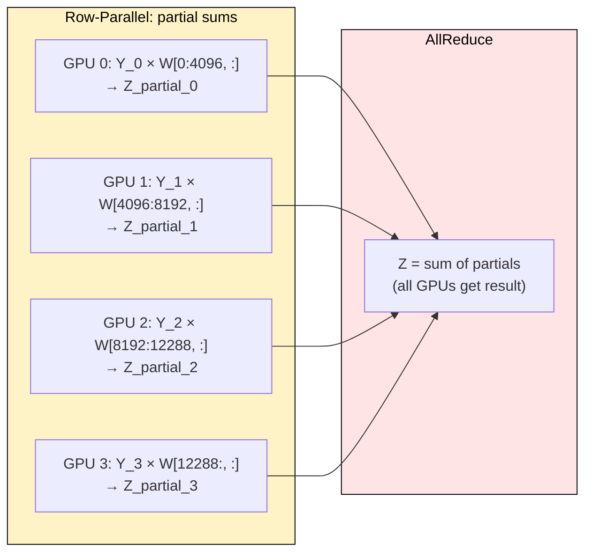
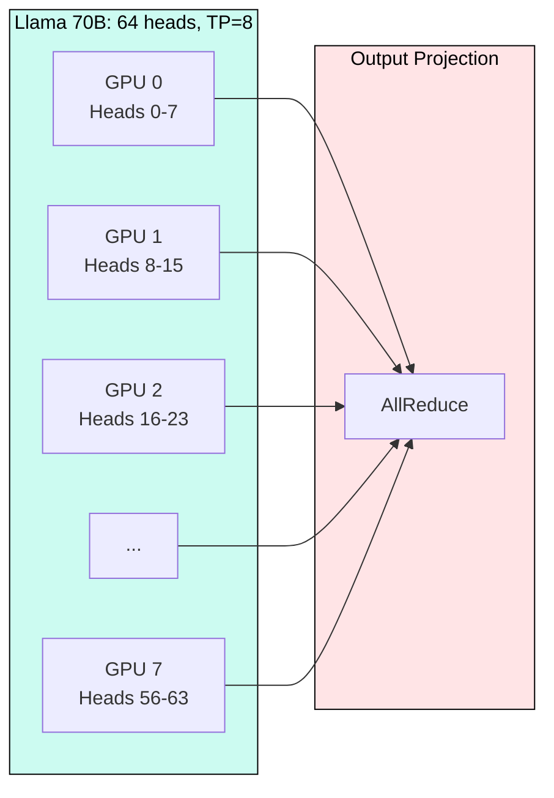

# 6.1 Tensor Parallelism

> When a model exceeds one GPU's memory, tensor parallelism splits every layer across GPUs so each reads only a fraction of weights per token.

Llama 70B in FP16 needs 140 GB. No single GPU holds that. Tensor parallelism (TP) from Megatron-LM (Shoeybi et al., 2019) solves this by sharding weight matrices across GPUs within a node, using AllReduce to recombine partial results after each layer. The result: lower per-token latency (less compute per GPU) at the cost of requiring fast interconnect (NVLink) between GPUs.

---

## Where TP Fits Among Parallelism Strategies

**Data Parallelism**: replicate model, split requests. No communication. Use when model fits on one GPU.
**Tensor Parallelism**: split every layer, AllReduce per layer. Use within a node (NVLink).
**Pipeline Parallelism**: assign layer ranges to GPUs in sequence. Use across nodes (InfiniBand).

The rule: TP within a node (600-900 GB/s NVLink), PP across nodes (200-400 GB/s InfiniBand).

---

## Column-Parallel Split

The first linear in the FFN projects hidden_size to ffn_hidden_size. Column parallelism splits the weight matrix W along columns. Each GPU computes a slice of the output independently, requiring no communication.

Each GPU receives the full input X and multiplies by its column slice. The outputs are disjoint portions of Y. No AllReduce needed at this stage because the next layer uses row parallelism that consumes these partial outputs directly.

---

## Row-Parallel Split and AllReduce

The second FFN linear projects ffn_hidden_size back to hidden_size. Row parallelism splits W along rows, aligning with column-parallel outputs from the previous layer. Each GPU computes a partial sum, then AllReduce combines them.

The column-then-row pattern requires only ONE AllReduce per FFN block. This halves communication versus naive approaches where each matmul would need its own synchronization.

---

## Attention Head Distribution

Multi-head attention is naturally parallel: each head operates independently. TP assigns contiguous groups of heads to GPUs. Communication happens only after the output projection.

Each GPU computes Q, K, V for its heads only, runs attention independently, then AllReduce merges outputs. Constraint: TP must divide num_attention_heads evenly (32 heads → TP of 1, 2, 4, 8, 16, 32).

---

## Communication Cost: Why NVLink is Mandatory

Every layer requires 2 AllReduces (attention + FFN). The ring AllReduce algorithm transfers 2×(N-1)/N × message_size. For Llama 70B decode at batch=32:

- Hidden: 8192, FP16 → message = 32 × 8192 × 2 = 512 KB per AllReduce
- Per forward pass: 512 KB × 2 × 80 layers = 80 MB total
- At 100 tok/s decode: 8 GB/s sustained bandwidth needed

| Interconnect | Bandwidth | TP=4 Efficiency | TP=8 Efficiency |
|---|---|---|---|
| PCIe 4.0 | 32 GB/s | ~65% | ~44% |
| PCIe 5.0 | 64 GB/s | ~78% | ~62% |
| NVLink 3 (A100) | 600 GB/s | ~92% | ~85% |
| NVLink 4 (H100) | 900 GB/s | ~95% | ~90% |

NVLink provides 10-28x more bandwidth than PCIe. Beyond TP=2, PCIe systems spend more time communicating than computing. This is why all cloud GPU instances designed for large model serving (p4d, p5) use NVLink internally.

---

## Choosing TP Degree

| Model Size | Instance | TP | Notes |
|---|---|---|---|
| ≤13B | g5.xlarge (A10G) | 1 | Fits single GPU with INT4/INT8 |
| 13-30B | g5.12xlarge | 2-4 | NVLink within node |
| 30-70B | p4d.24xlarge | 4-8 | 8×A100 NVLink |
| 70-140B | p4d.24xlarge | 8 | Full node required |
| >140B | 2×p4d.24xlarge | TP=8, PP=2 | Multi-node |
| 405B | 4×p5.48xlarge | TP=8, PP=4 | Multi-node |

Always calculate: per-GPU memory = (model_bytes / TP) + KV_cache + overhead. If total exceeds GPU VRAM, increase TP or apply quantization.

---

## FAQ

**Q: Can I use TP across nodes (InfiniBand)?**
Technically yes, but efficiency drops below 50% due to latency. Use PP across nodes instead.

**Q: Why not just use data parallelism for everything?**
DP requires each replica to hold the full model. When the model exceeds one GPU, DP cannot help.

**Q: Does quantization reduce the need for TP?**
Yes. Llama 70B in INT4 (35 GB) fits on one 80 GB GPU, eliminating TP entirely.

**Q: What about GQA models with fewer KV heads?**
GQA reduces KV cache memory but does not change the TP constraint on Q heads. TP must still divide num_attention_heads.

**Q: How does vLLM handle TP?**
Set `--tensor-parallel-size N`. vLLM shards weights, inserts AllReduce ops, and manages NCCL automatically.

---

## References

1. Shoeybi et al. "Megatron-LM: Training Multi-Billion Parameter Language Models Using Model Parallelism" (2019)
2. Narayanan et al. "Efficient Large-Scale Language Model Training on GPU Clusters Using Megatron-LM" (2021)
3. NVIDIA NCCL Documentation: https://docs.nvidia.com/deeplearning/nccl/
4. vLLM Documentation: Distributed Inference: https://docs.vllm.ai/
5. Pope et al. "Efficiently Scaling Transformer Inference" (2022)
