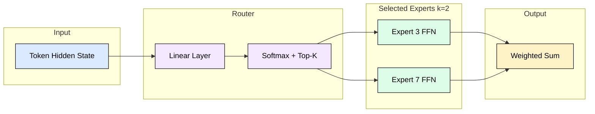
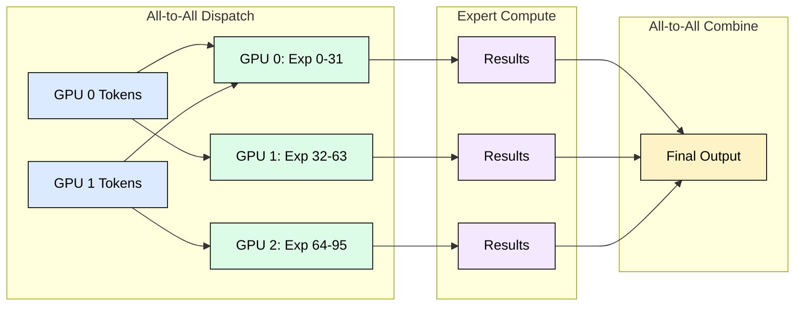
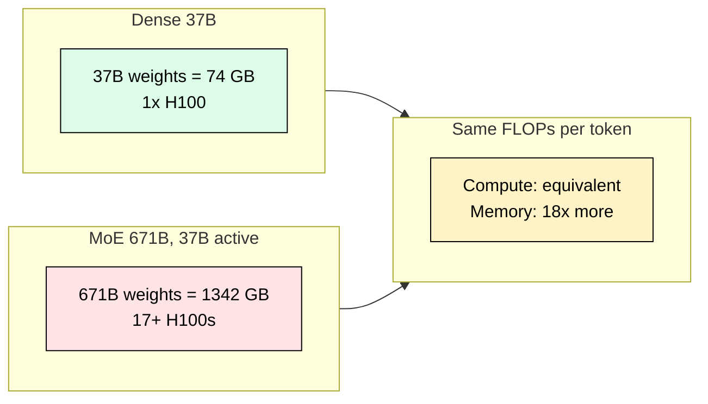
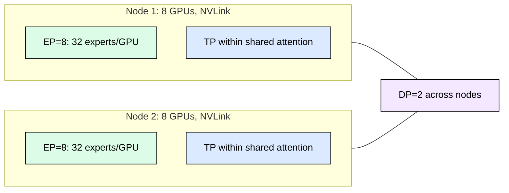

# 6.2 MoE Inference

## Why MoE Matters

MoE enables **7x parameter scaling with the same compute budget**. DeepSeek-V3 packs 671B parameters but activates only 37B per token, matching a 37B dense model in FLOPs while delivering far superior quality. The tradeoff: you store all 671B in GPU memory because any token might route to any expert.

| Model | Total Params | Active/Token | Experts | Top-k |
|-------|------------:|------------:|--------:|------:|
| Mixtral 8x7B | 47B | 13B | 8 | 2 |
| DeepSeek-V3 | 671B | 37B | 256 | 8 |
| DBRX | 132B | 36B | 16 | 4 |

## How MoE Routing Works

Each MoE layer replaces the standard FFN with multiple expert FFNs and a router. The router scores every expert, selects the top-k, and dispatches tokens only to those experts.

The forward pass per MoE layer: (1) compute router logits, (2) dispatch tokens to selected experts, (3) each expert computes on its assigned tokens, (4) gather and weighted-sum results.

## Expert Parallelism

Tensor parallelism splits weight matrices. Expert parallelism (EP) assigns entire experts to different GPUs. With 256 experts on 8 GPUs, each GPU holds 32 experts and processes only tokens routed there.

EP requires two all-to-all operations per layer (dispatch + combine). For DeepSeek-V3 with hidden_dim=7168, top-8, BF16, batch 1024: dispatch volume is 117 MB per layer, 7 GB across 60 MoE layers. NVLink handles this in ~8 ms; PCIe would take 110 ms. MoE at scale demands high-bandwidth interconnects.

## The Memory Paradox

MoE compute scales with active parameters but memory scales with total parameters. DeepSeek-V3 needs 1,342 GB (BF16) for weights alone, requiring 17+ H100s just for storage. A 37B dense model with identical per-token compute fits on a single GPU.

Mitigations: INT4 quantization (4x reduction), expert offloading (cold experts on CPU, adds latency on cache miss), or simply more GPUs.

## Load Balancing

If all tokens route to the same experts, those GPUs bottleneck while others idle. Training uses auxiliary load-balancing loss to spread tokens uniformly. At serving time, a capacity factor C defines max tokens per expert. Excess tokens are dropped or fallback-routed.

Healthy imbalance ratio (max_load / mean_load) should stay below 1.5. Above 3.0 indicates a critical hotspot requiring capacity factor increase or expert replication.

## Composing Parallelism

Total GPUs = TP x EP x DP. For DeepSeek-V3: individual experts are small (33M params each), so TP=1 within experts, EP=8 per node, DP=N for throughput scaling. Mixtral with larger experts (7B each) may need TP=2 within experts.

## Engine Support

vLLM uses fused Triton MoE kernels (route + permute + matmul + unpermute in one launch). SGLang groups tokens with similar routing patterns and overlaps combine all-to-all with next-layer attention. TensorRT-LLM provides custom NCCL all-to-all kernels tuned per GPU topology.

## FAQ

**Q: Why not offload inactive experts to save GPU memory?**
A: Expert offloading works for batch workloads but adds 0.5-2 ms per cache miss. Across 60 layers this can add 60-120 ms, too slow for interactive serving with 50 ms/token budgets.

**Q: Does MoE benefit from KV cache optimizations like GQA or MLA?**
A: Yes. Attention layers are shared (not expert-gated), so KV cache techniques apply identically. DeepSeek-V3 uses MLA to cut KV cache 3.5x, critical when weights already consume most memory.

**Q: What happens when a token routes to an offloaded expert?**
A: The system either loads it from CPU (PCIe latency) or drops the token to a fallback path. Speculative pre-loading can predict needed experts one layer ahead.

**Q: Is MoE more cost-effective than dense models?**
A: Per unit of model capacity, yes. DeepSeek-V3 costs ~3x more in absolute GPU spend than a 70B dense model but delivers 10x more capacity, making it 3.3x cheaper per quality-unit.

**Q: How do I size hardware for a MoE model?**
A: Start with total weights / GPU memory for minimum GPUs. Add KV cache and activation budgets. Keep EP within a single NVLink domain. Scale throughput with DP replicas across nodes.

## References

1. Fedus, W., Zoph, B., & Shazeer, N. (2022). Switch Transformers: Scaling to Trillion Parameter Models. JMLR 23(120).
2. Jiang, A. Q., et al. (2024). Mixtral of Experts. arXiv:2401.04088.
3. DeepSeek-AI. (2024). DeepSeek-V3 Technical Report. arXiv:2412.19437.
4. Shazeer, N., et al. (2017). Outrageously Large Neural Networks: The Sparsely-Gated MoE Layer. ICLR 2017.
5. Lepikhin, D., et al. (2021). GShard: Scaling Giant Models with Conditional Computation. ICLR 2021.
