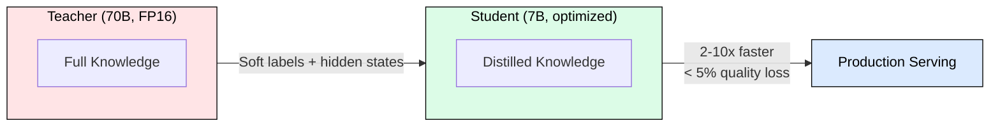
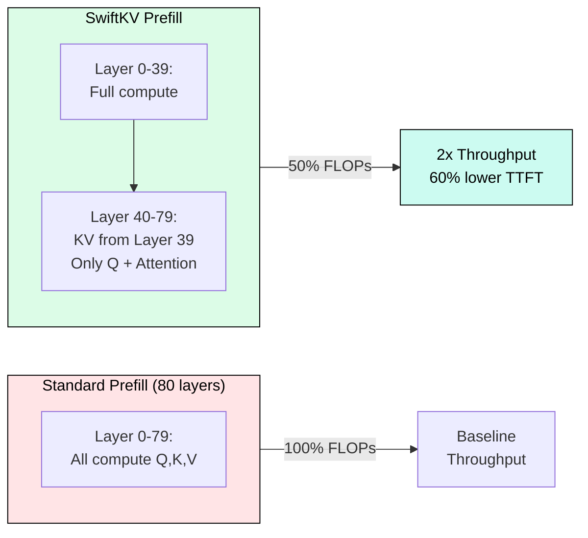
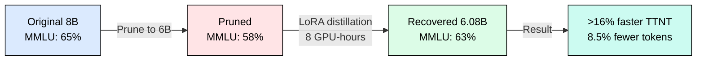
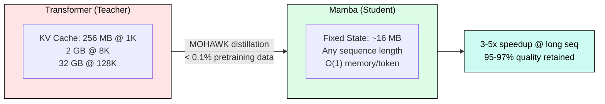
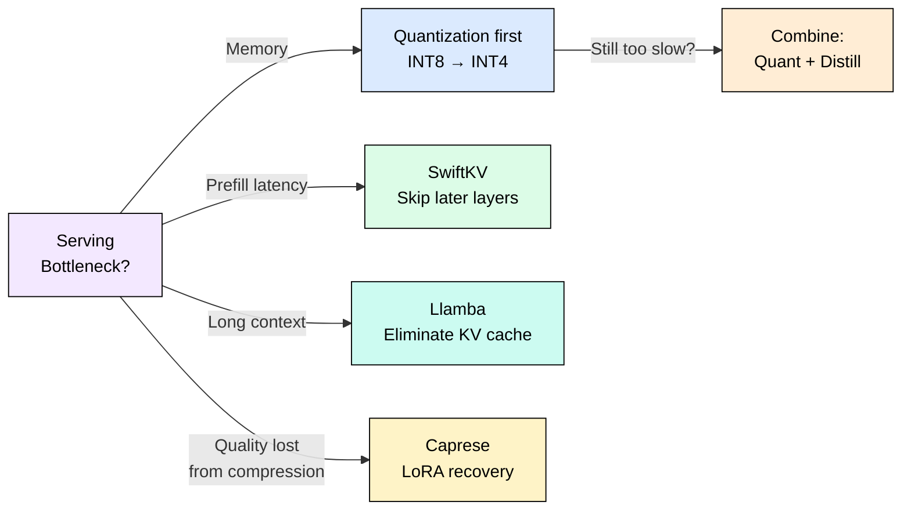

# 6.3 Knowledge Distillation for Serving

Knowledge distillation enables 2-10x model compression with less than 5% quality loss, making it the most powerful technique for reducing serving costs without sacrificing capability. Unlike quantization (which preserves architecture) or pruning (which removes weights), distillation transfers learned behavior from a large teacher into a smaller, faster student.

## Why Distillation Matters for Inference

Quantization and pruning have diminishing returns below 4-bit precision. Distillation breaks through this wall by changing what the model computes rather than how precisely it computes.

Three modern distillation strategies target different serving bottlenecks: SwiftKV skips redundant prefill computation, Caprese recovers quality after aggressive compression, and Llamba eliminates the KV cache entirely through cross-architecture transfer.

## SwiftKV: 2x Throughput via Layer Skipping

SwiftKV observes that later transformer layers contribute diminishing returns during prefill. By distilling knowledge from early layers into later layers' KV projections, it skips computation in the bottom half of the network during prefill.

Results on Llama-3.1-70B: 2x throughput improvement, 60% lower TTFT, 560 TFLOPs/GPU (16K tokens/s), with minimal quality degradation on standard benchmarks. The decode phase remains unchanged since it uses the already-cached KV.

## Caprese: Quality Recovery After Compression

When aggressive pruning or quantization drops reasoning quality by 5-10%, Caprese recovers most of it through lightweight low-rank distillation. It adds LoRA adapters (rank=64, roughly 1% extra parameters) and distills from the original model on reasoning data.

The key insight: distillation recovers 70%+ of lost quality at only 1% parameter overhead, making aggressive compression practical for production.

## Llamba: Cross-Architecture Distillation

The most radical approach distills a Transformer into a Mamba (SSM) architecture that eliminates the KV cache entirely. Mamba uses a fixed-size recurrent state regardless of sequence length: O(1) memory per token vs. O(n) for Transformers.

Tradeoffs: eliminates KV cache and achieves subquadratic inference, but has a 3-5% quality gap on complex reasoning and struggles with precise long-range retrieval. Best suited for edge deployment and high-batch long-context serving.

## Technique Comparison

| Technique | Throughput Gain | Quality Impact | Training Cost | Best For |
|-----------|----------------|----------------|---------------|----------|
| SwiftKV | 2x | < 1% drop | Low (hours) | Prefill-heavy workloads |
| Caprese | 16%+ faster TTNT | Recovers 70%+ | Medium (8 GPU-hrs) | Post-pruning recovery |
| Llamba | 3-5x (long seq) | 5-10% drop | High (days) | Edge, long-context |
| INT4 Quant | 1.8x | 3% drop | None | Memory-constrained |
| Spec Decode | 2-3x latency | 0% drop | None | Latency-critical |

## Decision Framework

Start with quantization (free, no training needed). If quality or throughput remain insufficient, add distillation. Use speculative decoding only when quality cannot be compromised at all.

Combined approaches (quantization + distillation) can achieve 2.5x throughput at 0.25x memory, but risk compounding quality loss. Monitor benchmark scores at each stage.

## FAQ

**Q: When should I distill vs. quantize?**
Quantize first (free, instant). Distill when you need further compression beyond INT4 or must recover quality lost from aggressive quantization.

**Q: How much training data does distillation need?**
SwiftKV needs a few hours on task-specific data. Caprese needs roughly 100B tokens for full recovery. Llamba (cross-architecture) needs less than 0.1% of pretraining data via MOHAWK.

**Q: Does distillation work with quantized models?**
Yes. You can distill from a full-precision teacher into a quantized student, or distill first then quantize the student. The order matters: distill-then-quantize generally preserves more quality.

**Q: What is the minimum teacher-student size ratio?**
Practical ratios range from 2x to 10x. Below 2x, distillation adds marginal value. Above 10x, the capacity gap makes transfer difficult without specialized techniques.

**Q: Can I distill proprietary API models?**
Yes, using only output logits (black-box distillation). Quality is lower than white-box (hidden state) distillation, but still effective. This is how many open-source models learn from GPT-4 outputs.

**Q: Does SwiftKV help decode latency?**
No. SwiftKV only accelerates prefill by skipping KV computation. Decode uses the cached KV normally and sees no speedup.

**Q: How do I detect when distillation quality is insufficient?**
Run your eval suite after each distillation stage. Flag any benchmark where the student drops more than 5% below the teacher. Focus recovery training on those specific capabilities.

## References

1. Qiao et al. "SwiftKV: Fast Prefill-Optimized Inference with Knowledge-Preserving Model Transformation" (arXiv:2410.03960, 2024)
2. Dong et al. "Caprese: Scalable and Efficient Reasoning Acceleration for LLMs" (arXiv:2505.07861, 2025)
3. Bick et al. "Llamba: Scaling Distilled Recurrence Beyond 100B Tokens" (arXiv:2502.14458, 2025)
4. Hinton et al. "Distilling the Knowledge in a Neural Network" (NeurIPS Workshop, 2015)
5. Gu and Dao. "Mamba: Linear-Time Sequence Modeling with Selective State Spaces" (arXiv:2312.00752, 2023)
6. Kim and Rush. "Sequence-Level Knowledge Distillation" (EMNLP, 2016)
