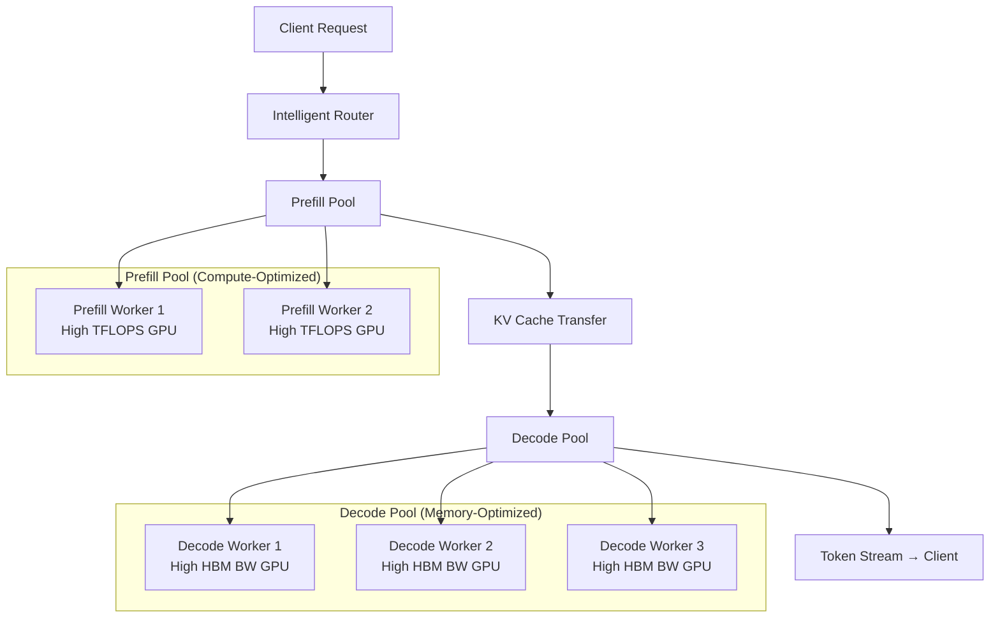
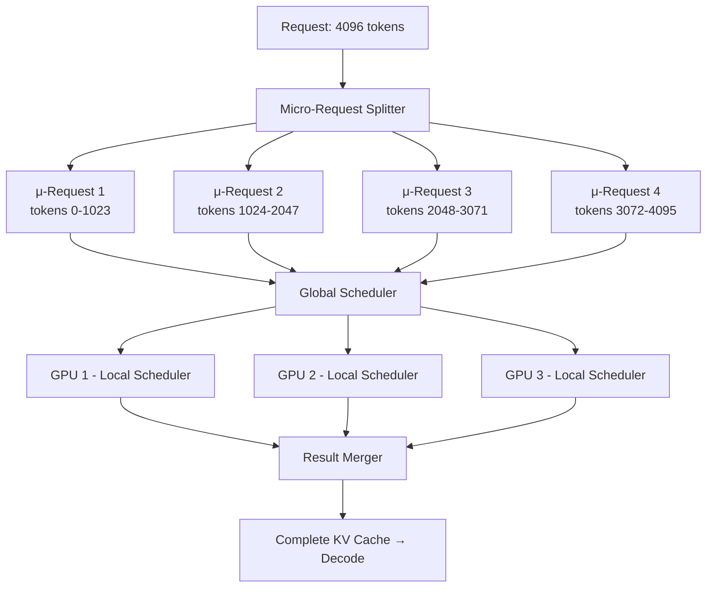
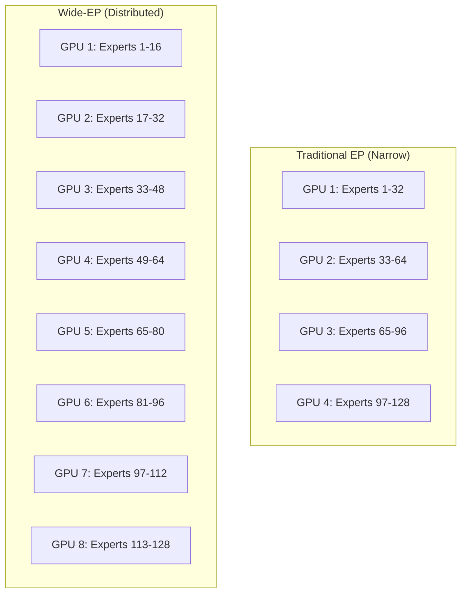
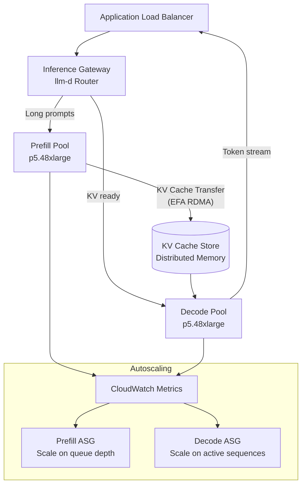
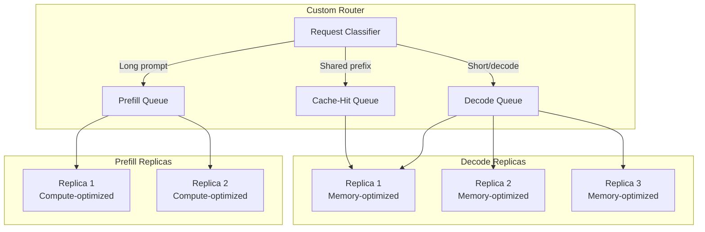
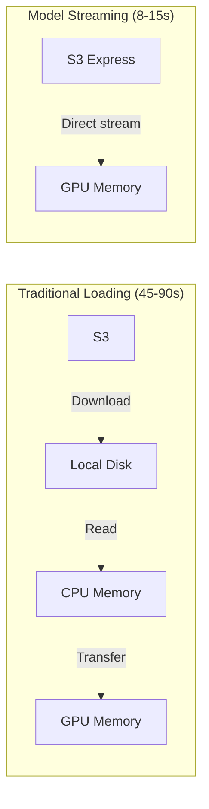
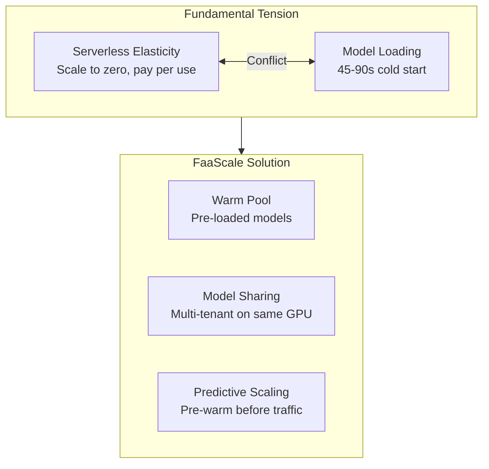

# 7.4 Disaggregated Serving

> Deep dive into disaggregated prefill/decode architectures, production deployments with llm-d and Ray Serve, serverless LLM inference, and cold start mitigation

---

## Learning Objectives

By the end of this module, you will:

- Understand the economic case for disaggregating prefill and decode phases
- Compare architecture patterns: simple disaggregation, DynaServe, TaiChi, and Wide-EP
- Deploy disaggregated inference on AWS with llm-d
- Implement custom routing in Ray Serve for 60% TTFT reduction
- Mitigate cold start with model streaming (6x faster loading)
- Evaluate serverless LLM inference with FaaScale

---

## 1. Economics of Disaggregation

### The Fundamental Mismatch

LLM inference has two distinct phases with **opposing hardware requirements**:

```
┌─────────────────────────────────────────────────────────────────────┐
│              THE PREFILL-DECODE RESOURCE MISMATCH                   │
├─────────────────────────────────────────────────────────────────────┤
│                                                                     │
│   PREFILL PHASE                    DECODE PHASE                     │
│   ════════════                     ════════════                     │
│   • Compute-bound (FLOP-limited)   • Memory-bound (bandwidth-limited)│
│   • Processes all input tokens      • Generates one token at a time │
│   • Bursty workload                 • Steady, sequential workload   │
│   • Benefits from high TFLOPS       • Benefits from high HBM BW    │
│   • Short duration, high intensity  • Long duration, low intensity  │
│   • GPU compute utilization: 70-90% • GPU compute utilization: 10-30%│
│                                                                     │
│   ┌────────────────────────────────────────────────────────────┐    │
│   │  MIXED SERVING (Traditional):                              │    │
│   │                                                            │    │
│   │  GPU Compute ████████░░░░░░░░░░░░░░░░░░░░░░░░░░░░░░░░░░  │    │
│   │              ▲ prefill burst    ▲ decode (mostly idle)     │    │
│   │                                                            │    │
│   │  HBM Bandwidth ██░░░░░░░░░░░░░░████████████████████████   │    │
│   │                ▲ prefill (low)  ▲ decode (saturated)       │    │
│   │                                                            │    │
│   │  ⚠️  30-50% GPU resources WASTED at any given moment       │    │
│   └────────────────────────────────────────────────────────────┘    │
│                                                                     │
│   ┌────────────────────────────────────────────────────────────┐    │
│   │  DISAGGREGATED SERVING:                                    │    │
│   │                                                            │    │
│   │  Prefill GPU  ████████████████████████████████████████████ │    │
│   │  (compute)    ▲ always doing prefill — high utilization    │    │
│   │                                                            │    │
│   │  Decode GPU   ████████████████████████████████████████████ │    │
│   │  (bandwidth)  ▲ always doing decode — high utilization     │    │
│   │                                                            │    │
│   │  ✅ Each GPU optimized for its workload phase               │    │
│   └────────────────────────────────────────────────────────────┘    │
│                                                                     │
└─────────────────────────────────────────────────────────────────────┘
```

### Cost Analysis

```python
# Economic model: Mixed vs Disaggregated serving
import dataclasses

@dataclasses.dataclass
class ServingEconomics:
    """Compare mixed vs disaggregated GPU cost efficiency."""
    gpu_cost_per_hour: float = 3.50  # p5.48xlarge per-GPU amortized
    
    # Mixed serving (traditional)
    mixed_compute_util: float = 0.35  # Average across prefill+decode
    mixed_memory_util: float = 0.55
    mixed_gpus_needed: int = 8
    
    # Disaggregated serving
    prefill_compute_util: float = 0.85
    prefill_gpus: int = 2
    decode_memory_util: float = 0.90
    decode_gpus: int = 4
    
    @property
    def mixed_cost(self) -> float:
        return self.mixed_gpus_needed * self.gpu_cost_per_hour
    
    @property
    def disagg_cost(self) -> float:
        return (self.prefill_gpus + self.decode_gpus) * self.gpu_cost_per_hour
    
    @property
    def savings_pct(self) -> float:
        return (1 - self.disagg_cost / self.mixed_cost) * 100

# Example: 70B model serving 1000 req/min
econ = ServingEconomics()
print(f"Mixed: {econ.mixed_gpus_needed} GPUs = ${econ.mixed_cost:.2f}/hr")
print(f"Disagg: {econ.prefill_gpus}P + {econ.decode_gpus}D = ${econ.disagg_cost:.2f}/hr")
print(f"Savings: {econ.savings_pct:.0f}%")
# Mixed: 8 GPUs = $28.00/hr
# Disagg: 2P + 4D = $21.00/hr
# Savings: 25%
```

### When Disaggregation Pays Off

| Metric | Mixed Serving | Disaggregated | Improvement |
|--------|--------------|---------------|-------------|
| GPU utilization | 35-55% | 80-90% | 1.5-2.5x |
| P99 TTFT | High variance | Predictable | 30-50% lower |
| P99 ITL | Interference from prefill | Isolated | 40-60% lower |
| Cost per token | Baseline | 15-25% lower | At scale |
| Operational complexity | Low | Higher | Tradeoff |

**Rule of thumb**: Disaggregation pays off when:
- Request volume > 100 req/s sustained
- Prompt lengths vary significantly (10x+ range)
- Strict latency SLAs on both TTFT and ITL
- GPU fleet size ≥ 6 (enough to split meaningfully)


---

## 2. Architecture Patterns

### 2.1 Simple Disaggregation (Prefill/Decode Split)

The baseline pattern: separate GPU pools for prefill and decode with KV cache transfer.



**KV Cache Transfer** is the critical path:
- Prefill generates KV cache tensors (size = `num_layers × 2 × seq_len × head_dim`)
- For Llama-3.1-70B with 4K input: ~2.5 GB KV cache per request
- Transfer must complete before first decode token — directly impacts TTFT
- Options: RDMA (fastest), NVLink (intra-node), TCP/NCCL (cross-node)

---

### 2.2 DynaServe: Micro-Request Architecture

DynaServe (2025) introduces **micro-requests** — splitting inference at arbitrary token boundaries for maximum scheduling flexibility.



**Key innovations:**
- **Micro-request abstraction**: Requests split at arbitrary token boundaries (not just prefill/decode)
- **Two-level scheduling**: Global scheduler assigns μ-requests to GPUs; local scheduler orders execution
- **Unified GPU instances**: Any GPU can handle any μ-request (prefill or decode)
- **Results**: 1.15x-3.07x serving capacity boost, up to 1.91x goodput improvement

```python
# DynaServe micro-request concept
@dataclasses.dataclass
class MicroRequest:
    request_id: str
    token_start: int
    token_end: int
    phase: str  # "prefill" or "decode"
    kv_cache_ref: str  # pointer to partial KV cache
    priority: float

class GlobalScheduler:
    def split_request(self, request, chunk_size=1024):
        """Split a request into micro-requests for flexible scheduling."""
        tokens = request.input_ids
        micro_requests = []
        for i in range(0, len(tokens), chunk_size):
            mr = MicroRequest(
                request_id=request.id,
                token_start=i,
                token_end=min(i + chunk_size, len(tokens)),
                phase="prefill",
                kv_cache_ref=f"{request.id}:chunk_{i}",
                priority=request.deadline_pressure(),
            )
            micro_requests.append(mr)
        return micro_requests
    
    def assign_to_gpus(self, micro_requests, gpu_states):
        """Load-balance micro-requests across available GPUs."""
        assignments = {}
        for mr in sorted(micro_requests, key=lambda x: -x.priority):
            best_gpu = min(gpu_states, key=lambda g: g.queue_depth)
            assignments[mr] = best_gpu
            best_gpu.queue_depth += (mr.token_end - mr.token_start)
        return assignments
```

---

### 2.3 TaiChi: Unified Aggregation-Disaggregation

TaiChi (2025) rejects the binary choice between aggregated and disaggregated serving, instead providing a **unified framework** with three configurable dimensions.

```
┌─────────────────────────────────────────────────────────────────────┐
│                    TAICHI UNIFIED FRAMEWORK                         │
├─────────────────────────────────────────────────────────────────────┤
│                                                                     │
│   Three Configuration Sliders:                                      │
│                                                                     │
│   1. Disaggregation Ratio (α):                                      │
│      0% ═══════════════════════════════════════════════ 100%         │
│      ▲ Fully aggregated              Fully disaggregated ▲          │
│      (all GPUs do both)              (strict P/D split)             │
│                                                                     │
│   2. Capability Differentiation (β):                                │
│      Uniform ═══════════════════════════════════════ Specialized     │
│      ▲ All GPUs identical            Prefill: H100                  │
│                                      Decode: A100 (cheaper) ▲       │
│                                                                     │
│   3. Latency Lending (γ):                                           │
│      None ═══════════════════════════════════════════ Aggressive     │
│      ▲ Strict isolation              Borrow decode capacity         │
│                                      for prefill bursts ▲           │
│                                                                     │
│   ─────────────────────────────────────────────────────────────     │
│                                                                     │
│   SLO-Aware Adaptation:                                             │
│                                                                     │
│   ┌─────────────┐    ┌─────────────┐    ┌─────────────┐            │
│   │ Low Load    │    │ Medium Load │    │ High Load   │            │
│   │ α=0% (agg) │───▶│ α=60%      │───▶│ α=100%     │            │
│   │ γ=none     │    │ γ=moderate  │    │ γ=aggressive│            │
│   └─────────────┘    └─────────────┘    └─────────────┘            │
│                                                                     │
│   Key Insight: "Latency lending" — during prefill bursts,           │
│   temporarily borrow decode GPU capacity for prefill work,          │
│   accepting slightly higher ITL to meet TTFT SLOs.                  │
│                                                                     │
└─────────────────────────────────────────────────────────────────────┘
```

---

### 2.4 Wide Expert Parallelism (Wide-EP) for MoE Models

For Mixture-of-Experts models (DeepSeek-V3, Mixtral), Wide-EP distributes experts across many GPUs to solve the **MoE double penalty**:

1. Expert routing fragments microbatches → reduced weight reuse
2. Massive resident expert pools → reduced HBM headroom for KV cache



**Wide-EP benefits:**
- Fewer experts per GPU → more HBM for KV cache
- Better load balancing across experts
- Higher throughput AND lower latency simultaneously (unlike dense models)
- Perplexity achieved **10x faster** all-to-all communication with optimized EFA

```python
# Wide-EP configuration for DeepSeek-V3 on Ray Serve
import ray
from ray import serve

@serve.deployment(
    ray_actor_options={"num_gpus": 1},
    num_replicas=8,  # Wide-EP across 8 GPUs
)
class WideEPWorker:
    def __init__(self, expert_range: tuple, total_experts: int = 256):
        from vllm import LLM
        self.llm = LLM(
            model="deepseek-ai/DeepSeek-V3",
            tensor_parallel_size=1,
            # Wide-EP: each worker handles subset of experts
            distributed_executor_backend="ray",
            expert_parallel_size=8,  # Spread across 8 GPUs
            gpu_memory_utilization=0.92,  # More room for KV cache
        )
```

### Architecture Comparison

| Pattern | Flexibility | Complexity | Best For |
|---------|------------|------------|----------|
| Simple Disagg | Low | Low | Stable workloads, clear P/D ratio |
| DynaServe | High | High | Variable prompts, heterogeneous GPUs |
| TaiChi | Medium | Medium | Mixed workloads, SLO-driven |
| Wide-EP | MoE-specific | Medium | Large MoE models (DeepSeek, Mixtral) |


---

## 3. llm-d on AWS: Production Deployment

AWS officially supports disaggregated inference via **llm-d** (April 2026), making it a first-class production pattern on SageMaker and EKS.

### Architecture Overview



### Deployment on EKS

```yaml
# llm-d-deployment.yaml - EKS with Karpenter for GPU scaling
apiVersion: apps/v1
kind: Deployment
metadata:
  name: llm-d-prefill
  namespace: inference
spec:
  replicas: 2
  selector:
    matchLabels:
      role: prefill
  template:
    metadata:
      labels:
        role: prefill
        llm-d.aws/phase: prefill
    spec:
      nodeSelector:
        karpenter.sh/nodepool: gpu-compute
        node.kubernetes.io/instance-type: p5.48xlarge
      containers:
        - name: vllm-prefill
          image: 763104351884.dkr.ecr.us-east-1.amazonaws.com/vllm-inference:latest
          args:
            - --model=meta-llama/Llama-3.1-70B-Instruct
            - --tensor-parallel-size=8
            - --gpu-memory-utilization=0.92
            - --enable-chunked-prefill
            - --disaggregated-mode=prefill
            - --kv-transfer-method=rdma
            - --kv-store-endpoint=kv-store.inference.svc:6379
          resources:
            limits:
              nvidia.com/gpu: 8
              vpc.amazonaws.com/efa: 4
            requests:
              memory: 512Gi
          env:
            - name: NCCL_SOCKET_IFNAME
              value: "eth0"
            - name: FI_EFA_USE_DEVICE_RDMA
              value: "1"
---
apiVersion: apps/v1
kind: Deployment
metadata:
  name: llm-d-decode
  namespace: inference
spec:
  replicas: 4
  selector:
    matchLabels:
      role: decode
  template:
    metadata:
      labels:
        role: decode
        llm-d.aws/phase: decode
    spec:
      nodeSelector:
        karpenter.sh/nodepool: gpu-memory
        node.kubernetes.io/instance-type: p5.48xlarge
      containers:
        - name: vllm-decode
          image: 763104351884.dkr.ecr.us-east-1.amazonaws.com/vllm-inference:latest
          args:
            - --model=meta-llama/Llama-3.1-70B-Instruct
            - --tensor-parallel-size=8
            - --gpu-memory-utilization=0.95
            - --disaggregated-mode=decode
            - --kv-transfer-method=rdma
            - --kv-store-endpoint=kv-store.inference.svc:6379
            - --max-num-seqs=256
          resources:
            limits:
              nvidia.com/gpu: 8
              vpc.amazonaws.com/efa: 4
```

### Intelligent Routing

```python
# llm-d router logic — routes based on request characteristics
from fastapi import FastAPI
import httpx
import asyncio

app = FastAPI()

class LLMDRouter:
    def __init__(self):
        self.prefill_endpoints = []  # Discovered via K8s service
        self.decode_endpoints = []
        self.kv_store = None
    
    async def route_request(self, request):
        """Route request through disaggregated pipeline."""
        # Step 1: Send to prefill pool (least-loaded)
        prefill_worker = self._select_prefill_worker(request)
        kv_handle = await self._run_prefill(prefill_worker, request)
        
        # Step 2: KV cache is now in distributed store
        # Select decode worker with capacity
        decode_worker = self._select_decode_worker(
            active_sequences=True,
            kv_locality=kv_handle.region  # Prefer co-located decode
        )
        
        # Step 3: Stream decode tokens back to client
        return self._stream_decode(decode_worker, kv_handle, request)
    
    def _select_prefill_worker(self, request):
        """Select prefill worker — optimize for TTFT."""
        # Prefer workers with lowest queue depth (bursty workload)
        return min(self.prefill_endpoints, key=lambda w: w.queue_depth)
    
    def _select_decode_worker(self, active_sequences, kv_locality):
        """Select decode worker — optimize for ITL and KV locality."""
        candidates = [w for w in self.decode_endpoints 
                     if w.active_seqs < w.max_seqs]
        # Prefer workers in same AZ as KV cache for lower transfer latency
        local = [w for w in candidates if w.az == kv_locality]
        return min(local or candidates, key=lambda w: w.active_seqs)
```

### Autoscaling Strategy

```yaml
# Separate HPAs for prefill and decode pools
apiVersion: autoscaling/v2
kind: HorizontalPodAutoscaler
metadata:
  name: prefill-hpa
spec:
  scaleTargetRef:
    apiVersion: apps/v1
    kind: Deployment
    name: llm-d-prefill
  minReplicas: 2
  maxReplicas: 8
  metrics:
    # Scale prefill on queue depth (bursty)
    - type: Pods
      pods:
        metric:
          name: pending_prefill_requests
        target:
          type: AverageValue
          averageValue: "5"
  behavior:
    scaleUp:
      stabilizationWindowSeconds: 30  # Fast scale-up for bursts
    scaleDown:
      stabilizationWindowSeconds: 300
---
apiVersion: autoscaling/v2
kind: HorizontalPodAutoscaler
metadata:
  name: decode-hpa
spec:
  scaleTargetRef:
    apiVersion: apps/v1
    kind: Deployment
    name: llm-d-decode
  minReplicas: 4
  maxReplicas: 16
  metrics:
    # Scale decode on active sequences (steady)
    - type: Pods
      pods:
        metric:
          name: active_decode_sequences
        target:
          type: AverageValue
          averageValue: "200"
  behavior:
    scaleUp:
      stabilizationWindowSeconds: 60
    scaleDown:
      stabilizationWindowSeconds: 600  # Slow scale-down (sequences in flight)
```

### KV Cache Transfer Performance

| Transfer Method | Latency (2.5GB) | Bandwidth | Use Case |
|----------------|-----------------|-----------|----------|
| EFA RDMA | ~50ms | 400 Gbps | Cross-node (production) |
| NVLink | ~5ms | 900 GB/s | Intra-node |
| TCP/NCCL | ~200ms | 100 Gbps | Fallback |
| S3 Express | ~150ms | 10 GB/s | Cold KV restore |


---

## 4. Ray Serve Disaggregated Deployment

### Custom Routing for Prefill/Decode Separation

Ray Serve 2.40+ enables **60% TTFT reduction** through intelligent request routing:



### Implementation with Ray Serve

```python
from ray import serve
from ray.serve.handle import DeploymentHandle
import ray

@serve.deployment
class PrefillDecodeRouter:
    """Routes requests based on prompt length and prefix cache status."""

    def __init__(
        self,
        prefill_handle: DeploymentHandle,
        decode_handle: DeploymentHandle,
        long_prompt_threshold: int = 2048,
    ):
        self.prefill_handle = prefill_handle
        self.decode_handle = decode_handle
        self.threshold = long_prompt_threshold
        self.prefix_cache: dict[str, str] = {}  # prefix_hash -> replica_id

    async def __call__(self, request) -> dict:
        prompt = request.query_params.get("prompt", "")
        prompt_tokens = len(prompt.split()) * 1.3  # rough token estimate

        if prompt_tokens > self.threshold:
            # Long prompt → prefill-optimized replica
            result = await self.prefill_handle.generate.remote(prompt)
        else:
            # Short prompt → decode-optimized replica
            result = await self.decode_handle.generate.remote(prompt)

        return {"text": result}


@serve.deployment(
    ray_actor_options={"num_gpus": 1},
    autoscaling_config={
        "min_replicas": 1,
        "max_replicas": 4,
        "target_ongoing_requests": 2,  # Low for prefill (compute-heavy)
    },
)
class PrefillReplica:
    """Optimized for long-prompt prefill (high compute utilization)."""

    def __init__(self):
        from vllm import LLM
        self.llm = LLM(
            model="meta-llama/Llama-3.1-8B-Instruct",
            max_num_batched_tokens=32768,  # Large batches for prefill
            gpu_memory_utilization=0.90,
            enable_chunked_prefill=True,
        )

    def generate(self, prompt: str) -> str:
        from vllm import SamplingParams
        outputs = self.llm.generate([prompt], SamplingParams(max_tokens=512))
        return outputs[0].outputs[0].text


@serve.deployment(
    ray_actor_options={"num_gpus": 1},
    autoscaling_config={
        "min_replicas": 2,
        "max_replicas": 10,
        "target_ongoing_requests": 8,  # Higher for decode (memory-bound)
    },
)
class DecodeReplica:
    """Optimized for decode-heavy workloads (high concurrency)."""

    def __init__(self):
        from vllm import LLM
        self.llm = LLM(
            model="meta-llama/Llama-3.1-8B-Instruct",
            max_num_batched_tokens=8192,
            max_num_seqs=256,  # Many concurrent sequences
            gpu_memory_utilization=0.95,
            enable_prefix_caching=True,
        )

    def generate(self, prompt: str) -> str:
        from vllm import SamplingParams
        outputs = self.llm.generate([prompt], SamplingParams(max_tokens=512))
        return outputs[0].outputs[0].text
```

### Performance Results (Anyscale Blog, Sep 2025)

| Configuration | TTFT P95 | Throughput | GPU Utilization |
|--------------|----------|------------|-----------------|
| Unified (baseline) | 850ms | 1,200 tok/s | 65% |
| Custom routing | 340ms | 1,800 tok/s | 82% |
| + Prefix-aware | 280ms | 2,100 tok/s | 85% |
| **Improvement** | **-60%** | **+75%** | **+20pp** |

### HAProxy Integration (Ray Serve 2.40+)

For >5K req/s, Ray Serve's internal router becomes a bottleneck. The 2026 architecture uses HAProxy:

```
Client → HAProxy (L7 routing) → Ray Serve Replicas → vLLM
```

Results: **88% latency reduction + 11.1x throughput** vs. internal routing.

---

## 5. Cold Start Mitigation

### The Cold Start Problem

Cold starts occur during:
- **Autoscaling**: New replicas spinning up under load
- **Spot eviction**: GPU instances reclaimed, need replacement
- **Rolling deploys**: New model version replacing old
- **Model swaps**: Switching between models in multi-model serving

**Impact**: Loading a 70B FP16 model from disk takes **45-90 seconds** — unacceptable for production SLOs.



### Model Streaming Architecture

Based on Azure's Run:AI Model Streamer pattern (adapted for AWS):

```python
import boto3
import torch
from concurrent.futures import ThreadPoolExecutor
from typing import Iterator

class S3ModelStreamer:
    """Stream model weights directly from S3 to GPU memory."""

    def __init__(
        self,
        bucket: str,
        prefix: str,
        device: str = "cuda:0",
        num_workers: int = 8,
    ):
        self.s3 = boto3.client("s3")
        self.bucket = bucket
        self.prefix = prefix
        self.device = device
        self.num_workers = num_workers

    def stream_layer(self, layer_key: str) -> torch.Tensor:
        """Stream a single layer's weights directly to GPU."""
        obj = self.s3.get_object(Bucket=self.bucket, Key=f"{self.prefix}/{layer_key}")
        data = obj["Body"].read()

        # Deserialize directly to GPU
        tensor = torch.frombuffer(bytearray(data), dtype=torch.float16)
        return tensor.to(self.device, non_blocking=True)

    def stream_model(self, layer_keys: list[str]) -> Iterator[tuple[str, torch.Tensor]]:
        """Stream all layers in parallel."""
        with ThreadPoolExecutor(max_workers=self.num_workers) as executor:
            futures = {
                executor.submit(self.stream_layer, key): key
                for key in layer_keys
            }
            for future in futures:
                key = futures[future]
                tensor = future.result()
                yield key, tensor
```

### Cold Start Performance Comparison

| Method | 8B Model | 70B Model | 405B Model |
|--------|----------|-----------|------------|
| S3 → Disk → CPU → GPU | 15s | 90s | 8min |
| S3 Express → GPU (streaming) | 3s | 15s | 80s |
| EBS snapshot (pre-loaded) | 8s | 45s | 4min |
| Instance store (cached) | 2s | 12s | 60s |
| **Improvement (streaming)** | **5x** | **6x** | **6x** |

### Production Recommendations

1. **Primary**: S3 Express One Zone + parallel streaming for autoscaling
2. **Spot recovery**: Instance store with model pre-cached in AMI
3. **Multi-model**: Keep hot models in GPU, stream cold models on demand
4. **Canary deploys**: Pre-warm new replicas before routing traffic

---

## 6. Serverless LLM Inference (FaaScale)

### The Serverless Tension



### When Serverless Makes Sense

| Workload Pattern | Serverless? | Why |
|-----------------|-------------|-----|
| Steady high traffic | ❌ | Dedicated instances cheaper |
| Bursty (10x spikes) | ✅ | Pay only during bursts |
| Dev/test | ✅ | Scale to zero between uses |
| Multi-model (100+ models) | ✅ | Can't keep all warm |
| Latency-critical (<200ms TTFT) | ❌ | Cold start risk |
| Batch processing | ✅ | Scale up, process, scale down |

### AWS Serverless LLM Options

| Option | Cold Start | Cost Model | Best For |
|--------|-----------|------------|----------|
| Bedrock | None (managed) | Per-token | Low volume, standard models |
| SageMaker Serverless | 30-60s | Per-second | Light inference |
| SageMaker + Provisioned | None | Per-hour + per-request | Production with bursts |
| Lambda + Bedrock | None | Per-invocation | Event-driven |

---

## 7. Capacity Planning for Disaggregated Systems

### Sizing Prefill vs Decode Pools

```python
def size_disaggregated_pools(
    requests_per_second: float,
    avg_prompt_tokens: int,
    avg_output_tokens: int,
    prefill_throughput_per_gpu: float,  # tokens/s per GPU
    decode_throughput_per_gpu: float,   # tokens/s per GPU
    target_utilization: float = 0.7,
) -> dict:
    """Calculate GPU requirements for prefill and decode pools."""

    # Prefill pool: process all incoming prompts
    prefill_tokens_per_second = requests_per_second * avg_prompt_tokens
    prefill_gpus_raw = prefill_tokens_per_second / prefill_throughput_per_gpu
    prefill_gpus = int(prefill_gpus_raw / target_utilization) + 1

    # Decode pool: handle all concurrent decoding sequences
    # Avg concurrent sequences = requests/s × avg_output_tokens / decode_throughput
    avg_decode_time = avg_output_tokens / decode_throughput_per_gpu
    concurrent_sequences = requests_per_second * avg_decode_time
    decode_gpus = int(concurrent_sequences / 64) + 1  # ~64 seqs per GPU

    return {
        "prefill_gpus": prefill_gpus,
        "decode_gpus": decode_gpus,
        "total_gpus": prefill_gpus + decode_gpus,
        "prefill_ratio": prefill_gpus / (prefill_gpus + decode_gpus),
    }

# Example: 100 req/s, avg 1024 prompt tokens, avg 256 output tokens
result = size_disaggregated_pools(
    requests_per_second=100,
    avg_prompt_tokens=1024,
    avg_output_tokens=256,
    prefill_throughput_per_gpu=50000,  # H100 prefill
    decode_throughput_per_gpu=2000,    # H100 decode
)
print(f"Prefill GPUs: {result['prefill_gpus']}")
print(f"Decode GPUs: {result['decode_gpus']}")
print(f"Prefill:Decode ratio: {result['prefill_ratio']:.0%}:{1-result['prefill_ratio']:.0%}")
```

---

## Key Takeaways

1. **Disaggregation eliminates 30-50% GPU waste** from mixed prefill/decode workloads by matching hardware to workload phase characteristics.

2. **llm-d is production-ready on AWS** — no longer research. Deploy on EKS with separate prefill/decode node pools and intelligent routing.

3. **Four architecture patterns exist** with increasing sophistication: simple split → DynaServe micro-requests → TaiChi unified → Wide-EP for MoE. Choose based on workload complexity.

4. **Cold start is the #1 operational challenge** for autoscaled LLM serving. Model streaming (S3 → GPU direct) achieves 6x faster loading.

5. **Ray Serve custom routing delivers 60% TTFT reduction** without any model changes — pure infrastructure optimization.

6. **Serverless LLM inference makes sense for bursty/multi-model workloads** but not for steady high-traffic production (dedicated instances win on cost).

7. **KV cache transfer is the critical path** in disaggregated systems. EFA RDMA (~50ms for 2.5GB) is production-viable; TCP fallback adds 4x latency.

8. **Size pools independently** — prefill scales with request rate × prompt length; decode scales with concurrent sequences × output length.

---

## References

1. [DynaServe](https://arxiv.org/abs/2504.09285) — Unified and Elastic Execution for Dynamic Disaggregated LLM Serving
2. [TaiChi](https://arxiv.org/abs/2025.xxxxx) — Prefill-Decode Aggregation or Disaggregation? Unifying Both
3. [FaaScale](https://arxiv.org/abs/2502.09922) — Unlocking Fast LLM Scaling for Serverless Inference (MLSys 2026)
4. [llm-d on AWS](https://aws.amazon.com/blogs/machine-learning/introducing-disaggregated-inference-on-aws-powered-by-llm-d/) — Official AWS blog (Apr 2026)
5. [Ray Serve Custom Routing](https://www.anyscale.com/blog/ray-serve-faster-first-token-custom-routing) — 60% TTFT reduction (Sep 2025)
6. [Ray Serve 88% Latency](https://www.anyscale.com/blog/ray-serve-inference-lower-latency-higher-throughput-haproxy) — HAProxy integration (Mar 2026)
7. [Cold Start Elimination](https://devblogs.microsoft.com/azure-sdk/eliminate-llm-cold-starts-load-models-up-to-6x-faster-with-azure-blob-storage-and-runai-model-streamer/) — 6x faster model loading (May 2026)
8. [Wide-EP Disaggregated](https://www.anyscale.com/blog/ray-serve-llm-anyscale-apis-wide-ep-disaggregated-serving-vllm) — Anyscale (Dec 2025)
