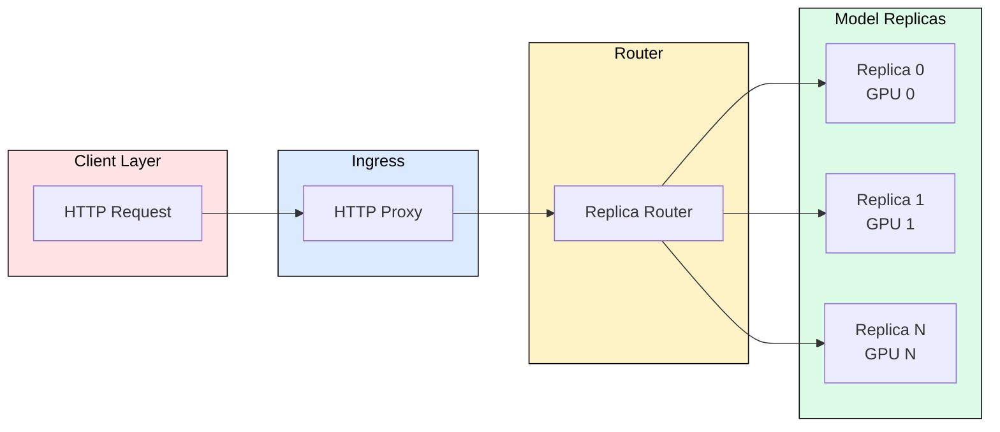
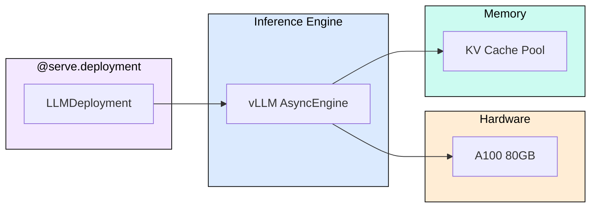
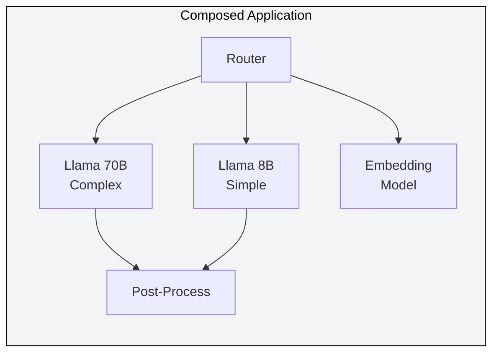
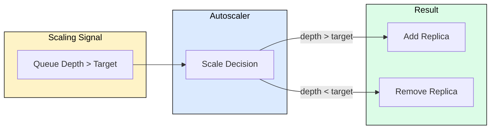

# 7.1 Ray Serve for LLM Inference

 

Ray Serve is the most widely adopted framework for serving LLMs in production. It handles autoscaling, batching, multi-model composition, and GPU multiplexing without requiring you to build these primitives from scratch. This module explains how Ray Serve works, when to choose it over alternatives, and how its architecture maps to LLM serving requirements.

---

## Why Ray Serve for LLMs

LLM serving differs from traditional model serving in three ways: models consume entire GPUs, requests have variable compute cost (short prompt vs. long generation), and latency SLOs require continuous batching. Ray Serve addresses all three through its actor-based deployment model.

The HTTP proxy accepts requests and forwards them to the replica router, which load-balances across GPU-pinned replicas. Each replica runs a vLLM or SGLang engine internally.

---

## Core Architecture

Ray Serve deployments wrap inference engines as Ray actors. Each actor owns a GPU, runs continuous batching internally, and exposes an async interface for streaming tokens back to clients.

Key configuration parameters:
- `num_replicas`: how many GPU actors to run
- `max_ongoing_requests`: controls request queuing per replica
- `autoscaling_config`: scales replicas based on queue depth
- `ray_actor_options`: pins GPUs with `num_gpus=1`

---

## Multi-Model Composition

Production systems rarely serve a single model. Ray Serve's deployment graph lets you compose a router, multiple specialized models, and post-processing steps into a single application.

The router examines input complexity and dispatches to the appropriate model. This reduces GPU cost by routing simple queries to smaller models while reserving large models for complex reasoning tasks.

---

## Autoscaling for LLM Workloads

Ray Serve autoscaling monitors queue depth per replica and adjusts replica count within configured bounds. For LLMs, the critical metric is `num_ongoing_requests` rather than CPU utilization.

Configuration:
- `target_ongoing_requests`: desired queue depth per replica (typically 1-4 for LLMs)
- `min_replicas` / `max_replicas`: bounds on scaling
- `upscale_delay_s`: how long to wait before adding replicas (30-60s typical)
- `downscale_delay_s`: how long to wait before removing (300s to avoid flapping)

---

## When to Use Ray Serve

Ray Serve is the right choice when you need:
- Multi-model serving on a shared GPU cluster
- Custom routing logic (A/B testing, cascading models)
- Integration with Ray Data pipelines for online feature computation
- Autoscaling with fine-grained queue-depth metrics

Alternatives are preferable when:
- You need a single-model, maximum-throughput endpoint (use vLLM directly)
- You require Kubernetes-native deployment with HPA (use KServe + vLLM backend)
- You want serverless scale-to-zero (use managed endpoints like SageMaker or Baseten)

---

## FAQ

**Q: Does Ray Serve add latency over running vLLM directly?**
A: Approximately 1-3ms per request for routing. Negligible compared to generation time.

**Q: Can I use tensor parallelism across multiple GPUs per replica?**
A: Yes. Set `ray_actor_options={"num_gpus": N}` and configure the engine for TP=N.

**Q: How does Ray Serve handle long-running streaming requests?**
A: Each replica runs async generators. The proxy streams Server-Sent Events back to the client without blocking other requests.

**Q: What happens if a replica crashes mid-generation?**
A: Ray restarts the actor automatically. In-flight requests receive an error; the client retries against a healthy replica.

**Q: How do I deploy Ray Serve on Kubernetes?**
A: Use KubeRay (RayCluster CRD). Ray Serve deployments run inside the Ray cluster; Kubernetes handles node-level scaling.

---

## References

1. Ray Serve documentation: https://docs.ray.io/en/latest/serve/
2. Anyscale blog, "Scaling LLM Inference with Ray Serve" (2024)
3. KubeRay project: https://github.com/ray-project/kuberay
4. vLLM + Ray Serve integration: https://docs.vllm.ai/en/latest/serving/distributed_serving.html
5. Anyscale, "Architecting Multimodal Pipelines" (Ray Summit 2025)
