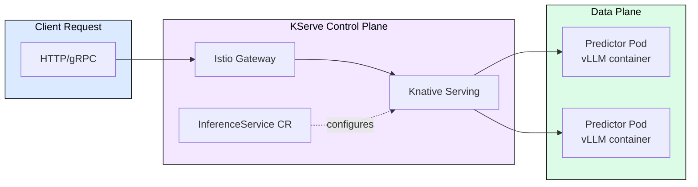
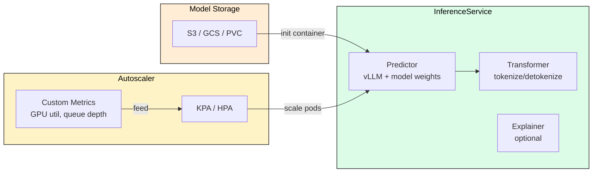
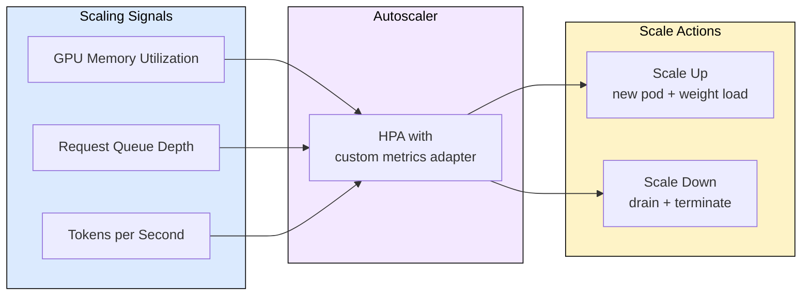
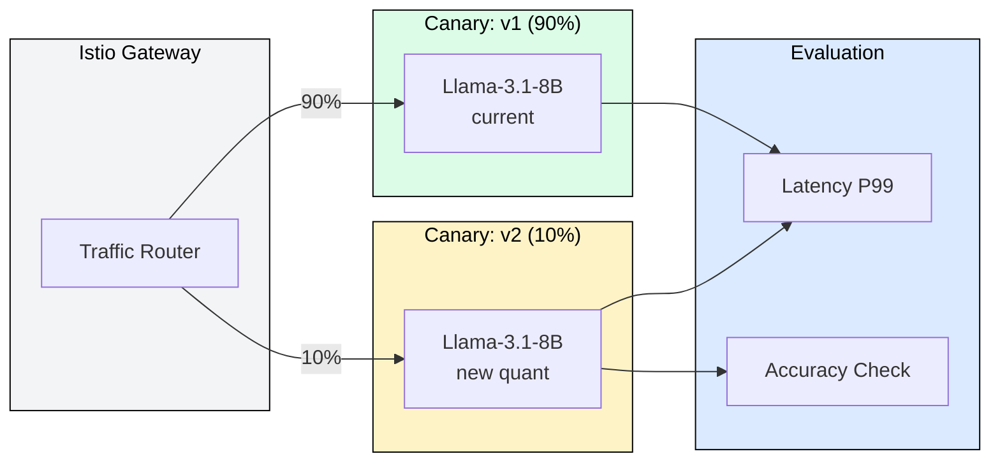

# 7.2 KServe on EKS

 

KServe is the Kubernetes-native model serving framework that abstracts inference workloads behind a standardized API. For LLM serving on EKS, KServe provides autoscaling, canary rollouts, and multi-model routing without writing custom deployment logic. This module covers why KServe fits LLM workloads, how the architecture maps requests to GPU pods, and the operational patterns that make production serving reliable.

## Why KServe for LLMs

Traditional Kubernetes Deployments treat every pod identically. LLM serving breaks this assumption: models consume 14-140 GB of VRAM, cold starts take 30-120 seconds loading weights, and request latency varies 10x depending on output length. KServe solves these problems through model-aware autoscaling, predictive routing, and graceful scale-to-zero.

The alternative is hand-rolling HPA metrics, custom readiness probes, and load balancer configuration. Teams that start with raw Deployments inevitably rebuild KServe's features one by one.

KServe splits responsibilities: the control plane (InferenceService CRD, Knative, Istio) handles routing and scaling decisions, while the data plane runs actual inference containers. This separation means you can swap vLLM for TensorRT-LLM without changing any routing configuration.

## InferenceService Architecture

An InferenceService is a single Custom Resource that declares the entire serving stack: model location, runtime container, resource requests, scaling bounds, and canary traffic splits.

The Predictor component runs the actual LLM engine. For LLMs, the Transformer component (pre/post-processing) is typically embedded in the engine itself (vLLM handles tokenization internally), so most LLM InferenceServices only define a Predictor.

Key fields in the spec:
- `storageUri`: S3 path to model weights (downloaded by init container at pod startup)
- `runtimeVersion`: container image tag for the serving engine
- `resources.limits.nvidia.com/gpu`: number of GPUs per replica
- `minReplicas` / `maxReplicas`: autoscaling bounds (set minReplicas=1 to avoid cold starts)

## Autoscaling for LLM Workloads

Default Knative autoscaling uses concurrency (requests per pod). For LLMs, this is suboptimal because a single long-generation request and a short prompt have wildly different costs. Production deployments replace concurrency with custom metrics.

Recommended scaling strategy for LLMs on EKS:
1. Primary metric: request queue depth (directly measures user-visible wait time)
2. Secondary metric: GPU memory utilization (prevents OOM from KV cache growth)
3. Scale-up threshold: queue depth > 5 for 30 seconds
4. Scale-down cooldown: 300 seconds minimum (avoids thrashing given 60-second cold starts)
5. Always set `minReplicas >= 1` for latency-sensitive endpoints

## Canary Deployments and Traffic Splitting

Model updates in production require careful rollouts. KServe supports percentage-based traffic splitting between model versions natively through the InferenceService spec.

The rollout pattern: deploy new model version at 10% traffic, monitor P99 latency and output quality for 1 hour, promote to 50% if metrics hold, then 100%. Rollback is instant (update traffic percentage in the CR).

## Operational Considerations

**Cold start mitigation**: LLM weight loading takes 30-120 seconds depending on model size and storage throughput. Use `minReplicas=1`, pre-pull images with DaemonSets, and store weights on FSx for Lustre (10 GB/s throughput) rather than S3 directly.

**Multi-GPU models**: For models requiring tensor parallelism (70B+ parameters), configure `nvidia.com/gpu: N` and ensure the KServe runtime passes `--tensor-parallel-size N` to vLLM.

**Node affinity**: Pin LLM workloads to specific GPU node pools (p5.48xlarge for H100, g5.xlarge for A10G) using node selectors. Mixing GPU types in one node pool causes scheduling failures.

**Cost optimization**: Use Karpenter for GPU node provisioning. It provisions right-sized instances within seconds rather than maintaining always-on GPU capacity. Combine with KServe scale-to-zero for dev/staging environments.

## FAQ

**Q: KServe vs raw Kubernetes Deployment for LLMs?**
A: KServe adds model-aware autoscaling, canary traffic splitting, model storage abstraction, and standardized inference APIs. Raw Deployments require reimplementing all of these.

**Q: How do I handle models larger than one GPU?**
A: Set `resources.limits.nvidia.com/gpu` to the tensor parallelism degree and configure the runtime with matching TP size. KServe schedules the pod on a node with sufficient GPUs.

**Q: What about scale-to-zero for LLMs?**
A: Possible but impractical for production (60-120 second cold starts). Use for dev/staging. Production should set `minReplicas >= 1`.

**Q: KServe vs Triton Inference Server?**
A: They complement each other. KServe is the orchestration layer (routing, scaling, rollouts). Triton can be the runtime inside KServe's Predictor pod, though vLLM/SGLang are preferred for LLMs due to PagedAttention.

**Q: How does KServe handle request timeouts for long generations?**
A: Configure Istio gateway timeout (default 300s is too low for long outputs). Set to max_tokens * expected_ITL * 2 as safety margin.

## References

1. KServe Documentation. "InferenceService API." https://kserve.github.io/website/
2. AWS. "Deploy ML Models on EKS with KServe." https://docs.aws.amazon.com/eks/latest/userguide/
3. Knative Serving. "Autoscaling Configuration." https://knative.dev/docs/serving/autoscaling/
4. vLLM. "Deploying with KServe." https://docs.vllm.ai/en/latest/serving/deploying_with_kserve.html
5. Karpenter. "GPU Instance Provisioning." https://karpenter.sh/docs/concepts/nodepools/
