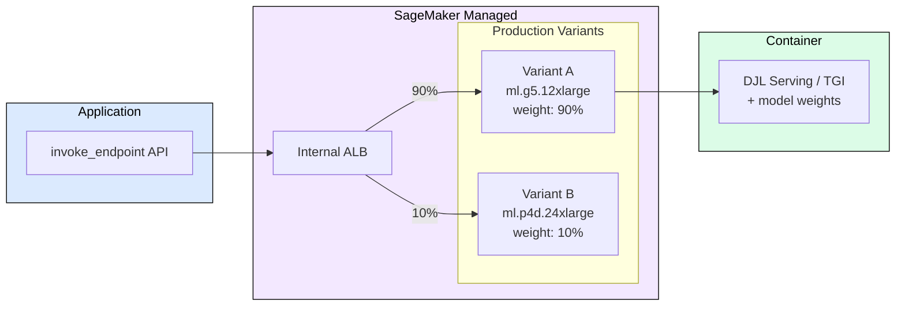
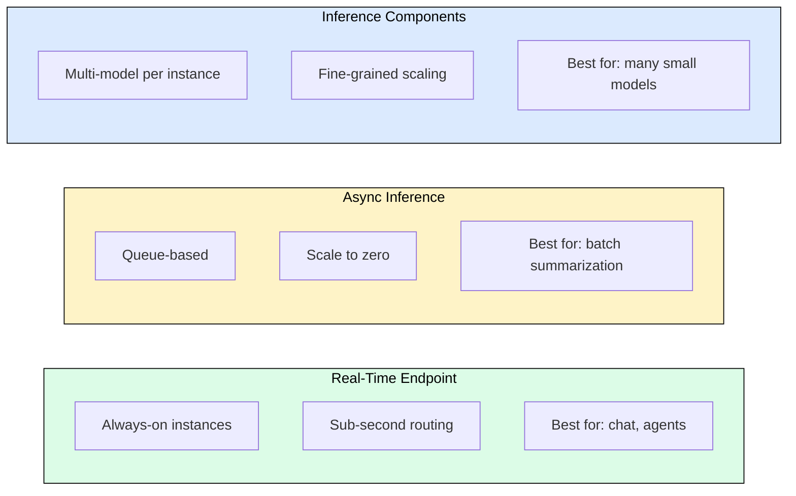
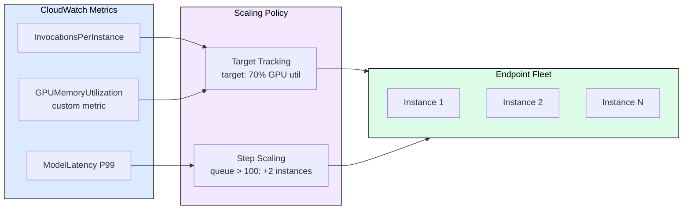
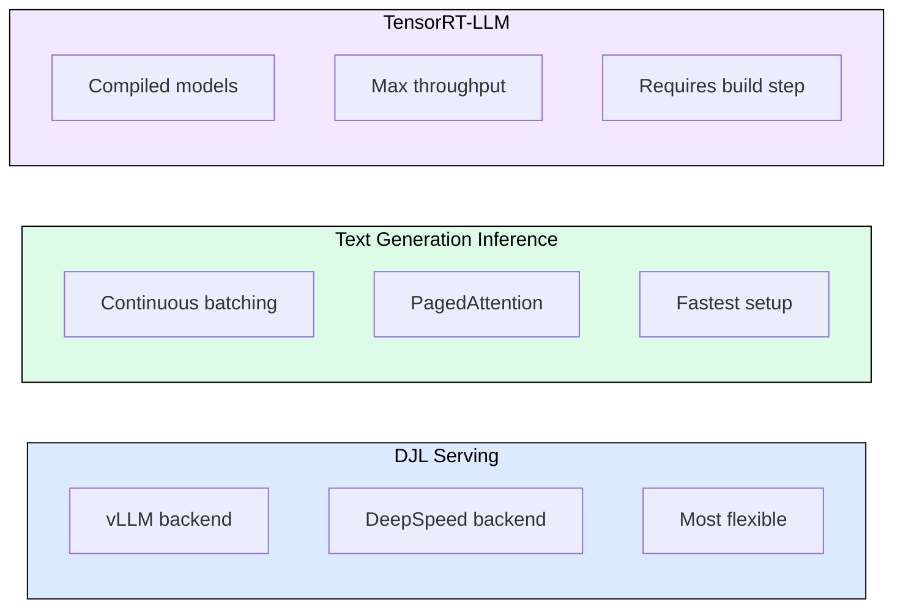

# 7.3 SageMaker for LLM Serving

 

SageMaker abstracts GPU infrastructure behind managed endpoints. You specify the model, instance type, and scaling policy; AWS handles container orchestration, load balancing, health checks, and instance lifecycle. For teams without dedicated Kubernetes expertise, SageMaker eliminates months of infrastructure work. This module covers when SageMaker fits LLM workloads, how its inference components map to serving concepts, and the operational patterns for production deployments.

## SageMaker Inference Architecture

SageMaker endpoints run model containers on managed ML instances behind an internal load balancer. The key abstraction: you never see the underlying EC2 instances, VPCs, or container orchestration.

Each Production Variant is an instance fleet running one model version. Traffic splitting between variants enables A/B testing and canary deployments without infrastructure changes.

## Deployment Options for LLMs

SageMaker provides three LLM-specific deployment paths, each optimized for different latency and cost requirements.

**Real-Time Endpoints** keep instances warm and route requests immediately. Use for interactive applications where P99 latency matters. Cost: you pay for instances 24/7 regardless of traffic.

**Async Inference** accepts requests into an SQS queue and processes them when capacity is available. Supports scale-to-zero (no instances running when idle). Trade-off: seconds to minutes of queue delay.

**Inference Components** (launched 2024) pack multiple models onto shared GPU instances with per-model autoscaling. Each component gets a guaranteed GPU memory allocation. This is ideal for serving dozens of fine-tuned LoRA variants on shared base model infrastructure.

## Autoscaling Configuration

SageMaker autoscaling uses Application Auto Scaling with CloudWatch metrics. For LLMs, the default InvocationsPerInstance metric is insufficient because it ignores token-level costs.

Recommended scaling configuration:
1. Primary: Target tracking on custom GPU utilization metric (target 70%)
2. Secondary: Step scaling on ModelLatency P99 (> 5 seconds triggers +1 instance)
3. Min instances: 1 for production, 0 for async endpoints
4. Cooldown: 600 seconds scale-in, 120 seconds scale-out
5. Publish custom metrics from the container using CloudWatch PutMetricData

## Container Choices

SageMaker provides pre-built Deep Learning Containers (DLCs) optimized for LLM serving:

- **DJL Serving (djl-deepspeed)**: Supports vLLM, DeepSpeed, and FasterTransformer backends. Most flexible option. Configure via `serving.properties` file.
- **TGI (Hugging Face Text Generation Inference)**: Production-proven, handles continuous batching and PagedAttention natively. Less configuration surface.
- **TensorRT-LLM**: Highest throughput on NVIDIA hardware. Requires model compilation step before deployment. Best for stable, high-volume endpoints.

Selection criteria: TGI for fastest time-to-production, DJL for backend flexibility, TensorRT-LLM for maximum throughput on fixed models.

## Operational Patterns

**Model loading optimization**: Large models (70B+) take 10-15 minutes to load from S3. Use SageMaker Model Registry with pre-compiled model artifacts and enable S3 Express One Zone for 10x faster downloads.

**Shadow testing**: Deploy new model versions as shadow variants that receive copies of production traffic without affecting responses. Compare output quality offline before promoting.

**Multi-model endpoints**: For serving many fine-tuned variants (LoRA adapters), use Inference Components with a shared base model. Each adapter loads in seconds rather than minutes for full model swaps.

**Cost management**: Use Savings Plans for steady-state baseline, auto-scaling for burst traffic. Async endpoints with scale-to-zero for batch workloads. Monitor per-model cost using endpoint tagging.

## FAQ

**Q: SageMaker vs self-managed EKS for LLM serving?**
A: SageMaker trades flexibility for operational simplicity. Choose SageMaker when you lack Kubernetes expertise or want faster time-to-production. Choose EKS when you need custom networking, specific autoscaling logic, or multi-cloud portability.

**Q: How do I serve models larger than one instance's GPU memory?**
A: Use ml.p4d.24xlarge (8x A100) or ml.p5.48xlarge (8x H100) with tensor parallelism configured in the container. DJL Serving supports `option.tensor_parallel_degree` in serving.properties.

**Q: What about streaming responses for chat applications?**
A: SageMaker supports response streaming via `InvokeEndpointWithResponseStream` API. Both TGI and DJL containers support server-sent events for token-by-token delivery.

**Q: How do I A/B test model versions?**
A: Create multiple Production Variants on the same endpoint with traffic weight percentages. Monitor per-variant CloudWatch metrics. Promote winner by shifting traffic to 100%.

**Q: What are cold start times?**
A: Real-time endpoints: 5-15 minutes for initial deployment (model download + container start + weight loading). Subsequent scaling events: 3-8 minutes per new instance. Inference Components: 30-60 seconds for LoRA adapter swaps on pre-loaded base models.

## References

1. AWS. "Deploy LLMs with SageMaker." https://docs.aws.amazon.com/sagemaker/latest/dg/large-model-inference.html
2. AWS. "SageMaker Inference Components." https://docs.aws.amazon.com/sagemaker/latest/dg/inference-components.html
3. DJL Serving. "Configuration for LLMs." https://docs.djl.ai/docs/serving/serving/docs/lmi/
4. AWS. "SageMaker Autoscaling." https://docs.aws.amazon.com/sagemaker/latest/dg/endpoint-auto-scaling.html
5. Hugging Face. "TGI on SageMaker." https://huggingface.co/docs/sagemaker/inference
