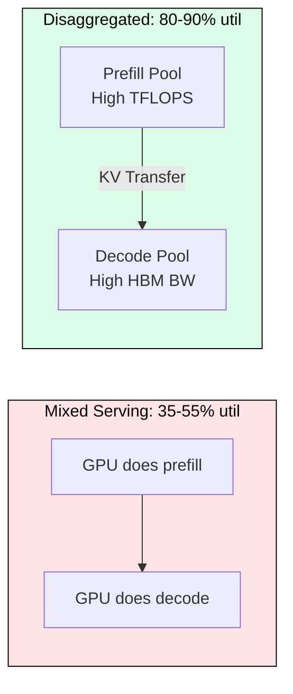
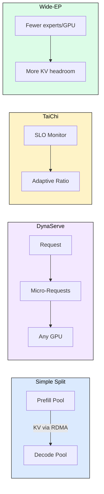
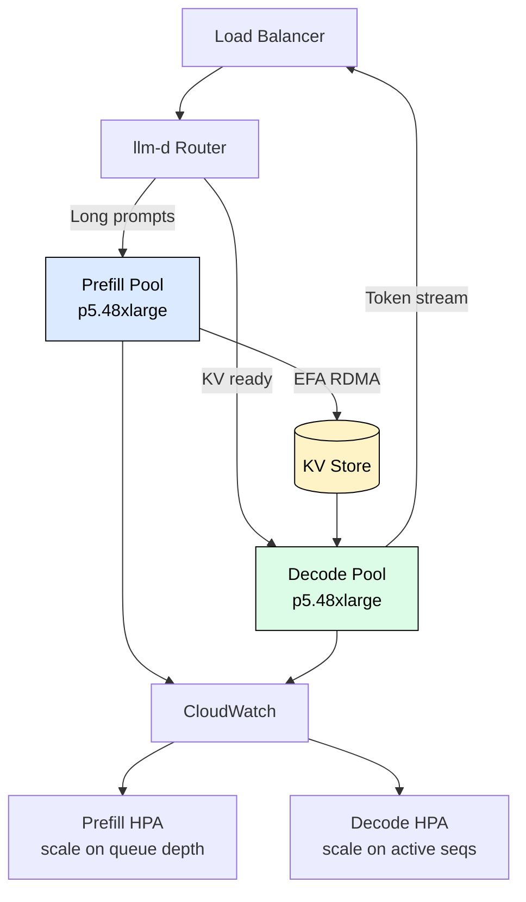
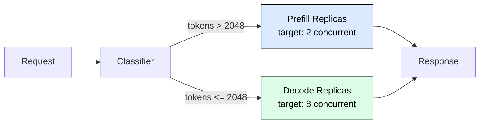

# 7.4 Disaggregated Serving

 

LLM inference wastes 30-50% of GPU resources because prefill (compute-bound) and decode (memory-bound) share the same hardware. Disaggregated serving eliminates this by running each phase on dedicated GPU pools optimized for its workload characteristics.

---

## Why Disaggregation Matters

A single GPU running both phases operates at 35-55% utilization. Prefill saturates compute (70-90% FLOPS) but leaves memory bandwidth idle. Decode saturates bandwidth but leaves compute idle. Separating them lets each pool hit 80-90% utilization on the dimension that matters.

The economic case: for a 70B model serving 1000 req/min, disaggregation reduces GPU count from 8 to 6 (2 prefill + 4 decode) by eliminating idle resource waste, saving 25% on GPU costs.

| Metric | Mixed | Disaggregated |
|--------|-------|---------------|
| GPU utilization | 35-55% | 80-90% |
| P99 TTFT | High variance | 30-50% lower |
| P99 ITL | Prefill interference | 40-60% lower |
| Cost per token | Baseline | 15-25% lower |

Disaggregation pays off when: request volume exceeds 100 req/s, prompt lengths vary by 10x+, and the fleet has 6+ GPUs to split meaningfully.

---

## Architecture Patterns

Four patterns exist with increasing sophistication. Choose based on workload complexity.

**Simple Disaggregation**: Separate GPU pools for prefill and decode with KV cache transfer via RDMA. Prefill generates KV tensors (for Llama-3.1-70B with 4K input: ~2.5 GB), transfers them to the decode pool, which streams tokens back. Best for stable workloads with predictable P/D ratios.

**DynaServe** (2025): Splits requests into micro-requests at arbitrary token boundaries. A global scheduler assigns chunks to any GPU based on load and priority. Achieves 1.15-3.07x capacity boost by eliminating rigid prefill/decode assignment.

**TaiChi** (2025): Rejects binary disaggregation. Three configurable sliders control disaggregation ratio (0-100%), capability differentiation (uniform vs specialized GPUs), and latency lending (borrowing decode capacity for prefill bursts). Adapts the split dynamically based on SLO pressure.

**Wide-EP** (for MoE models): Distributes experts across more GPUs so each holds fewer experts, freeing HBM for KV cache. Critical for DeepSeek-V3 and Mixtral where expert routing fragments microbatches.

---

## Production Deployment with llm-d on AWS

AWS officially supports disaggregated inference via llm-d (April 2026), making it first-class on EKS and SageMaker.

The router selects prefill workers by lowest queue depth (bursty workload) and decode workers by KV locality plus available sequence slots. Autoscaling uses separate HPAs: prefill scales on pending requests (fast scale-up, 30s window), decode scales on active sequences (slow scale-down, 600s window to protect in-flight sequences).

KV cache transfer performance determines whether disaggregation is viable:

| Transfer Method | Latency (2.5GB) | Use Case |
|----------------|-----------------|----------|
| EFA RDMA | ~50ms | Cross-node production |
| NVLink | ~5ms | Intra-node |
| TCP/NCCL | ~200ms | Fallback |

EFA RDMA at 400 Gbps makes cross-node transfer viable (50ms overhead vs 400ms prefill savings). TCP fallback adds 4x latency and should be avoided for latency-sensitive workloads.

---

## Ray Serve: 60% TTFT Reduction

Ray Serve 2.40+ enables custom routing that classifies requests by prompt length and routes long prompts to compute-optimized prefill replicas, short prompts to memory-optimized decode replicas.

Results from Anyscale (Sep 2025): TTFT P95 drops from 850ms to 280ms (with prefix-aware routing), throughput increases 75%, GPU utilization rises from 65% to 85%. For deployments exceeding 5K req/s, HAProxy as L7 router delivers 88% latency reduction and 11.1x throughput vs Ray Serve internal routing.

---

## Cold Start Mitigation

Cold starts (45-90s for 70B models from disk) are the primary operational challenge for autoscaled disaggregated systems. Model streaming eliminates 80% of this latency by streaming weights directly from S3 Express to GPU memory.

| Method | 8B Model | 70B Model | Improvement |
|--------|----------|-----------|-------------|
| S3, Disk, CPU, GPU | 15s | 90s | Baseline |
| S3 Express, GPU stream | 3s | 15s | 6x faster |
| Instance store (cached) | 2s | 12s | 7x faster |

Production strategy: S3 Express streaming for autoscaling, instance store with pre-cached AMI for spot recovery, gradual traffic ramp for new nodes.

---

## Sizing Prefill vs Decode Pools

Pool ratio depends on the prompt-to-output ratio. The prefill pool scales with request rate multiplied by prompt length. The decode pool scales with concurrent sequences multiplied by output length.

Rule of thumb for a 70B model at 100 req/s with 1024 prompt tokens and 256 output tokens: 3 prefill GPUs + 5 decode GPUs (typical 30-40% prefill allocation).

---

## FAQ

**Q: When does disaggregation NOT make sense?**
A: Below 100 req/s, the overhead of KV transfer and operational complexity outweighs utilization gains. Single-node deployments should use standard continuous batching.

**Q: What happens if the prefill pool is overwhelmed?**
A: Requests queue at the router. The prefill HPA should scale up within 30s. TaiChi-style latency lending can temporarily borrow decode capacity for prefill bursts.

**Q: Does disaggregation work with tensor parallelism?**
A: Yes. Each TP group within the prefill/decode pool operates normally. The KV transfer moves the full KV cache (all TP shards) to the decode pool.

**Q: How does Mooncake hide transfer latency?**
A: Output-length prediction (85%+ accuracy) pre-allocates decode slots before prefill finishes, overlapping KV transfer with decode batch formation.

**Q: What is the minimum interconnect for production?**
A: 200Gb InfiniBand (RDMA) minimum. 400Gb preferred. TCP adds 4x latency and erases disaggregation benefits for latency-sensitive workloads.

---

## References

1. DynaServe (arXiv:2504.09285, 2025): Micro-request architecture for elastic disaggregated serving
2. TaiChi (2025): Unified aggregation-disaggregation framework with SLO-aware adaptation
3. FaaScale (arXiv:2502.09922, MLSys 2026): Serverless LLM inference with warm pool management
4. llm-d on AWS (Apr 2026): Official AWS disaggregated inference with EFA RDMA
5. Anyscale Ray Serve (Sep 2025): Custom routing achieving 60% TTFT reduction
6. Mooncake (FAST 2025): Prediction-based scheduling with KV cache pipelining
7. Azure Model Streamer (May 2026): 6x faster cold start via direct S3-to-GPU streaming
