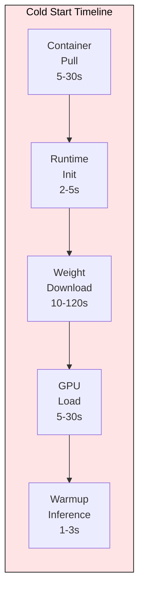
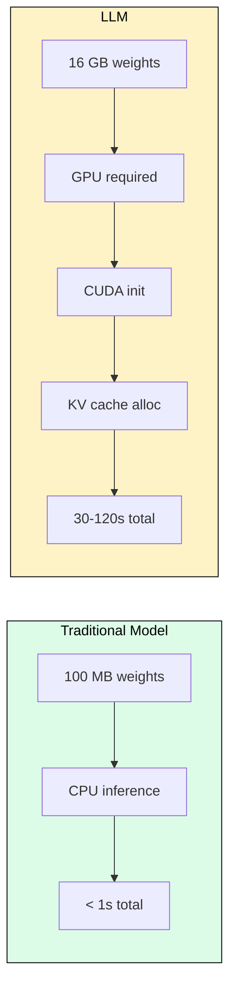
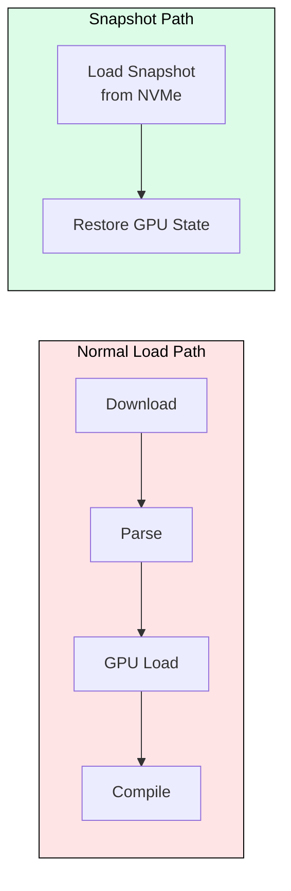
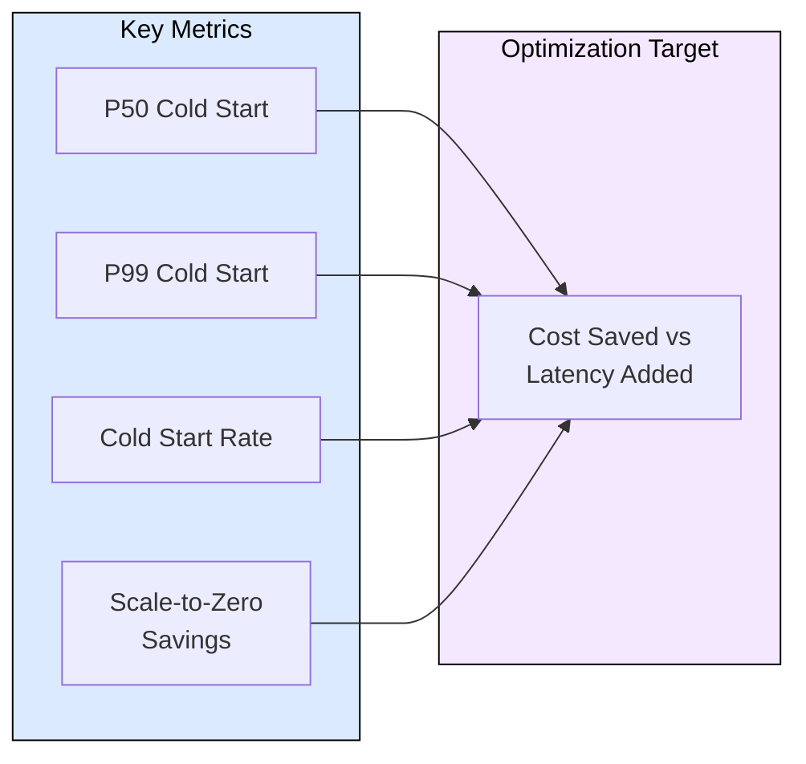

# 7.5 Cold Start in Serverless LLM Serving

 

Serverless LLM serving promises scale-to-zero economics: you pay nothing when idle and spin up on demand. The fundamental challenge is cold start latency. Loading a 7B model takes 15-45 seconds; a 70B model takes 2-5 minutes. This module breaks down where cold start time goes, and what techniques reduce it from minutes to seconds.

---

## Anatomy of a Cold Start

When a serverless LLM endpoint receives its first request after scaling to zero, five sequential steps must complete before the first token is generated.

For a Llama 3.1 8B model on A10G:
- Container pull: ~8s (with cached base layers)
- Runtime init: ~3s (Python, CUDA, vLLM)
- Weight download: ~12s (16GB from S3 at 10 Gbps)
- GPU transfer: ~8s (CPU RAM to GPU)
- Warmup: ~2s (CUDA graph compilation)
- **Total: ~33 seconds before first token**

---

## Why LLMs Make Cold Start Worse

Traditional ML models (XGBoost, small NNs) cold-start in 1-3 seconds because they fit in CPU memory and require no GPU initialization. LLMs break every assumption that makes traditional cold start tolerable.

The weight size is 100-1000x larger, GPU memory allocation is non-trivial, and CUDA kernel compilation adds fixed overhead regardless of model size.

---

## Mitigation Strategies

### Pre-warming

Keep minimum replicas warm (never scale to zero). Trades cost for latency. Most production systems keep at least one replica warm during business hours.

### Weight Caching

Store model weights on fast local NVMe rather than pulling from object storage. Reduces the download step from 60s to 3-5s for cached models.

### Snapshot-Based Loading

Serialize the fully initialized model state (including CUDA graphs) to disk. On cold start, restore the snapshot rather than re-initializing from scratch.

Snapshot loading can reduce cold start from 33s to 8-12s by eliminating parsing, graph compilation, and weight transformation steps.

### Speculative Pre-loading

Predict scale-up events before they happen using traffic patterns (e.g., morning ramp-up). Start loading models 2-3 minutes before predicted demand arrives.

---

## Platform Comparison

| Platform | Cold Start (7B) | Strategy |
|----------|----------------|----------|
| SageMaker | 45-90s | Container + S3 download |
| Baseten | 10-15s | NVMe cache + snapshots |
| Modal | 8-12s | Container snapshots |
| Replicate | 5-10s | Hot pools + COW memory |
| RunPod Serverless | 15-30s | Volume mounts |
| Self-hosted (Ray) | 0s | Always-on replicas |

---

## Measuring Cold Start

The optimization target is minimizing `cold_start_rate * cold_start_latency` while maximizing `idle_hours * hourly_gpu_cost` savings. If your service is busy enough that cold starts rarely happen, serverless economics dominate. If traffic is spiky, the latency penalty compounds.

---

## FAQ

**Q: When is scale-to-zero actually worth it for LLMs?**
A: When utilization is below 20%. Above that, the cold start penalty (user-facing latency) outweighs GPU savings.

**Q: Can I cold-start a 70B model in under 10 seconds?**
A: Not yet with standard approaches. Techniques like tensor parallelism across pre-warmed nodes can hit 15-20s. True sub-10s requires always-warm replicas.

**Q: Does quantization help cold start?**
A: Yes. A 4-bit quantized 70B model is ~35GB instead of ~140GB, reducing download and GPU transfer time by 4x.

**Q: What is copy-on-write (COW) memory for model serving?**
A: Multiple containers share the same physical GPU memory for model weights. Only KV cache is private per request. Replicate uses this to "clone" warm instances instantly.

**Q: How do CUDA graphs affect cold start?**
A: CUDA graph compilation adds 1-5s on first inference. Snapshot-based loading captures compiled graphs, eliminating this step on subsequent cold starts.

---

## References

1. Modal documentation, "Cold Start Optimization": https://modal.com/docs/guide/cold-start
2. Baseten blog, "Sub-second Model Loading with Truss" (2024)
3. Replicate blog, "How we run models": https://replicate.com/blog/how-we-run-models
4. ServerlessLLM: Low-Latency Serverless Inference for LLMs (2024): https://arxiv.org/abs/2401.14351
5. NVIDIA TensorRT-LLM, "Engine Caching for Fast Startup": https://github.com/NVIDIA/TensorRT-LLM
