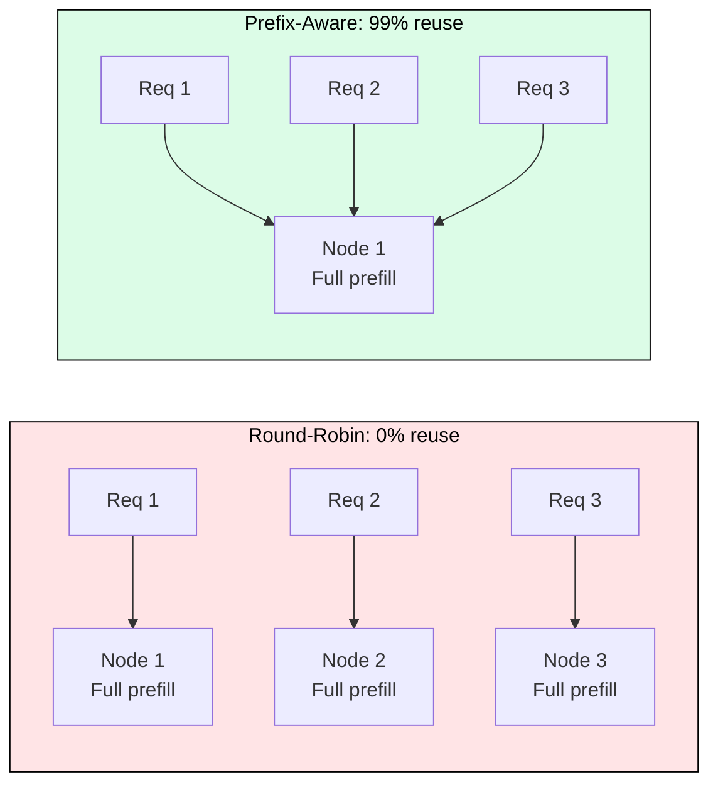
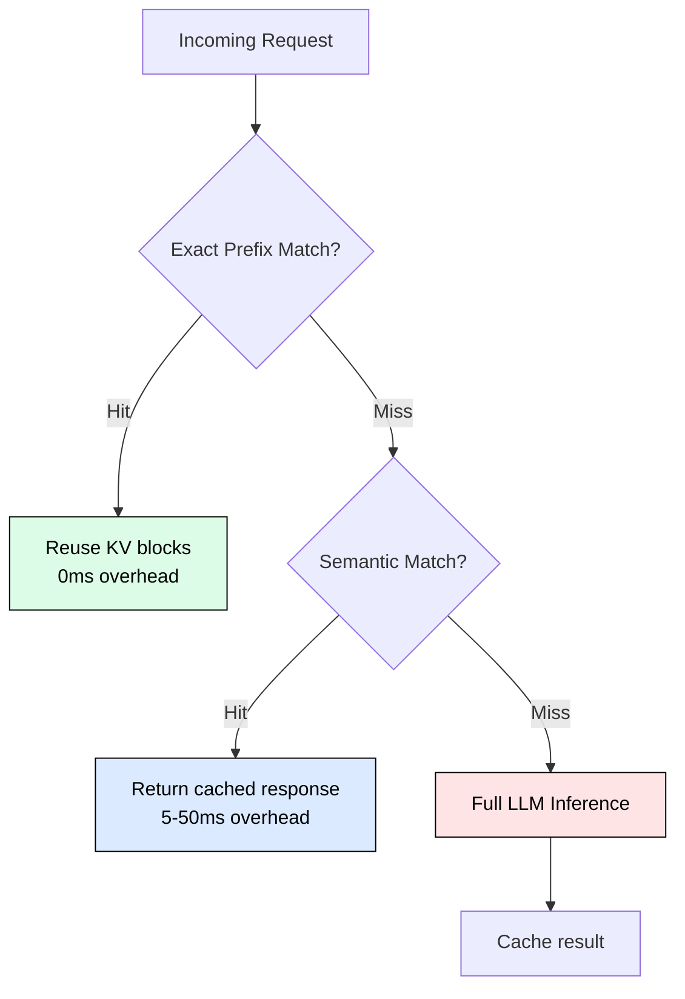
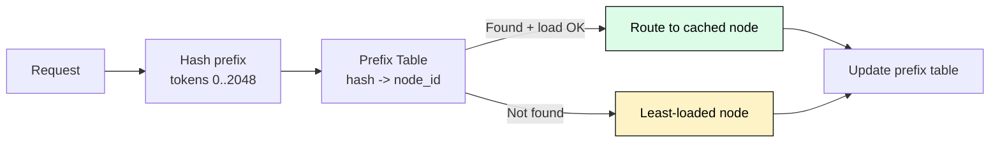
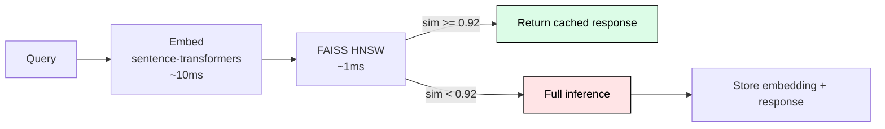

# 7.6 Cache-Aware Routing

 

Round-robin routing wastes GPU compute by scattering requests across nodes that must recompute KV cache from scratch. Cache-aware routing asks a different question: "which node already has the computation I need stored in GPU memory?" This shift from load distribution to memory optimization yields 2-5x improvements in TTFT and throughput.

---

## The Cost of Naive Routing

Consider 8 GPU nodes serving a chatbot with a 2,048-token system prompt. Under round-robin, the first 8 requests each compute the identical 2,048-token KV cache independently: 8 x 410ms = 3,280ms of aggregate GPU waste. At 1,000 req/s on a 64-node cluster, 7.7 GPU-seconds per wall-second are burned on duplicate prefill computation.

For a 2,048-token prefix on A100 at ~5,000 tokens/s during prefill, each cache hit saves 410ms of TTFT. At 70% cache hit rate with 1M requests/day, that translates to ~3K/month in saved GPU compute.

---

## Three Levels of Cache-Aware Routing

**Level 1: Exact Prefix Match** (vLLM APC, SGLang RadixAttention). Hash token sequences block-by-block. If the hash exists in the cache, reuse those KV blocks. Zero overhead, zero false positives. Both vLLM and SGLang enable this by default.

**Level 2: Semantic Similarity Match**. Embed the query, search a vector index (FAISS/Milvus) for similar cached prompts. If cosine similarity exceeds threshold (~0.92), return the cached response without invoking the LLM. Achieves 60-70% hit rate on FAQ workloads (arXiv:2411.05276). Tradeoff: 5-50ms embedding overhead per request.

**Level 3: Hybrid**. Check exact prefix first (free), then semantic cache on miss (5-50ms), then full inference only on double miss. Maximizes hit rate while maintaining correctness for high-confidence matches.

---

## Prefix-Aware Routing

The router maintains a prefix table mapping token hashes to node assignments. On each request: extract prefix, hash it, look up which node caches that prefix, route there if load permits, otherwise fall back to least-loaded.

Production prefix sharing rates (Mooncake, FAST 2025): multi-turn conversations ~40%, tool/agent workloads ~59%, RAG pipelines with time-windowed context ~50-70%. SGLang's RadixAttention achieves up to 5x throughput on few-shot workloads through automatic radix tree-based prefix reuse.

---

## Session Affinity for Multi-Turn Chat

Each conversation turn builds on the full history. Routing turn N+1 to the same node as turn N means only the new message needs prefill, not the entire context.

At turn 10 with 200 tokens/turn: without affinity, 2,000 tokens of prefill (400ms). With affinity, 200 tokens (40ms). That is 90% TTFT reduction at turn 10, compounding further with each additional turn.

The tension: session affinity can create hotspot nodes. DualMap (Yuan et al., 2026) resolves this with power-of-two-choices: hash each prefix to two candidate nodes, select the one with better cache hit unless it exceeds the SLO threshold, then fall back to the less-loaded option. Achieves load deviation bounded by O(log log n) while maintaining 90%+ of optimal cache hit rate. Experiments show 2.25x higher effective request capacity vs single-choice routing.

---

## Semantic Caching Architecture

For semantically equivalent but textually different queries ("explain photosynthesis simply" vs "describe photosynthesis in easy language"), an embedding-based cache avoids redundant LLM calls entirely.

Key results (arXiv:2411.05276): 68.8% API call reduction, 97%+ cache hit accuracy, <50ms cache hit latency vs 500-2000ms for full inference. GPTCache (Zilliz) provides a production-ready implementation with pluggable embedding backends and vector stores.

Staleness is the primary correctness risk. Mitigations: TTL-based expiration, content-aware bypass for temporal queries ("today", "current"), versioned caching that invalidates on model/prompt changes.

---

## The GORGO Cost Model

The GORGO paper (2025) formalizes routing as minimizing estimated TTFT:

The router selects the node with minimum cost. This makes the tradeoff explicit: a node with perfect cache hit but a deep queue may lose to a node with partial miss but immediate availability.

---

## Operational Considerations

**Cache warming on cold start**: Pre-compute KV for known high-frequency prefixes before accepting traffic. Mooncake persists KV to host DRAM/NVMe for reload (~0.3ms from DRAM vs ~410ms recompute).

**Eviction feedback loop**: When a node evicts a prefix under memory pressure, it must report to the router within 100ms. Otherwise the router sends requests expecting a hit that encounter a miss.

**Multi-tenant isolation**: Partition semantic cache by tenant ID to prevent cross-tenant leakage. Per-tenant cache quotas prevent high-traffic tenants from evicting others.

---

## FAQ

**Q: Is prefix caching free to enable?**
A: Yes. vLLM APC and SGLang RadixAttention are enabled by default with zero configuration overhead and no performance penalty on cache miss.

**Q: What similarity threshold should I use for semantic caching?**
A: Start at 0.92. Lower thresholds increase hit rate but introduce false positives (wrong cached response). Monitor false positive rate and adjust.

**Q: How does cache-aware routing interact with disaggregated serving?**
A: The prefill node selection becomes the cache-aware decision point. Route to the prefill node that already has the prefix cached, transfer only the new KV to the decode pool.

**Q: When is semantic caching NOT appropriate?**
A: When responses must be personalized per user, when queries contain temporal references, or when the model is frequently updated (invalidating cached responses).

**Q: How much memory does a semantic cache index require?**
A: For 100K entries with 768-dim embeddings: ~307 MB for the index + ~200 MB for responses. This resides on CPU/DRAM, not GPU memory.

---

## References

1. SGLang RadixAttention (arXiv:2312.07104, 2024): Radix tree for automatic KV cache reuse, 5x throughput on structured workloads
2. DualMap (arXiv:2602.06502, 2026): Power-of-two-choices for joint cache affinity and load balance
3. Mooncake (FAST 2025): Production traces showing 40-59% prefix sharing in multi-turn and agent workloads
4. GORGO (arXiv:2602.11688, 2025): Cross-region load balancing with cache locality optimization
5. Semantic Embedding Caching (arXiv:2411.05276, 2024): 68.8% API call reduction via embedding similarity
6. GPTCache (NLP-OSS 2023): Open-source semantic caching with pluggable components
7. vLLM Automatic Prefix Caching: Block-hash-based prefix reuse (enabled by default)
