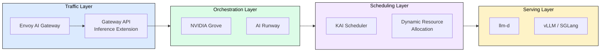
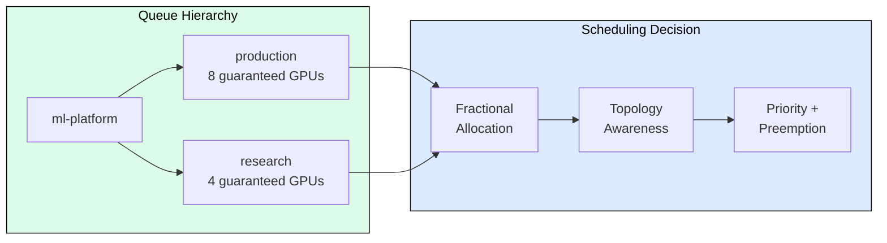
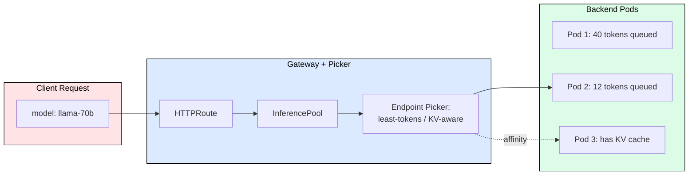
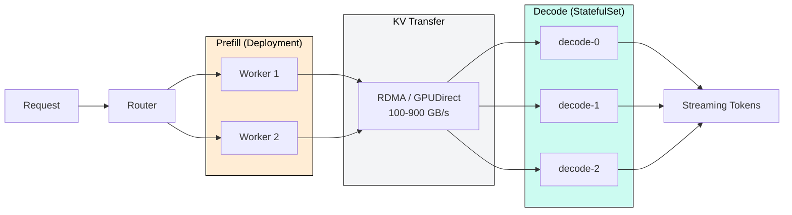

# 7.7 Kubernetes Inference Infrastructure

Kubernetes was designed for stateless HTTP microservices. LLM inference breaks every assumption: it is stateful (KV caches consume 10-40 GB per request), GPU-bound with non-fungible resources (NVLink vs PCIe matters 14x), and latency-sensitive with variable cost (100 to 100,000 tokens per request). Seven new projects emerged in 2025-2026 to close these gaps.

## The Stack at a Glance

## KAI Scheduler: GPU-Aware Scheduling

The default kube-scheduler treats GPUs as opaque integers. KAI Scheduler (NVIDIA, CNCF Sandbox 2026) replaces it with fractional GPU allocation, topology-aware placement, and queue-based fairness.

**Key capabilities:**
- Fractional GPU: request 16 GB of an 80 GB H100 instead of the whole device
- Topology awareness: ensures tensor-parallel GPUs share NVLink domain (900 GB/s vs 64 GB/s PCIe)
- Hierarchical queues: teams borrow unused GPUs, yield gracefully when owners need them
- Workload-type policies: inference (non-preemptible, spread), training (preemptible, packed), interactive (best-effort)

## Dynamic Resource Allocation (DRA)

DRA (GA in Kubernetes 1.32) replaces the device plugin integer-counter model with structured, claim-based resource management using CEL selectors.

Instead of `nvidia.com/gpu: 4`, you express: "4 GPUs with 80+ GB memory, Hopper architecture, on the same NVLink domain." DRA evaluates claims against real GPU inventory, supports multi-node claims for large-model tensor parallelism, and incorporates GPU health status into scheduling.

Migration is incremental: DRA coexists with device plugins. New workloads use ResourceClaims; legacy workloads keep integer requests.

## Gateway API Inference Extension: Model-Aware Routing

Standard Kubernetes networking routes on HTTP attributes (path, headers). Inference needs routing on model identity, token cost, and KV cache affinity. The Gateway API Inference Extension (SIG Network, v0.3 alpha) introduces:

- **InferencePool**: groups serving pods with a custom endpoint picker (least-tokens, KV-cache-aware, cost-aware)
- **InferenceModel**: maps model name to pool with criticality levels (Critical never sheds traffic; BestEffort can)

The picker runs out-of-band (not inline), keeping its latency off the critical path.

## Envoy AI Gateway: Token-Level Traffic Management

Envoy AI Gateway extends L7 proxying with:
- **Token-based rate limiting**: limits per input/output tokens consumed, not request count
- **Provider failover**: graduated traffic shifting (not binary) based on latency, error rate, or queue depth
- **KV-cache-aware routing**: session affinity to backends holding prior turn caches (eliminates 2-4s re-prefill)

## llm-d: Disaggregated Inference on Kubernetes

llm-d (Red Hat + IBM, 2026) maps disaggregated prefill/decode onto native Kubernetes primitives:
- Prefill workers: stateless Deployment, scales on input queue depth
- Decode workers: StatefulSet (stable identity for session affinity), scales on KV cache pressure
- KV transfer via RDMA (100-400 Gbps) or GPU Direct RDMA (400-900 Gbps)

Independent scaling is the key benefit: add decode pods when KV cache fills up, add prefill pods when input queue grows. No need to scale expensive full-stack replicas.

## Grove and AI Runway: Fleet Orchestration

**NVIDIA Grove** (GA 2026): fleet-level model placement across heterogeneous GPU nodes. Decides what models run where, handles warm migration (zero-downtime model relocation), and optimizes for cost vs latency SLOs.

**Microsoft AI Runway** (Alpha 2026): auto-fits models to hardware by computing memory requirements from Hugging Face metadata. Reports fit indicators before deployment ("Model fits on 2x A100-80GB with TP=2, projected P99: 380ms").

## Decision Framework

| Model Scale | Stack |
|---|---|
| Small (< 13B) | KServe + KAI fractional GPU |
| Medium (13-70B) | vLLM + Gateway Inference Extension |
| Large (70B-405B) | llm-d + KAI topology-aware |
| Fleet (many models) | Grove + Envoy AI Gateway |

Start at the bottom of the stack (DRA + KAI), add routing when you serve multiple models, add fleet orchestration at scale.

## FAQ

**Q: Do I need all seven components?**
No. Start with DRA + KAI for better GPU utilization. Add Gateway Inference Extension when you serve multiple models. Add Grove/llm-d only at large scale.

**Q: How does KAI Scheduler coexist with kube-scheduler?**
Pods specify `schedulerName: kai-scheduler`. Non-GPU pods continue using the default scheduler unchanged.

**Q: What network speed does llm-d require?**
RDMA (100+ Gbps) is the minimum for production. TCP/gRPC works but adds 1-4 seconds of KV transfer latency for large contexts.

**Q: Is DRA ready for production?**
Yes. DRA graduated to GA in Kubernetes 1.32. NVIDIA donated their DRA driver to the CNCF in 2025.

**Q: Can I use these tools on EKS/GKE/AKS?**
KAI and DRA work on any conformant Kubernetes cluster. Gateway Inference Extension requires a compatible gateway implementation (Envoy Gateway, Istio). llm-d requires RDMA-capable networking.

## References

1. NVIDIA KAI Scheduler: github.com/NVIDIA/KAI-Scheduler (CNCF Sandbox)
2. KEP-4381: Dynamic Resource Allocation, kubernetes/enhancements
3. Gateway API Inference Extension: kubernetes-sigs/gateway-api-inference-extension
4. Envoy AI Gateway: envoyproxy/ai-gateway
5. llm-d: github.com/llm-d/llm-d (Red Hat + IBM)
6. NVIDIA Grove: github.com/NVIDIA/grove
7. Microsoft AI Runway: github.com/microsoft/ai-runway
8. KubeCon EU 2026 AI Day keynotes on inference infrastructure
