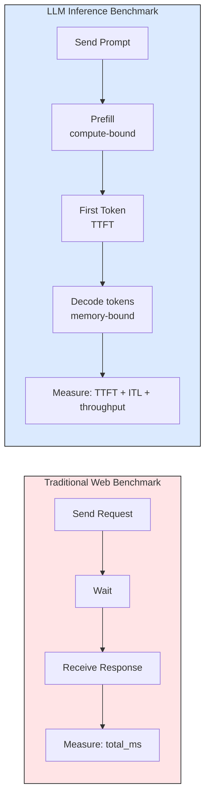
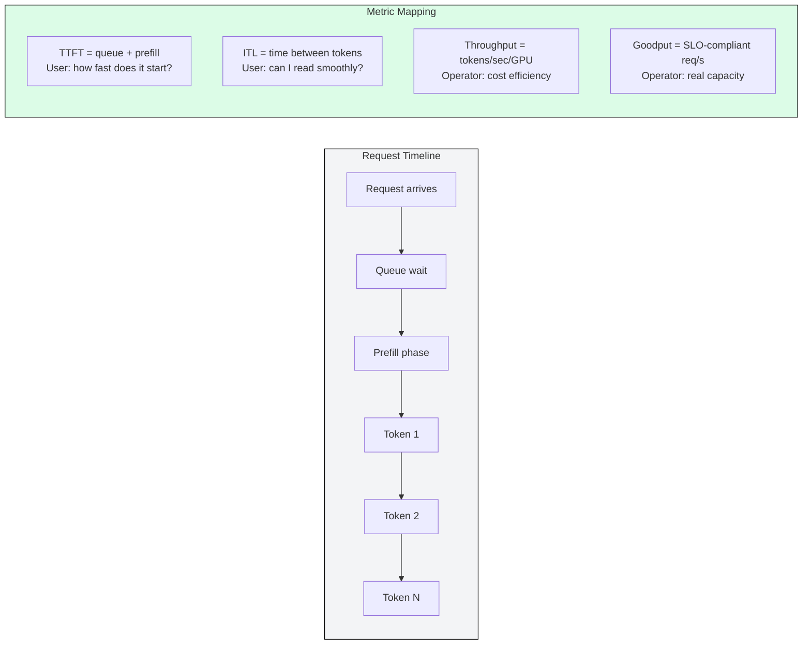
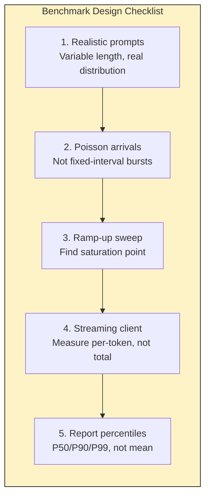
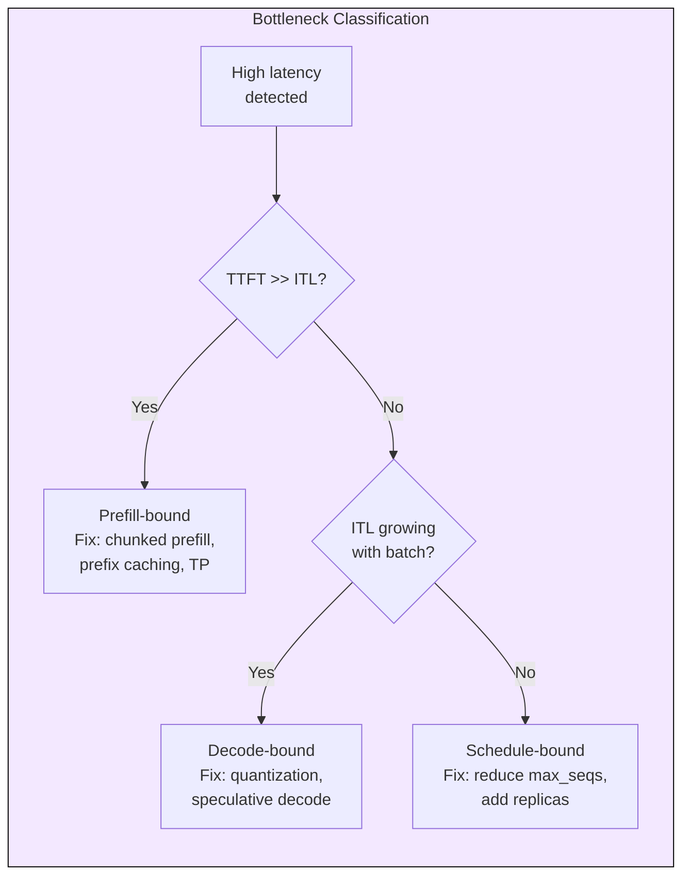

# 8.1 Benchmarking and Metrics

[](https://colab.research.google.com/github/harshuljain13/llm-inference-at-scale/blob/master/content/09_operations/08.1_benchmarking/lab.ipynb) [](https://molab.marimo.io/github/harshuljain13/llm-inference-at-scale/blob/master/content/09_operations/08.1_benchmarking/lab.ipynb)

Benchmarking LLM inference is fundamentally different from benchmarking traditional web services. A single request produces hundreds of tokens over seconds, latency compounds non-linearly with batch size, and the system exhibits two distinct computational phases (prefill and decode) with completely different bottlenecks. Getting benchmarking wrong means deploying systems that either waste GPU budget or violate user-facing SLOs under real traffic.

## Why Standard Load Testing Fails

Traditional HTTP benchmarks (wrk, hey, k6) measure request-level latency as a single number. LLM inference requires per-token streaming measurements because the user experience depends on time-to-first-token (responsiveness) and inter-token latency (reading speed), not just total completion time.



## The Four Metrics That Matter

Every LLM deployment must track four metrics. Each maps to a different user experience dimension and a different system bottleneck.



**TTFT (Time to First Token):** Dominated by prefill compute. Scales linearly with input length. Target: 200ms for code completion, 500ms for chat, 5s for batch.

**ITL (Inter-Token Latency):** Dominated by memory bandwidth during decode. Degrades as batch size grows because more KV cache entries compete for bandwidth. Target: 20-50ms for streaming, 100ms for batch.

**Throughput (tokens/s/GPU):** Total output tokens generated per second per GPU. The metric operators optimize for cost. Higher batch sizes increase throughput but hurt per-request latency.

**Goodput (SLO-compliant requests/s):** The fraction of throughput that actually meets latency SLOs. A system doing 1000 tok/s but violating TTFT on 40% of requests has low goodput despite high throughput.

## SLO Profiles by Use Case

| Use Case | TTFT P99 | ITL P99 | Throughput Priority | Bottleneck |
|----------|----------|---------|--------------------:|------------|
| Voice/realtime | < 150ms | < 30ms | Low | Prefill |
| Code completion | < 200ms | < 20ms | Low | Prefill |
| Chat streaming | < 500ms | < 50ms | Medium | Both |
| Document processing | < 2s | < 80ms | High | Decode |
| Batch/offline | < 5s | < 200ms | Highest | Throughput |

## Benchmark Design: Getting It Right

Most published benchmarks are misleading because they use fixed-length synthetic prompts, ignore queue effects, and report averages instead of percentiles. A production-grade benchmark must model real traffic patterns.



**Realistic workload generation:** Production traffic follows log-normal input length distributions. A chat workload has inputs of 20-200 tokens; a RAG workload has 500-4000 tokens. Mixing short and long prompts reveals scheduling interference that uniform benchmarks hide.

**Poisson arrival process:** Real traffic arrives randomly, not in synchronized bursts. Poisson arrivals create natural queue buildup that exposes scheduling latency. Fixed-rate injection underestimates tail latency by 2-5x.

**Saturation sweep:** Run the benchmark at increasing request rates (1, 5, 10, 20, 50, 100 req/s) and plot latency vs. throughput. The "knee" where P99 TTFT exceeds your SLO is your true capacity, not peak throughput.

## Bottleneck Diagnosis

After collecting benchmark data, classify the bottleneck to choose the right optimization.



**Prefill-bound:** TTFT variance is high, TTFT/E2E ratio > 0.4, long prompts cause spikes. Fix with chunked prefill (splits long prompts across iterations), prefix caching (reuses KV for shared prefixes), or tensor parallelism (spreads compute across GPUs).

**Decode-bound:** ITL grows linearly with concurrent sequences. Memory bandwidth is saturated. Fix with quantization (fewer bytes per KV read), speculative decoding (generates multiple tokens per forward pass), or GQA models (fewer KV heads = less bandwidth).

**Schedule-bound:** Queue time dominates. GPU utilization is low but latency is high. Fix by reducing max concurrent sequences, adding replicas, or switching to a faster scheduler (e.g., vLLM continuous batching over static batching).

## Capacity Planning Formula

Given benchmark results at a known concurrency level, estimate GPUs needed for a target request rate:

```
measured_rps_per_gpu = successful_requests / (benchmark_duration * gpu_count)
gpus_needed = ceil(target_rps / measured_rps_per_gpu * (1 + headroom))
```

Always include 30%+ headroom for traffic spikes. Validate by running the benchmark again at `gpus_needed` scale to confirm SLOs still hold under the projected load.

## Tools

| Tool | Strengths | Use When |
|------|-----------|----------|
| [LLMPerf](https://github.com/ray-project/llmperf) | Streaming TTFT/ITL, multi-provider | Quick per-endpoint comparison |
| [GenAI-Perf](https://github.com/triton-inference-server/perf_analyzer) | NVIDIA-optimized, Triton integration | TensorRT-LLM benchmarks |
| [vLLM benchmark_serving.py](https://github.com/vllm-project/vllm/blob/main/benchmarks/benchmark_serving.py) | ShareGPT dataset, realistic | vLLM capacity planning |
| Custom async client | Full control, Poisson arrivals | Production-specific workloads |

## FAQ

**Q: Why not just use wrk or hey for LLM benchmarks?**
They measure total request latency as one number. LLM inference needs per-token streaming measurements because TTFT and ITL have different bottlenecks and different SLO targets.

**Q: What is the difference between throughput and goodput?**
Throughput counts all tokens generated. Goodput counts only tokens from requests that met their SLO. A system can have high throughput but low goodput if latency violations are frequent.

**Q: How many requests do I need for statistically meaningful P99?**
At minimum 1000 requests. For P99.9, you need 10,000+. With fewer samples, tail latency estimates have high variance.

**Q: Should I benchmark with or without prompt caching enabled?**
Both. Cache-warm benchmarks show best-case for repeated prefixes. Cache-cold benchmarks show worst-case for unique prompts. Production is typically a mix.

**Q: Why does ITL degrade with batch size?**
Decode is memory-bandwidth-bound. Each token generation reads KV cache for all sequences in the batch. More sequences = more bytes read per iteration = higher per-token latency.

**Q: How do I benchmark multi-GPU tensor parallelism?**
Use the same benchmark client. TP is transparent to the client. Compare throughput/latency of TP=1 vs TP=2 vs TP=4 at the same request rate to find the optimal parallelism degree.

## References

1. Agrawal, A. et al. "Sarathi-Serve: Optimizing LLM Serving with Chunked Prefills." arXiv:2403.02310, 2024.
2. Kwon, W. et al. "Efficient Memory Management for Large Language Model Serving with PagedAttention." SOSP 2023.
3. Zhong, Y. et al. "DistServe: Disaggregating Prefill and Decoding for Goodput-optimized Large Language Model Serving." OSDI 2024.
4. [LLMPerf benchmark suite](https://github.com/ray-project/llmperf)
5. [vLLM benchmark scripts](https://github.com/vllm-project/vllm/tree/main/benchmarks)
