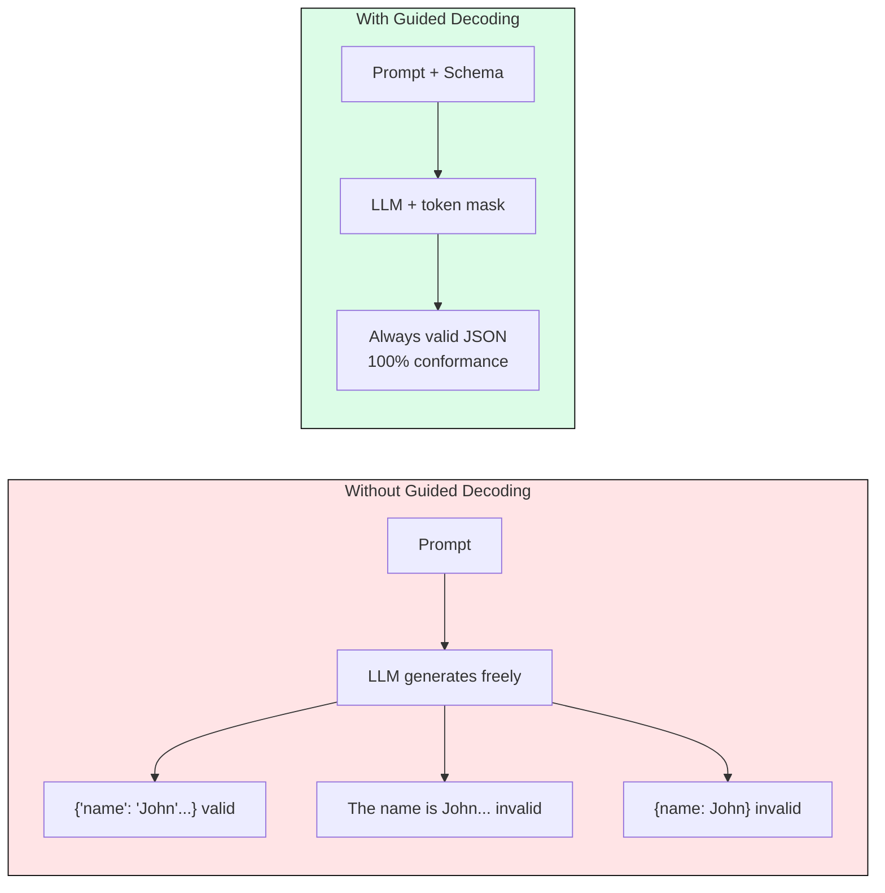
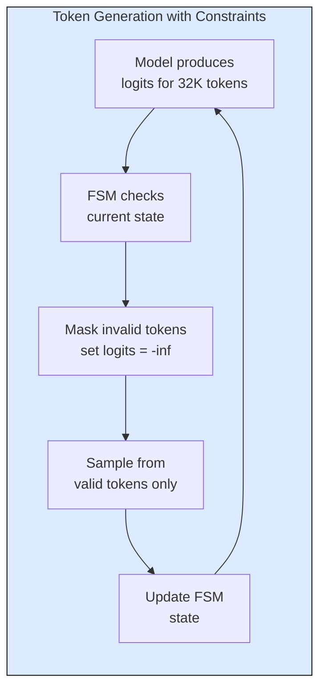
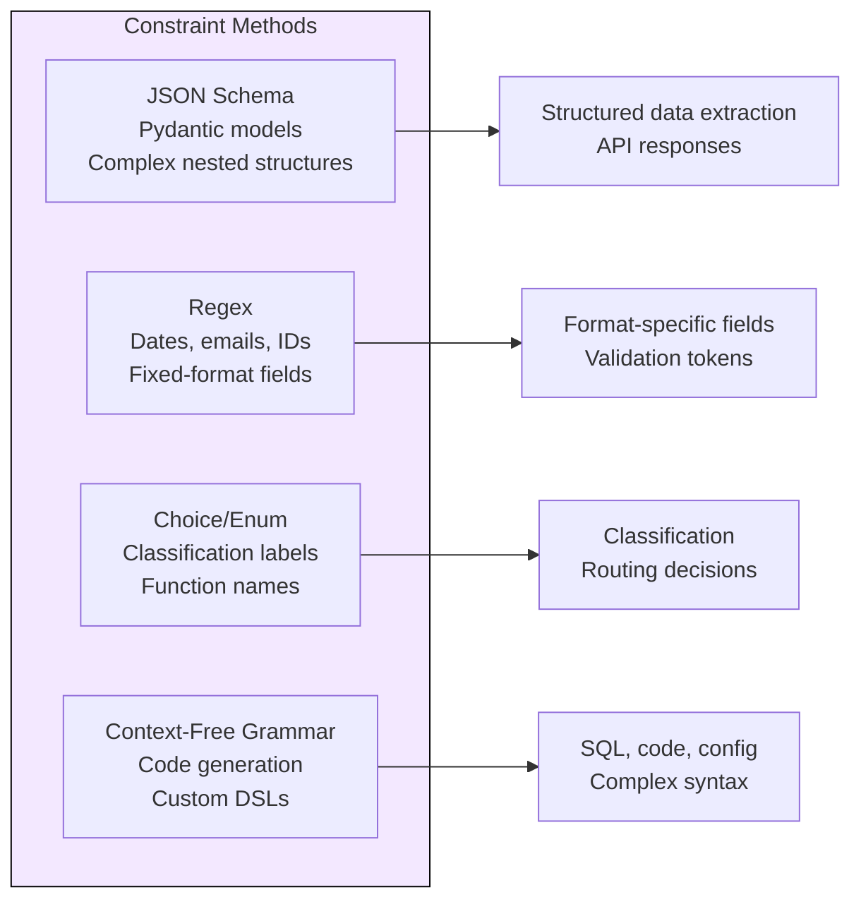
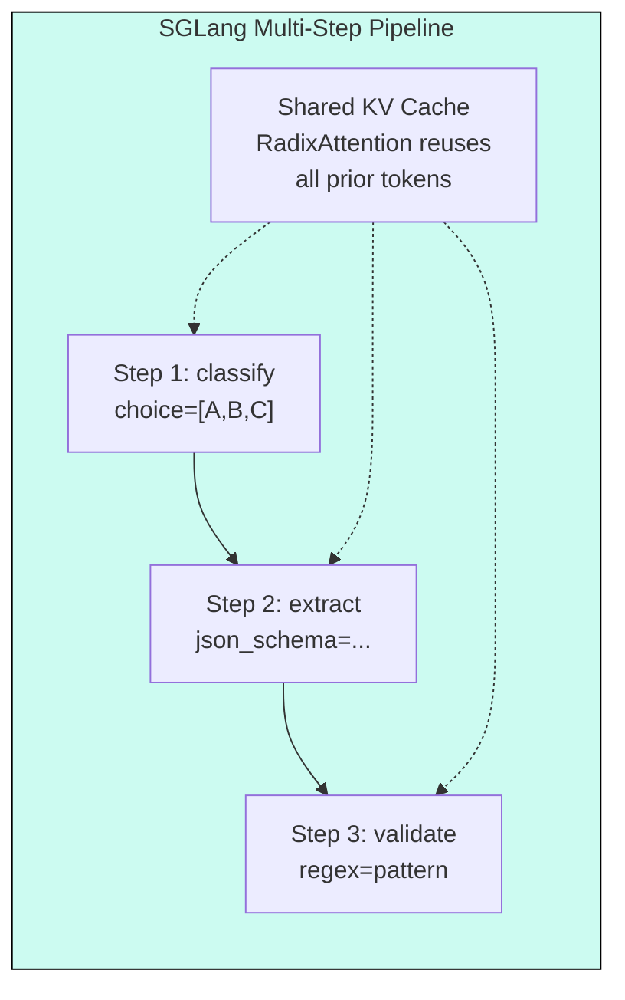
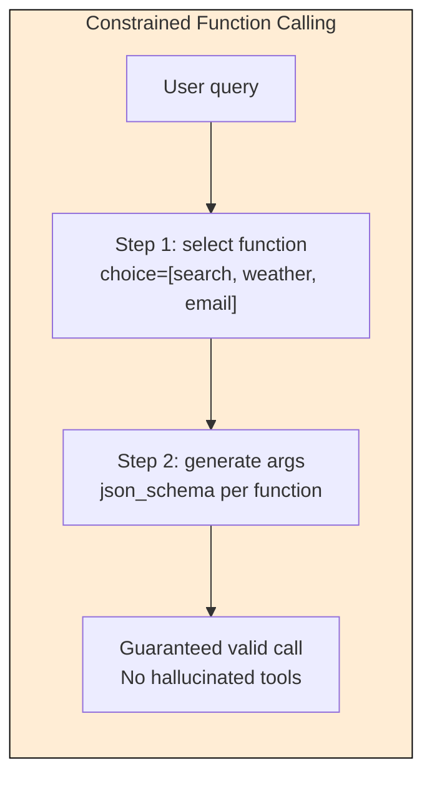

# 8.2 Structured Output and Guided Decoding

[](https://colab.research.google.com/github/harshuljain13/llm-inference-at-scale/blob/master/content/09_operations/08.2_structured_output/lab.ipynb) [](https://molab.marimo.io/github/harshuljain13/llm-inference-at-scale/blob/master/content/09_operations/08.2_structured_output/lab.ipynb)

Production systems cannot tolerate malformed LLM outputs. When an LLM generates JSON for a downstream API, a single missing comma or wrong type crashes the pipeline. Guided decoding solves this by constraining token selection at generation time, guaranteeing 100% schema compliance with minimal latency overhead.

## The Conformance Problem

Without constraints, LLMs produce valid JSON roughly 60-80% of the time depending on the model and prompt complexity. For production APIs processing thousands of requests per minute, even 5% failure rate means hundreds of retries, increased latency, and wasted GPU compute.



## How Guided Decoding Works

At each token generation step, the engine computes which tokens are valid given the current output state and the target schema. Invalid tokens get their logits set to negative infinity, making them impossible to sample. The result is output that always conforms to the constraint.



The constraint is compiled into a finite state machine (FSM) once per schema. The FSM tracks what characters/tokens are legal at each position. For JSON schemas, this means tracking whether we are inside a string, expecting a comma, starting a new field, etc.

**Compilation cost:** 10-100ms per schema (one-time, cached).
**Per-token overhead:** 0.1-1ms (mask computation + application).
**Net latency impact:** 1-5% increase for most workloads.

## Constraint Types



**JSON Schema:** Define output structure using Pydantic models or raw JSON schema. The engine ensures every field has correct type, required fields are present, and enums are respected. Most common in production.

**Regex:** Constrain output to match a regular expression. Fast to compile, low overhead. Use for dates (`\d{4}-\d{2}-\d{2}`), emails, phone numbers, semantic versions.

**Choice/Enum:** Restrict output to one of N predefined strings. Zero ambiguity, fastest constraint type. Use for classification, routing, and function name selection.

**CFG (Context-Free Grammar):** Full grammar support for generating syntactically valid code, SQL, or custom DSLs. Highest compilation cost but handles recursive structures that regex cannot.

## Backend Comparison

| Backend | Engine | Compile Speed | Per-Token Speed | Best For |
|---------|--------|:------------:|:--------------:|----------|
| outlines | vLLM (default) | Medium | Fast | General use, JSON+regex+CFG |
| xgrammar | vLLM, SGLang | Fast | Fastest | High-throughput production |
| lm-format-enforcer | vLLM | Fast | Medium | Simple schemas |
| SGLang native | SGLang | Fast | Fast | Multi-step constrained programs |

**Recommendation:** Use xgrammar for throughput-critical deployments. Use outlines when you need CFG support or broader feature coverage. SGLang's native constraints shine for multi-turn programs where RadixAttention reuses KV cache across constrained generation steps.

## vLLM Integration

vLLM supports guided decoding through the OpenAI-compatible API. Pass the schema in the request and the engine handles constraint enforcement transparently.

```python
# Define schema with Pydantic
class ExtractedEntity(BaseModel):
    name: str
    entity_type: Literal["person", "org", "location"]
    confidence: float = Field(ge=0.0, le=1.0)

# Request with guided decoding
response = client.chat.completions.create(
    model="meta-llama/Llama-3.1-8B-Instruct",
    messages=[{"role": "user", "content": f"Extract entities from: {text}"}],
    extra_body={
        "guided_json": ExtractedEntity.model_json_schema(),
        "guided_decoding_backend": "xgrammar",
    },
)
# response.choices[0].message.content is ALWAYS valid JSON
```

For regex and choice constraints:

```python
# Regex: generate valid ISO date
response = client.chat.completions.create(
    model="...", messages=[...],
    extra_body={"guided_regex": r"\d{4}-(0[1-9]|1[0-2])-(0[1-9]|[12]\d|3[01])"},
)

# Choice: classify into exactly one category
response = client.chat.completions.create(
    model="...", messages=[...],
    extra_body={"guided_choice": ["positive", "negative", "neutral"]},
)
```

## SGLang Multi-Step Programs

SGLang's programming model enables chaining constrained generation steps with shared KV cache via RadixAttention. Each step's output becomes part of the prefix for the next step, with zero recomputation.



This is 2-5x faster than making three separate API calls because the shared prefix (system prompt + user input) is computed once and cached in the radix tree.

## Function Calling with Constraints

Function calling is the highest-value application of guided decoding. Without constraints, models hallucinate function names, omit required arguments, and produce malformed parameter types. With constraints, every function call is guaranteed valid.



The pattern: first constrain the function name to a choice set, then use the selected function's parameter schema to constrain argument generation. This two-step approach prevents the model from generating arguments for the wrong function.

## Performance Impact

Guided decoding adds minimal overhead in practice:

| Constraint Type | Compilation | Per-Token Overhead | E2E Impact |
|----------------|:-----------:|:-----------------:|:----------:|
| Choice (5 options) | < 1ms | ~0.01ms | < 0.5% |
| Regex (email) | ~5ms | ~0.1ms | ~1% |
| JSON Schema (5 fields) | ~50ms | ~0.5ms | ~3% |
| Complex nested JSON | ~100ms | ~1ms | ~5% |
| CFG (SQL grammar) | ~200ms | ~1.5ms | ~8% |

Schema compilation is cached after the first request. For repeated schemas (the common case in production), the amortized cost is negligible.

**When NOT to use guided decoding:** Creative writing, open-ended chat, or any task where constraining format would reduce output quality. Use it exclusively when you need parseable, machine-readable output.

## FAQ

**Q: Does guided decoding reduce output quality?**
No. It only removes tokens that would produce invalid output. The model's probability distribution over valid tokens is preserved, so semantic quality is unchanged.

**Q: Can I use guided decoding with streaming?**
Yes. The constraint is applied token-by-token, so streaming works identically. Each streamed token is guaranteed to be part of a valid final output.

**Q: What happens if no valid token exists at a generation step?**
This indicates a schema that conflicts with the model's vocabulary (rare). The engine forces an EOS token. In practice, well-designed schemas never trigger this.

**Q: How does guided decoding interact with temperature and top-p?**
The mask is applied before temperature scaling and top-p filtering. So temperature still controls creativity within the space of valid tokens.

**Q: Is there a token limit where overhead becomes significant?**
For outputs over 4000 tokens with complex grammars, overhead can reach 10-15%. For typical structured outputs (10-500 tokens), overhead is under 5%.

**Q: Can I combine multiple constraint types in one request?**
Not directly. Use SGLang's multi-step programs to chain different constraint types (e.g., choice for function name, then JSON schema for arguments).

**Q: Which backend should I use for production?**
xgrammar for throughput-critical workloads (fastest per-token). outlines for maximum flexibility (CFG support). SGLang native for multi-step pipelines.

## References

1. Willard, B. & Louf, R. "Efficient Guided Generation for Large Language Models." arXiv:2307.09702, 2023.
2. Dong, Y. et al. "XGrammar: Flexible and Efficient Structured Generation Engine." arXiv:2411.15100, 2024.
3. Zheng, L. et al. "SGLang: Efficient Execution of Structured Language Model Programs." arXiv:2312.07104, 2023.
4. [vLLM Guided Decoding docs](https://docs.vllm.ai/en/latest/serving/openai_compatible_server.html#guided-decoding)
5. [Outlines library](https://github.com/dottxt-ai/outlines)
