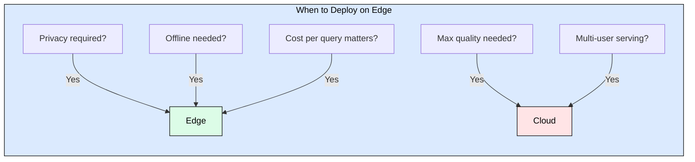
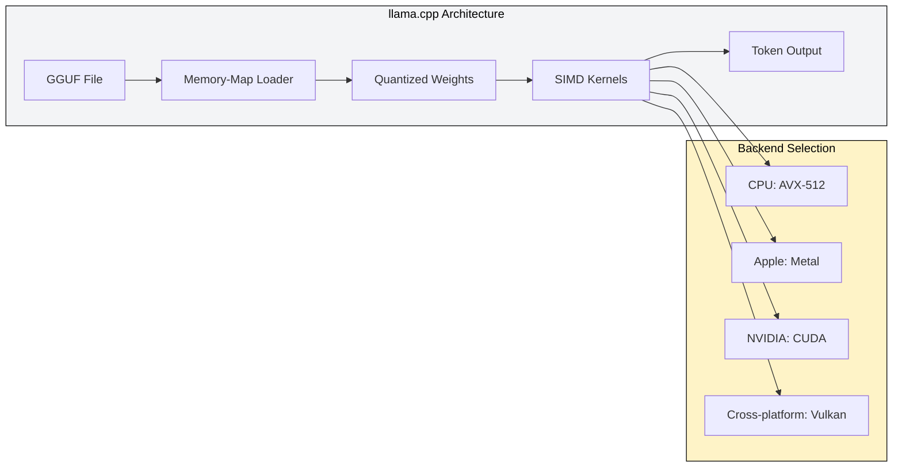
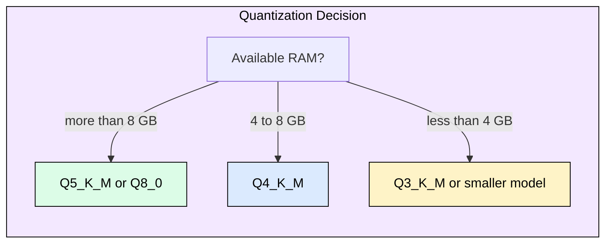
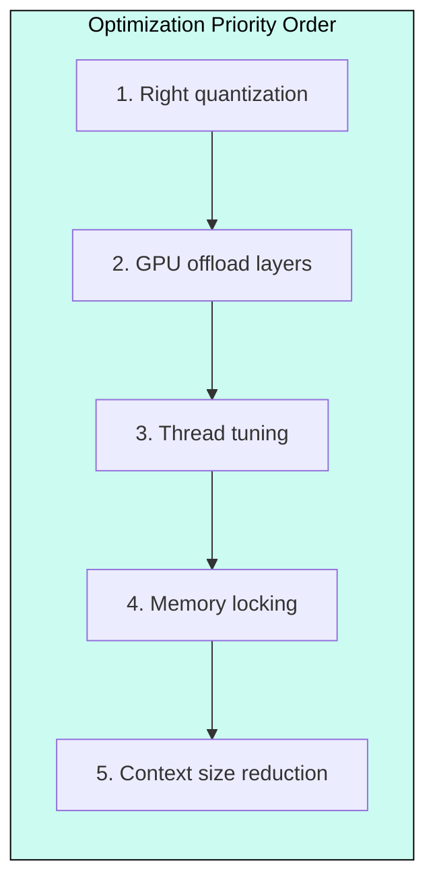

# 8.3 Edge Deployment

> Run billion-parameter models on laptops, phones, and embedded devices with zero cloud dependency.

## Why Edge Deployment Matters

Cloud inference costs $0.50-$3.00 per million tokens. A device running a 7B model locally at Q4 quantization generates tokens at zero marginal cost after hardware purchase. For privacy-sensitive workloads (medical notes, legal documents, personal assistants), data never leaves the device. For offline scenarios (aircraft, remote locations, unreliable networks), edge is the only option.

The tradeoff: lower throughput (10-100 tok/s vs 1000+ on datacenter GPUs), limited model size (constrained by device RAM), and no batching benefits (single user per device).

## The Edge Stack: llama.cpp + GGUF

llama.cpp is the universal edge runtime: pure C/C++, no Python dependency, runs on every CPU architecture (x86, ARM, RISC-V) with optional GPU acceleration via CUDA, Metal, and Vulkan. GGUF is its model format, embedding weights, tokenizer, and metadata in a single memory-mappable file.

## Quantization: The Size/Quality Tradeoff

GGUF quantization compresses 16-bit weights to 2-8 bits. The naming convention: Q4_K_M means 4-bit quantization using k-quant method at medium quality. Q4_K_M is the universal recommendation: 3.7x compression with minimal perplexity loss.

| Quant | Bits | 7B Size | Quality | Use Case |
|-------|------|---------|---------|----------|
| Q8_0 | 8 | 7.2 GB | Excellent | Quality-critical, 16+ GB RAM |
| Q5_K_M | 5 | 4.8 GB | Very Good | When you have headroom |
| **Q4_K_M** | **4** | **4.1 GB** | **Good** | **Default recommendation** |
| Q3_K_M | 3 | 3.3 GB | Usable | Extreme RAM constraints |
| Q2_K | 2 | 2.7 GB | Poor | Research/experiments only |

## Platform Performance Map

| Platform | Framework | Memory | Throughput (7B Q4) | Key Advantage |
|----------|-----------|--------|-------------------|---------------|
| Apple M-series | MLX / llama.cpp | 16-192 GB | 30-100 tok/s | Unified memory, high bandwidth |
| x86 CPU | llama.cpp | 8-64 GB | 10-30 tok/s | Universal availability |
| NVIDIA Jetson | llama.cpp + CUDA | 8-64 GB | 20-50 tok/s | Edge AI with GPU |
| Mobile (iOS/Android) | MLC LLM | 4-8 GB | 5-15 tok/s | On-device apps |

Apple Silicon excels because Unified Memory Architecture eliminates the CPU-GPU data transfer bottleneck. An M2 Ultra with 192 GB RAM and 800 GB/s bandwidth can run a 70B model at interactive speed, something impossible on any other laptop hardware.

## Performance Optimization Checklist

1. **Thread count**: Use physical cores only (not hyperthreads). 8-core CPU uses 8 threads.
2. **Memory locking**: Prevents swapping to disk during inference.
3. **GPU layer offload**: Moving N transformer layers to GPU helps even with limited VRAM.
4. **Context size**: Smaller context means less KV cache memory. Use the minimum needed.
5. **NUMA pinning**: On multi-socket servers, pin to one NUMA node to avoid cross-socket memory access.

## FAQ

**Q: What is the minimum RAM to run a 7B model?**
A: 8 GB with Q4_K_M (4.1 GB model + ~2 GB KV cache + ~1 GB runtime). 16 GB recommended for headroom.

**Q: Should I use llama.cpp or MLX on Mac?**
A: MLX for Apple Silicon only (better Metal integration). llama.cpp for cross-platform or the OpenAI-compatible server mode.

**Q: How much quality do I lose with Q4 quantization?**
A: Typically 0.5-1.5 perplexity points. For most applications (chat, summarization, code), users cannot distinguish Q4_K_M from FP16 outputs.

**Q: Can I run 70B models on edge?**
A: Only on high-memory devices: M2 Ultra (192 GB), workstations with 96+ GB RAM. Expect 8-15 tok/s.

**Q: What about mobile phones?**
A: Stick to 1-3B models (Phi-3 Mini, Gemma 2B). The 4-8 GB RAM limit makes 7B impractical for sustained use.

## References

1. Gerganov, G. (2023). "llama.cpp: LLM inference in C/C++." GitHub. https://github.com/ggerganov/llama.cpp
2. Apple Machine Learning Research. (2024). "MLX: An array framework for Apple silicon." https://ml-explore.github.io/mlx/
3. GGML Team. (2023). "GGUF: GPT-Generated Unified Format specification." https://github.com/ggerganov/ggml/blob/master/docs/gguf.md
4. MLC Team. (2024). "MLC LLM: Universal LLM Deployment Engine." https://mlc.ai/mlc-llm/
5. Frantar, E. et al. (2023). "GPTQ: Accurate Post-Training Quantization for Generative Pre-trained Transformers." ICLR 2023.
