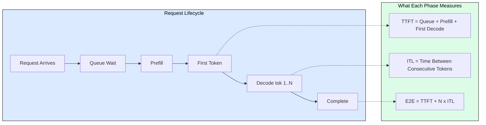
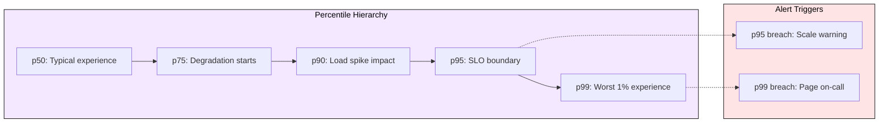
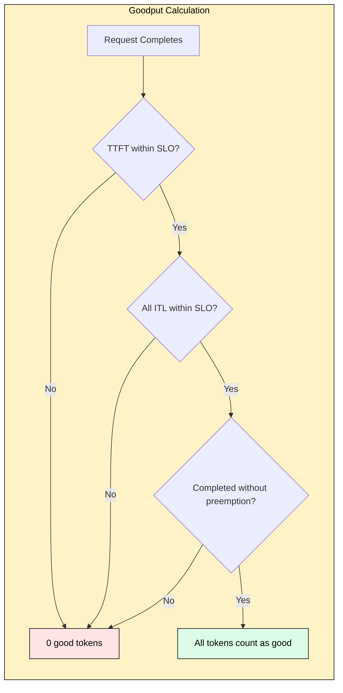
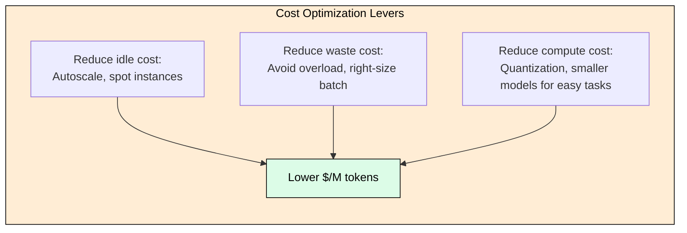

# 8.4 Inference Metrics and Goodput

> A system reporting 10,000 tokens/second looks healthy until you discover 40% of those tokens belong to requests that already violated their SLO. Goodput is the metric that separates real capacity from busy waste.

## Why Standard Metrics Fail LLM Inference

A REST API has one latency number. LLM inference has three distinct user experiences: the wait for the first token (TTFT), the streaming speed (ITL), and total completion time. A single "latency" metric conflates all three into one meaningless average.

Throughput is equally misleading. A system generating 5000 tok/s might be serving 50 users well at 100 tok/s each, or it might be generating 4000 tokens for requests that will timeout. Standard throughput counts all work equally, whether it satisfies users or not.

## The Core Metrics Hierarchy

**TTFT (Time-to-First-Token)**: Queue wait + prefill computation + first decode step. For interactive apps, delays beyond 300ms feel slow regardless of subsequent streaming speed. Scales with input length because prefill is O(n) in sequence length.

**ITL (Inter-Token Latency)**: Time between consecutive decode tokens. Human reading speed is 4-5 words/second (~6-7 tokens/second, or 140-170ms ITL). Faster than this provides no perceptible benefit for chat interfaces.

**Throughput**: Total tokens/second across all concurrent requests. Must be reported alongside per-request latency to be interpretable.

| Application | TTFT SLO | ITL SLO | Why |
|-------------|----------|---------|-----|
| Interactive chat | < 300ms p95 | < 80ms p95 | Users retry if slow |
| Code completion | < 200ms p99 | < 50ms p95 | Breaks typing flow |
| Voice assistant | < 150ms p99 | < 40ms p99 | Stutters are audible |
| Batch summarization | < 5s p95 | < 200ms p95 | Completion matters more |

## Percentiles: Why Averages Lie

A system with mean TTFT of 230ms might have p99 of 4000ms. If you serve 10M requests/day, that is 100,000 users per day waiting 4+ seconds. The gap between p50 and p99 in LLM inference is typically 10-50x (versus 2-5x for web services) because of input length variance, batch interference, and KV cache preemption.

## Goodput: The Production Metric That Matters

**Goodput** = tokens generated for requests meeting ALL SLO constraints / time. A request contributes to goodput only if TTFT is within bound, every ITL is within bound, and the request completes without preemption.

A deployment with 10,000 raw tok/s but 70% goodput ratio is effectively a 7,000 tok/s system. The other 3,000 tok/s represent wasted GPU compute (tokens for violated requests, preempted work, timed-out generations).

Traditional capacity planning asks: "How many tok/s can this GPU produce?" This leads to overloading. Goodput-driven planning asks: "How many tok/s can this GPU produce while keeping all requests within SLO?" There exists an optimal batch size beyond which raw throughput increases but goodput decreases.

## GPU-Side Signals

**KV Cache Occupancy**: The fraction of allocated KV cache in use. At 100%, new requests queue. Above 85%, preemption is imminent. This single gauge predicts TTFT degradation 30-60 seconds before users notice.

**Preemption Events**: When the scheduler evicts a partially-generated request from KV cache to admit a higher-priority request. Each preemption wastes all compute spent so far and forces re-queuing. Any preemption rate above 0% warrants immediate investigation.

**SM Utilization**: High during prefill (compute-bound), low during decode (memory-bound). Low SM during prefill means batch size is too small. High SM during decode means batch is large enough to become compute-bound again.

## Cost: Dollars Per Good Token

GPU cost per million tokens has a U-curve. At low utilization, you pay for idle silicon. At high utilization, SLO violations make effective cost worse because you pay for tokens that do not count toward goodput. The optimal operating point is typically 65-75% utilization where goodput ratio stays above 0.9.

## Alerting Priorities

| Signal | Severity | Threshold | Action |
|--------|----------|-----------|--------|
| KV cache occupancy | Critical | > 90% for 2 min | Scale out or reduce batch |
| Preemption rate | Critical | > 0 for 1 min | Reduce concurrent requests |
| TTFT p99 | Critical | > SLO for 5 min | Check queue depth |
| Goodput ratio | Warning | < 0.8 for 5 min | Investigate load vs capacity |
| Queue depth growing | Warning | Monotonic for 5 min | Scale out |

Do not alert on: instantaneous spikes (use duration), low GPU utilization (decode is memory-bound by design), or individual timeouts (track rate instead).

## Open-Loop vs Closed-Loop Benchmarking

Closed-loop (send next request after previous completes) artificially limits concurrency when the system is slow, hiding true tail latency. Open-loop (fixed arrival rate regardless of completions) reveals queuing behavior. Production traffic is open-loop. The p99 gap between the two methods is typically 3-10x, meaning closed-loop benchmarks give dangerously optimistic results.

## FAQ

**Q: What is the single most important metric for production LLM serving?**
A: Goodput ratio. It combines latency compliance, throughput, and waste into one actionable number. Below 0.7 means you are wasting 30%+ of GPU spend.

**Q: Why does the p50-to-p99 gap in LLM inference exceed typical web services?**
A: Four compounding factors: input length variance (32 vs 4096 tokens), batch interference (new prefills delay existing decodes), KV cache pressure (preemption), and output length variance.

**Q: What goodput ratio should I target?**
A: Above 0.9 is healthy. 0.8-0.9 needs attention. Below 0.8 means significant waste requiring immediate action (scale out or reduce load).

**Q: How do I reduce TTFT without sacrificing throughput?**
A: Disaggregate prefill from decode (separate prefill-optimized instances), use prefix caching for common prompts, or reduce queue depth by scaling out.

**Q: Why alert on any preemption at all?**
A: Each preemption destroys partial generation work, spikes TTFT for the re-queued request, and signals that KV cache capacity is exhausted. It is a leading indicator of cascading SLO violations.

## References

1. Kwon, W. et al. (2023). "Efficient Memory Management for Large Language Model Serving with PagedAttention." SOSP 2023.
2. Agrawal, A. et al. (2024). "Taming Throughput-Latency Tradeoff in LLM Inference with Sarathi-Serve." OSDI 2024.
3. Zhong, Y. et al. (2024). "DistServe: Disaggregating Prefill and Decoding for Goodput-optimized Large Language Model Serving." OSDI 2024.
4. Anyscale Team. (2024). "LLMPerf: Benchmarking LLM Inference with Goodput." https://github.com/ray-project/llmperf
5. vLLM Team. (2024). "vLLM Production Metrics Documentation." https://docs.vllm.ai/en/latest/serving/metrics.html
6. NVIDIA. (2024). "GenAI-Perf: Benchmarking Generative AI Models." Triton Inference Server Documentation.
