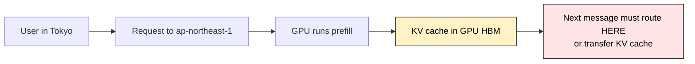
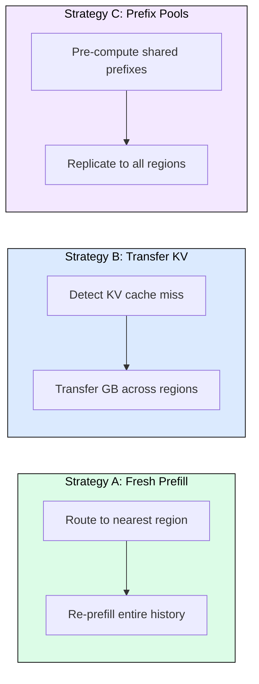
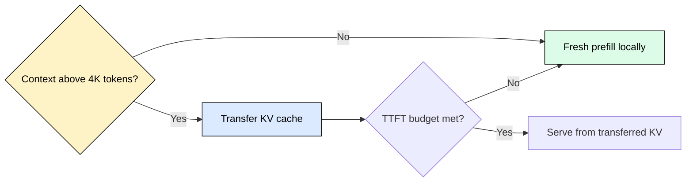
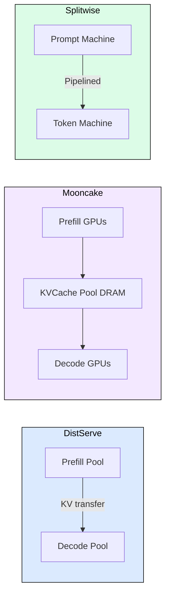

# 8.5 Multi-Region Inference and KV Cache Locality

 

At global scale, KV cache becomes a distributed systems problem. The challenge shifts from fitting KV cache in one GPU to getting the right KV cache to the right GPU in the right region before the user notices.

## Why Single-Region Breaks

Physics imposes a hard floor: the speed of light in fiber is roughly 200,000 km/s. A user in Tokyo hitting GPUs in us-east-1 pays 150-250ms of round-trip latency before the first token begins generation. For interactive applications, this is unacceptable.

| Route | Distance (km) | Practical RTT (ms) |
|-------|---------------|---------------------|
| us-east-1 to eu-west-1 | 5,500 | 80-120 |
| us-east-1 to ap-northeast-1 | 11,000 | 150-220 |
| eu-west-1 to ap-southeast-1 | 10,500 | 140-200 |

Beyond latency, compliance (GDPR, PIPL, DPDPA) mandates data residency, and single-region creates a single point of failure. Multi-region deployment is mandatory at scale.

## The Core Tension: KV Cache as Sticky State

Traditional web services are stateless: replicate servers, route to nearest. LLM inference is fundamentally stateful. The prefill phase produces a KV cache that every subsequent decode step reads from and appends to. This pins a conversation to a specific GPU.

Breaking this affinity requires either discarding the KV cache (re-prefilling from scratch) or moving it (transferring gigabytes across a network). Neither is free.

## Three Strategies

**Strategy A (Fresh Prefill):** Always route to nearest region, re-prefill the full conversation. Simple, zero cross-region transfer. Compute cost grows O(n squared) with conversation length.

**Strategy B (Transfer KV):** Move the existing KV cache to the new region. Avoids redundant prefill. Transfer time is linear in KV size. Wins for long contexts (above 4K tokens at 100 Gbps).

**Strategy C (Prefix Pools):** Pre-compute KV caches for shared prefixes (system prompts, RAG templates) and replicate globally. Savings of 50-80% on prefill for high-traffic apps with standardized prompts.

Production systems combine all three: replicate top prefixes globally, route new conversations with fresh prefill, transfer KV for long sessions when users switch regions.

## The Crossover Point

When is transferring faster than re-computing? For Llama 70B (GQA, 8 KV heads, 320 KB/token):

| Context Length | KV Size | Transfer at 100 Gbps | Prefill Time (H100) |
|---------------|---------|---------------------|---------------------|
| 2048 tokens | 640 MB | 51 ms | ~60 ms |
| 4096 tokens | 1.28 GB | 102 ms | ~150 ms |
| 8192 tokens | 2.56 GB | 205 ms | ~450 ms |
| 32768 tokens | 10.24 GB | 820 ms | ~4800 ms |

Prefill grows quadratically (attention), transfer grows linearly. Above 4K tokens, transfer wins. Above 32K tokens, transfer is 6x faster.

A hysteresis factor of 1.3x is applied: transfer must be 30% faster to justify the network dependency and coordination complexity over local compute.

## Transfer Protocols

| Protocol | Bandwidth | Use Case |
|----------|-----------|----------|
| RDMA over InfiniBand (400 Gbps) | 50 GB/s effective | Intra-DC, campus-scale |
| GPUDirect RDMA | Eliminates 2 host copies | Same PCIe root complex |
| TCP/NCCL over WAN | 70% of link capacity | Cross-region backbone |
| S3 Express One Zone | 5-10 GB/s same-AZ | Async persistence for idle sessions |

GPUDirect RDMA bypasses host memory entirely (GPU HBM to NIC to network to NIC to GPU HBM), saving 30-40% over staged transfers.

## Production Architectures

**DistServe** (Zhong et al., 2024): Disaggregates prefill and decode into separate GPU pools connected via RDMA. 1.5-2.3x goodput improvement. KV transfer adds less than 10% latency.

**Mooncake** (Moonshot AI, 2024): Treats KV cache as a first-class distributed object in a dedicated DRAM pool (TB-scale). Chunk-based storage, prefix-aware scheduling, multi-tier eviction (DRAM to NVMe to evict).

**Splitwise** (Microsoft, 2024): Pipelines KV transfer layer-by-layer during prefill. By the time the last layer finishes prefilling, the first 80% of KV is already at the decode machine. Effective transfer overhead approaches zero for sequences above 1K tokens.

## Session Stickiness and Failover

Users switch regions through mobile roaming, VPN changes, load balancing, and failover. The session router tracks KV cache locations in a globally replicated metadata store:

1. New session: route to nearest region, fresh prefill
2. Same region: append to existing KV cache
3. Different region: evaluate transfer vs re-prefill using crossover formula
4. Source unavailable (failover): re-prefill from conversation history, accept latency spike

For failover, prefix pools in backup regions ensure the shared portion of KV caches survives. Session-specific caches require emergency re-prefill capacity.

## Cost Analysis

For a global app serving 1M requests/day across 3 regions:

| Strategy | Monthly Cost | TTFT P50 | TTFT P99 |
|----------|-------------|----------|----------|
| Single region | $45K | 80/300ms | 150/500ms |
| Multi-region, always re-prefill | $135K | 80ms | 200ms |
| Multi-region + prefix pools + transfer | $160K | 35ms | 90ms |

The full system costs 3.5x single-region but delivers 4-5x better tail latency globally.

## FAQ

**Q: Does the CAP theorem apply to KV cache?**
Yes. Prefix pools use AP (available, partition-tolerant) with eventual consistency. Session caches use CP (consistent, partition-tolerant) because stale prefix caches produce silently incorrect outputs while missing session caches just cause slower re-prefill.

**Q: How large is the KV cache per token for a 70B model with GQA?**
For Llama 70B (8 KV heads, head_dim=128, 80 layers, FP16): 2 x 8 x 128 x 80 x 2 = 327,680 bytes, approximately 320 KB per token.

**Q: When does prefix caching ROI break even?**
At 10M requests/day sharing a 2300-token prefix, savings are approximately 8 GPU-days per day ($240/day on H100). Break-even requires the prefix memory cost to be less than compute savings.

**Q: What happens during a region failover?**
The source region may be unreachable, making KV transfer impossible. All sessions require emergency re-prefill in backup regions. Pre-replicated prefix pools mitigate this by preserving the shared portion of KV state.

**Q: How does Mooncake handle TB-scale KV state?**
KV cache is stored in CPU DRAM (not GPU HBM). The architecture holds TB-scale state across DRAM nodes, with hot caches under 1ms access and warm caches on NVMe at 5-10ms.

## References

- Zhong et al., "DistServe: Disaggregating Prefill and Decoding for Goodput-optimized LLM Serving" (OSDI 2024)
- Moonshot AI, "Mooncake: A KVCache-centric Disaggregated Architecture for LLM Serving" (2024)
- Patel et al., "Splitwise: Efficient Generative LLM Inference with Model Splitting" (Microsoft Research, 2024)
- Kwon et al., "Efficient Memory Management for Large Language Model Serving with PagedAttention" (SOSP 2023)
- AWS, "S3 Express One Zone Documentation" (docs.aws.amazon.com)
