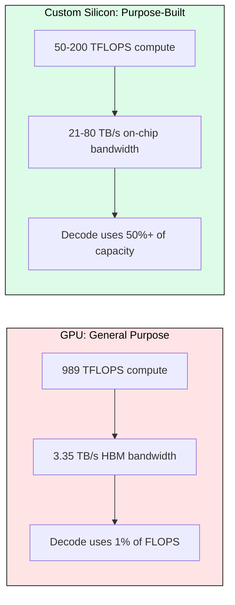
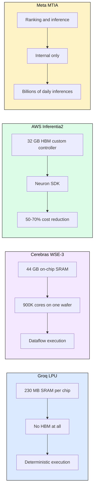
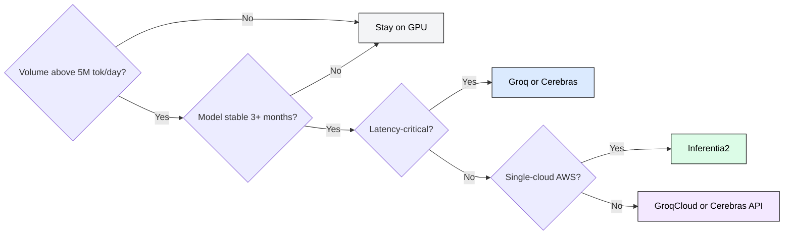
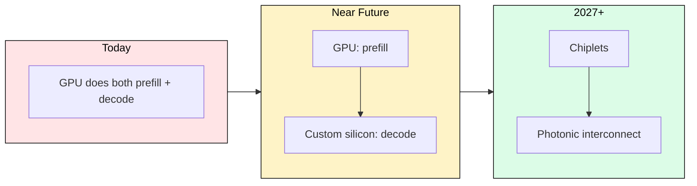

# 8.6 Beyond GPUs: Custom Silicon for LLM Inference

 

Custom silicon delivers 10-50x decode speed improvements over GPUs by eliminating the memory bandwidth wall. Groq achieves 300+ tokens/second on Llama 70B. Cerebras reaches 2,500 tokens/second. These are not projections: they are measured today on public APIs.

## Why Custom Silicon Exists: The GPU Efficiency Gap

During decode, an H100 uses less than 1% of its 989 TFLOPS. The chip waits for memory reads 99% of the time. You pay for massive compute you cannot use because decode is entirely memory-bandwidth-bound.

Custom silicon closes this gap by reallocating transistor budget: less compute, more bandwidth, purpose-built memory hierarchies.

| Resource | GPU (H100) | Inference ASIC (ideal) |
|----------|-----------|----------------------|
| Compute | 989 TFLOPS | 50-200 TFLOPS |
| On-chip SRAM | 50 MB | 200 MB to 44 GB |
| Memory bandwidth | 3.35 TB/s (HBM) | 21-80 TB/s (on-chip) |
| Power efficiency | ~3 TFLOPS/W | 10-50 TFLOPS/W |

## The Decode Speed Arithmetic

For a 70B model in FP16 (140 GB), decode throughput equals bandwidth divided by model size:

- **H100** (3.35 TB/s HBM): 3,350 / 140 = 24 tokens/s per sequence
- **Groq LPU** (~80 TB/s SRAM): 80,000 / 140 = 571 theoretical, ~300 measured
- **Cerebras WSE-3** (21 PB/s on-chip): 150,000 theoretical, ~2,500 measured

The gap between theoretical and measured reflects routing overhead and synchronization. Even at 5% efficiency, wafer-scale outperforms GPUs by 100x on decode.

## The Four Architectures

### Groq LPU: Deterministic SRAM-Only

Groq eliminates HBM entirely. Each chip has 230 MB of SRAM. A 70B model requires approximately 600 chips in a single rack. The Temporal Streaming Architecture (TSP) pre-schedules every instruction at compile time: no kernel launches, no variable-latency memory, no synchronization overhead.

Key results: 300+ tok/s on Llama 70B, under 100ms TTFT. NVIDIA acquired Groq in December 2025.

### Cerebras WSE-3: Wafer-Scale

The largest chip ever built: 4 trillion transistors, 900,000 cores, 44 GB SRAM on a single 300mm wafer. Memory bandwidth is 21 PB/s (6,000x an H100). Models up to 20B fit entirely on-chip in FP16; larger models stream weights from external MemoryX modules.

Key results: 2,500 tok/s on Llama 70B, available via Cerebras Inference API.

### AWS Inferentia2/Trainium2: Cloud-Native Cost Play

AWS optimizes for cost per token rather than raw speed. Inferentia2 delivers comparable throughput to H100 at 50-70% lower cost. Trainium2 handles both training and inference with NeuronLink interconnect.

The tradeoff: Neuron SDK has narrower operator coverage than CUDA, compilation takes hours for large models, and you are locked to AWS.

### Meta MTIA: Vertical Integration

Meta built chips for their 3+ billion daily active users. MTIA v1 targets recommendation (memory-bound like LLM decode). MTIA v2 extends to generative AI. Not externally available, but indicative of the direction: at sufficient scale, building custom silicon is cheaper than renting GPUs.

## Head-to-Head Comparison

| Dimension | H100 | Groq LPU | Cerebras WSE-3 | Inferentia2 |
|-----------|------|----------|----------------|-------------|
| Decode tok/s (70B) | 20-30 | 250-300 | 2,100-2,500 | 35-45 |
| Cost per M tokens | ~$0.60 | ~$0.30 | ~$0.20 | ~$0.20 |
| Ecosystem maturity | Excellent | Limited | Limited | Good |
| Model support | Universal | Major models | Major models | Major HF models |
| Time to deploy new model | Hours | Days-weeks | Days-weeks | Days-weeks |

## When to Use Custom Silicon

**Deploy on custom silicon when:** High-volume single-model serving (above 5M tokens/day), latency is the primary constraint (sub-100ms TTFT required), model will be stable for months, and only standard transformer operators are used.

**Stay on GPU when:** Research iteration (weekly model changes), multi-model serving on shared infra, cutting-edge architectures with custom operators, or scale below 1M tokens/day.

**The hybrid approach:** GPUs for development and experimentation, custom silicon for production at scale, GPU as fallback for spikes and new model rollouts. This mirrors the CPU/DSP/ASIC pattern in other industries.

## The CUDA Ecosystem Moat

Custom silicon faces a formidable barrier: CUDA is not just a language but libraries (cuBLAS, cuDNN, NCCL), frameworks (PyTorch, JAX), tools (NSight, TensorRT-LLM), and millions of trained developers. Every new model works on CUDA first. The gap between "model released" and "model available on custom silicon" is days to weeks.

Forces eroding this moat: OpenAI Triton (multi-backend compiler), MLIR/StableHLO (write-once compile-anywhere), and cloud API abstraction (application developers never see the hardware).

## Future Directions

1. **Disaggregated prefill/decode:** GPUs handle compute-bound prefill, custom silicon handles memory-bound decode. NVIDIA's Groq acquisition likely targets this.
2. **Inference-time compute:** Reasoning models generate 5,000-50,000 internal tokens per query. Custom silicon's decode advantage becomes 10x more valuable.
3. **Chiplet architectures:** AMD MI300X (192 GB HBM3, 5.3 TB/s) and NVIDIA Blackwell B200 (8 TB/s) represent middle ground between monolithic GPU and wafer-scale.
4. **Photonic compute:** Lightmatter uses light-based interconnect for matrix multiplications at near-zero energy.

## FAQ

**Q: Why not just add more HBM bandwidth to GPUs?**
HBM bandwidth is constrained by physics (pin count, signaling speed, stack height). Doubling HBM bandwidth requires doubling the number of memory stacks, which doubles cost and power. Custom silicon sidesteps this by keeping data on-chip.

**Q: How does Groq fit a 70B model across 600 chips?**
The compiler partitions the model across chips at compile time and pre-schedules all inter-chip transfers. Because execution is deterministic, chips know exactly when data arrives from neighbors. No runtime coordination.

**Q: Is the CUDA moat permanent?**
Unlikely. MLIR, Triton, and cloud APIs are reducing switching costs. But full CUDA parity is years away. The transition will be gradual, starting with the highest-volume inference workloads.

**Q: What about quantization on custom silicon?**
All custom chips support INT8/INT4. Groq and Cerebras can serve 70B models in INT4 (35 GB), fitting more model per chip. This compounds the bandwidth advantage since fewer bytes need to traverse on-chip paths.

**Q: Can I fine-tune on custom silicon?**
Groq is inference-only. Cerebras and Trainium2 support both training and inference. For most organizations, the workflow is: train/fine-tune on GPU, compile and deploy on custom silicon for serving.

## References

- Groq, "Groq LPU Inference Engine" (groq.com/technology)
- Cerebras, "Wafer-Scale Engine Architecture" (cerebras.net/product-chip)
- AWS, "AWS Neuron SDK Documentation" (awsdocs-neuron.readthedocs-hosted.com)
- Meta, "MTIA: Training and Inference Accelerator" (ai.meta.com/blog/meta-training-inference-accelerator-AI-MTIA)
- Jouppi et al., "TPU v4: An Optically Reconfigurable Supercomputer" (2023)
- Patterson, "A Domain-Specific Architecture for Deep Neural Networks" (2018)
- NVIDIA, "NVIDIA to Acquire Groq" (December 2025)
