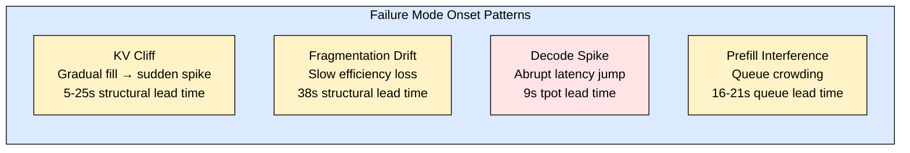
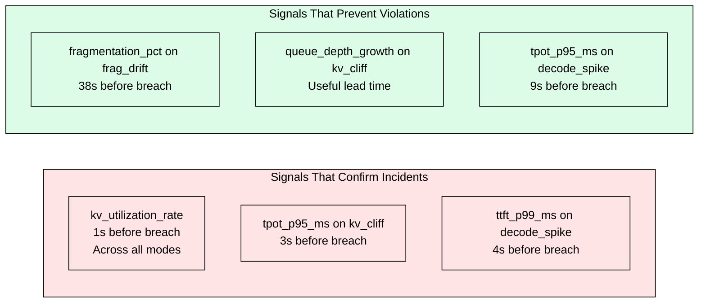
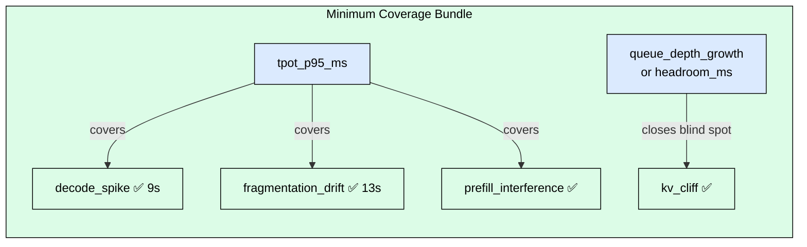
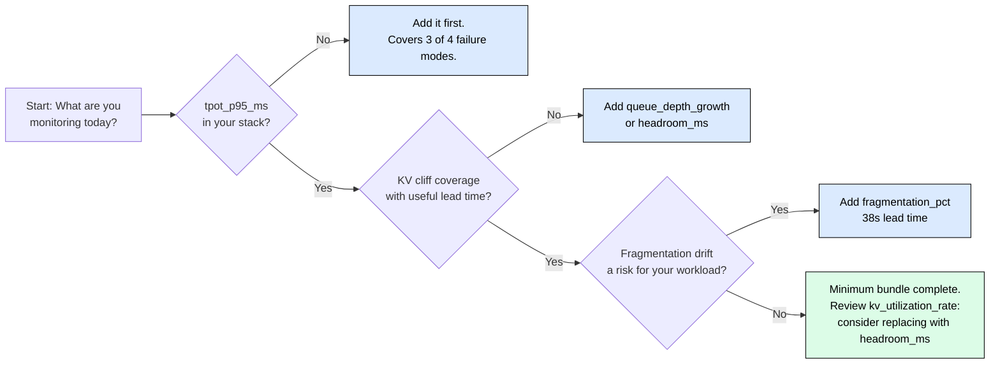

# 8.7 Observability Signal Coverage for LLM Serving

> Your KV utilization dashboard shows 72%. No alerts firing. Three minutes later, 
> TTFT breaches SLO for 40% of requests. KV utilization was watching the wrong thing.

Module 8.4 defines the core metrics hierarchy for LLM inference: TTFT, ITL, goodput,
and KV occupancy. This module answers a different question: given a set of candidate
signals, which ones actually give you enough lead time to act before an SLO violation,
and which ones only confirm the incident after it has already happened?

The answer changes how you design your alerting stack.

---

## The Four Failure Modes

LLM serving degrades through a small number of structural failure patterns.
Understanding each mode is prerequisite to evaluating which signals detect it.

**KV cliff.** KV cache fills progressively. Queue grows. Latency spikes after a lag.
Structural KV signals appear first; latency signals confirm later. The cliff shape
means there is a window of 5-25 seconds between structural signal and SLO breach
where intervention is still possible.

**Fragmentation drift.** Batching efficiency degrades gradually over 30-120 seconds
as the block pool accumulates partially-filled pages. No single request looks slow;
the system as a whole loses throughput silently. Latency signals take 13-18 seconds
to reflect degradation that structural signals catch at 38 seconds.

**Decode spike.** Per-token decode latency increases abruptly, often triggered by a
sudden increase in batch size or a model-side anomaly. The spike is fast: useful
lead time window is narrow, and structural KV signals have near-zero lead time for
this mode.

**Prefill interference.** Long prefill requests crowd out decode traffic by consuming
shared compute and KV allocation. Queue and scheduling signals are earliest (16-21
seconds). Latency signals follow with 5-6 seconds of lead time.

---

## The Signal Pool

Twenty candidate signals were evaluated across five categories. Each signal was
assessed for lead time (seconds before SLO breach) and coverage (which failure
modes it detects with useful lead time, defined as >= 5 seconds).

| Category | Signals |
|---|---|
| Latency | ttft_p95_ms, ttft_p99_ms, tpot_p95_ms, decode_step_ms |
| Queue / backlog | queue_depth, queue_depth_growth, waiting_requests, queue_composition_prefill_frac |
| Resource / KV | kv_utilization_rate, kv_headroom_mb, headroom_ms |
| Batching / efficiency | fragmentation_pct, effective_batch_utilization, prefill_share_of_step, prefill_to_decode_ratio, batch_size_trend, compaction_frequency |
| Admission / control | admission_reject_rate, scheduler_repack_rate, cancel_rate |

Source benchmark and methodology:
[github.com/JohnScheuer/inference-observability-bench](https://github.com/JohnScheuer/inference-observability-bench)

---

## Individual Signal Blind Spots

Every individual signal has at least one failure mode where it provides zero
useful early warning. This is the central finding that makes minimum-set
analysis necessary.

| Signal | kv_cliff | fragmentation_drift | decode_spike | prefill_interference |
|---|---|---|---|---|
| ttft_p99_ms | ✅ | ✅ | ⚠️ 4s (late) | ✅ |
| tpot_p95_ms | ⚠️ 3s (late) | ✅ 13s | ✅ 9s | ✅ |
| headroom_ms | ✅ | ❌ | ❌ | ❌ |
| queue_depth_growth | ✅ | ❌ | ❌ | ✅ |
| fragmentation_pct | ❌ | ✅ 38s | ❌ | ❌ |
| prefill_share_of_step | ❌ | ❌ | ❌ | ✅ |
| **kv_utilization_rate** | **⚠️ 1s (late)** | **⚠️ late** | **⚠️ late** | **⚠️ late** |

✅ = detected with useful lead time (>= 5s). ⚠️ = detected but late (< 5s). ❌ = not detected.

Three findings stand out from this table.

**ttft_p99_ms misses decode spikes.** It fires only 4 seconds before breach in
decode spike scenarios, below the 5-second useful lead time threshold. By the time
TTFT reflects a decode spike, the decode latency has been elevated long enough to
have already started violating per-token SLOs. You need a per-token signal, not a
per-request one.

**tpot_p95_ms misses KV cliff.** It fires only 3 seconds before breach in KV cliff
scenarios. The structural fill pattern of KV cliff is invisible to decode latency
until the queue has already grown to the point where requests are stalling before
prefill even starts. A structural signal is required.

**kv_utilization_rate provides zero useful early warning.** Despite being one of
the most commonly monitored LLM serving signals, kv_utilization_rate fires only 1
second before breach across all four failure modes. It confirms that an incident is
happening. It does not give you time to prevent the SLO violation.

---

## The Minimum Effective Bundle

The minimum observability bundle is not more signals. It is the right signals
to close the specific blind spots of each other.

Set cover analysis across all four failure modes with the useful lead time
constraint (>= 5 seconds) finds that **2 signals provide full coverage**:

1. **tpot_p95_ms** covers decode spike (9s), fragmentation drift (13s), and
   prefill interference. It is the highest coverage-per-signal in the pool.

2. **queue_depth_growth or headroom_ms** closes the KV cliff blind spot that
   tpot_p95_ms cannot catch with useful lead time.

This does not mean other signals are useless. fragmentation_pct at 38 seconds is
the earliest available signal for fragmentation drift by a large margin. If your
workload is particularly susceptible to fragmentation (large batches, mixed
short/long sequences), adding it is justified. The minimum bundle establishes the
floor; your specific failure mode risk profile determines what you add above it.

---

## Coverage Efficiency

Signals are not equally efficient. Coverage efficiency is the number of failure
modes detected with useful lead time relative to the collection and storage cost
of the signal.

Latency signals (tpot_p95_ms, ttft_p99_ms) have the highest coverage efficiency
per unit cost. They are already collected by most serving engines, require no
additional instrumentation, and cover 2-3 failure modes with useful lead time.

Structural signals (fragmentation_pct, queue_depth_growth, headroom_ms) are
complementary, not redundant. They do not duplicate what latency signals cover;
they cover the modes that latency signals miss. The right framing is not "latency
vs structural" but "latency first, structural to close specific gaps."

KV utilization rate has the worst coverage efficiency in this evaluation. It is
expensive to monitor continuously, it appears in nearly every LLM observability
dashboard, and it provides zero useful lead time on any failure mode. Replace it
with headroom_ms, which measures the same physical resource but reports time-to-cliff
rather than current fill level, giving it a meaningful lead time advantage.

---

## Decision Framework

---

## Alerting Priorities

| Signal | Failure mode covered | Lead time | Severity |
|---|---|---|---|
| tpot_p95_ms | decode_spike, frag_drift, prefill_interference | 9-13s+ | Critical |
| queue_depth_growth | kv_cliff | Useful | Critical |
| headroom_ms | kv_cliff | Useful | Critical |
| fragmentation_pct | fragmentation_drift | 38s | Warning |
| ttft_p99_ms | kv_cliff, frag_drift, prefill_interference | Useful | Warning |
| kv_utilization_rate | None (confirmation only) | 1s | Remove or demote |

Do not alert on kv_utilization_rate as a leading indicator. Use it for dashboards
and post-incident review. Alert on headroom_ms instead: it measures the same
resource but in units of time remaining, not current percentage consumed.

---

## Limitations

This module is based on synthetic incident traces, not live serving data.
Detection thresholds are fixed and not learned from traffic patterns.
Failure modes are modeled as independent incidents; in production, KV cliff and
prefill interference can co-occur and interact. Lead times represent relative
signal utility under the modeled incident shapes, not absolute production alert
timing. Results should be treated as signal ordering guidance, not as exact
threshold recommendations for a specific deployment.

---

## FAQ

**Q: We already monitor KV utilization rate. Should we remove it?**
Do not remove it — it has value for dashboards, capacity planning, and post-incident
analysis. Demote it: do not use it as an alert trigger for SLO protection. Replace
its alert role with headroom_ms, which gives you time-to-cliff rather than current
fill percentage. Keep kv_utilization_rate for visualization.

**Q: Is 5 seconds of lead time actually enough to act?**
It depends on your intervention. Automated actions (reject new requests, reduce
batch size, trigger scale-out) can execute in milliseconds. Human-in-the-loop
responses need 30-60 seconds minimum. Design your alerting stack so that 5-second
signals trigger automated mitigations, not pager notifications.

**Q: Our workload has very short sequences. Does this change the signal ranking?**
Yes. Short sequences reduce KV cliff risk (smaller per-request footprint) and
amplify decode spike sensitivity (batch size fluctuations have larger per-token
impact). In short-sequence workloads, tpot_p95_ms remains the primary signal but
headroom_ms becomes less critical. Monitor queue_depth_growth as the KV cliff proxy.

**Q: How does this interact with the metrics in Module 8.4?**
Module 8.4 defines what to measure; this module identifies which of those
measurements gives you useful lead time for each failure mode. Goodput ratio from
8.4 is an outcome metric: it tells you how the system is performing. The signals
here are input metrics: they tell you what is about to happen. Both layers are
necessary.

**Q: fragmentation_pct has a 38-second lead time. Why is it not in the minimum bundle?**
Because tpot_p95_ms also covers fragmentation drift with a 13-second lead time,
which exceeds the 5-second useful threshold. If tpot_p95_ms is already in your
stack, fragmentation_pct adds earlier warning (38s vs 13s) but not additional
coverage. Add it when you need earlier intervention for fragmentation specifically,
not because it is required for full failure mode coverage.

---

## References

1. De Souza, J.F. "Inference Observability Bench." 2026.
   [github.com/JohnScheuer/inference-observability-bench](https://github.com/JohnScheuer/inference-observability-bench)

2. Kwon, W. et al. "Efficient Memory Management for Large Language Model Serving
   with PagedAttention." SOSP 2023.

3. Agrawal, A. et al. "Taming Throughput-Latency Tradeoff in LLM Inference with
   Sarathi-Serve." OSDI 2024.

4. Zhong, Y. et al. "DistServe: Disaggregating Prefill and Decoding for
   Goodput-optimized Large Language Model Serving." OSDI 2024.

5. vLLM Team. "vLLM Production Metrics Documentation."
   https://docs.vllm.ai/en/latest/serving/metrics.html
