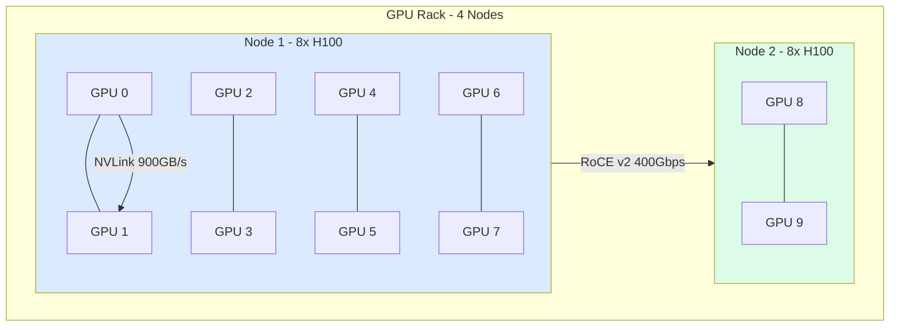
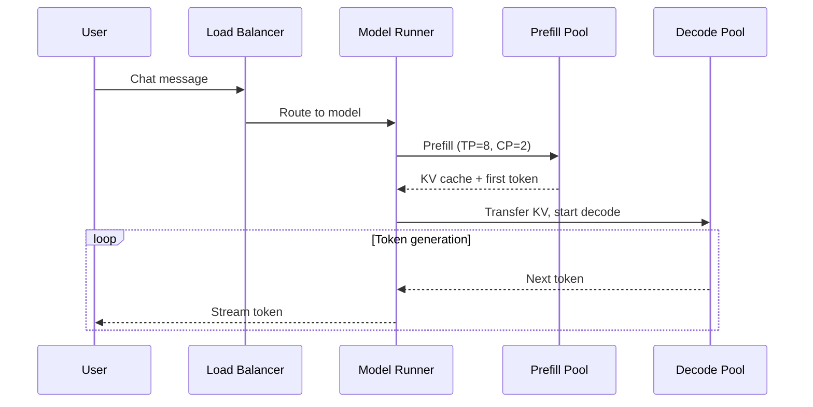

# Meta's LLM Inference Infrastructure: Running Every Optimization Simultaneously at Planetary Scale

## Why This Chapter Matters

Every technique you have learned in this book, from KV cache management to tensor parallelism to expert parallelism, exists because somebody needed it in production. Meta is the company that needs *all of them at once*. They serve billions of AI-powered interactions every single day across Meta AI (the assistant embedded in WhatsApp, Messenger, Instagram, and Facebook), Ray-Ban Meta smart glasses, content ranking systems, and reinforcement learning from human feedback (RLHF) pipelines that continuously improve their models. When you deploy Llama 3.1 405B to serve real-time conversations for billions of users across multiple form factors, every optimization in this book stops being academic and becomes existential.

This chapter walks through how Meta builds and operates their inference infrastructure at a scale that few organizations will ever reach. But the principles transfer. The parallelism composition strategies, the mixed-workload scheduling, the hardware-aware kernel optimization: these are the same problems you will face at 10 GPUs or 100 GPUs, just with fewer zeros. Meta's public engineering blogs give us a rare window into how production inference actually works when every millisecond costs real money and every dropped request disappoints a real user.

We will ground every claim in publicly available sources from Meta's engineering blog and related publications. Where Meta has not disclosed implementation details, we will say so explicitly rather than speculate.

---

## Back-References: The Concepts You Already Know

Before we dive into Meta's infrastructure, let us connect what you have already learned to what you are about to see:

- **Tensor Parallelism (Module 5.1)**: You learned how to split weight matrices across GPUs within a single node using NVLink's high-bandwidth interconnect. Meta uses this as the innermost layer of their parallelism hierarchy, splitting attention heads and MLP columns across 8 GPUs within each node.

- **Context Parallelism (Module 5.4)**: You explored how ring attention distributes long sequences across GPUs to handle 128K+ context windows without running out of memory on any single device. Meta applies this to serve Llama 3.1's full 128K context window for Meta AI conversations that accumulate long chat histories.

- **Expert Parallelism (Module 5.2)**: You studied how Mixture-of-Experts models route tokens to specialized sub-networks, and how to distribute those experts across devices. Meta's deployment of Llama 3.1 405B (which uses a dense architecture, but their broader model fleet includes MoE variants) requires careful expert placement.

- **KV Cache Management (Module 2.1-2.4)**: You learned about paged attention, cache eviction, and memory budgeting. At Meta's scale, KV cache memory is the binding constraint that determines how many concurrent users a single GPU can serve.

- **Disaggregated Serving (Module 6.4)**: You studied how to separate prefill from decode to optimize each phase independently. Meta's Model Runner handles mixed workloads where some requests are prefill-heavy (long prompts) and others are decode-heavy (long generations).

- **Inference Metrics (Module 7.4)**: You learned about time-to-first-token, inter-token latency, and goodput. Meta operates under strict SLOs that differ by product surface, making these metrics the central nervous system of their deployment.

Meta uses all of these simultaneously. Not one at a time, not in isolation, but composed together in a hierarchy that maps the logical structure of the model onto the physical topology of their datacenter network. This is what production inference looks like at planetary scale.

---

## The Model Runner Platform

Meta's unified inference serving layer is called **Model Runner**. Described in their October 2025 engineering blog post "Scaling LLM Inference," Model Runner is the single platform that handles all of Meta's generative AI workloads. Rather than building separate serving systems for each product (a common anti-pattern at large companies), Meta consolidated onto one framework that can serve models ranging from Llama 3.1 8B (a single GPU) to Llama 3.1 405B (requiring dozens of GPUs working in concert).

### What Model Runner Does

Model Runner abstracts away the complexity of multi-GPU inference behind a unified API. Product teams (Meta AI, smart glasses, content ranking) submit inference requests without needing to know which GPUs will handle them, how the model is sharded, or what parallelism strategy is in use. Model Runner handles:

1. **Request routing**: Directing incoming queries to the appropriate model replica based on current load, latency requirements, and hardware availability.

2. **Parallelism orchestration**: Automatically configuring the tensor parallelism degree, context parallelism ring, and expert parallelism layout based on the model architecture and available hardware.

3. **Memory management**: Allocating and reclaiming KV cache memory across concurrent requests using techniques analogous to the paged attention you learned in Module 2.3.

4. **SLO enforcement**: Monitoring per-request latency against product-specific targets and making scheduling decisions to meet those targets.

5. **Batch formation**: Grouping compatible requests into batches for efficient GPU utilization, similar to the continuous batching strategies covered in Module 3.1.

### Why Unification Matters

The decision to build one platform rather than many deserves attention. When you have 100K+ GPUs and dozens of product surfaces, the operational cost of maintaining separate serving stacks is enormous. Each stack needs its own on-call rotation, its own performance tuning, its own bug fixes. Model Runner lets Meta's infrastructure team optimize once and benefit everywhere.

This is a pattern that transfers to smaller organizations. Even at 10-100 GPUs, building a unified serving layer (using tools like vLLM, TensorRT-LLM, or SGLang) is almost always better than maintaining separate deployments per model. The operational overhead of multiple serving stacks grows faster than the complexity of one flexible system.

### Model Support

Model Runner handles the full Llama model family:
- **Llama 3.1 8B**: Single-GPU deployment for lightweight tasks, fast time-to-first-token
- **Llama 3.1 70B**: Multi-GPU deployment with tensor parallelism across one node
- **Llama 3.1 405B**: Multi-node deployment combining tensor, context, and pipeline parallelism

It also supports Meta's internally-trained models beyond the Llama family, though Meta has not disclosed the full catalog of models served through this platform.

---

## Hardware Fleet: 100K+ GPUs and the Ethernet Choice

### Scale of the Fleet

Meta operates one of the largest GPU fleets in the world for AI workloads. Their public disclosures indicate over 100,000 GPUs dedicated to AI training and inference, with the inference portion growing as generative AI products scale. The primary GPU is the NVIDIA H100, deployed in 8-GPU nodes connected via NVLink within each node.

But Meta's hardware strategy extends beyond NVIDIA. They are developing **MTIA (Meta Training and Inference Accelerator)**, a custom silicon chip designed specifically for Meta's workloads. The June 2026 post "Scaling AI Experiences for Billions" describes MTIA as purpose-built to handle Meta's specific inference patterns: the embedding lookups, the attention computations, and the memory access patterns that dominate their serving workloads. MTIA represents Meta's long-term bet that general-purpose GPUs are over-provisioned for inference (you pay for training-oriented features you do not use) and that custom silicon can deliver better performance-per-watt for their specific model architectures.

### Why Ethernet (RoCE v2) Instead of InfiniBand

This is one of Meta's most distinctive infrastructure decisions and it deserves deep examination because it contradicts conventional wisdom.

Most large-scale AI deployments use InfiniBand for inter-node communication. InfiniBand provides low latency, high bandwidth, and built-in congestion control. It is the standard for GPU clusters at NVIDIA, at most cloud providers, and at most enterprises deploying multi-node inference.

Meta chose **RoCE v2 (RDMA over Converged Ethernet)** instead. Their August 2024 blog post "RoCE networks for distributed AI training at scale" explains why:

**1. Existing infrastructure leverage.** Meta already operates one of the world's largest Ethernet networks for their data centers. Every switch, every cable, every monitoring tool, every automation script is built for Ethernet. Adopting InfiniBand would mean maintaining two entirely separate network stacks: one for AI and one for everything else. The operational cost of that duality is enormous.

**2. Vendor diversity.** InfiniBand is effectively a single-vendor ecosystem (NVIDIA/Mellanox). Ethernet has dozens of vendors competing on switches, NICs, and optics. Meta's scale gives them purchasing power, but only if multiple vendors can compete for their business.

**3. Scale economics.** At 100K+ GPUs, Meta needs thousands of network switches. Ethernet switches are commodity hardware with well-understood failure modes and replacement procedures. InfiniBand switches are specialized, more expensive, and harder to source at scale.

**4. Software-defined congestion control.** The traditional argument for InfiniBand is superior congestion control. Meta addresses this by implementing custom congestion control algorithms in software on top of RoCE v2. Their RDMA stack handles the lossless requirements (Priority Flow Control, ECN marking) through careful network design rather than relying on InfiniBand's hardware-based flow control.

The tradeoff is real: RoCE v2 requires more careful network engineering to achieve the same lossless behavior that InfiniBand provides out of the box. But at Meta's scale, the operational simplification of staying on Ethernet outweighs the additional network engineering investment.

**What this means for practitioners**: If you are building a cluster of 10-100 GPUs, InfiniBand remains the pragmatic choice because the network engineering burden of RoCE v2 is harder to justify at smaller scale. But if your organization already has significant Ethernet infrastructure expertise, RoCE v2 is a viable path, especially as the ecosystem matures.

---

## Parallelism Composition: The Combined Hierarchy

This is where everything comes together. You learned each parallelism dimension in isolation in Chapter 5. Meta deploys them simultaneously, composed into a hierarchy that maps model structure onto network topology.



> **Communication hierarchy**: TP communicates within a node over NVLink (900 GB/s, sub-microsecond). CP and PP communicate across nodes over RoCE v2 (400 Gbps, ~5 microseconds). EP routes tokens across racks over the spine network.

### The Three Dimensions

**Tensor Parallelism (TP) — Innermost Layer**

Tensor parallelism operates within a single node, using NVLink for communication. NVLink on H100 nodes provides 900 GB/s bidirectional bandwidth between GPUs, which is essential because tensor parallelism requires an AllReduce after every transformer layer. With 8 GPUs per node and NVLink, the AllReduce latency is low enough that TP does not become a bottleneck even at the decode phase's small batch sizes.

For Llama 3.1 405B, Meta uses TP degree 8 (all GPUs within a node). This splits each attention head group and MLP column across 8 devices. The math you learned in Module 5.1 applies directly: each GPU holds 1/8 of the weight matrices and computes 1/8 of the matrix multiplication, then they synchronize via AllReduce.

**Context Parallelism (CP) — Middle Layer**

For requests with long context (up to 128K tokens), a single node cannot hold the entire KV cache in memory even with TP-8. Context parallelism distributes the sequence across multiple nodes. Each node holds a contiguous chunk of the sequence's KV cache, and attention is computed using ring attention (Module 5.4): each node computes attention over its local chunk, then passes partial results around the ring.

The communication here happens over the RoCE v2 network (inter-node), which has lower bandwidth than NVLink. This is why CP is the *middle* layer: it requires less frequent communication than TP (only during attention computation, not at every layer) but operates at lower bandwidth. The ring attention algorithm minimizes the data that must traverse the network by overlapping computation with communication.

**Expert Parallelism (EP) — Outermost Layer**

For Mixture-of-Experts models in Meta's fleet, expert parallelism distributes experts across nodes. Each node holds a subset of experts, and a routing mechanism sends each token to the appropriate node for processing. The communication pattern is an all-to-all exchange: every node may need to send tokens to every other node depending on the routing decisions.

This is placed at the outermost layer because expert routing is inherently sparse (each token only visits 2-4 experts out of potentially hundreds) and the communication is less latency-sensitive than the synchronous AllReduce required by TP.

### The Composition

For a large MoE model served with 128K context, the full hierarchy looks like:

```
Level 3 (outermost): Expert Parallelism across node groups
  Level 2 (middle): Context Parallelism across nodes within each EP group  
    Level 1 (innermost): Tensor Parallelism across GPUs within each node
```

A concrete example for a hypothetical configuration:
- 4 expert groups × 4 CP nodes × 8 TP GPUs = 128 GPUs serving one model replica
- NVLink handles TP communication (900 GB/s)
- RoCE v2 handles CP ring communication (400 Gbps per link)
- RoCE v2 handles EP all-to-all communication (same network, different traffic pattern)

The key insight is that each parallelism dimension is mapped to the appropriate level of the network hierarchy based on its communication intensity:
- TP needs the highest bandwidth → NVLink (intra-node)
- CP needs moderate bandwidth, tolerates some latency → RoCE (inter-node, within rack or pod)
- EP needs bursty communication, is latency-tolerant → RoCE (inter-node, potentially cross-rack)

### Why This Composition Works

The reason these three dimensions compose cleanly is that they partition *different aspects* of the computation:
- TP partitions the **model weights** (each GPU has a slice of every layer)
- CP partitions the **sequence** (each node has a chunk of the context)
- EP partitions the **experts** (each node has a subset of the routing targets)

There is no fundamental conflict between them. A single forward pass can use all three simultaneously because they operate on orthogonal axes of the computation tensor. This is exactly the "combined parallelism hierarchy" concept from the parallelism lecture in the supplemental materials.

### Connection to What You Know

In Module 5.1, you computed the AllReduce cost for TP: `2 * (P-1)/P * M * dtype_bytes / bandwidth`. At Meta's scale with TP-8 on NVLink, that becomes `2 * 7/8 * M * 2 / 900e9` for FP16 weights. The per-layer overhead is microseconds, which is why TP can be the innermost (most frequent) parallelism.

In Module 5.4, you computed the ring attention communication volume: each step sends `batch * chunk_len * head_dim * 2` bytes around the ring. With RoCE at 400 Gbps (50 GB/s), a ring step for a 4K chunk at batch 32 takes roughly `32 * 4096 * 128 * 2 / 50e9 ≈ 0.67ms`. Overlapped with compute, this hides effectively behind the attention FLOPs.

---

## Mixed Workloads: One Fleet, Many SLOs

One of the hardest operational challenges Meta faces is serving radically different workloads on shared hardware. Their GPU fleet does not have separate clusters for each product. Instead, Model Runner schedules diverse workloads across the same physical infrastructure, each with different latency and throughput requirements.

### The Workload Spectrum

**Meta AI Chatbot (Latency-Sensitive)**

When a user sends a message to Meta AI on WhatsApp or Messenger, they expect a response to begin appearing within 1-2 seconds. The key metrics are:
- **Time-to-first-token (TTFT)**: Must be under ~1 second for conversational feel
- **Inter-token latency (ITL)**: Must be under ~50ms for smooth streaming
- **Context**: Moderate (conversation histories of 2K-20K tokens typically)

This workload demands low latency at the expense of throughput. Small batch sizes, fast scheduling, and aggressive prefill optimization are critical.

**Ray-Ban Meta Smart Glasses (Ultra-Low Latency)**

The smart glasses present an even more demanding latency target. When a user says "Hey Meta, what am I looking at?", the system must process the camera image and generate a spoken response in real time. The latency budget includes:
- Camera capture and encoding
- Network transmission to Meta's data centers
- Image understanding (vision model inference)
- Text generation (language model inference)
- Text-to-speech synthesis
- Network transmission back
- Audio playback

The inference portion of this pipeline has an extremely tight budget, potentially under 500ms for the text generation component. Meta has not disclosed exact SLO numbers for smart glasses inference, but the real-time conversational constraint implies aggressive optimization.

**Batch RLHF Processing (Throughput-Maximizing)**

Reinforcement Learning from Human Feedback requires generating many completions for the same prompt to create preference pairs. This is fundamentally a throughput workload:
- **Latency**: Not user-facing, so multi-second delays are acceptable
- **Throughput**: Generate as many tokens per second as possible
- **Batch size**: Large batches (hundreds to thousands of sequences)
- **Context**: Often long (full conversations being evaluated)

RLHF can absorb any leftover GPU capacity after latency-sensitive workloads are served. It acts as a "backfill" workload that keeps GPUs utilized during low-traffic periods.

### Scheduling Across SLOs

Model Runner must make real-time decisions about how to allocate GPU resources across these workloads. The core tension is:

- **Latency-sensitive requests cannot wait.** If a Meta AI user sends a message, you cannot queue it behind 500 RLHF completions.
- **But GPUs are expensive.** Keeping GPUs idle "just in case" a latency-sensitive request arrives is wasteful.
- **Batch size affects efficiency.** Larger batches give better GPU utilization (higher arithmetic intensity), but forming large batches requires waiting for more requests to arrive, which increases latency.

Meta has not fully disclosed their scheduling algorithm, but the public information suggests a priority-based system where:
1. Latency-sensitive requests (chatbot, glasses) preempt batch workloads
2. Batch workloads (RLHF) run at lower priority and can be interrupted
3. Request batching uses a deadline-aware strategy: form the largest batch possible without violating any request's SLO

This is conceptually similar to the "goodput" framework from Module 7.4: the system optimizes for useful work completed within SLO bounds, not raw throughput.

### What This Means for You

Even at smaller scale, you will face the mixed-workload problem. If you run both a user-facing chatbot and a batch summarization pipeline on the same GPUs, you need:
1. Priority queues that let interactive requests jump ahead
2. Preemption capability to pause batch work when interactive load spikes
3. Monitoring that tracks SLO compliance per workload class, not just aggregate metrics

The alternative is separate clusters per workload, which is simpler operationally but wastes hardware. Meta's approach shows that unified scheduling is achievable, but it requires sophisticated infrastructure software.

---

## KernelEvolve: Agentic Kernel Optimization

In April 2026, Meta published a blog post describing **KernelEvolve**, an agentic system that automatically generates and optimizes CUDA kernels for their inference workloads. This represents a fascinating intersection of the agentic systems concepts from your broader learning and the low-level GPU optimization that drives inference performance.

### The Problem KernelEvolve Solves

Meta's hardware fleet is heterogeneous. They run:
- **NVIDIA H100 GPUs** (primary inference accelerator)
- **AMD GPUs** (Meta has publicly discussed AMD MI300X adoption)
- **MTIA custom chips** (Meta's own silicon)

Each hardware target has different:
- Memory hierarchy (cache sizes, bandwidth characteristics)
- Instruction sets (CUDA for NVIDIA, ROCm/HIP for AMD, custom ISA for MTIA)
- Optimal tiling strategies (how to partition matrix computations across processing elements)
- Occupancy characteristics (how many threads can run concurrently)

Writing optimized kernels for each hardware target manually is a massive engineering investment. A kernel that is optimal on H100 may be suboptimal on MI300X due to different L2 cache sizes, different warp scheduling, or different memory coalescing rules.

### How KernelEvolve Works

KernelEvolve is described as a "Ranking Engineer Agent" that uses LLM-based reasoning to:

1. **Analyze existing kernels**: Understand what the current implementation does and where it may be suboptimal for a given hardware target.

2. **Generate kernel variants**: Produce multiple candidate implementations with different optimization strategies (different tiling, different memory access patterns, different instruction schedules).

3. **Benchmark candidates**: Run each variant on the target hardware and measure actual performance (latency, throughput, memory utilization).

4. **Select winners**: Choose the best-performing variant based on empirical benchmarks, not just theoretical analysis.

5. **Iterate**: Use the benchmark results as feedback to generate improved candidates in subsequent rounds.

This is an evolutionary optimization approach (hence "Evolve" in the name): generate, evaluate, select, mutate, repeat. The LLM provides the "mutation" intelligence, generating variants that are more likely to be improvements rather than random perturbations.

### Why This Matters for Inference

The kernels that dominate inference computation are:
- **GEMM (General Matrix Multiply)**: The core of every linear layer. Tiling strategy, shared memory usage, and pipeline depth all affect throughput.
- **Attention kernels**: Flash attention variants optimized for specific head dimensions, sequence lengths, and batch sizes.
- **Quantization kernels**: Dequantize-on-the-fly kernels that convert INT4/INT8 weights to FP16/BF16 during computation.
- **Communication kernels**: AllReduce and AllToAll implementations for multi-GPU parallelism.

At Meta's scale, a 5% improvement in a single kernel that runs in every transformer layer across 100K+ GPUs translates to enormous resource savings. The cost of running an LLM agent to find that 5% improvement is trivial compared to the GPU-hours it saves.

### Connection to Broader Themes

KernelEvolve illustrates a broader trend: using AI to optimize AI infrastructure. The system that generates better kernels is itself an LLM running inference. This recursive self-improvement (using models to make model serving faster) is a pattern you will see increasingly in production systems.

For practitioners at smaller scale, the takeaway is: kernel selection matters enormously for performance, and the optimal kernel depends on your specific hardware, model, and workload characteristics. Tools like Triton (which lets you write kernels in Python that compile to different backends) and auto-tuning frameworks give you a lighter-weight version of what KernelEvolve does. Do not assume the default kernels in your serving framework are optimal for your specific deployment.

---

## Key Metrics: What Meta Optimizes For

Meta's inference infrastructure is ultimately measured by three categories of metrics, each reflecting a different stakeholder's concerns.

### Resource Efficiency (Infrastructure Team)

**GPU utilization** is the primary efficiency metric. A GPU that sits idle between requests is wasted capital expenditure. At Meta's scale (100K+ GPUs, each costing $25K-40K), even 1% improvement in utilization represents millions of dollars in effective capacity.

Meta has not disclosed exact utilization numbers for their inference fleet, but industry benchmarks suggest that well-optimized inference clusters achieve 60-80% GPU utilization on average, with the remainder lost to:
- Batch formation delays (waiting for enough requests to form an efficient batch)
- Memory fragmentation (KV cache allocation inefficiency)
- Load imbalance (some replicas busier than others)
- Scheduling overhead (time between requests where no computation occurs)

The techniques you learned in Module 3.1 (continuous batching), Module 2.3 (paged attention for memory efficiency), and Module 6.2 (load balancing) all directly target these utilization gaps.

### Throughput (Capacity Planning)

**Queries per second (QPS)** and **tokens per second** determine how many model replicas Meta needs for each product. Higher throughput per replica means fewer total replicas, which means less hardware, less power, less cooling.

The throughput equation is:
```
Required replicas = Peak QPS × (Average tokens per request / Tokens per second per replica)
```

Every optimization that increases tokens-per-second-per-replica directly reduces the fleet size. This is why Meta invests so heavily in kernel optimization (KernelEvolve), parallelism tuning (Model Runner), and hardware co-design (MTIA): each improvement cascades multiplicatively across the entire fleet.

### Latency (Product Quality)

**Time-to-first-token** and **inter-token latency** directly affect user experience. Research consistently shows that users disengage when AI responses take too long to begin appearing or when the token stream stutters.

Meta likely maintains different latency SLOs per product:
- Meta AI chatbot: TTFT < 1s, ITL < 50ms (estimated based on competitive products)
- Smart glasses: End-to-end < 2-3s including network and TTS (the inference portion must be much tighter)
- RLHF batch: No user-facing latency constraint

### The Three-Way Tradeoff

These three metrics are in fundamental tension:
- **Higher utilization** requires larger batches → **higher latency**
- **Lower latency** requires smaller batches and reserved capacity → **lower utilization**
- **Higher throughput** per replica requires aggressive batching → **higher latency for individual requests**

Model Runner's scheduling algorithm navigates this tradeoff continuously, adjusting batch sizes, preemption policies, and replica allocation based on real-time demand signals. The optimal operating point shifts throughout the day as user traffic patterns change (peak hours vs. off-peak).

### Monitoring at Scale

At 100K+ GPUs, monitoring itself becomes a distributed systems problem. Meta likely tracks:
- Per-request latency with percentile breakdowns (p50, p95, p99)
- Per-replica utilization with anomaly detection
- Queue depth per model per region
- SLO compliance rates per product surface
- Resource allocation efficiency (are GPUs doing useful work or waiting?)

The metrics framework from Module 7.4 (goodput, effective throughput, SLO attainment) applies directly here. The difference is scale: Meta must aggregate these metrics across hundreds of thousands of devices and make automated decisions based on them.

---

## MTIA: Custom Silicon for Inference

Meta's investment in custom silicon deserves dedicated attention because it represents a strategic bet about the future of inference hardware.

### Why Build Custom Chips

General-purpose GPUs (like the H100) are designed to excel at both training and inference. But training and inference have very different computational profiles:

| Aspect | Training | Inference |
|--------|----------|-----------|
| Batch size | Large (thousands) | Small to moderate (1-256) |
| Precision | BF16/FP16 | INT8/INT4/FP8 |
| Memory access | Sequential, predictable | Random (KV cache, embedding lookups) |
| Compute intensity | High (always compute-bound) | Variable (often memory-bound in decode) |
| Latency sensitivity | None (offline) | Critical (user-facing) |

An H100 costs $25K-40K and provides 3,958 TFLOPS of INT8 throughput. But for inference, you often do not need all that compute. You need memory bandwidth (to read KV cache quickly), low-latency memory access (to fetch embeddings), and energy efficiency (to serve billions of requests per day without enormous power bills).

MTIA is designed to optimize the inference-specific profile: high memory bandwidth relative to compute, efficient INT8/INT4 execution, and low power consumption per inference operation. Meta has not disclosed detailed MTIA specifications in the June 2026 post, but the strategic intent is clear: purpose-built silicon that costs less per inference than renting general-purpose GPU compute.

### Implications for the Ecosystem

Meta building custom chips is significant for practitioners because it signals that inference workloads are becoming large enough to justify silicon specialization. This trend (also seen in Google's TPU, Amazon's Inferentia/Trainium, and Microsoft's Maia) suggests that the future of inference hardware will be heterogeneous: different chips optimized for different model sizes, precisions, and latency requirements.

For you as a practitioner, this means:
- Do not over-index on NVIDIA-specific optimizations (CUDA kernels) as your only path
- Understand the compute vs. memory bandwidth tradeoff at a hardware-agnostic level
- Design your serving layer to be hardware-portable (frameworks like vLLM and TensorRT-LLM are adding multi-backend support)

---

## Lessons for Practitioners: What Transfers

Not everything Meta does applies at smaller scale. Custom silicon, KernelEvolve, and 100K-GPU scheduling are not accessible to a team with 10-100 GPUs. But many principles transfer directly.

### Principles That Transfer

**1. Parallelism composition is a hierarchy, not a choice.**

You do not pick TP *or* CP *or* EP. You compose them based on your network topology. The principle: map the most communication-intensive parallelism to your highest-bandwidth interconnect. If you have 8 GPUs in one node with NVLink, use TP-8 within the node. If you need to go multi-node, add PP or CP across nodes. The topology dictates the composition.

**2. Mixed workloads should share infrastructure with priority scheduling.**

Running separate clusters per workload is operationally simpler but wastes hardware. If you serve both a latency-sensitive chatbot and batch summarization, put them on the same cluster with priority queues. The batch workload absorbs spare capacity without starving interactive requests.

**3. Hardware-aware kernel selection matters more than you think.**

Even without KernelEvolve, you should benchmark different attention kernels (Flash Attention 2 vs. Flash Attention 3 vs. FlashDecoding), different GEMM implementations (cuBLAS vs. CUTLASS vs. Triton), and different quantization approaches for your specific GPU model and model architecture. Default settings leave performance on the table.

**4. Unify your serving layer.**

Do not build separate inference stacks per model. Use one framework (vLLM, TensorRT-LLM, SGLang, or a custom solution) with model-specific configurations. This reduces operational burden and lets optimizations benefit all models.

**5. Monitor goodput, not just throughput.**

Raw tokens-per-second does not matter if half your requests miss their SLO. Track SLO attainment rate as your primary metric, and optimize for useful work completed within bounds.

### Custom Tooling That Does NOT Transfer

**1. RoCE v2 at scale.** Unless you have a dedicated network engineering team and existing Ethernet infrastructure at scale, InfiniBand remains the easier path for 10-100 GPU clusters. The engineering burden of making RoCE lossless is only justified at Meta's scale.

**2. Custom silicon (MTIA).** Designing ASICs requires billions in investment and years of lead time. Use the best available commercial hardware for your scale.

**3. KernelEvolve-style agentic optimization.** At smaller scale, the available kernel variants in open-source frameworks (Triton auto-tuning, torch.compile) cover most of the optimization space. Building an agent to generate custom kernels only makes sense when you have unique hardware or workload patterns not covered by existing libraries.

**4. Global scheduling across 100K GPUs.** At 10-100 GPUs, simpler scheduling (round-robin with priority, or weight-based routing) is sufficient. You do not need a distributed scheduler with sub-second decision-making until you hit thousands of GPUs.

### The 10-GPU Version of Meta's Stack

If you have 10 GPUs (e.g., 2 nodes of 8 GPUs each, or one node plus two single-GPU machines), here is what Meta's approach looks like scaled down:

| Meta's Approach | Your Version |
|----------------|--------------|
| Model Runner | vLLM or TensorRT-LLM with a simple load balancer |
| TP-8 across NVLink | TP-8 within your 8-GPU node |
| CP across nodes | Not needed unless serving 128K+ context (most use cases do not) |
| EP across node groups | Not relevant unless running MoE models |
| Mixed workload scheduling | Priority queue: interactive requests preempt batch jobs |
| KernelEvolve | Triton auto-tuning + benchmarking Flash Attention variants |
| MTIA | Use the best commercial GPU available (H100 > A100 > L40S for inference) |
| RoCE v2 network | InfiniBand if multi-node, or just NVLink within a single node |
| Global monitoring | Prometheus + Grafana tracking TTFT, ITL, QPS, GPU util per replica |

The principles are identical. The implementation complexity scales with your fleet size.

---

## The Scale That Makes It Hard

To appreciate why Meta's infrastructure is exceptional, consider the numbers:

- **Billions of daily interactions** across Meta AI, WhatsApp, Messenger, Instagram, Facebook
- **Multiple model sizes** served simultaneously (8B for simple queries, 70B for complex reasoning, 405B for the highest-quality responses)
- **Global distribution** across multiple data center regions with latency requirements that demand geographic proximity to users
- **24/7 operation** with no maintenance windows (billions of users across all time zones)
- **Continuous model updates** as new Llama versions and fine-tuned variants are deployed without interrupting service

Each of these individually is a hard problem. Together, they require:
- Automated deployment pipelines that can roll out new model versions without downtime
- Canary testing that catches performance regressions before they affect all users
- Graceful degradation strategies (serve a smaller model if the large model is overloaded)
- Geographic routing that balances latency against compute availability

Meta has not disclosed all details of how they handle these operational challenges, but the public information makes clear that Model Runner is not just an inference engine; it is a full production platform with deployment, monitoring, failover, and capacity management capabilities.

---

## Mental Model: Inference as Product

Here is the mental model to carry away from this chapter:

> **At Meta's scale, the inference system IS the product.**

When a user talks to Meta AI, they are not interacting with a model. They are interacting with a distributed system that spans 100K+ GPUs across multiple data centers, running every parallelism strategy in this book simultaneously, scheduling across wildly different workload types, optimizing kernels with AI agents, and doing all of this while maintaining sub-second latency for billions of users.

Every concept in this book runs simultaneously, 24/7, for billions of users:
- KV cache management (Module 2) allocates and reclaims memory for millions of concurrent conversations
- Continuous batching (Module 3) groups requests to maximize GPU utilization
- Quantization (Module 4) reduces memory footprint to serve more users per GPU
- Parallelism (Module 5) distributes enormous models across dozens of devices
- Scheduling and routing (Module 6) directs requests to the right hardware
- Monitoring and metrics (Module 7) ensures SLOs are met and regressions are caught

The lesson is not "you need to operate at Meta's scale." The lesson is that these techniques are not theoretical: they are battle-tested at the largest scale imaginable, and the principles work at every scale. The same parallelism composition logic that serves Llama 405B on 128 GPUs at Meta will serve your 70B model on 8 GPUs in your data center. The same mixed-workload scheduling that balances chatbot and RLHF traffic at Meta will balance your interactive and batch workloads on a 4-GPU machine.

Production inference is not a separate discipline from the optimization techniques in this book. It is the discipline of applying all of them together, reliably, at whatever scale you operate.

---

## Summary

| Aspect | Meta's Implementation | Key Takeaway |
|--------|----------------------|--------------|
| Serving platform | Model Runner (unified) | One serving layer for all models and workloads |
| Hardware | 100K+ H100s + MTIA custom chips | Heterogeneous fleet, hardware-aware optimization |
| Network | RoCE v2 (Ethernet RDMA) | Choose network based on existing infrastructure, not convention |
| Parallelism | TP + CP + EP composed hierarchically | Map parallelism dimensions to network topology |
| Workloads | Chatbot + glasses + RLHF on shared fleet | Priority scheduling enables resource sharing |
| Kernel optimization | KernelEvolve (agentic, evolutionary) | Auto-tune kernels for your specific hardware |
| Metrics | Utilization + throughput + latency (tradeoff) | Optimize goodput (useful work within SLO) |
| Custom silicon | MTIA for inference-specific patterns | Inference-optimized hardware is the future |

---

## Further Reading

- Meta Engineering Blog: "Scaling LLM Inference: Innovations in Tensor Parallelism, Context Parallelism, and Expert Parallelism" (October 2025)
- Meta Engineering Blog: "KernelEvolve: How Meta's Ranking Engineer Agent Optimizes AI Infrastructure" (April 2026)  
- Meta Engineering Blog: "RoCE networks for distributed AI training at scale" (August 2024)
- Meta AI Blog: "Scaling AI Experiences for Billions" (June 2026)
- Module 5.1 (Tensor Parallelism), Module 5.2 (Expert Parallelism), Module 5.4 (Context Parallelism) in this book
- Module 7.4 (Inference Metrics and Goodput) in this book

---

## Key Terms

- **Model Runner**: Meta's unified inference serving platform that handles all generative AI workloads
- **RoCE v2**: RDMA over Converged Ethernet version 2, Meta's choice for inter-node AI communication
- **MTIA**: Meta Training and Inference Accelerator, custom silicon for AI workloads
- **KernelEvolve**: Meta's agentic system for generating hardware-optimized inference kernels
- **Parallelism composition**: Combining TP + CP + EP in a hierarchy mapped to network topology
- **Goodput**: Useful work completed within SLO bounds, the metric that matters most in production


---

## Deep Dive: Prefill/Decode Disaggregation Options

Meta has not explicitly described whether they use disaggregated prefill/decode (separate GPU pools for each phase, as described in Module 6.4's coverage of DistServe and Splitwise). However, the mixed-workload nature of their fleet suggests some form of phase-aware scheduling. The likely options:

| Option | Architecture | Tradeoff |
|--------|-------------|----------|
| **A: Disaggregated pools** | Dedicated prefill GPUs hand off KV cache to decode GPUs over RoCE v2 | Best TTFT, but KV transfer adds network cost |
| **B: Unified pools + chunked prefill** | Each GPU interleaves prefill chunks with decode steps for other requests | Lower infrastructure complexity, slightly higher TTFT |
| **C: Hybrid by SLO tier** | Ultra-low-latency (glasses) uses disaggregated pools; chatbot uses chunked prefill | Best of both, higher operational complexity |
| **D: Dynamic switching** | Model Runner detects load patterns and transitions between A/B per replica | Adaptive, requires sophisticated control plane |

The public information does not confirm which approach Meta uses. What we know is that Model Runner handles both phases efficiently enough to meet sub-second TTFT targets at billion-user scale.

### The Memory Math

Consider Llama 3.1 70B served with TP-8 on a single node:
- Model weights: ~140 GB in FP16, split across 8 GPUs = ~17.5 GB per GPU
- Each H100 has 80 GB HBM3
- Available for KV cache: ~62.5 GB per GPU (after weights and activations)
- KV cache per token per layer (FP16): 2 × num_heads/TP × head_dim × 2 bytes
- For Llama 70B: 2 × 8 × 128 × 2 = 4,096 bytes per layer per token
- 80 layers: 4,096 × 80 = 327,680 bytes ≈ 320 KB per token per GPU
- Maximum tokens in cache per GPU: 62.5 GB / 320 KB ≈ 200,000 tokens

With 200K tokens of cache capacity per GPU, and average conversations of 5K-10K tokens, each GPU can serve roughly 20-40 concurrent conversations. For a billion daily interactions, Meta needs thousands of such nodes serving simultaneously, with load balancing distributing conversations across them.

This is the same math you did in Module 2.4, but now applied to production planning at planetary scale. The principles are identical; only the multipliers change.

---

## Deep Dive: RoCE v2 Network Design for Inference

The networking story deserves more detail because network performance directly determines the feasibility of multi-node parallelism. Every AllReduce in tensor parallelism, every ring pass in context parallelism, and every all-to-all in expert parallelism flows through this network.

### The Lossless Requirement

RDMA (Remote Direct Memory Access) requires a lossless network. If packets are dropped, the RDMA verbs fail and must be retried, which introduces latency jitter that destroys the deterministic timing that multi-GPU parallelism depends on. Meta achieves lossless behavior on Ethernet through:

**Priority Flow Control (PFC)**: When a switch buffer fills, it sends a PAUSE frame to the upstream sender, preventing packet loss at the cost of briefly pausing transmission. This is the same mechanism used in traditional lossless Ethernet but applied specifically to the RDMA traffic class.

**ECN (Explicit Congestion Notification)**: Rather than waiting for buffers to fill (reactive PFC), ECN marks packets when congestion begins, allowing endpoints to reduce their sending rate proactively. This prevents the cascade of PAUSE frames that can cause "PFC storms" in poorly designed networks.

**Traffic isolation**: RDMA traffic runs on a dedicated VLAN/priority class, isolated from general datacenter traffic (web serving, storage, management). This ensures that a burst of non-AI traffic cannot interfere with inference communication.

### Topology for AI Workloads

Meta's AI network topology (described in their RoCE blog) uses a multi-tier Clos (leaf-spine-superspine) architecture. For inference specifically:

- **Leaf switches** connect to GPU nodes (8-16 nodes per leaf)
- **Spine switches** connect leaf switches within a pod
- **Superspine switches** connect pods within a data center

The key design decision for inference: keep all GPUs participating in a single model's parallelism within the same pod (or even the same leaf) to minimize the number of network hops. Tensor parallelism (intra-node, NVLink) requires zero network hops. Context parallelism ideally stays within one leaf switch (1 hop). Expert parallelism can tolerate spine-level communication (2 hops) because it is less latency-sensitive.

### Bandwidth Requirements

For Llama 405B with TP-8 + CP-4 (32 GPUs total, 4 nodes):

- **TP AllReduce per layer**: 2 × (7/8) × hidden_size × dtype = 2 × 0.875 × 12,288 × 2 = 43,008 bytes ≈ 42 KB (this happens on NVLink, not the network)
- **CP ring communication per attention layer**: batch × chunk_len × head_dim × 2 bytes sent to next node. For batch=64, chunk_len=32K/4=8K, head_dim=128: 64 × 8192 × 128 × 2 = 134 MB per ring step
- At 400 Gbps (50 GB/s) per link: 134 MB / 50 GB/s = 2.7 ms per ring step

This 2.7 ms is overlapped with the attention computation for the local chunk, which takes longer for reasonable batch sizes. The overlap effectiveness determines whether context parallelism adds latency to the critical path. Meta's network provides sufficient bandwidth that the overlap works for their production batch sizes.

### Comparison to InfiniBand

| Aspect | InfiniBand HDR/NDR | Meta's RoCE v2 |
|--------|-------------------|----------------|
| Link bandwidth | 200-400 Gbps | 400 Gbps (same) |
| Latency | ~1 μs | ~2-3 μs (slightly higher) |
| Congestion control | Hardware (credit-based) | Software (ECN + custom) |
| Vendor lock-in | NVIDIA/Mellanox only | Multiple vendors |
| Operational complexity | Separate fabric | Unified with DC network |
| Cost at scale | Higher (specialized) | Lower (commodity) |

The bandwidth is equivalent. The latency difference (1-2 μs) is negligible for inference workloads where communication granularity is in the millisecond range. The real difference is operational: Meta's network team manages one unified Ethernet fabric instead of two separate networks.

---

## Deep Dive: How KernelEvolve Relates to Your Workflow

KernelEvolve is fascinating not just as a Meta-specific tool but as an illustration of where inference optimization is heading. Let us connect it to concepts you can use today.

### The Kernel Selection Problem You Face

When you deploy a model using vLLM or TensorRT-LLM, the framework selects kernels for you:
- Flash Attention 2 vs. Flash Attention 3 (if on Hopper)
- cuBLAS GEMM vs. CUTLASS GEMM
- FP16 accumulation vs. FP32 accumulation in matrix multiplies
- Different tile sizes for different matrix dimensions

These selections are based on heuristics (input size thresholds, hardware detection) that work well on average but may not be optimal for your specific workload. For example:
- Your sequence lengths might cluster at unusual values (not powers of 2)
- Your batch sizes might be consistently small (interactive workloads) or consistently large (batch processing)
- Your quantization format might create matrix dimensions that do not align with default tile sizes

### What You Can Do Today (Without KernelEvolve)

**1. Triton auto-tuning.** Write your custom kernels in Triton and use its auto-tuner to search over tile sizes, number of warps, and pipeline stages. This is a lightweight version of KernelEvolve's evolutionary approach.

**2. torch.compile with mode="max-autotune".** PyTorch's compiler will benchmark multiple kernel implementations and select the fastest for each operation in your specific model.

**3. TensorRT engine building.** NVIDIA's TensorRT builds optimized execution plans by profiling kernel variants during the engine build phase. The engine is hardware-specific and workload-specific.

**4. Manual benchmarking.** Profile your model with Nsight Systems or PyTorch Profiler, identify the slowest kernels, and search for alternative implementations. Often a different attention kernel or GEMM configuration yields 10-20% speedup for specific input shapes.

### The Future: AI-Optimized AI

KernelEvolve points toward a future where:
- Serving frameworks automatically profile your workload and select optimal kernels
- New hardware receives optimized kernels within days (not months) of release
- The boundary between framework development and production tuning dissolves

For now, the practical lesson is: never assume default kernel configurations are optimal. Profile, benchmark alternatives, and lock in the best configuration for your specific deployment.

---

## Operational Reality: What Goes Wrong at Scale

Production inference at Meta's scale encounters failure modes that smaller deployments rarely face. Understanding these helps you design more resilient systems at any scale.

### GPU Failures

At 100K+ GPUs, hardware failures are a daily occurrence. GPUs experience:
- Memory errors (ECC correctable and uncorrectable)
- Thermal throttling under sustained load
- NVLink failures (individual links or entire switches)
- Complete device failures requiring replacement

Model Runner must handle GPU failures gracefully:
- Detect the failure within seconds (health checks, heartbeats)
- Drain active requests from the affected replica (migrate conversations to healthy replicas)
- Remove the node from the serving pool
- Alert operations for hardware replacement
- Rebalance load across remaining replicas

At smaller scale (10-100 GPUs), you face the same problem less frequently but with higher impact (each GPU represents a larger fraction of your capacity). The principle transfers: always design for graceful degradation. Your serving layer should handle GPU failures without user-visible errors.

### Network Partitions

RoCE v2 depends on the underlying Ethernet fabric. Switch failures, cable faults, or misconfigured PFC thresholds can create network partitions that isolate GPUs from their parallelism peers. When a GPU in a TP group becomes unreachable:
- The AllReduce hangs (waiting for the missing participant)
- All requests in that replica's batch stall
- Timeout detection triggers replica failover

Meta's network design includes redundant paths and fast failover (sub-second reconvergence), but the inference serving layer must still handle the transient disruption. This is why Model Runner maintains multiple replicas of each model: a single replica failure does not reduce service capacity to zero.

### Model Update Rollouts

Deploying a new model version (e.g., upgrading from Llama 3.1 to a newer checkpoint) across 100K GPUs cannot happen instantaneously. Meta likely uses:
- **Canary deployments**: Roll the new version to a small percentage of replicas first
- **A/B traffic splitting**: Send a fraction of requests to the new version and compare metrics
- **Gradual rollout**: Increase the new version's traffic share over hours/days
- **Instant rollback**: If metrics degrade, revert to the previous version immediately

The challenge is that LLM inference requires loading the full model weights into GPU memory (140 GB for a 70B model in FP16). Model loading takes minutes, during which those GPUs are unavailable for serving. Rolling out across the entire fleet must be carefully staged to maintain sufficient serving capacity throughout the transition.

---

## Connecting Everything: The Full Picture



Let us trace a single request through Meta's infrastructure to see every concept in action:

**1. User sends "What's the weather like today?" to Meta AI on WhatsApp**

**2. Request arrives at Model Runner's routing layer**
- Classification: simple query, short expected output
- Model selection: Llama 3.1 8B or 70B (smaller model sufficient for factual query)
- Replica selection: route to nearest datacenter, choose replica with lowest queue depth

**3. Prefill phase begins**
- The conversation history (previous messages + new query) is tokenized
- Tokens are sent to the selected replica
- With TP-8, each GPU processes 1/8 of the model's layers in parallel
- KV cache is allocated from the paged memory pool (Module 2.3)
- AllReduce synchronizes intermediate activations after each layer (NVLink, microseconds)
- TTFT clock is ticking: target < 1 second

**4. Decode phase begins**
- First output token is generated and streamed back to the user
- Each subsequent token: read KV cache → compute attention → MLP → sample → append to cache
- Continuous batching (Module 3.1): this request shares GPU cycles with other requests in the same batch
- ITL target: < 50ms per token

**5. Generation completes**
- EOS token generated or length limit reached
- KV cache memory is reclaimed for the next request
- Metrics logged: TTFT, ITL distribution, total latency, tokens generated

**6. Behind the scenes (continuously)**
- GPU utilization monitored (target: >70%)
- SLO compliance tracked (target: >99.9% of requests within bounds)
- If this GPU's utilization drops, batch workloads (RLHF) are scheduled to fill capacity
- If utilization spikes above threshold, new requests are routed to other replicas

Every step in this flow uses concepts from earlier chapters. The request did not encounter context parallelism (short context) or expert parallelism (dense model), but if the user had asked a complex question requiring the 405B model with their full 50K-token conversation history, both would have been active.

This is what "inference as product" means: every request exercises the full stack, from network routing to memory management to parallelism orchestration to kernel execution, all in service of making one user's experience feel instant and effortless.

---

## Chapter Checklist

After reading this chapter, you should be able to:

- [ ] Explain why Meta chose RoCE v2 over InfiniBand and when each makes sense
- [ ] Describe how TP + CP + EP compose into a parallelism hierarchy mapped to network topology
- [ ] Articulate the tradeoffs in serving mixed workloads (latency-sensitive vs. throughput-maximizing) on shared hardware
- [ ] Connect KernelEvolve's approach to practical kernel optimization tools available today
- [ ] Identify which Meta-scale practices transfer to smaller deployments (10-100 GPUs) and which do not
- [ ] Trace a request through the full inference stack and identify which module's concepts apply at each step
- [ ] Explain why inference at Meta's scale makes every optimization in this book simultaneously necessary
