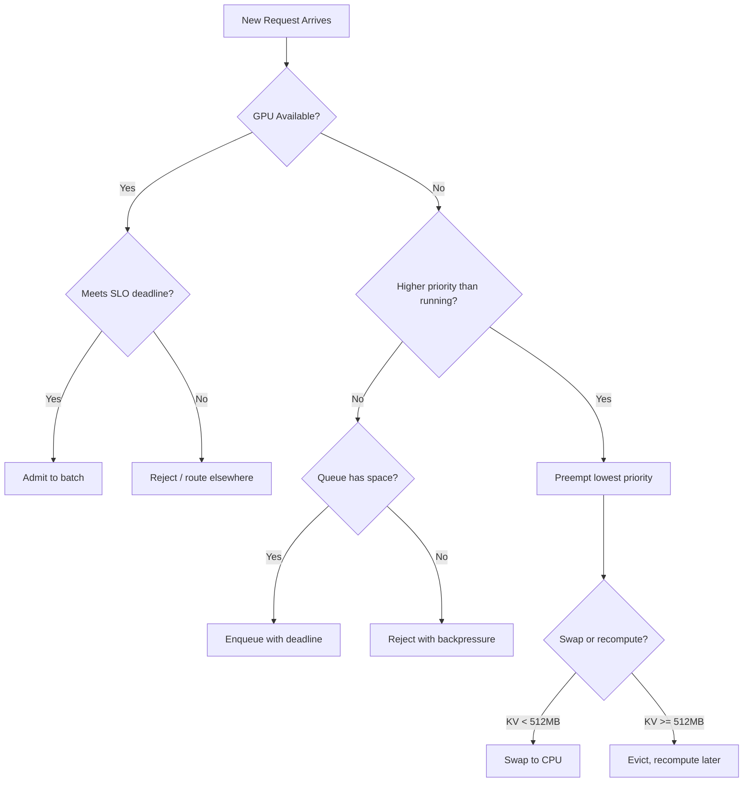

# Managing Mixed LLM Inference Workloads on Shared Infrastructure

Production LLM inference fleets do not serve a single workload. They serve chatbots demanding sub-200ms time-to-first-token, batch summarization jobs processing millions of documents overnight, RAG pipelines retrieving and synthesizing across 32K-token contexts, code completion engines racing against developer keystrokes, and voice assistants where every 50ms of added latency degrades perceived naturalness. Each workload has fundamentally different characteristics: latency tolerance, context length distribution, generation length, burstiness, and business priority. The central engineering challenge of production LLM serving is not optimizing any single workload in isolation. It is multiplexing all of them onto shared GPU infrastructure while meeting every SLO simultaneously.

This chapter synthesizes patterns from Meta's Model Runner fleet (serving hundreds of billions of daily inferences across chat, feed ranking, and content moderation), Databricks' multi-tenant serving layer (handling mixed LoRA workloads at 200K+ QPS), and general industry practices for GPU fleet management. The goal is a complete framework for classifying workloads, scheduling them efficiently, isolating failures, attributing costs, and operating the fleet day-to-day.

> **Back-references**: This chapter builds directly on continuous batching (Ch03.3) which explains how requests share GPU compute within a batch, chunked prefill (Ch03.5) which shows how long prefills can be broken into smaller pieces to reduce decode stalls, disaggregated serving (Ch06.4) which separates prefill and decode into specialized pools, and inference metrics and SLOs (Ch07.4) which defines the goodput framework we use here to measure fleet efficiency.

---

## 1. Why Mixed Workloads Are the Default

A naive deployment strategy assigns one model replica per workload type: a chatbot cluster, a batch cluster, a RAG cluster. This approach fails at scale for three reasons:

**GPU utilization collapse.** Each workload has different peak hours. Chatbots peak during business hours. Batch jobs run overnight. Code completion spikes during sprint weeks. Dedicated clusters mean each pool is sized for peak but runs at 20-40% utilization during off-peak. At $2-3/hour per GPU, a 1000-GPU fleet wastes $400K-$900K monthly on idle capacity.

**Model version proliferation.** When the same foundation model serves multiple workloads (common with instruction-tuned models), dedicated clusters require N copies of the same model weights in GPU memory. A 70B parameter model at FP16 occupies 140GB. Replicating it across 4 workload clusters wastes 420GB of HBM that could serve additional concurrent requests.

**Operational overhead multiplication.** Each cluster needs independent scaling policies, monitoring dashboards, on-call runbooks, and upgrade procedures. A fleet serving 5 workload types with dedicated clusters requires 5x the operational surface area.

The industry has converged on shared fleets with workload-aware scheduling. Meta's inference platform serves all workload types from unified GPU pools. Databricks routes all customer inference requests through a shared multi-tenant layer. The question is not whether to share infrastructure, but how to share it without workload interference.

---

## 2. Workload Taxonomy

Before scheduling workloads, you must classify them. Classification drives every downstream decision: priority assignment, pool routing, preemption policy, and cost allocation.

### 2.1 Latency Sensitivity Classes

| Class | TTFT Target | ITL Target | Examples |
|-------|-------------|------------|----------|
| **Real-time** | < 200ms | < 30ms | Voice assistants, code completion, autocomplete |
| **Interactive** | < 2s | < 100ms | Chatbots, RAG Q&A, search summarization |
| **Near-real-time** | < 10s | < 200ms | Email drafting, document analysis, content moderation |
| **Batch** | < 60s | No constraint | Overnight summarization, embedding generation, eval pipelines |

The key insight is that latency sensitivity determines preemption priority. A real-time request arriving at a busy GPU must be able to interrupt batch processing, because the batch job's SLO has slack while the real-time request does not.

### 2.2 Context Length Distribution

Context length is the single strongest predictor of per-request compute cost and memory consumption:

| Category | Token Range | Memory Impact | Scheduling Impact |
|----------|-------------|---------------|-------------------|
| **Short** | < 2K tokens | < 100MB KV cache | Many can coexist in a batch |
| **Medium** | 2K-32K tokens | 100MB-1.6GB KV cache | Moderate batching, fits most GPUs |
| **Long** | 32K-128K tokens | 1.6-6.4GB KV cache | Dominates GPU memory, limits batch size to 1-4 |
| **Ultra-long** | > 128K tokens | > 6.4GB KV cache | Requires context parallelism or dedicated routing |

A 70B model with GQA (8 KV heads, 128 head dim, 80 layers) at FP16 uses:

```
KV cache per token = 2 * 8 * 128 * 80 * 2 bytes = 327,680 bytes ≈ 0.31 MB/token
```

At 128K context: 0.31 * 128,000 = 39.7 GB of KV cache alone. This single request can saturate an 80GB A100's memory.

### 2.3 Generation Length Profile

| Profile | Output Tokens | Typical Workload | Decode Compute |
|---------|--------------|------------------|----------------|
| **Terse** | 1-50 tokens | Classification, yes/no, code completion | Negligible |
| **Standard** | 50-500 tokens | Chat responses, Q&A, summaries | Moderate |
| **Verbose** | 500-4000 tokens | Long-form generation, essays, code files | Dominates total latency |
| **Streaming** | 4000+ tokens | Novel generation, report writing | Minutes of continuous decode |

Generation length matters because decode is memory-bandwidth-bound (Ch01.2). A verbose request occupying a batch slot for 30 seconds of decode starves other requests of that slot.

### 2.4 Priority Matrix

Combining these dimensions yields a priority matrix:

```
Priority = f(latency_class, business_value, user_tier)

P0 (Critical):    Real-time + revenue-generating (voice commerce, paid API)
P1 (High):        Interactive + user-facing (chatbot, search)  
P2 (Standard):    Near-real-time + internal (content moderation, safety)
P3 (Background):  Batch + deferrable (nightly summarization, eval runs)
```

Every request entering the system gets classified into this matrix. The classification drives all scheduling decisions downstream.

---

## 3. The Scheduling Problem

The core scheduling problem in mixed-workload LLM serving is: given a GPU with fixed HBM capacity and compute bandwidth, how do you admit, order, and potentially preempt requests from different priority classes to maximize fleet-wide goodput?

The following flowchart captures the decision tree every scheduler evaluation must traverse, from initial GPU availability check through preemption and eviction policy:



Notice how the 512MB threshold in the swap-vs-recompute decision connects directly to the cost analysis in §4.1 below: at ~4K tokens (1.24GB KV cache), swap and recompute costs converge. Below that threshold, swapping is fast enough to preserve invested compute. Above it, the PCIe transfer time dominates and eviction with later recompute becomes cheaper.

### 3.1 Why LLM Scheduling Is Harder Than Traditional Job Scheduling

Traditional job schedulers (Kubernetes, YARN, Mesos) allocate resources at coarse granularity (whole GPUs, CPU cores, memory chunks) and assume jobs run to completion. LLM inference breaks these assumptions:

**Dynamic memory consumption.** A request's memory footprint grows with every generated token. You cannot statically allocate memory at admission time because you don't know the output length in advance.

**Prefill-decode interference.** As covered in Ch03.5, prefill is compute-bound while decode is memory-bandwidth-bound. Running them simultaneously on the same GPU means prefill steals compute cycles from decode, causing ITL spikes for in-flight requests. This is the "prefill stall" problem.

**Head-of-line blocking.** A single 128K-context request in the prefill phase can block the entire batch for seconds. All decode-phase requests in the same batch experience latency spikes proportional to the prefill duration.

**Non-preemptible partial state.** Once a request has consumed 10GB of KV cache, preempting it means either (a) evicting that cache and re-computing it later (wasting the compute already spent), or (b) swapping it to CPU/disk (adding resume latency). Neither option is free.

### 3.2 Admission Control

The first scheduling decision is admission: should this request enter the system now, or should it wait?

```python
def admit_request(request, gpu_state):
    """Admission control for mixed-workload scheduler."""
    
    # Estimate memory requirement
    estimated_kv_memory = (
        request.input_length + request.max_output_length
    ) * KV_BYTES_PER_TOKEN
    
    available_memory = gpu_state.total_hbm - gpu_state.used_hbm
    
    # Hard constraint: must fit in memory
    if estimated_kv_memory > available_memory:
        if request.priority <= P1 and can_preempt(gpu_state, estimated_kv_memory):
            preempt_lowest_priority(gpu_state, estimated_kv_memory)
        else:
            return QUEUE  # Wait for memory to free up
    
    # Soft constraint: batch interference
    if gpu_state.active_prefills > 0 and request.is_latency_sensitive():
        if request.priority == P0:
            return ADMIT_TO_DECODE_POOL  # Route to disaggregated decode
        else:
            return QUEUE_UNTIL_PREFILL_COMPLETE
    
    return ADMIT
```

The key parameters for admission control:

- **Memory headroom**: Reserve 10-20% of HBM as buffer for output token growth beyond estimates
- **Batch size ceiling**: Limit concurrent requests per GPU to prevent memory-bandwidth saturation (typically 32-128 for decode, 1-4 for prefill)
- **Prefill concurrency limit**: At most 1-2 concurrent prefills per GPU to bound interference

### 3.3 Request Queuing Strategies

Once a request is queued (not immediately admitted), the queuing strategy determines service order:

**Strict priority queue (SPQ):** Always serve highest priority first. Simple but causes starvation: batch jobs may never run during peak hours.

**Weighted fair queuing (WFQ):** Assign bandwidth shares proportional to priority weights. P0 gets 40%, P1 gets 30%, P2 gets 20%, P3 gets 10%. Prevents starvation but may violate tight SLOs during bursts.

**Deadline-aware scheduling:** Each request carries a deadline (derived from its SLO). Schedule the request whose deadline is nearest. This naturally prioritizes real-time requests (tight deadlines) while still serving batch requests (loose deadlines) when there's slack.

```python
class DeadlineAwareScheduler:
    """Schedule by earliest deadline, with priority tiebreaking."""
    
    def next_request(self, queue):
        now = time.time()
        
        # Filter to requests that can still meet their deadline
        feasible = [r for r in queue if r.deadline > now + r.estimated_latency]
        
        if not feasible:
            # All deadlines blown -- serve highest priority to minimize damage
            return max(queue, key=lambda r: r.priority)
        
        # Among feasible requests, pick earliest deadline
        # Tiebreak by priority (higher priority wins)
        return min(feasible, key=lambda r: (r.deadline, -r.priority))
```

Production systems typically use a hybrid: strict priority for P0 (never delayed), deadline-aware for P1-P2, and opportunistic for P3 (only when spare capacity exists).

**Worked example: 5 requests under each strategy.** Consider these requests arriving simultaneously at a scheduler with capacity for one at a time:

| Request | Priority | Deadline | Tokens | SPQ Order | WFQ Order | Deadline Order |
|---------|----------|----------|--------|-----------|-----------|----------------|
| A | P0 (critical) | 200ms | 50 | 1st | 1st | 1st |
| B | P1 (interactive) | 2s | 200 | 3rd | 2nd | 3rd |
| C | P0 (critical) | 150ms | 100 | 2nd | 3rd | 2nd (tighter deadline) |
| D | P2 (batch) | 60s | 2000 | 5th | 4th | 5th |
| E | P1 (interactive) | 1s | 80 | 4th | 5th | 4th |

Key observations: SPQ orders A before C (same priority, FIFO tiebreak) while deadline-aware flips them (C's 150ms deadline is tighter than A's 200ms). WFQ interleaves priorities based on token-weighted fairness, giving B (200 tokens, P1) a slot before C (100 tokens, P0) to prevent P0 from monopolizing bandwidth. In practice, the hybrid approach uses SPQ semantics for P0 (A and C always first, ordered by deadline), then deadline-aware for the rest.

---

## 4. Priority Queues and Preemption

When a P0 request arrives and all GPUs are fully utilized, something must give. This is the preemption problem.

### 4.1 Preemption Mechanisms in vLLM

vLLM implements two preemption strategies (selectable via configuration):

**Recompute preemption:** Evict the lowest-priority request's KV cache entirely. When the preempted request resumes, it re-runs prefill from scratch. This wastes compute but frees memory immediately.

**Swap preemption:** Copy the preempted request's KV cache from GPU HBM to CPU DRAM. When it resumes, swap it back. This preserves compute but adds swap latency (proportional to cache size) and consumes CPU memory.

The cost tradeoff:

```
Recompute cost = prefill_time(preempted_request.context_length)
Swap cost = transfer_time(kv_cache_size) * 2  (swap out + swap in)

# For a 4K-context request on A100 (900 GB/s HBM bandwidth):
# KV cache size ≈ 4000 * 0.31 MB ≈ 1.24 GB
# Swap out time ≈ 1.24 GB / 32 GB/s (PCIe 4.0) ≈ 39ms
# Swap in time ≈ 39ms
# Total swap cost ≈ 78ms
#
# Recompute cost ≈ 4000 tokens / 50K tokens/sec prefill rate ≈ 80ms
#
# Roughly equivalent at 4K context. Swap wins for longer contexts.
```

**Decision rule:** Swap when context > 4K tokens (recompute would be expensive). Recompute when context < 4K tokens (fast to redo, saves CPU memory).

### 4.2 Preemption Cascades

A dangerous failure mode: preempting request A frees memory for request B, but B's generation grows beyond estimates, triggering preemption of request C, which cascades further. This "preemption storm" can destabilize the entire fleet.

Mitigation strategies:

1. **Preemption budget:** Limit preemptions to N per GPU per minute. If budget exhausted, reject new requests instead.
2. **Hysteresis:** Only preempt if memory pressure exceeds threshold for >500ms (not transient spikes).
3. **Priority gap requirement:** Only preempt if the arriving request's priority is at least 2 levels higher than the victim. P0 can preempt P2/P3, but P1 cannot preempt P2.

### 4.3 Preemption-Aware Admission

Smart admission control considers preemption cost before admitting:

```python
def should_admit_with_preemption(new_request, gpu_state):
    """Only preempt if net goodput improves."""
    
    victims = select_preemption_victims(gpu_state, new_request.memory_need)
    
    # Calculate goodput impact
    victim_remaining_value = sum(
        v.tokens_generated / v.total_expected_tokens * v.priority_weight
        for v in victims
    )
    
    new_request_value = new_request.priority_weight
    preemption_waste = sum(compute_cost(v) for v in victims)
    
    # Only preempt if new request value exceeds lost value + waste
    return new_request_value > victim_remaining_value + preemption_waste
```

This prevents the pathological case where a P1 request preempts a P2 request that is 95% complete, wasting most of the compute already invested.

---

## 5. Workload Isolation Strategies

Isolation prevents one workload class from degrading another. Three strategies exist, each with different tradeoffs:

### 5.1 Physical Isolation (Dedicated Pools)

Assign GPU pools exclusively to workload classes:

```
Pool A (100 GPUs): Real-time only (chatbot, voice, code completion)
Pool B (60 GPUs):  Interactive (RAG, search summarization)  
Pool C (40 GPUs):  Batch (nightly jobs, eval pipelines)
```

**Advantages:**
- Zero interference between classes
- Simple capacity planning per pool
- Independent scaling policies
- Failure blast radius limited to one pool

**Disadvantages:**
- Low utilization (each pool sized for peak)
- No resource sharing during off-peak
- Model weight duplication across pools
- Operational overhead (3 separate fleets)

**When to use:** When workload classes have incompatible SLOs that cannot be reconciled with priority scheduling. For example, voice assistants requiring P99 TTFT < 100ms cannot safely share GPUs with 128K-context RAG requests that occupy 40GB of HBM.

### 5.2 Logical Isolation (Priority + Preemption on Shared Pool)

All workloads share the same GPU pool, differentiated only by priority:

```
Shared Pool (200 GPUs): All workloads, priority-scheduled
  - P0 requests: guaranteed admission (preempt P2/P3 if needed)
  - P1 requests: high-priority admission (preempt P3 if needed)
  - P2 requests: best-effort (queued during peak)
  - P3 requests: opportunistic (only when spare capacity)
```

**Advantages:**
- Maximum utilization (all GPUs available to all workloads)
- Automatic load balancing across workload types
- Single operational surface
- Natural work conservation (idle capacity serves batch)

**Disadvantages:**
- Preemption overhead (P3 jobs may restart repeatedly during peak)
- Tail latency harder to guarantee (interference still possible)
- Complex monitoring (must track per-class SLOs on shared infra)
- Risk of priority inversion bugs

**When to use:** When workload classes have overlapping peak hours and the utilization gain from sharing justifies preemption complexity. Most production systems use this approach with guardrails.

### 5.3 Time-Sharing (Temporal Isolation)

Reserve GPU capacity by time window:

```
00:00 - 06:00: Batch window (P3 gets 80% of fleet, P0-P2 get 20%)
06:00 - 22:00: Interactive window (P0-P1 get 70%, P2 gets 20%, P3 gets 10%)
22:00 - 00:00: Transition window (gradual rebalance)
```

**Advantages:**
- Predictable capacity for batch jobs (guaranteed completion window)
- Reduced preemption during batch window (fewer high-priority arrivals)
- Simple to reason about and monitor

**Disadvantages:**
- Rigid (can't adapt to unexpected demand patterns)
- Wasted capacity if batch jobs finish early
- Requires accurate demand forecasting per time window

**When to use:** When batch workloads have firm completion deadlines (e.g., "all documents must be summarized before 6 AM for morning reports") and peak interactive hours are predictable.

### 5.4 Hybrid Approach (Industry Standard)

Production fleets typically combine all three:

```
┌─────────────────────────────────────────────────────────┐
│  Fleet: 500 GPUs total                                   │
├─────────────────────────────────────────────────────────┤
│  Reserved Pool (50 GPUs): Voice/P0 only                  │
│    - Physical isolation for strictest SLOs               │
│    - Never shared, never preempted                       │
│                                                          │
│  Shared Pool (400 GPUs): P1-P3, priority-scheduled       │
│    - Logical isolation via priority queues                │
│    - P3 batch jobs preemptible                           │
│    - Burst overflow from Reserved Pool                   │
│                                                          │
│  Spot Pool (50 GPUs): Batch only, interruptible          │
│    - Time-shared (active only during off-peak)           │
│    - Spot instances (70% cost savings)                   │
│    - Jobs must be checkpoint-able                        │
└─────────────────────────────────────────────────────────┘
```

This hybrid achieves the strictest SLOs (reserved pool), high utilization (shared pool), and cost efficiency (spot pool) simultaneously.

---

## 6. Disaggregated Serving for Mixed Workloads

Chapter 06.4 introduced disaggregated serving: separating prefill (compute-bound) and decode (memory-bandwidth-bound) into distinct GPU pools. For mixed workloads, disaggregation provides a natural isolation boundary.

### 6.1 Routing by Workload Class

```
                    ┌──────────────┐
                    │   Router     │
                    └──────┬───────┘
                           │
              ┌────────────┼────────────┐
              │            │            │
              ▼            ▼            ▼
     ┌────────────┐ ┌──────────┐ ┌──────────────┐
     │ Prefill    │ │ Decode   │ │ Batch Prefill │
     │ Pool (A100)│ │ Pool     │ │ Pool (H100)   │
     │ 80 GPUs   │ │ (A100)   │ │ 40 GPUs       │
     │            │ │ 120 GPUs │ │               │
     └────────────┘ └──────────┘ └──────────────┘
```

**Routing rules:**

- **Real-time (P0):** Prefill on dedicated fast prefill nodes → immediate KV transfer → decode on reserved decode slots
- **Interactive (P1):** Standard prefill → decode pool with priority admission
- **Batch (P3):** Batch prefill pool (high throughput, no latency target) → decode when slots available

### 6.2 KV Cache Transfer Optimization

The critical path in disaggregated serving is transferring KV cache from prefill to decode nodes. For mixed workloads, transfer priority matters:

```python
class KVTransferScheduler:
    """Priority-aware KV cache transfer between prefill and decode pools."""
    
    def schedule_transfer(self, completed_prefills):
        # Sort by priority (P0 first), then by deadline proximity
        sorted_prefills = sorted(
            completed_prefills,
            key=lambda p: (p.priority, p.deadline - time.time())
        )
        
        for prefill in sorted_prefills:
            kv_size = prefill.context_length * KV_BYTES_PER_TOKEN
            
            # P0: use RDMA direct transfer (lowest latency)
            if prefill.priority == 0:
                self.rdma_transfer(prefill, decode_node=self.nearest_decode_node())
            
            # P1-P2: use NVLink if same-node, else TCP
            elif prefill.priority <= 2:
                self.standard_transfer(prefill)
            
            # P3: batch transfers (accumulate, send in bulk)
            else:
                self.batch_queue.append(prefill)
                if len(self.batch_queue) >= BATCH_TRANSFER_THRESHOLD:
                    self.bulk_transfer(self.batch_queue)
                    self.batch_queue.clear()
```

### 6.3 When Disaggregation Hurts

Disaggregation is not universally beneficial for mixed workloads. It hurts when:

1. **Short-context real-time requests dominate.** If 90% of traffic is <1K token chatbot queries, the prefill is trivially fast (2-5ms). The KV transfer overhead (1-5ms over network) adds more latency than co-located prefill+decode would.

2. **Network becomes the bottleneck.** Transferring KV caches for 32K+ context requests at high QPS can saturate inter-node bandwidth. A 32K request generates ~10GB of KV cache: at 100 Gbps network, transfer takes 800ms.

3. **Fleet is small.** Disaggregation requires at least 2x the operational complexity (two pool types, transfer infrastructure, routing logic). Below ~50 GPUs, the overhead exceeds the benefit.

**Decision framework:**

```
Use disaggregated if:
  - Mixed workload with >20% long-context (>8K tokens) requests
  - AND fleet size > 50 GPUs
  - AND P0 latency SLO < 200ms TTFT
  - AND inter-node bandwidth > 200 Gbps (InfiniBand/NVLink)

Use co-located if:
  - Predominantly short-context requests
  - OR fleet size < 50 GPUs
  - OR network bandwidth < 100 Gbps
```

---

## 7. Cost Allocation and Chargeback

When multiple teams share a GPU fleet, cost attribution becomes essential for budgeting, capacity planning, and incentive alignment.

### 7.1 Cost Metrics

Three common cost attribution models:

**Per-request pricing:**
```
cost_per_request = base_cost + (input_tokens * input_rate) + (output_tokens * output_rate)

# Example rates (approximate, based on cloud pricing):
# Input: $0.001 per 1K tokens
# Output: $0.003 per 1K tokens (3x input due to sequential decode cost)
```

Simple but unfair: a 128K-context request costs the same as a 1K-context request under flat per-request pricing.

**Per-token pricing (most common):**
```
cost = input_tokens * input_price + output_tokens * output_price

# Accounts for asymmetric compute:
# Prefill: parallel, compute-bound → cheaper per token
# Decode: sequential, bandwidth-bound → more expensive per token
```

This is what OpenAI, Anthropic, and other API providers use. It aligns cost with actual resource consumption.

**Per-GPU-second pricing (most accurate):**
```
cost = gpu_seconds_consumed * gpu_hourly_rate / 3600

# GPU-seconds includes:
# - Prefill compute time
# - Decode time (proportional to output length)
# - Memory occupancy time (KV cache holding GPU memory)
# - Queue wait time (optionally, to incentivize efficient prompts)
```

Most accurate but hardest to measure. Requires per-request GPU utilization tracking.

### 7.2 SLO-Weighted Cost

A sophisticated model weights cost by SLO tier:

```python
def calculate_slo_weighted_cost(request, actual_gpu_seconds):
    """Higher SLO guarantees cost more (you pay for priority)."""
    
    slo_multipliers = {
        "P0_realtime": 3.0,    # 3x premium for guaranteed <200ms
        "P1_interactive": 1.5,  # 1.5x for <2s guarantee
        "P2_standard": 1.0,    # Base rate
        "P3_batch": 0.4,       # 60% discount for preemptible/deferrable
    }
    
    base_cost = actual_gpu_seconds * GPU_HOURLY_RATE / 3600
    return base_cost * slo_multipliers[request.slo_class]
```

This creates the right incentives: teams that don't need strict latency choose P3 and save 60%. Teams requiring P0 pay a premium that funds the reserved capacity.

### 7.3 Cost Allocation Dashboard

A production cost allocation system tracks:

| Metric | Granularity | Purpose |
|--------|-------------|---------|
| GPU-seconds consumed | Per team, per model, per hour | Capacity billing |
| Tokens processed | Per request class | Usage tracking |
| SLO attainment | Per team, P50/P95/P99 | Quality of service |
| Preemption events | Per victim team | Fairness monitoring |
| Queue wait time | Per priority class | Capacity adequacy |
| Cost per successful request | Per team | Efficiency metric |

Teams that generate excessive preemptions for others (by consuming disproportionate long-context requests) can be charged a "interference tax" to internalize the externality.

---

## 8. Fleet Right-Sizing

### 8.1 Capacity Planning Framework

Fleet sizing for mixed workloads requires modeling each workload class independently, then optimizing the joint allocation:

```python
def size_fleet(workload_forecasts, slo_targets, gpu_specs):
    """
    Determine GPU count per pool to meet all SLOs at minimum cost.
    
    Args:
        workload_forecasts: dict of {class: (peak_qps, avg_context_len, avg_gen_len)}
        slo_targets: dict of {class: (ttft_p99, itl_p99)}
        gpu_specs: (hbm_gb, compute_tflops, bandwidth_tb_s)
    """
    
    total_gpus = 0
    
    for wclass, (peak_qps, ctx_len, gen_len) in workload_forecasts.items():
        # Compute per-request GPU time
        prefill_time = ctx_len / prefill_throughput(gpu_specs)
        decode_time = gen_len * itl_target(slo_targets[wclass])
        request_gpu_time = prefill_time + decode_time
        
        # Memory constraint: max concurrent requests per GPU
        kv_per_request = ctx_len * KV_BYTES_PER_TOKEN
        max_concurrent = (gpu_specs.hbm_gb * 1e9 - MODEL_MEMORY) / kv_per_request
        
        # Throughput constraint: requests/sec per GPU
        throughput_per_gpu = min(
            max_concurrent / request_gpu_time,  # Memory-limited
            gpu_specs.bandwidth / (kv_per_request * gen_len)  # Bandwidth-limited
        )
        
        # GPUs needed for this workload at peak
        gpus_needed = math.ceil(peak_qps / throughput_per_gpu)
        
        # Add headroom for bursts (20%) and failures (10%)
        gpus_with_buffer = math.ceil(gpus_needed * 1.3)
        
        total_gpus += gpus_with_buffer
    
    # Sharing discount: workloads with non-overlapping peaks share capacity
    sharing_factor = calculate_sharing_factor(workload_forecasts)
    
    return math.ceil(total_gpus * sharing_factor)
```

### 8.2 Burst Buffer Sizing

The burst buffer must absorb traffic spikes without violating SLOs. Size it based on historical burst patterns:

```
burst_buffer_gpus = peak_sustained_load * (burst_ratio - 1.0) * burst_duration / drain_rate

# Example:
# Peak sustained: 100 GPUs worth of load
# Burst ratio: 2x (traffic doubles during spikes)  
# Burst duration: 5 minutes
# Drain rate: 1.2x (burst drains over 6 minutes at full capacity)
# Buffer = 100 * 1.0 * 300s / (1.2 * 300s) = 83 GPUs
```

In practice, autoscaling handles sustained load changes while the burst buffer handles transient spikes (faster than autoscaling can react, typically 2-5 minutes).

### 8.3 Spot vs. Reserved vs. On-Demand Mix

| Instance Type | Cost | Availability | Best For |
|---------------|------|--------------|----------|
| Reserved (1-3yr) | 40-60% discount | Guaranteed | Baseline load (P0, P1) |
| On-demand | Full price | Guaranteed | Burst buffer, peak hours |
| Spot | 60-90% discount | Interruptible | Batch (P3), off-peak processing |

**Optimal mix for a 500-GPU fleet:**
```
Reserved: 200 GPUs (40%) - covers 24/7 baseline for P0+P1
On-demand: 200 GPUs (40%) - covers peak interactive hours
Spot: 100 GPUs (20%) - batch processing, checkpointable jobs only

Monthly cost comparison:
  All on-demand: 500 * $2.50/hr * 730hr = $912,500
  Optimized mix: (200*$1.25 + 200*$2.50 + 100*$0.50) * 730 = $583,750
  Savings: 36% ($328,750/month)
```

---

## 9. Operational Patterns

### 9.1 Graceful Degradation

When demand exceeds capacity, degrade gracefully by shedding load in priority order:

```python
class GracefulDegradation:
    """Progressive load shedding under pressure."""
    
    LEVELS = [
        # Level 0: Normal operation
        {"action": "none", "trigger": "utilization < 80%"},
        
        # Level 1: Reduce batch throughput
        {"action": "pause_p3_admission", "trigger": "utilization > 80%"},
        
        # Level 2: Throttle interactive
        {"action": "rate_limit_p2_to_50pct", "trigger": "utilization > 90%"},
        
        # Level 3: Queue P1 requests
        {"action": "queue_p1_with_timeout", "trigger": "utilization > 95%"},
        
        # Level 4: Emergency - P0 only
        {"action": "reject_all_non_p0", "trigger": "utilization > 98%"},
    ]
    
    def evaluate(self, fleet_utilization):
        for level in reversed(self.LEVELS):
            if self.trigger_met(level["trigger"], fleet_utilization):
                self.apply(level["action"])
                self.alert(f"Degradation level: {level}")
                break
```

Key principle: **shed batch first, interactive second, real-time never.** A batch job delayed by 10 minutes has zero user impact. A chatbot request dropped loses a customer.

### 9.2 Canary Rollouts for Model Updates

When deploying a new model version to a mixed-workload fleet, canary progressively:

```
Stage 1 (1 hour):   5% of P3 batch traffic → new model
Stage 2 (2 hours):  25% of P3 + 5% of P2 → new model
Stage 3 (4 hours):  100% of P3 + 25% of P2 + 5% of P1 → new model
Stage 4 (8 hours):  All P2-P3 + 25% of P1 + 5% of P0 → new model
Stage 5 (24 hours): Full rollout
```

Rollback trigger: any SLO violation in the canary cohort that exceeds 2x the baseline rate.

Why start with P3: batch jobs are the most tolerant of quality regressions (output verified in bulk later) and have the loosest SLOs. Any latency regression or accuracy drop surfaces before affecting user-facing traffic.

### 9.3 A/B Testing on Shared Infrastructure

Running A/B tests (comparing model versions) on shared infrastructure requires traffic isolation:

```python
class ABTestRouter:
    """Route requests to model variants without cross-contamination."""
    
    def route(self, request):
        # Deterministic assignment based on user ID
        variant = hash(request.user_id) % 100
        
        if variant < self.experiment.traffic_percentage:
            model = self.experiment.treatment_model
        else:
            model = self.experiment.control_model
        
        # Ensure both variants get same priority/scheduling
        # (no confounding from one variant getting better GPU slots)
        request.scheduling_hints["ab_test"] = self.experiment.id
        request.scheduling_hints["variant"] = "treatment" if variant < self.experiment.traffic_percentage else "control"
        
        return model
```

Critical: both variants must receive identical scheduling treatment. If the treatment model is deployed on newer GPUs (faster), the performance difference confounds the quality comparison.

### 9.4 Capacity Reservation for Maintenance

GPU fleet maintenance (driver updates, firmware patches, hardware replacements) requires taking nodes offline without violating SLOs:

```
Maintenance budget: 5% of fleet at any time (25 of 500 GPUs)
Drain procedure:
  1. Stop admitting new requests to target node
  2. Wait for in-flight requests to complete (timeout: 60s)
  3. Preempt remaining P3 requests (they will retry elsewhere)
  4. Force-kill if any request exceeds 120s drain timeout
  5. Mark node as maintenance, proceed with update
  6. Warm up (load model weights) and rejoin pool
```

---

## 10. Monitoring Mixed Workloads

### 10.1 Per-Class SLO Dashboards

The cardinal sin of mixed-workload monitoring is tracking aggregate metrics. An "average TTFT of 500ms" means nothing if P0 requests are at 100ms and P3 requests are at 5000ms. Always decompose by workload class:

| Metric | P0 Target | P1 Target | P2 Target | P3 Target |
|--------|-----------|-----------|-----------|-----------|
| TTFT P50 | < 100ms | < 500ms | < 2s | < 10s |
| TTFT P99 | < 200ms | < 2s | < 10s | < 60s |
| ITL P50 | < 20ms | < 50ms | < 100ms | N/A |
| ITL P99 | < 50ms | < 150ms | < 300ms | N/A |
| Goodput | > 99.9% | > 99.5% | > 99% | > 95% |
| Preemption rate | 0% | < 1% | < 5% | < 20% |

### 10.2 Interference Detection

Detect when one workload class degrades another:

```python
class InterferenceDetector:
    """Detect cross-workload interference on shared GPUs."""
    
    def check(self, metrics_window):
        for gpu in self.fleet:
            # Check if P0 latency correlates with P3 batch presence
            p0_latencies = gpu.get_latencies(priority=0, window=metrics_window)
            p3_presence = gpu.get_occupancy(priority=3, window=metrics_window)
            
            correlation = pearson_correlation(p0_latencies, p3_presence)
            
            if correlation > 0.6:  # Strong positive correlation
                self.alert(
                    f"GPU {gpu.id}: P0 latency correlates with P3 occupancy "
                    f"(r={correlation:.2f}). Consider tighter preemption or "
                    f"physical isolation for P0 traffic."
                )
```

### 10.3 Fleet Efficiency Metrics

Beyond per-class SLOs, track fleet-wide efficiency:

- **Aggregate goodput**: Total useful tokens generated per GPU-hour across all classes
- **Utilization by class**: What fraction of GPU-time serves each priority class
- **Preemption waste**: GPU-seconds spent on work that was later preempted (pure waste)
- **Queue pressure**: Average queue depth per class (leading indicator of under-provisioning)
- **Cost efficiency**: $/useful-token across the fleet (should decrease as utilization improves)

---

## 11. Mental Model

A shared LLM inference fleet is a multiplexer. Your job is not to optimize latency for chatbots, or throughput for batch jobs, or cost for the finance team. Your job is to maximize goodput across ALL workload classes simultaneously. This means:

1. **No workload class should starve.** Even P3 batch jobs must make progress, or teams will build shadow infrastructure to route around your fleet (defeating the purpose of sharing).

2. **Preemption is a feature, not a bug.** It is how the system dynamically reallocates scarce GPU memory from low-value to high-value work. But preemption without accounting creates resentment. Track preemption events, attribute them, and ensure preempted work gets priority resumption.

3. **Cost signals drive behavior.** If P0 is free, every team will claim P0 priority. If P3 is too expensive, teams will under-provision batch capacity and create shadow cron jobs. Price each tier to reflect its true cost (including the opportunity cost of reserved capacity).

4. **The fleet is never "done."** Workload mixes shift seasonally, model sizes grow quarterly, and new use cases emerge monthly. Build the scheduling and isolation systems to be tunable without redeployment. Use configuration-driven policies, not hard-coded rules.

The ultimate measure of a well-run mixed-workload fleet: every team gets their SLOs met, utilization exceeds 70%, and the infrastructure team sleeps through the night.

---

## Summary

| Concept | Key Insight | Chapter Reference |
|---------|-------------|-------------------|
| Workload taxonomy | Classify by latency sensitivity + context length + priority | This chapter §2 |
| Scheduling | Deadline-aware with strict P0 priority override | This chapter §3 |
| Preemption | Swap for long context, recompute for short; budget preemptions | This chapter §4, Ch03.3 |
| Isolation | Hybrid: reserved P0 pool + shared priority pool + spot batch pool | This chapter §5, Ch06.4 |
| Disaggregation | Route by workload class to prefill/decode pools | This chapter §6, Ch06.4 |
| Cost allocation | Per-token with SLO multiplier creates correct incentives | This chapter §7 |
| Fleet sizing | Model each class, apply sharing factor, add burst buffer | This chapter §8 |
| Operations | Shed batch first, canary from P3 up, maintain 5% buffer | This chapter §9 |
| Monitoring | Always decompose by class; aggregate metrics hide problems | This chapter §10, Ch07.4 |

The shared fleet is the economic backbone of production LLM serving. Master these patterns, and you can serve every workload class at lower cost and higher quality than any dedicated deployment could achieve alone.
