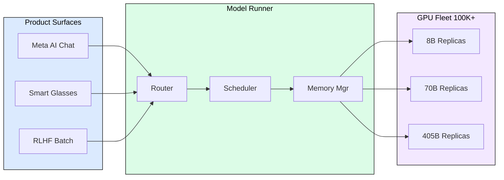
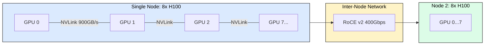
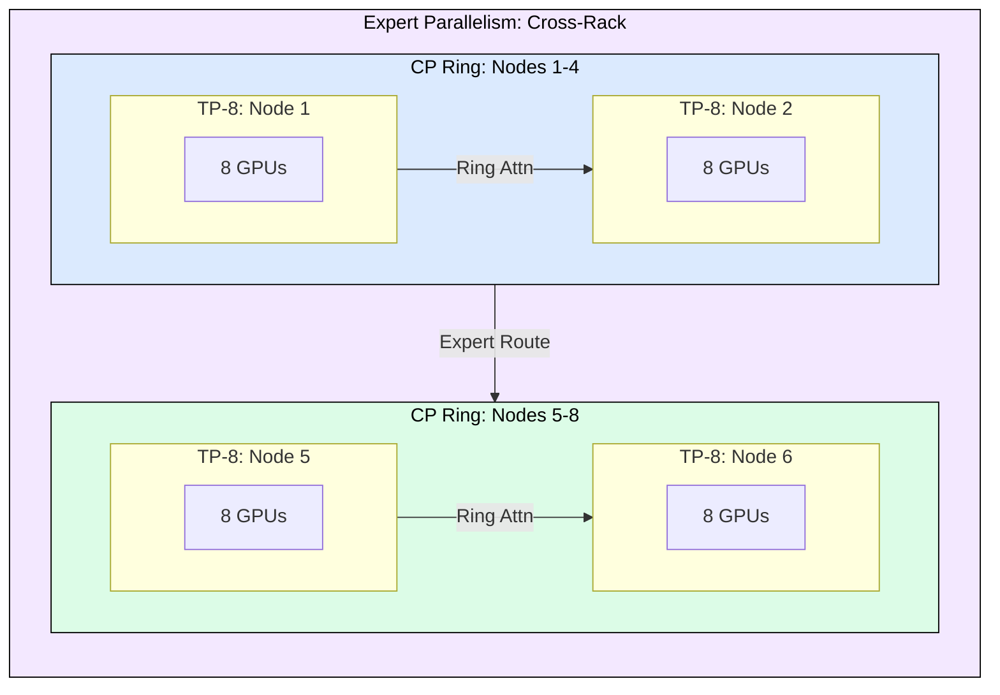
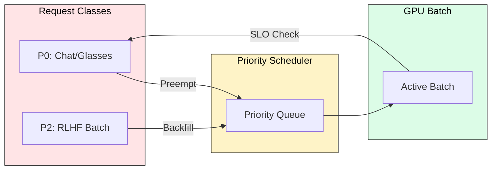

# 9.1 Meta's Inference Platform

Meta serves billions of AI interactions daily across WhatsApp, Messenger, Instagram, and Ray-Ban smart glasses. Their infrastructure runs every optimization in this book simultaneously: tensor parallelism, context parallelism, expert parallelism, continuous batching, and paged attention, all composed into a hierarchy mapped to their network topology. This module dissects how they do it.

## Model Runner: The Unified Serving Layer

Model Runner is Meta's single platform for all generative AI workloads (described in their October 2025 engineering blog). Product teams submit inference requests without knowing which GPUs handle them or how the model is sharded. Model Runner handles request routing, parallelism orchestration, memory management, SLO enforcement, and batch formation.

The unification principle transfers to any scale: one serving framework (vLLM, TensorRT-LLM, SGLang) with model-specific configs beats maintaining separate stacks per model.

## Hardware: RoCE v2 Over InfiniBand

Meta chose RoCE v2 (RDMA over Converged Ethernet) instead of InfiniBand for inter-node communication. The reasons: existing Ethernet infrastructure leverage, vendor diversity (InfiniBand is single-vendor), commodity switch economics at 100K+ scale, and software-defined congestion control (PFC + ECN). The tradeoff is more network engineering work, justified only at Meta's scale. Below 100 GPUs, InfiniBand remains pragmatic.

## Parallelism Composition Hierarchy

Meta composes three parallelism dimensions simultaneously, mapped to network bandwidth tiers:

| Dimension | Scope | Interconnect | Communication Pattern |
|-----------|-------|-------------|----------------------|
| Tensor Parallelism (TP-8) | Intra-node | NVLink 900 GB/s | AllReduce every layer |
| Context Parallelism (CP) | Inter-node | RoCE 400 Gbps | Ring attention per attn layer |
| Expert Parallelism (EP) | Cross-rack | RoCE 400 Gbps | Sparse all-to-all |

The principle: map the most communication-intensive parallelism to the highest-bandwidth interconnect. TP needs highest bandwidth (synchronous every layer), so it uses NVLink. CP needs moderate bandwidth (only during attention), so it uses inter-node RoCE. EP is bursty and latency-tolerant, so it can span racks.

## Mixed Workloads: Priority Scheduling

Meta serves radically different SLO classes on shared hardware:

| Workload | TTFT Target | ITL Target | Batch Priority |
|----------|-------------|------------|----------------|
| Meta AI Chat | < 1s | < 50ms | P0 (preemptive) |
| Smart Glasses | < 500ms | < 30ms | P0 (ultra-low) |
| RLHF Batch | Minutes OK | N/A | P2 (backfill) |

Latency-sensitive requests preempt batch workloads. RLHF absorbs spare capacity during low-traffic periods. This is the "goodput" framework from Module 7.4 in action: optimize useful work within SLO bounds, not raw throughput.

## KernelEvolve: AI-Optimized Kernels

Meta's April 2026 blog describes KernelEvolve, an agentic system that generates hardware-optimized CUDA kernels. It uses LLM reasoning to analyze existing kernels, generate variants with different tiling/memory patterns, benchmark them on target hardware, and select winners. This evolutionary loop produces 5-15% speedups per kernel, which at 100K+ GPUs translates to massive savings.

For practitioners: use Triton auto-tuning, `torch.compile(mode="max-autotune")`, or TensorRT engine building as lightweight equivalents. Never assume default kernels are optimal for your specific hardware and workload.

## MTIA: Custom Inference Silicon

Meta's custom chip (Meta Training and Inference Accelerator) targets inference-specific patterns: high memory bandwidth relative to compute, efficient INT8/INT4 execution, and low power per operation. General-purpose GPUs are over-provisioned for inference (you pay for training features you don't use). The trend (Google TPU, AWS Inferentia, Microsoft Maia) signals that inference hardware will be heterogeneous.

## What Transfers to Smaller Deployments

| Meta Approach | Your 10-GPU Version |
|---------------|---------------------|
| Model Runner | vLLM + simple load balancer |
| TP-8 + CP + EP hierarchy | TP-8 within node, no CP needed unless 128K+ context |
| RoCE v2 | InfiniBand (simpler at small scale) |
| Mixed workload scheduling | Priority queue: interactive preempts batch |
| KernelEvolve | Triton auto-tune + benchmark FA variants |
| MTIA custom silicon | Best commercial GPU available |
| Fleet monitoring | Prometheus + Grafana: TTFT, ITL, QPS, util |

The principles are identical. The implementation complexity scales with fleet size.

## FAQ

**Q: Why does Meta use Ethernet instead of InfiniBand?**
They already operate one of the world's largest Ethernet networks. Maintaining two separate network fabrics (one for AI, one for everything else) costs more than engineering lossless behavior on their existing Ethernet with PFC + ECN.

**Q: Can you use TP + CP + EP together at small scale?**
At 8-16 GPUs, you typically only need TP (within one node). CP is only necessary for 128K+ context that doesn't fit in a single node's KV cache. EP is only relevant for MoE models. Most practitioners use TP alone.

**Q: What is the cost of a GPU failure at Meta's scale?**
At 100K+ GPUs, failures are daily occurrences. Model Runner detects failures in ~500ms, drains active requests, removes the node, and rebalances. N+1 redundancy ensures no model becomes unavailable.

**Q: How does Meta handle model updates without downtime?**
Canary deployments (small % of replicas first), A/B traffic splitting, gradual rollout over hours, and instant rollback if metrics degrade. Model loading takes minutes, so rollouts are carefully staged.

**Q: Is KernelEvolve practical at smaller scale?**
Not the full agentic approach. Use Triton auto-tuning (searches tile sizes automatically), `torch.compile` with max-autotune mode, and manual profiling with Nsight Systems. These cover 90% of the kernel optimization space.

## References

1. Meta Engineering Blog, "Scaling LLM Inference: Innovations in Tensor, Context, and Expert Parallelism" (October 2025)
2. Meta Engineering Blog, "KernelEvolve: How Meta's Ranking Engineer Agent Optimizes AI Infrastructure" (April 2026)
3. Meta Engineering Blog, "RoCE networks for distributed AI training at scale" (August 2024)
4. Meta AI Blog, "Scaling AI Experiences for Billions" (June 2026)
5. Llama 3.1 Technical Report (July 2024)
