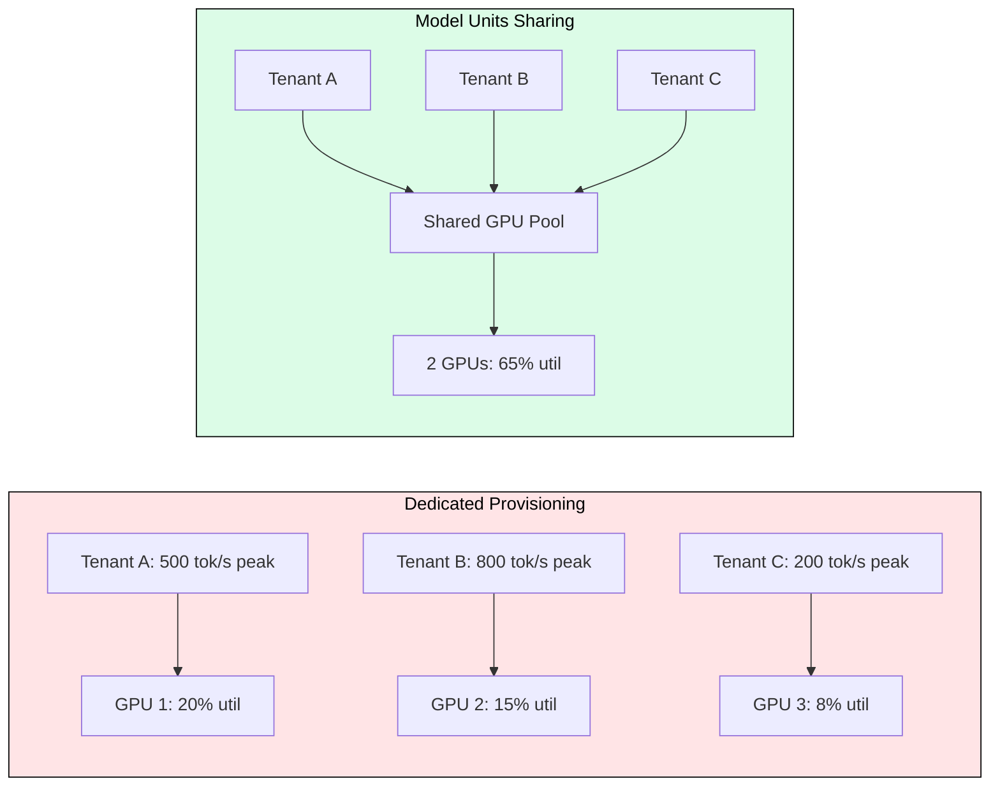
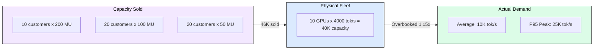
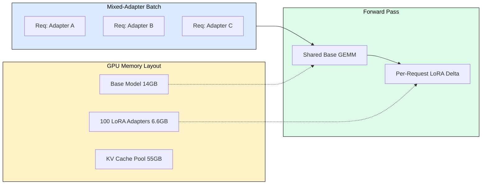
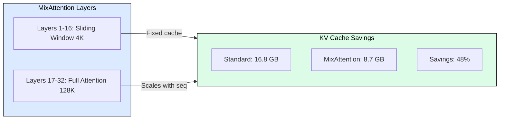

# 9.2 Databricks Multi-Tenant Serving

Databricks serves thousands of customers on a shared GPU fleet where each runs different models, generates wildly different traffic patterns, and demands different SLOs. Their solutions (Model Units, LoRA multiplexing, MixAttention) encode reusable patterns that work at 10 GPUs or 10,000. This module dissects how they achieved 200K QPS with 60% throughput gains for Superhuman.

## The Multi-Tenancy Problem

GPU inference breaks traditional multi-tenancy because: (1) a 70B model occupies an entire 8-GPU node regardless of demand, (2) request cost varies 400x (10 tokens vs 4096 tokens), and (3) KV cache creates memory reservations blocking other tenants. Naive dedicated provisioning achieves only 15-25% GPU utilization. The challenge: share GPUs while giving each tenant the illusion of dedicated capacity.

## Model Units: VM Abstraction for Inference

A Model Unit guarantees a fixed amount of inference throughput (tokens/second) regardless of fleet state. Like VMs abstract physical hardware, Model Units abstract GPU capacity into portable, schedulable units. Statistical multiplexing means not all tenants peak simultaneously, enabling overbooking (typically 1.15-1.5x) that dramatically improves utilization.

| Concept | Definition |
|---------|-----------|
| Model Unit | Guaranteed N tokens/second for a specific model |
| Overbooking | Selling more capacity than physical max (safe due to traffic variance) |
| Burst Pool | 15-20% reserved fleet capacity for handling spikes |
| Priority Classes | P0 (latency-critical), P1 (throughput), P2 (best-effort) |

## Fast LoRA Serving: Hundreds of Adapters

Many customers fine-tune the same base model with their own data, producing LoRA adapters that add only ~0.5% parameters (66 MB for rank-16 on 7B model). This makes the marginal cost of adding another tenant negligible. Requests targeting different adapters share the same batch for base model computation; only the tiny LoRA delta differs per tenant.

Key mechanisms:
- **Adapter routing**: Two-level strategy (placement layer + request routing layer)
- **Cross-adapter batching**: Base forward pass shared, LoRA delta computed per-request (< 0.5% overhead)
- **LRU eviction**: Hot adapters in HBM, warm in host DRAM (~10ms load), cold on SSD (~100ms)

## MixAttention: Hybrid Context Architecture

MixAttention uses sliding window attention in lower layers and full attention in upper layers. This reduces KV cache by ~48% for long-context requests without quality loss, because full-attention layers still capture long-range dependencies.

For 32-layer model at 128K context:
- Standard: 32 layers x full cache = 16.8 GB per request
- MixAttention: 16 sliding (4K window) + 16 full = 8.7 GB per request

This means one long-context request displaces half as many short-context requests, giving the scheduler far more placement flexibility.

## Noisy Neighbor Isolation

Multi-tenant GPU inference suffers from KV cache pressure, batch slot monopolization, and prefill interference. Databricks isolates tenants through:

1. **Per-tenant KV budgets**: Each Model Unit allocation gets guaranteed cache memory
2. **Scheduling quanta**: Fair-share batch slots per 100ms quantum
3. **Chunked prefill**: Long prompts broken into 1-2K token chunks, yielding between chunks
4. **Workload classification**: Incompatible SLO classes (real-time + batch) never co-locate

## Superhuman Case Study: 200K QPS

Databricks achieved 200K QPS with 60% throughput improvement for Superhuman (email AI) through three sources:

| Source | Gain | Mechanism |
|--------|------|-----------|
| Fleet consolidation | 25% | Statistical multiplexing across non-overlapping peak times |
| Cross-adapter batching | 20% | Mixed feature requests share base model forward pass |
| MixAttention + KV efficiency | 15% | More concurrent requests per GPU |

Fleet: ~50 A10G GPUs (small models), ~30 A100s (medium), ~20 H100s (large) = ~100 GPUs total.

## Practitioner Adoption Order

1. **Continuous batching + routing** (immediate throughput gains, low complexity)
2. **Multi-LoRA serving** if you have multiple fine-tunes (high memory savings)
3. **Priority queuing + SLO scheduling** (required for mixed workload types)
4. **Model Units + overbooking** (required for fleet utilization optimization)
5. **Custom architectures** like MixAttention (only at very large scale)

Each step captures diminishing returns. Steps 1-3 deliver 80% of efficiency with 20% of engineering effort.

## Economics: Worked Example

50 customers, 32 A100 GPUs, all using fine-tuned Llama 8B:

| Metric | Dedicated | Multi-Tenant |
|--------|-----------|--------------|
| GPUs needed | 50 | 10 |
| Avg utilization | 5% | 25% |
| Peak utilization | 100% (per tenant) | 62.5% |
| Annual cost | $1,095,000 | $219,000 |
| **Savings** | -- | **$876,000 (80%)** |

Payback on engineering investment (~$400K for 2 engineers x 6 months): 5.5 months.

## FAQ

**Q: When does multi-tenancy justify the engineering cost?**
When you serve 5+ model variants, fleet utilization is below 40%, tenants have > 5x peak-to-average ratio, or GPU spend exceeds engineering team cost.

**Q: How does overbooking handle simultaneous tenant peaks?**
Priority enforcement: each tenant gets exactly their guarantee (no burst allowance) until contention subsides. Burst pools (15-20% of fleet) absorb normal spikes.

**Q: Can you batch requests across different LoRA adapters?**
Yes. vLLM supports this natively. The base model forward pass is shared; only the rank-16 delta computation differs per request (< 0.5% of total FLOPs).

**Q: What is the cold-start penalty for scale-to-zero?**
45 seconds (small model, warm GPU) to 5+ minutes (large model, allocation queue). Serverless endpoints accept this; provisioned throughput endpoints stay in warm standby.

**Q: How does MixAttention preserve quality with sliding windows?**
Upper layers retain full attention over all tokens, preserving long-range dependency modeling. Lower sliding-window layers handle local patterns that don't need full context.

## References

1. Databricks Engineering Blog, "Reliable LLM Inference at Scale" (June 2026)
2. Databricks Engineering Blog, "Fast PEFT Serving: Hundreds of LoRA Adapters" (February 2025)
3. Databricks Engineering Blog, "MixAttention: Efficient Inference for Mixed-Context Workloads" (September 2024)
4. Sheng et al., "S-LoRA: Serving Thousands of Concurrent LoRA Adapters" (2023)
5. vLLM documentation: Multi-LoRA serving
