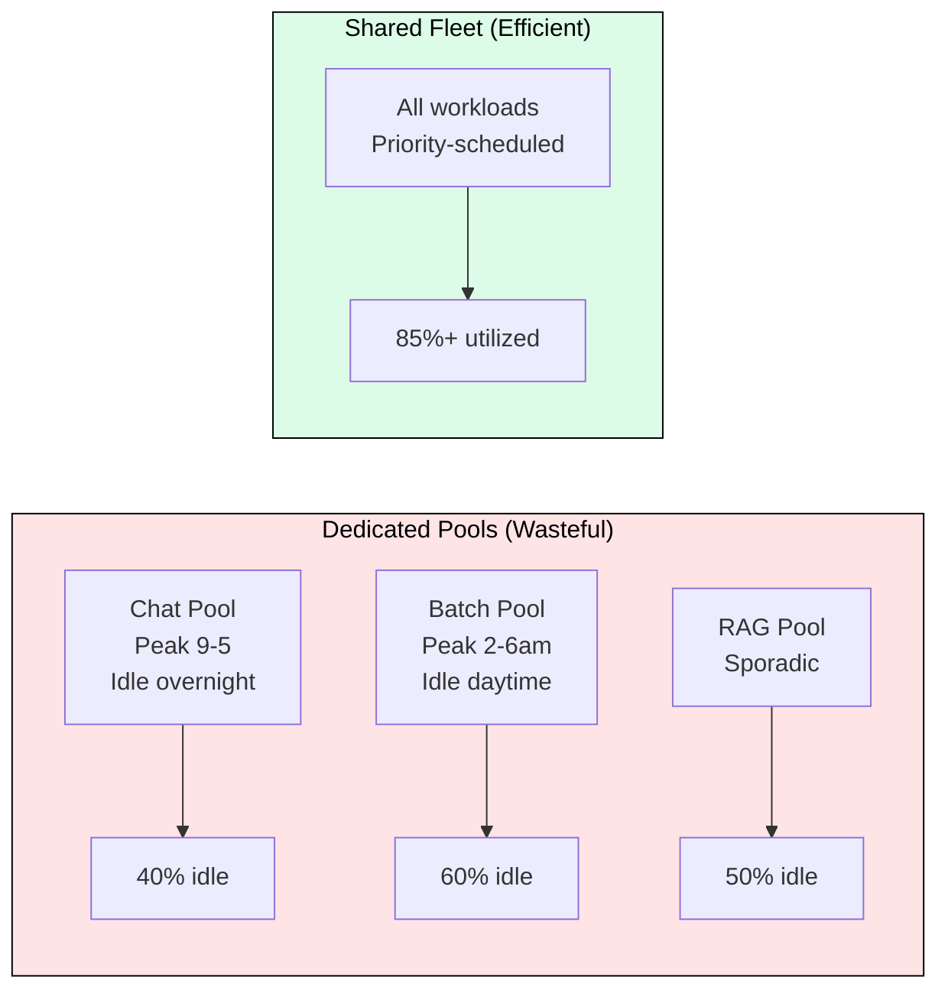
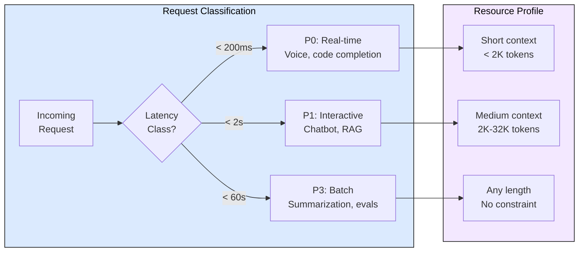
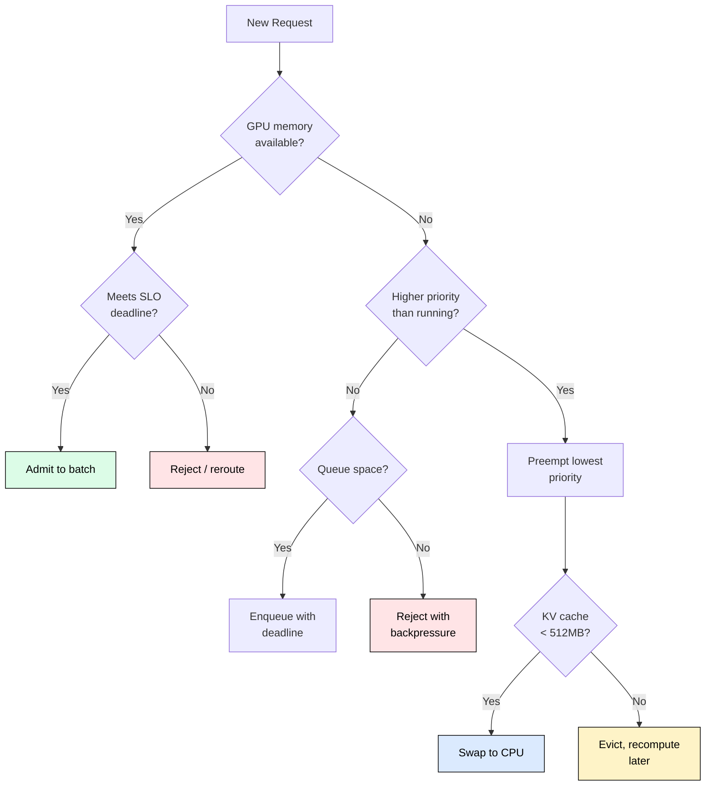
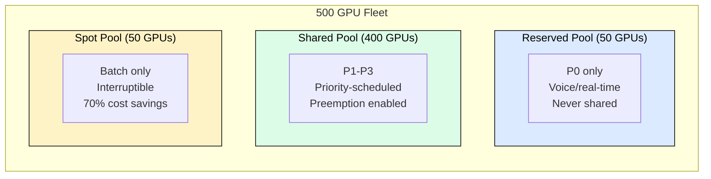

# 9.3 Mixed Workload Management

Production LLM fleets never serve one workload. Chatbots need sub-200ms TTFT, batch summarization tolerates minutes, and RAG pipelines sit in between. Multiplexing these onto shared GPUs while meeting every SLO simultaneously is the core scheduling challenge of production inference.

## Why Sharing Is Inevitable

Dedicated clusters per workload waste 60% of GPU spend. Chatbots peak during business hours, batch runs overnight, code completion spikes during sprints. Sizing each pool for peak means paying for idle capacity the rest of the time.

A 1000-GPU fleet with dedicated pools wastes $400K-$900K monthly on idle capacity. Shared fleets with priority scheduling eliminate this waste while protecting latency-sensitive workloads through preemption.

## Workload Classification

Every request entering the system gets classified along two axes: latency sensitivity and resource intensity. This classification drives scheduling, preemption, and cost allocation.

| Class | TTFT Target | ITL Target | Preemption | Examples |
|-------|-------------|------------|------------|----------|
| P0 Real-time | < 200ms | < 30ms | Never victim | Voice, autocomplete |
| P1 Interactive | < 2s | < 100ms | Rare victim | Chat, RAG |
| P2 Standard | < 10s | < 200ms | Occasional | Content moderation |
| P3 Batch | < 60s | None | Frequent | Nightly jobs, evals |

Priority determines preemption order: P0 can preempt P2/P3, P1 can preempt P3. P3 jobs accept interruption in exchange for 60% cost discount.

## Scheduling: Admission, Queuing, Preemption

The scheduler answers three questions for every request: admit now, queue, or preempt something else?

**Preemption cost tradeoff.** For a 4K-context request on A100 (PCIe 4.0 at 32 GB/s):
- KV cache size: 4000 tokens x 0.31 MB/token = 1.24 GB
- Swap cost: 1.24 GB / 32 GB/s x 2 (out + in) = 78ms
- Recompute cost: 4000 / 50K tokens/sec = 80ms

Below 4K tokens, recompute is cheaper (saves CPU memory). Above 4K, swapping preserves invested compute.

**Preemption safety.** Budget preemptions to N per GPU per minute. Require a 2-level priority gap (P0 preempts P2/P3, but P1 cannot preempt P2). Only preempt if the new request's value exceeds lost value plus waste from the victim's partial completion.

## Isolation: The Hybrid Fleet Model

Production systems combine physical isolation for the strictest SLOs with logical isolation for everything else.

Reserved pool guarantees P0 latency with zero interference. Shared pool maximizes utilization through priority scheduling. Spot pool captures batch workloads at steep discounts. The reserved pool also absorbs burst overflow from shared when P0 traffic spikes.

## Graceful Degradation

When demand exceeds capacity, shed load in priority order:

1. **80% util**: Pause P3 admission (batch jobs queue)
2. **90% util**: Throttle P2 to 50% (rate-limit standard tier)
3. **95% util**: Queue P1 with timeout (interactive waits)
4. **98% util**: P0 only (emergency, all others rejected)

Batch delayed 10 minutes has zero user impact. A chatbot request dropped loses a customer. Always shed batch first, interactive second, real-time never.

## Cost Allocation

SLO-weighted pricing creates correct incentives:

| Tier | Multiplier | Effect |
|------|-----------|--------|
| P0 Real-time | 3.0x | Funds reserved capacity |
| P1 Interactive | 1.5x | Standard premium |
| P2 Standard | 1.0x | Base rate |
| P3 Batch | 0.4x | 60% discount for preemptibility |

Teams that do not need strict latency choose P3 and save 60%. Teams requiring P0 pay a premium that funds the reserved pool. Without pricing signals, every team claims P0 priority.

## FAQ

**Q: How do you prevent P3 starvation during peak hours?**
Reserve 10% of shared pool capacity for P3 even during peak. P3 jobs make slow progress rather than zero progress. Teams that see zero throughput will build shadow infrastructure, defeating shared fleet economics.

**Q: What if preemption storms cascade?**
Budget preemptions per GPU per minute. Add hysteresis (only preempt if memory pressure sustains >500ms). Require priority gaps. If budget exhausted, reject new requests instead of cascading.

**Q: Should disaggregated serving be used for mixed workloads?**
Yes, when >20% of traffic exceeds 8K tokens and fleet size exceeds 50 GPUs. Route by priority: P0 gets dedicated fast-prefill with RDMA transfer, P3 uses batch-prefill pool optimized for throughput over latency.

**Q: How do you handle A/B tests on shared infrastructure?**
Deterministic user-ID hashing assigns variants. Both variants must receive identical scheduling treatment (same priority, same GPU pool). Otherwise performance differences confound quality comparisons.

**Q: What fleet mix minimizes cost?**
50% reserved (baseline P0+P1), 35% on-demand (peak hours), 15% spot (batch). This blend saves ~36% versus all on-demand while maintaining SLOs.

## References

1. Kwon, W. et al. "Efficient Memory Management for Large Language Model Serving with PagedAttention." SOSP 2023.
2. Zhong, Y. et al. "DistServe: Disaggregating Prefill and Decoding for Goodput-optimized Large Language Model Serving." OSDI 2024.
3. Agrawal, A. et al. "Sarathi-Serve: On-the-fly Request Splitting for Efficient LLM Inference Serving." 2024.
4. Meta. "How Meta Trains Large Language Models at Scale." Engineering Blog, 2024.
5. Databricks. "Optimizing Model Serving for Production LLMs." Technical Blog, 2024.
