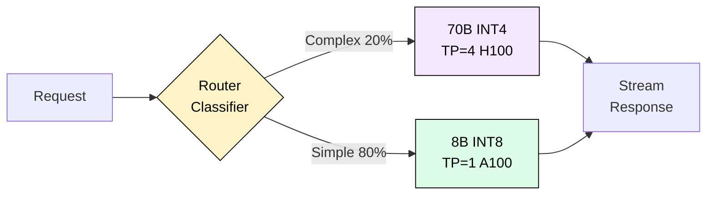
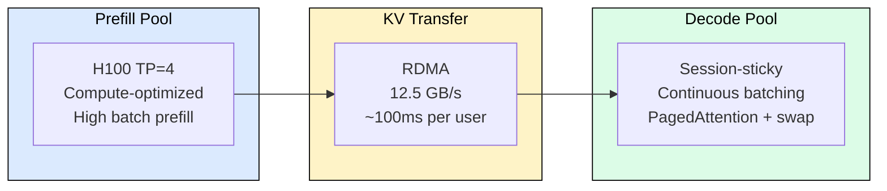
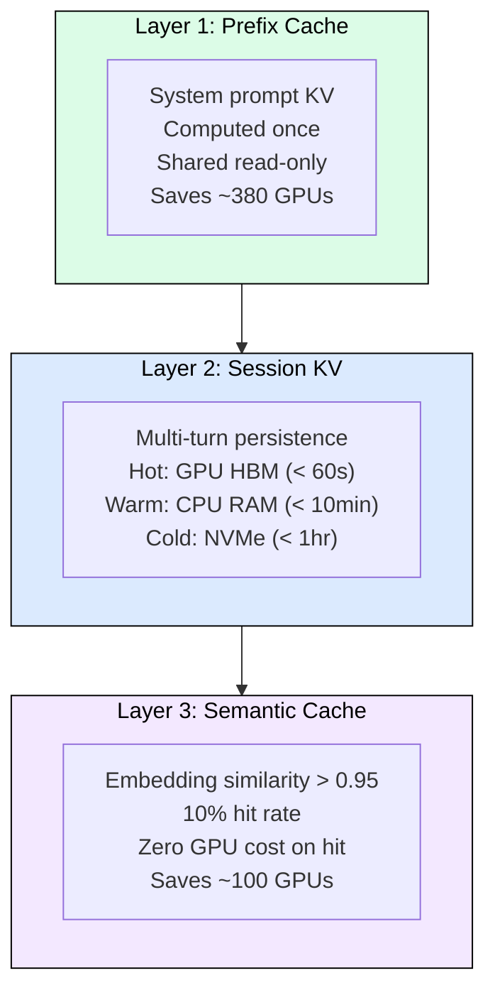

# 10.1 System Design: ChatGPT-Scale Chatbot

Design a conversational AI system serving 1M concurrent users with sub-second TTFT, smooth streaming, and cost under $0.005/conversation. Every decision draws on Chapters 00 through 09.

## Traffic Analysis

1M concurrent users with 45-second think time between turns produces ~22K requests/second. At 256 tokens per response: 5.7M tokens/second of sustained goodput required globally.

| Metric | p50 Target | p99 Target |
|--------|-----------|-----------|
| TTFT | < 300ms | < 1,000ms |
| ITL | < 50ms | < 150ms |
| End-to-end (256 tok) | < 13s | < 40s |

## Two-Tier Model Architecture

A lightweight router (distilled BERT, <5ms) classifies requests into quality or cost tier. 80% of traffic is simple Q&A handled by the 8B model; 20% needs 70B reasoning.

**Memory budgets per GPU (A100 80GB):**

| Component | 70B INT4 | 8B INT8 |
|-----------|----------|---------|
| Weights | 35 GB | 8 GB |
| KV cache pool | 38 GB | 62 GB |
| Overhead | 7 GB | 10 GB |
| Users/GPU | 25 | 100 |

## Disaggregated Prefill/Decode

Prefill is compute-bound and bursty. Decode is memory-bandwidth-bound and steady. Mixing them causes prefill stalls on decode users. Separating into pools eliminates interference.

**TP=4 for 70B latency (not capacity).** Single-GPU prefill at 4K tokens takes 571ms (exceeds TTFT target). TP=4 reduces to 143ms. Decode per token: 3.1ms (well under 50ms ITL).

## Three-Layer Caching

Session affinity gives 28x latency improvement on subsequent turns (incremental 5ms vs full 143ms re-prefill). Combined caching reduces fleet from ~1,500 to ~820 GPUs.

## Fleet Sizing and Cost

With oversubscription (only 7% of users actively generating at any instant due to think time), KV swap, and caching:

| Component | GPUs | Type | Cost/hr |
|-----------|------|------|---------|
| Quality tier | 500 | H100 | $1,750 |
| Cost tier | 600 | A100 | $1,200 |
| Spare + network | 100 | Mixed | $500 |
| **Total** | **1,200** | | **$3,450/hr** |

**Cost per conversation:** $3,450/hr serving 192M conversations/day = **$0.00043/conversation** (10x under budget).

Optimized instance mix (50% reserved, 35% on-demand, 15% spot) saves 40% further: ~$1.34M/month total.

## Failure Modes and Resilience

| Failure | Detection | Response | Recovery Time |
|---------|-----------|----------|---------------|
| Single GPU death | Health check miss | Hot spare takeover | < 30s |
| KV OOM (>95%) | Utilization monitor | Preempt idle free-tier sessions | Immediate |
| Prefill pool overload | Queue > 1000 | Circuit breaker, 503 new sessions | 2-5 min drain |
| Region partition | 3 health check misses | DNS failover, re-prefill from text | < 30s |
| Model update regression | Eval gate failure | Automatic rollback | < 5 min |

**Preemption hierarchy:** Free idle > Free active > Paid idle (swap only) > Paid active (never).

**Canary rollout:** 1% traffic x 1hr, 5% x 4hr, 25% x 12hr, 100%. Start with batch tier (most tolerant). Automated eval gates at each stage check accuracy, safety, latency, and memory regression.

## Scaling Signals

| Signal | Action | Speed |
|--------|--------|-------|
| Prefill queue > 200 | Scale prefill pool | 30-60s (pre-warmed) |
| KV util > 80% | Scale decode pool | 30-60s |
| TTFT p99 > 800ms | Emergency scale both | Immediate |
| Time-of-day model | Pre-scale 15min ahead | Proactive |

Scale-down drains gracefully (stop new sessions, wait for existing to complete in 5-10 min). Never kill active sessions.

## FAQ

**Q: Why not just use the 70B for everything?**
Cost. 70B serves 25 users/GPU vs 8B at 100 users/GPU. With 80% simple traffic on 8B, the fleet shrinks 4x for that segment. Quality routing ensures complex queries still get full reasoning.

**Q: Why disaggregate instead of chunked prefill?**
Chunked prefill (breaking long prefills into smaller pieces) reduces stalls but does not eliminate them. At 22K req/s, even small interference compounds. Disaggregation provides zero interference guarantee.

**Q: How does session affinity work with autoscaling?**
Consistent hashing on conversation_id. When instances scale out, only conversations hashing to the new instance migrate. Scaling in drains sessions naturally (no forced migration).

**Q: What happens when a user switches regions?**
KV cache is never transferred cross-region (50-100ms RTT too high). Conversation text is replicated via global database. User experiences one slow turn (full re-prefill) then normal latency.

**Q: Why 3 nines and not 4?**
Four nines requires active-active multi-region with synchronous replication, doubling cost. Three nines (8.7hr/year downtime) with fast failover is the sweet spot for a consumer product where brief degradation is acceptable.

## References

1. Kwon, W. et al. "Efficient Memory Management for Large Language Model Serving with PagedAttention." SOSP 2023.
2. Zhong, Y. et al. "DistServe: Disaggregating Prefill and Decoding for Goodput-optimized Large Language Model Serving." OSDI 2024.
3. Patel, P. et al. "Splitwise: Efficient Generative LLM Inference with Phase Splitting." ISCA 2024.
4. OpenAI. "Scaling ChatGPT Infrastructure." Engineering Blog, 2023.
5. Databricks. "Serving LLMs: Fixed vs. Auto-Scaling." Technical Blog, 2024.
