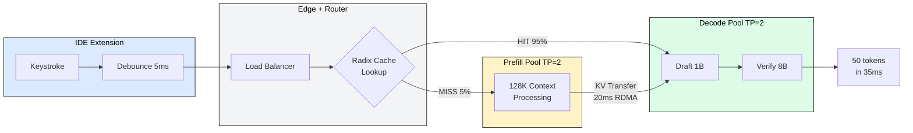
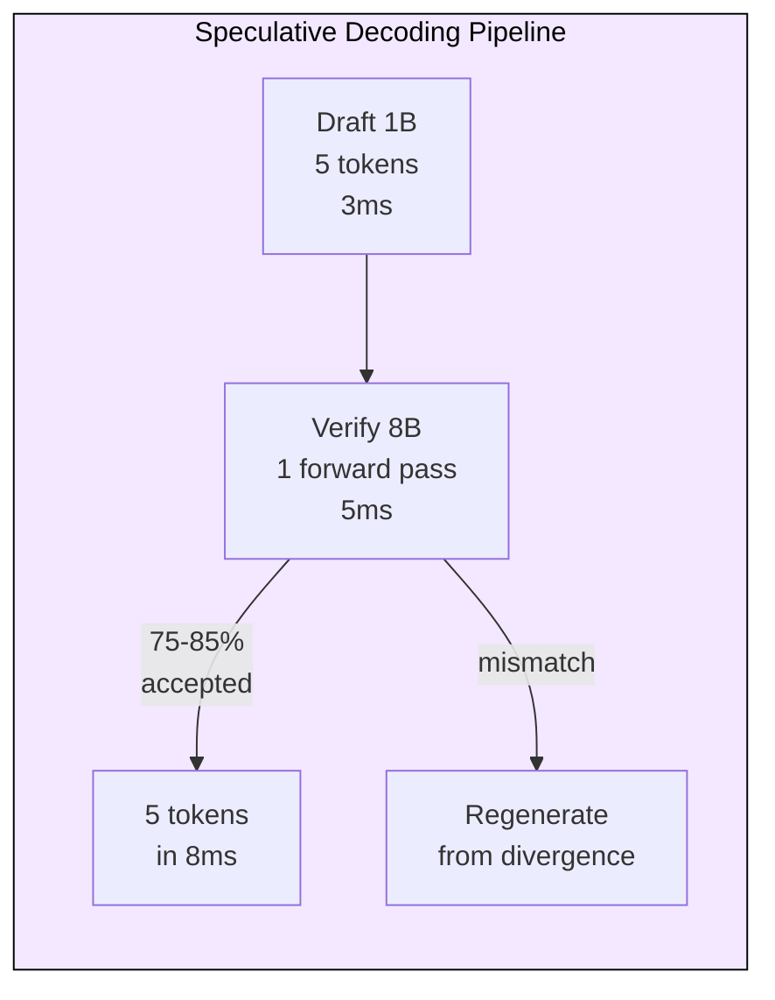
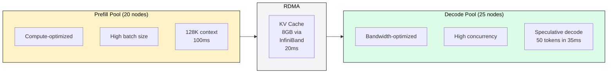
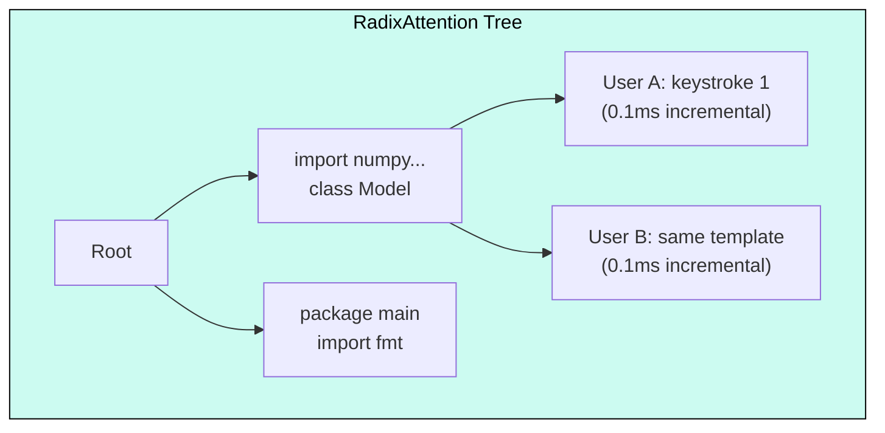

# 10.2 Code Completion Copilot

 

A code copilot must deliver suggestions in under 200ms because that is the average inter-keystroke interval for a proficient developer. Miss that window, and the suggestion arrives after the user has already typed the next character, making it worthless. This constraint makes the code copilot the most demanding LLM inference workload in production: 500M requests/day, 128K token contexts, sub-200ms TTFT, and 70% of generated tokens discarded unused.

## Why This Design Is Unique

Unlike chatbots where users tolerate 1-2s latency, code completion is speculative: the system generates completions that may never be shown. This flips the optimization target. Prefill dominates cost (128K input, 50 token output = 99%+ compute on prefill), caching delivers 10x latency reduction (successive keystrokes share 99.9% context), and model size is capped at 8B (the only class meeting the TTFT budget).

## Architecture Overview

## Requirements

| Metric | Target | Rationale |
|--------|--------|-----------|
| TTFT p50 | <100ms | Feels instantaneous at typing speed |
| TTFT p95 | <200ms | Must arrive before next keystroke |
| Total generation | <1s | Short outputs (50 tokens avg) |
| Daily requests | 500M | 10M DAU x 50 completions/user |
| Peak RPS | 17,400 | 3x sustained during morning coding bursts |
| Acceptance rate | >25% | Below this, users disable the feature |

Code completions are short (avg 50 tokens), high-rejection (75% discarded), and prefix-heavy (80% of value in first line). This means prefill dominates cost, not decode.

## Model Selection: Why Small Models Win

The 200ms TTFT budget eliminates large models entirely. At 128K context on a single H100: 70B takes 800ms (too slow), 8B takes 100ms (feasible), 1B takes 15ms (draft model).

The optimal architecture pairs a 1B draft model (DeepSeek-Coder-1.3B) with an 8B verifier (DeepSeek-Coder-V2-Lite). Code is highly predictable (syntax patterns, variable reuse), so draft acceptance rates reach 75-85%, yielding 3x decode speedup. INT8 quantization (not INT4) preserves code quality while halving memory.

## Memory Budget (2xH100, TP=2)

| Component | Per-GPU | Total |
|-----------|---------|-------|
| Model weights (8B INT8) | 4 GB | 8 GB |
| Draft model (1B FP16) | 1 GB | 2 GB |
| RadixAttention shared prefix pool | 40 GB | 80 GB |
| Per-request unique KV | 20 GB | 40 GB |
| CUDA overhead + activations | 15 GB | 30 GB |
| **Total** | **80 GB** | **160 GB** |

The key insight: 80%+ of KV cache is shared across users editing the same file or using the same libraries. RadixAttention exploits this via a radix tree that stores KV cache at the token level, enabling prefix sharing across requests.

## Disaggregated Prefill/Decode

Separating prefill (compute-bound, 128K matrix multiplications) from decode (bandwidth-bound, reading 8GB weights per token) lets each pool optimize for its bottleneck independently.

Total TTFT budget: 100ms prefill + 20ms transfer + 5ms first decode = 125ms (within 200ms target).

## Caching: The 10x Multiplier

RadixAttention is transformative for code copilots because successive keystrokes share 99.9% context:

| Scenario | Without Cache | With RadixAttention |
|----------|--------------|---------------------|
| First file open | 100ms | 100ms (cold start) |
| Keystroke N+1 | 100ms | 0.1ms (1 token delta) |
| Same file, different user | 100ms | 5ms (shared prefix) |
| Session avg (100 keystrokes) | 100ms | 1.1ms |

Cache hit rate in production: >95%. This reduces amortized TTFT from 100ms to <5ms for ongoing sessions.

## Failure Modes

| Mode | Mitigation |
|------|-----------|
| Context >128K | Priority-based truncation: cursor vicinity > imports > open tabs > distant code |
| Stale suggestion (user typed ahead) | Cancel propagation: newer request invalidates all in-flight for same session |
| GPU OOM | Graceful degradation ladder: reduce context (128K > 64K > 32K > 8K) before rejecting |
| Niche language quality | Route Tier 3 languages to 34B model, disable multi-line for Tier 4 |
| Cold start | Predictive pre-warming: start prefill when file is opened, before first keystroke |

## Cost at Scale

| Metric | Value |
|--------|-------|
| Fleet size (peak) | 45 nodes, 90 H100s |
| Monthly cost | $267K |
| Cost per user (10M DAU) | $0.027/month |
| Cost per completion | $0.000018 |
| Revenue (1M paying at $10/mo) | $10M/month |
| Gross margin | >95% |

Key cost enablers: short outputs (fast turnaround), RadixAttention (86% prefill cost reduction from caching), speculative decoding (3x decode speedup).

## FAQ

**Q: Why not use a 70B model with longer latency budget?**
A: At 128K context, 70B takes 800ms just for prefill on H100. No optimization can bring this within the 200ms TTFT requirement. The quality gap between 8B and 70B on code benchmarks (HumanEval, MBPP) is only 10-20% when grounded in retrieved context.

**Q: Why disaggregate prefill and decode instead of running both on the same GPU?**
A: A GPU doing both wastes compute during decode (bandwidth-bound) and wastes bandwidth during prefill (compute-bound). Disaggregation lets each pool run at optimal utilization with different batch sizes.

**Q: How does the system handle multi-line vs single-line completions?**
A: Confidence-based: if the model's first-token probability exceeds 0.7, generate multi-line (up to function body). Below 0.3, abort entirely. Between 0.3-0.7, generate single-line only.

**Q: What happens when a user switches files?**
A: New file triggers a full cold-start prefill (100ms). The previous file's KV cache remains in the radix tree with a 5-minute idle timeout. Switching back within 5 minutes is a cache hit.

**Q: Why INT8 instead of INT4 for the verification model?**
A: INT4 loses 3-5% quality on code benchmarks, causing incorrect variable names, wrong operators, and syntax errors. INT8 preserves quality with <1% degradation while halving memory vs FP16.

## References

1. Chen et al., "Speculative Decoding" (2023). Token-level draft-verify for lossless speedup.
2. Zheng et al., "SGLang: Efficient Execution of Structured Language Model Programs" (2024). RadixAttention for prefix sharing.
3. Agrawal et al., "Sarathi-Serve: CoPD Disaggregated LLM Serving" (2024). Prefill/decode separation.
4. Dao, "FlashAttention-2" (2023). Memory-efficient attention enabling long contexts.
5. GitHub Copilot Engineering Blog, "How GitHub Copilot handles scale" (2024). Production patterns for code completion.
6. Kwon et al., "Efficient Memory Management for Large Language Model Serving with PagedAttention" (2023). vLLM foundation.
