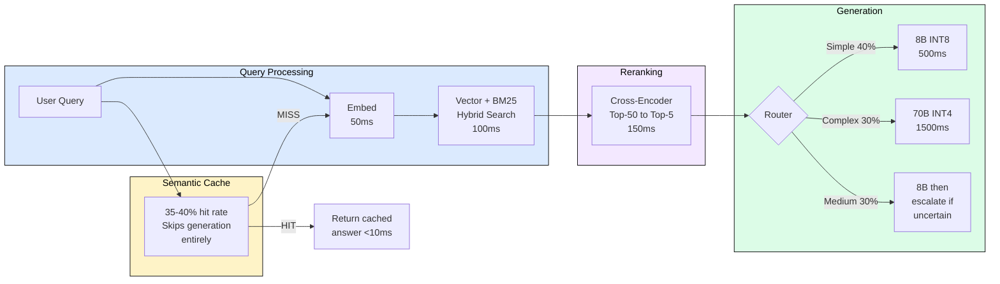
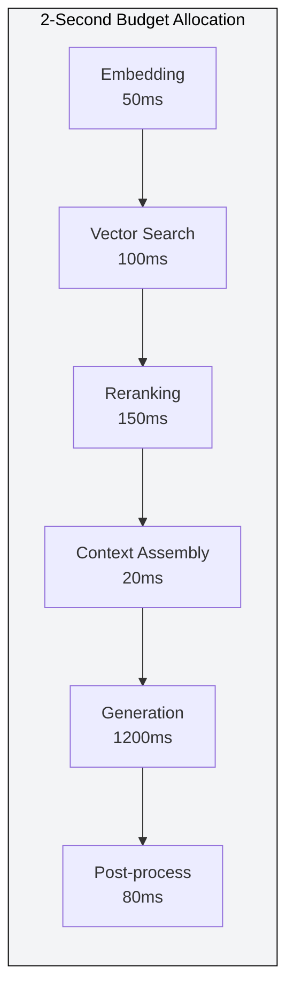
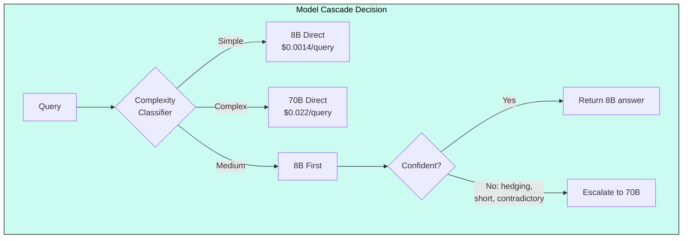
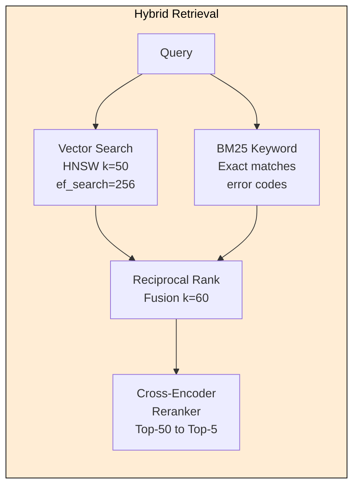

# 10.3 Enterprise RAG Service

 

Enterprise RAG is the most common production LLM deployment pattern today. The core tension: accuracy demands large models, but cost and latency demand small ones. This design resolves it with a model cascade (8B + 70B), semantic caching (40% hit rate eliminates generation entirely), and intelligent routing, achieving >90% domain QA accuracy at <$0.01 per query and <2s end-to-end latency for 5,000 concurrent users against 10M documents.

## Why This Design Is Unique

Unlike consumer chatbots optimized for single interaction styles, enterprise RAG handles diverse query types (factual lookup, summarization, analysis, code generation) under strict accuracy requirements. Wrong answers erode trust faster than slow answers. The system must serve document-level ACL-filtered results while keeping CFOs comfortable with the bill.

## Architecture Overview

## Requirements

| Metric | Target | Rationale |
|--------|--------|-----------|
| E2E latency p50 | <1.5s | Conversational UX expectation |
| E2E latency p99 | <3.0s | Users abandon after 5s |
| Accuracy (domain QA) | >90% | Below this, users revert to manual search |
| Faithfulness | >95% | Hallucinated enterprise info is dangerous |
| Monthly budget | <$50K | Must justify ROI vs hiring support staff |
| Peak QPS | 200 | 5,000 users x 2.5 queries/min during bursts |
| Corpus | 10M docs, 45M chunks | After 512-token chunking with 64-token overlap |

## Latency Budget Breakdown

Generation consumes 60% of the latency budget. Any caching that eliminates generation saves 1.2s, making the response feel instant.

## Model Cascade: Three-Model Architecture

| Model | Role | Why | Throughput |
|-------|------|-----|-----------|
| Llama 3.1 70B INT4 | Complex queries (30%) | Multi-hop reasoning over chunks | 25 tok/s on 4xA10G |
| Llama 3.1 8B INT8 | Simple/medium queries (70%) | 92% accuracy on single-source factual | 100 tok/s on 1xA10G |
| BGE-Large-en-v1.5 | Embedding + retrieval | Top-5 MTEB, 1024-dim | 500 emb/s on A10G |

The cascade saves cost: 40% simple queries go to 8B (1/10th cost), 30% medium queries try 8B first with escalation only if confidence is low. Only 30-50% of queries reach the expensive 70B.

## Memory Budget

**70B INT4 on g5.12xlarge (4xA10G-24GB):**

| Component | Per-GPU (24GB) |
|-----------|---------------|
| Model weights (sharded) | 8.75 GB (36.5%) |
| KV cache (4 seq x 4K ctx) | 10.5 GB (43.7%) |
| Activations + workspace | 2.0 GB (8.3%) |
| CUDA overhead | 2.75 GB (11.5%) |

4K context is sufficient for RAG: system prompt (200 tok) + 5 chunks x 512 tok (2,560) + query (100) + generation (1,140) = 4,000 tokens.

**8B INT8 on g5.xlarge (1xA10G-24GB):**

| Component | Memory |
|-----------|--------|
| Model weights (INT8) | 8.0 GB |
| KV cache (16 seq x 4K ctx) | 8.4 GB |
| Prefix cache (shared prompts) | 3.0 GB |
| Activations + overhead | 4.6 GB |

## Caching: The 40% Cost Eliminator

Enterprise environments have a unique property: employees ask the same questions repeatedly. 30-40% of queries are semantically identical to a previous query.

**Semantic Cache:** Matches queries by meaning (cosine similarity > 0.92), not exact text. "What's our PTO policy?" and "How many vacation days do I get?" hit the same cache entry. Invalidates automatically when source documents are updated.

**Document KV Cache:** Top-5 popular chunks appear in 20%+ of queries. Pre-computing their KV states saves 60-70% of prefill.

**Prefix Cache (vLLM built-in):** System prompt (200 tokens) computed once, reused for all requests. Saves 100ms per request.

| Cache Layer | Hit Rate | Latency Saved | Cost Saved |
|-------------|----------|---------------|------------|
| Semantic query cache | 35-40% | 1,200ms (skip gen) | $0.004/query |
| Document KV cache | 25-30% | 600ms (skip prefill) | $0.002/query |
| Prefix cache | 100% | 100ms | Minimal |
| **Combined** | **~55%** | **avg 700ms** | **$0.005/query** |

## Retrieval: Hybrid Search + Reranking

Hybrid search catches keyword-specific queries (exact error codes, policy numbers) that semantic search misses. The cross-encoder reranker improves MRR@5 by 15-25% over embedding-only retrieval.

## Cost Summary

| Component | Monthly Cost |
|-----------|-------------|
| 70B Generation (1.5 avg g5.12xlarge) | $6,208 |
| 8B Generation (2x g5.xlarge) | $1,475 |
| Embedding + Reranker (1x g5.xlarge) | $738 |
| Vector DB (3x r6g.2xlarge OpenSearch) | $2,847 |
| Batch indexing (spot) | $182 |
| API, storage, network, contingency | $2,972 |
| **Total** | **$14,422/month** |

**Blended cost per query:** 40% cached ($0.0001) + 30% 8B ($0.0014) + 30% 70B ($0.0315) = **$0.0098/query** (under $0.01 target).

## Failure Modes

| Mode | Detection | Mitigation |
|------|-----------|-----------|
| Irrelevant retrieval | Reranker max score < 0.3 | Prepend "I could not find specific information" |
| 70B OOM | KV cache > 90% or queue > 10 | Route medium queries to 8B with disclaimer |
| Index staleness | By design (nightly batch) | Hot index (brute-force, 30s freshness) for new docs |
| Cascade timeout | 8B + 70B sequential > 2s | Speculative execution: start both, cancel loser |
| Hallucination | LLM-as-judge sampling (5%) | Prompt: "answer ONLY from context, say you don't know otherwise" |

## FAQ

**Q: Why a model cascade instead of always using 70B?**
A: 40% of enterprise queries are simple lookups where 8B achieves comparable accuracy (within 2%) when given correct retrieved context. Routing everything to 70B wastes 10x compute on trivial questions.

**Q: How does semantic caching handle document updates?**
A: Each cache entry tracks source document IDs. When the indexing pipeline updates a document, all cache entries citing it are invalidated immediately via event-driven invalidation.

**Q: Why hybrid search (vector + BM25) instead of vector-only?**
A: Semantic embeddings conflate similar but different content. BM25 catches exact-match queries like error codes ("ERR_AUTH_403"), policy numbers ("Policy 7.2.1"), and proper nouns that vector search handles poorly.

**Q: How do you enforce document-level ACLs in vector search?**
A: OpenSearch k-NN supports filter clauses applied during HNSW traversal. Each chunk inherits its parent document's ACL tags, and the user's permission set is passed as a filter with every search query.

**Q: What is the cold-start experience for the first query of the day?**
A: First query has no semantic cache hit and no prefix cache warm-up, so it takes the full 1.6s pipeline. After that, the system prompt prefix is cached (saves 100ms on all subsequent queries) and popular document KV states are warmed.

## References

1. Lewis et al., "Retrieval-Augmented Generation for Knowledge-Intensive NLP Tasks" (2020). Foundational RAG architecture.
2. Xiao et al., "C-Pack: Packaged Resources To Advance General Chinese Embedding" (2023). BGE embedding models.
3. Kwon et al., "Efficient Memory Management for Large Language Model Serving with PagedAttention" (2023). vLLM prefix caching.
4. Gao et al., "Precise Zero-Shot Dense Retrieval without Relevance Labels" (2022). HyDE query expansion.
5. Wang et al., "MTEB: Massive Text Embedding Benchmark" (2022). Embedding model evaluation.
6. Robertson & Zaragoza, "The Probabilistic Relevance Framework: BM25 and Beyond" (2009). BM25 foundations.
