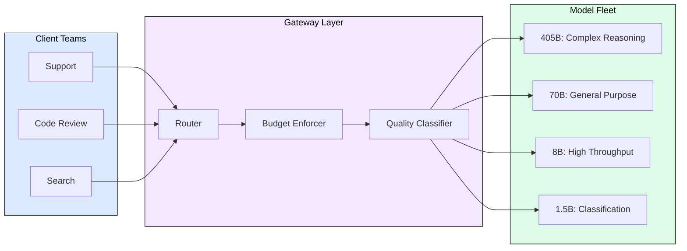
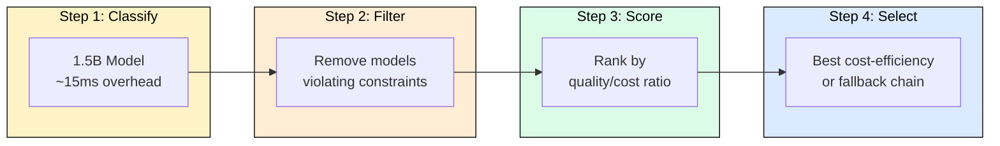
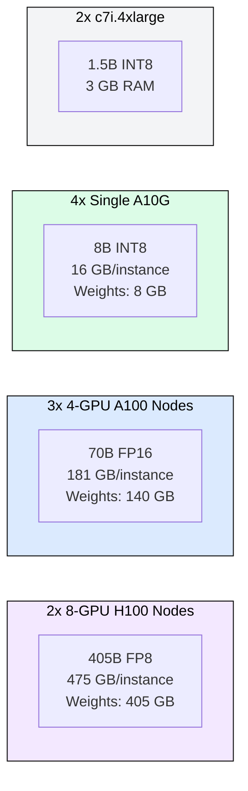
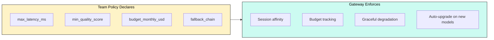

# 10.4 Multi-Model Gateway

 

 

A unified inference gateway routes requests across a heterogeneous model fleet (405B, 70B, 8B, 1.5B) based on SLOs, cost budgets, and quality requirements. This eliminates the N-teams x M-models integration explosion by decoupling "what quality I need" from "which model serves it."

## Why a Gateway Matters

Without a gateway, 4 models and 12 teams create 48 integration paths, each with its own auth, rate limiting, monitoring, and billing. Teams hard-code model choices that become stale as better models arrive. A gateway presents one API surface while routing optimally behind the scenes.

## Routing Decision: Constrained Optimization

Every request solves: maximize quality(model, request) subject to latency, budget, quality floor, and capacity constraints. The key insight: for complexity 1-3 requests (60-70% of traffic), an 8B model scores 9.0/10, nearly matching 405B at 1/19th the cost.

## Complexity-Driven Model Selection

A lightweight classifier (running on the 1.5B model in <20ms) scores request complexity 1-10. The quality matrix maps (model, complexity) to expected output quality:

| Complexity | 405B | 70B | 8B | 1.5B | Routing Decision |
|---|---|---|---|---|---|
| 1-2 (extraction) | 9.5 | 9.3 | 9.0 | 7.5 | Use 8B (saves 19x cost) |
| 3-4 (summarization) | 9.4 | 8.8 | 7.5 | 5.0 | Use 70B |
| 5-6 (reasoning) | 9.2 | 7.8 | 6.1 | 3.8 | Use 70B or 405B |
| 7-8 (complex analysis) | 9.0 | 6.5 | 4.8 | 2.5 | Use 405B |
| 9-10 (novel problems) | 8.5 | 5.2 | 3.5 | 1.8 | Use 405B only |

## Memory Budget

Total fleet: 11 instances, 2,336 GB GPU memory. Cost: $93/hr heterogeneous vs $200/hr homogeneous (all H100). Savings: 53%.

## Session Affinity and Fallback

Multi-turn conversations require model consistency. The gateway pins sessions to a model, switching only when the current model becomes unavailable or budget-exhausted. Fallback chains are per-team policy: code-review falls from 405B to 70B (never lower), support falls from 70B to 8B.

## Cost Analysis

| Model | $/1K tokens | Typical requests | Daily cost |
|---|---|---|---|
| 405B | $0.015 | 5K (complex only) | $375 |
| 70B | $0.004 | 30K (general) | $240 |
| 8B | $0.0008 | 50K (simple) | $80 |
| 1.5B | $0.0001 | 15K (classification) | $3 |
| **Total** | | **100K/day** | **$698/day** |

Without routing (all to 405B): $3,000/day. Gateway saves 77% at <5% quality loss.

## KV Cache Oversubscription

Not all requests use full context. The gateway oversubscribes memory like airlines overbook seats:

- 405B: 1.2x (conservative, expensive to OOM)
- 70B: 1.5x (moderate, can shed to 8B)
- 8B: 2.0x (aggressive, fast restart)
- 1.5B: 3.0x (CPU memory abundant)

When pressure exceeds budget: complete in-flight requests, page KV to host memory (+50ms), preempt low-priority requests.

## Production Considerations

**Monitoring**: track routing accuracy (post-hoc quality eval), budget burn rate, model queue depths, cache hit rates, fallback frequency.

**Canary deployments**: new models enter the fleet at 5% traffic, auto-promoted if quality metrics hold.

**A/B testing**: the gateway can split traffic for model comparison without changing any client integration.

---

## FAQ

**Q1: What happens when a team exhausts their budget mid-month?**
The gateway falls through the team's fallback chain to cheaper models. If all options exceed budget, requests queue with a 429 response after timeout.

**Q2: How does the gateway handle a new model joining the fleet?**
Teams declare requirements (latency, quality floor), not model names. A new 13B matching 70B quality at 8B cost routes automatically via the quality matrix.

**Q3: Why not let teams choose models directly?**
Direct selection creates coupling. Teams choose stale models, cannot benefit from fleet improvements, and create operational burden when models are deprecated.

**Q4: How accurate is the complexity classifier?**
~85% agreement with human raters. The 15% error rate is acceptable because misrouting to a larger model wastes cost (not quality), and misrouting to a smaller model triggers quality monitoring alerts.

**Q5: What about streaming responses?**
The gateway provides a consistent SSE interface regardless of backend model. Clients see no difference between a response from 405B vs 8B.

---

## References

1. Anthropic. "Routing for Model Selection." (2024). Model routing strategies for heterogeneous fleets.
2. Martian. "Model Router: Dynamic LLM Selection." (2024). Quality-aware routing across model sizes.
3. OpenRouter. "Multi-Model API Gateway." (2024). Production gateway serving 100+ models.
4. Unify AI. "LLM Routing Benchmark." (2024). Complexity-based model selection evaluation.
5. Leviathan et al. "Fast Inference from Transformers via Speculative Decoding." ICML 2023.
