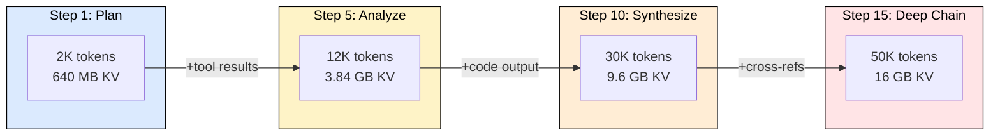
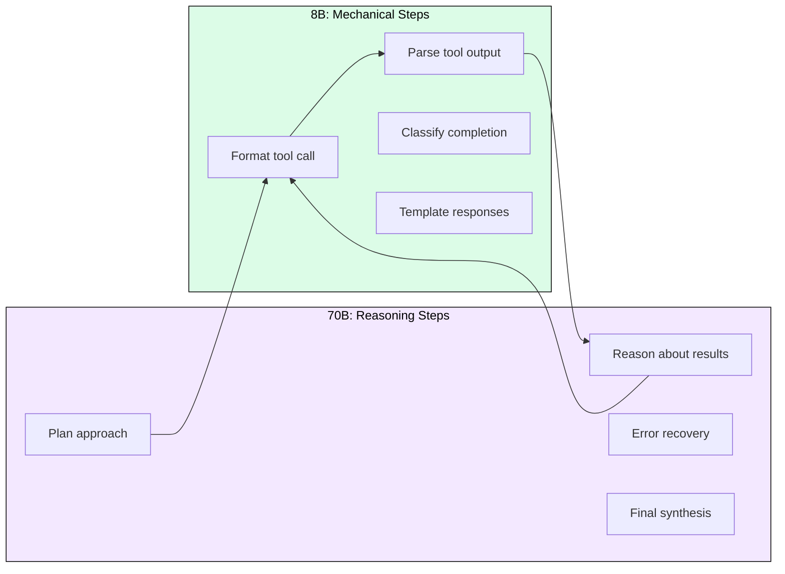
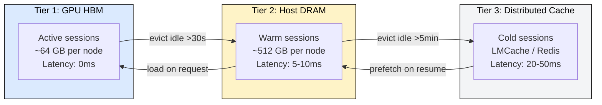
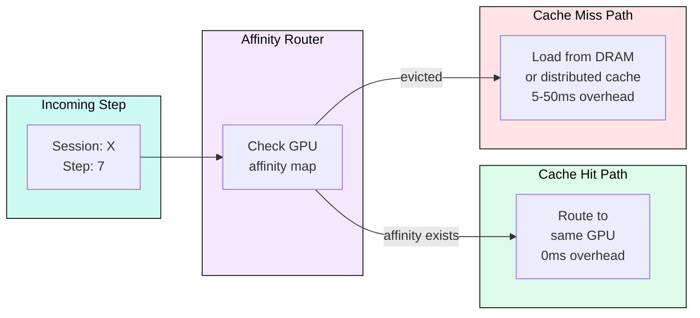

# 10.5 Agentic Workloads

 

 

Agentic AI is the hardest inference workload: 5-20 chained LLM calls per task, monotonically growing KV cache, unpredictable tool-call injections, and bursty compute patterns. This module designs infrastructure for 10K concurrent agent sessions at P95 task completion under 30 seconds.

## Why Agents Break Traditional Serving

A single-shot chatbot request is stateless: fixed context in, tokens out, done. An agent accumulates state across steps. A code-review agent starts at 2K tokens (system prompt), grows to 50K tokens by step 15 (after parsing diffs, retrieving docs, cross-referencing findings). KV cache grows monotonically. Multiply by 10K concurrent sessions and you need 25+ TB of cache, far exceeding GPU memory.

## The Two-Model Architecture

Not every agent step needs a 70B model. Planning and reasoning steps require deep inference; formatting tool calls and parsing results are mechanical. Splitting across two model tiers saves 60%+ compute.

In a typical 10-step task: 70B handles 4 steps (83% of compute budget, ~9s), 8B handles 6 steps (~1.7s). Total LLM time: 10.7s. With tool overhead (~5s), total: ~16s, well within the 30s SLO.

## Tiered Memory Architecture

GPU memory alone cannot hold 25 TB of KV cache. The solution is a three-tier hierarchy with session-aware routing to minimize movement.

**KV cache per token (70B, GQA 8 KV heads, 128 dim, 80 layers, FP16):**
2 x 8 x 128 x 80 x 2 = 327,680 bytes = 320 KB/token.

| Sessions at depth | Tokens | KV per session | Aggregate (10K sessions) |
|---|---|---|---|
| 25% at step 3 | 6K | 1.92 GB | 4.8 TB |
| 35% at step 5-7 | 15K | 4.8 GB | 16.8 TB |
| 25% at step 10 | 30K | 9.6 GB | 24 TB |
| 15% at step 15+ | 50K | 16 GB | 24 TB |

Session-aware routing (pinning sessions to the same GPU) keeps 95%+ of active KV in Tier 1, avoiding most transfers entirely.

## Session-Aware Routing

The scheduler maintains a session-to-GPU affinity map. When a new step arrives for session X, it routes to the GPU already holding X's KV cache. If that GPU is full, the scheduler checks whether the session is "hot" (last step <30s ago) or "warm" (last step 30s-5min ago). Hot sessions preempt cold ones; warm sessions load from DRAM.

## Speculative Model Escalation

For ambiguous steps (not clearly planning or execution), send to 8B first with a confidence probe. If output token probabilities drop below threshold, abort and escalate to 70B. Cost: one wasted 8B inference (~100ms). Savings: avoids 70B on ~40% of medium steps. Net savings ~25% of 70B compute even with 20% false-start rate.

## Capacity Planning

**Compute requirement:** 10K sessions x 1 step every 3s = 3,333 requests/s. At 200 output tokens/step = 666K tokens/s. A 70B TP=4 node generates ~800 tokens/s. Without model routing, you need 833 nodes. With 60/40 split (8B handles 60%): 70B needs 333 nodes, 8B needs ~50 nodes. Model routing is not optional; it is an economic necessity.

**Hardware fleet:** 70B on H100 TP=4 nodes (333 minimum), 8B on A10G single-GPU (50 minimum), distributed cache cluster (Redis/LMCache) for Tier 3.

## Production Monitoring

Key metrics for agentic workloads differ from traditional serving:

- **Steps-to-completion distribution**: detects regression in agent reasoning quality
- **KV cache hit rate**: target >95%, drops indicate routing failures
- **Inter-step latency**: includes tool-call time, separate from pure LLM latency
- **Escalation rate**: how often 8B steps get bumped to 70B
- **Session depth histogram**: capacity planning input
- **Thundering herd detection**: alerts when >30% of sessions hit reasoning steps simultaneously

---

## FAQ

**Q1: Why not just use one large model for everything?**
Cost. At 10K concurrent sessions, routing 60% of steps to 8B saves 333 H100 nodes (~$8K/hr in compute).

**Q2: How do you handle the thundering herd problem?**
Jitter injection: tool-call steps add 100-500ms random delay. Priority queuing: reasoning steps from sessions nearing SLO deadline get priority over fresh sessions.

**Q3: What happens when KV cache is evicted mid-session?**
The system recomputes prefill from the stored conversation history. This costs one extra prefill pass (~200ms for 20K tokens) but is rare with proper session-aware routing (<5% of steps).

**Q4: Can this handle 100K concurrent sessions?**
The architecture scales horizontally. 10x sessions = 10x GPU nodes + 10x cache capacity. The routing layer and session map are lightweight (Redis-backed, microsecond lookups).

**Q5: How does this differ from the multi-model gateway (10.4)?**
The gateway routes independent requests by complexity. Agentic infrastructure manages stateful sessions across many steps, maintaining KV cache affinity and handling context growth.

---

## References

1. Zheng et al. "Efficiently Programming Large Language Models using SGLang." arXiv:2312.07104 (2023). RadixAttention for KV cache sharing.
2. Liu et al. "CacheGen: KV Cache Compression and Streaming for Fast Language Model Serving." SIGCOMM 2024.
3. Gao et al. "Cost-Efficient Large Language Model Serving for Multi-turn Conversations with CachedAttention." ATC 2024.
4. Li et al. "LMCache: Sharing and Reusing KV Cache Across LLM Serving Instances." (2024).
5. Patel et al. "Splitwise: Efficient Generative LLM Inference with Disaggregated Prefill and Decode." ISCA 2024.
