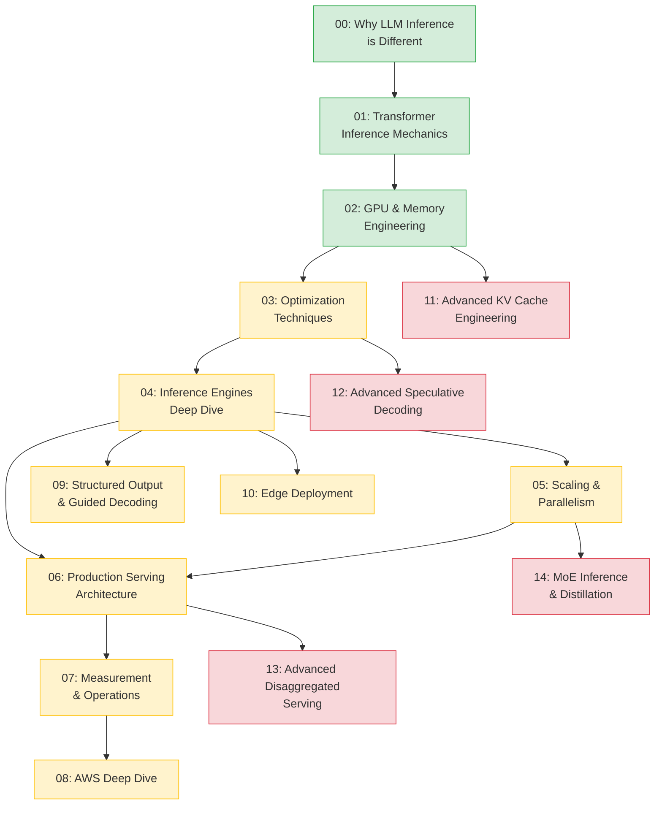

# LLM Inference at Scale — Workshop Roadmap

> From first principles to production-grade serving. 15 modules, 10 hands-on labs, three delivery formats.

---

## Workshop Formats

| Format | Duration | Coverage | Audience |
|--------|----------|----------|----------|
| **Full Workshop** | 2 days (16hrs) | All 15 modules + all labs | Engineers building inference platforms |
| **Condensed** | 1 day (8hrs) | Modules 00–08 + selected labs | Teams adopting vLLM/SGLang |
| **Deep Dive** | 2 hours | Pick 2–3 modules from any tier | Conference talks, brown bags |

---

## Module Tiers

### 🟢 Beginner — Foundations (Modules 00–02, ~3 hrs)

| Module | Title | Key Concepts |
|--------|-------|--------------|
| 00 | Why LLM Inference is Different | Autoregressive generation, compute vs memory bound, why ML inference rules don't apply |
| 01 | Transformer Inference Mechanics | Prefill vs decode, KV cache, attention variants (MHA/MQA/GQA), token generation loop |
| 02 | GPU and Memory Engineering | Roofline model, memory hierarchy, VRAM budgeting, bandwidth bottlenecks |

**Lab coverage:** Lab 01 (Transformer Forward Pass), Lab 02 (VRAM Calculation)

---

### 🟡 Intermediate — Engine Mastery & Production (Modules 03–10, ~10 hrs)

| Module | Title | Key Concepts |
|--------|-------|--------------|
| 03 | Optimization Techniques | Quantization (INT8/INT4/FP8), FlashAttention, continuous batching, chunked prefill |
| 04 | Inference Engines Deep Dive | vLLM, SGLang, TensorRT-LLM — architecture, tradeoffs, tuning knobs |
| 05 | Scaling and Parallelism | Tensor/pipeline/data/expert parallelism, NCCL, interconnect ceilings |
| 06 | Production Serving Architecture | Ray Serve, KServe, llm-d, routing, autoscaling, rollouts |
| 07 | Measurement and Operations | TTFT/TBT/P95, workload replay, SLOs, capacity planning |
| 08 | AWS Deep Dive | EC2 (g5/p4d/p5), SageMaker LMI, Inferentia2, Bedrock |
| 09 | Structured Output & Guided Decoding | JSON schema constraints, Outlines, grammar-guided generation |
| 10 | Edge Deployment (Optional) | llama.cpp, GGUF, Apple Silicon, Jetson, CoreML |

**Lab coverage:** Labs 03–10 (Quantization, vLLM Deployment, SGLang Structured Output, Tensor Parallelism, Ray Serve, EKS/KServe, SageMaker Production, Benchmarking & Monitoring)

---

### 🔴 Advanced — Research Frontier (Modules 11–14, ~5 hrs)

| Module | Title | Key Concepts |
|--------|-------|--------------|
| 11 | Advanced KV Cache Engineering | Beyond PagedAttention: compression, eviction policies, cross-request sharing, quantized KV |
| 12 | Advanced Speculative Decoding | Gen 1→3 evolution: Medusa, EAGLE, self-speculative, hardware-aware draft selection |
| 13 | Advanced Disaggregated Serving | Prefill/decode disaggregation, serverless LLM inference, cold start mitigation, llm-d internals |
| 14 | MoE Inference & Distillation | Expert routing at scale, load balancing, distillation for serving efficiency, DeepSeek-V2/V3 |

**Lab coverage:** TBD (advanced labs planned as batch after content finalization)

---

## Module Dependency Graph



---

## Suggested Schedules

### 2-Day Full Workshop (16 hrs)

| Time | Day 1 | Day 2 |
|------|-------|-------|
| 09:00–10:30 | M00 + M01 + Lab 01 | M06 + M07 + Lab 10 |
| 10:30–10:45 | Break | Break |
| 10:45–12:15 | M02 + Lab 02 | M08 + Lab 09 |
| 12:15–13:15 | Lunch | Lunch |
| 13:15–14:45 | M03 + Lab 03 | M09 + M10 |
| 14:45–15:00 | Break | Break |
| 15:00–16:30 | M04 + Labs 04–05 | M11 + M12 |
| 16:30–17:00 | M05 + Lab 06 | M13 + M14 + Wrap-up |

### 1-Day Condensed (8 hrs)

| Time | Content |
|------|---------|
| 09:00–10:00 | M00 + M01 (concepts only, skip lab) |
| 10:00–11:00 | M02 + M03 (VRAM math + quantization) |
| 11:00–12:00 | M04 + Lab 04 (vLLM hands-on) |
| 12:00–13:00 | Lunch |
| 13:00–14:00 | M05 + Lab 06 (tensor parallelism) |
| 14:00–15:00 | M06 + M07 (serving + measurement) |
| 15:00–16:00 | M08 + Lab 09 (AWS/SageMaker) |
| 16:00–17:00 | Pick one: M09 or M11 or M13 (audience vote) |

### 2-Hour Deep Dive (pick a track)

| Track | Modules | Best for |
|-------|---------|----------|
| **Inference Fundamentals** | M01 + M02 + M03 | New to LLM inference |
| **Engine Shootout** | M04 + M07 | Evaluating vLLM vs SGLang vs TRT-LLM |
| **Production at Scale** | M06 + M13 | Platform teams deploying LLMs |
| **Research Frontier** | M11 + M12 | ML engineers optimizing latency |
| **MoE & Distillation** | M05 + M14 | Teams serving large sparse models |

---

## Prerequisites

**All participants:**
- Python proficiency (comfortable reading PyTorch code)
- Basic understanding of neural networks (what a forward pass is)
- Familiarity with Linux CLI and SSH

**Intermediate tier additionally:**
- Experience deploying ML models (any framework)
- Basic Docker/Kubernetes awareness
- AWS account with GPU instance access (g5.2xlarge minimum)

**Advanced tier additionally:**
- Read at least one of: PagedAttention paper, FlashAttention paper, or vLLM architecture blog
- Comfort with distributed systems concepts (replication, sharding, load balancing)
- Experience profiling GPU workloads (nvidia-smi, nsight, or similar)

---

## What's New in 2026

The advanced tier (Modules 11–14) represents cutting-edge research and production techniques from 2025–2026:

| Module | Why it matters now |
|--------|-------------------|
| **11: Advanced KV Cache Engineering** | KV cache is the #1 memory bottleneck at scale. New techniques (quantized KV, cross-request sharing, learned eviction) reduce memory 2–4× without quality loss. |
| **12: Advanced Speculative Decoding** | Gen 3 speculative methods (self-speculative, hardware-aware drafting) achieve 2–3× speedup without separate draft models. Production-ready in vLLM 0.8+. |
| **13: Advanced Disaggregated Serving** | Separating prefill from decode unlocks independent scaling, serverless inference, and 40–60% cost reduction. llm-d and Mooncake are production-proven. |
| **14: MoE Inference & Distillation** | DeepSeek-V3/R1 proved MoE at scale. Distillation converts 600B MoE → 70B dense with minimal quality loss, slashing serving costs. |

**Key research incorporated:** TurboQuant (FP4), KIVI/Gear (KV compression), EAGLE-2/Sequoia (speculative trees), DistServe/Splitwise (disaggregation), DeepSeek-V2/V3 (MoE routing).

---

## Repository Structure

```
llm-inference-at-scale/
├── 00–14_*.md          # Module content (15 files)
├── labs/               # 10 hands-on labs (lab_01 through lab_10)
├── findings/           # Research papers, blogs, advanced content proposals
├── reference/          # Glossary, cheat sheet, cost calculator, setup guide
├── slides/             # Workshop outline for presentation
└── .kiro/specs/        # Requirements, design, and task specs
```

---

## Total Content

- **15 modules** (~600+ pages of technical content)
- **10 labs** with infrastructure scaffolding
- **3 research documents** in findings/
- **6 reference materials** (glossary, cheat sheet, vLLM quick ref, cost calculator, setup guide, post-workshop resources)
