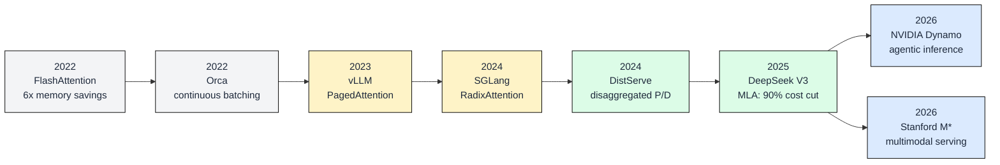
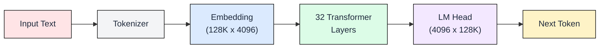
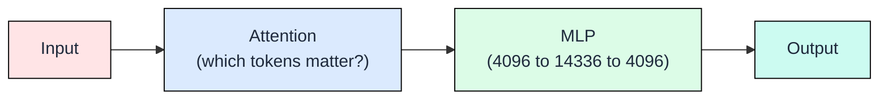
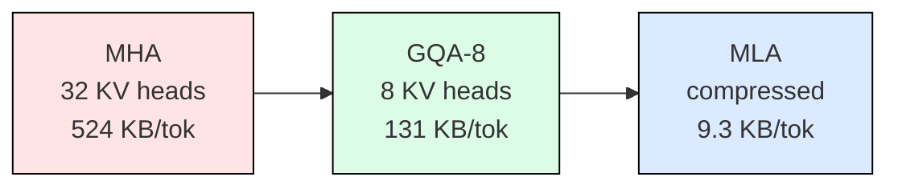

# AIE Workshop 2026: LLM Inference at Scale
## Presentation Narrative (39 slides, 8 demos, 2 hours)

Each slide ends with a question or implication that pulls the audience into the next.
Transitions are explicit. The audience should never wonder "why are we talking about this now?"

---

## PART 0: Problem Statement (15 min)

### Slide 1: Title
**LLM Inference at Scale: From Memory Equation to Production Engines**

Repo QR code. Molab links for attendees.

> "By the end of these 2 hours, you will know exactly why your model is slow, and how to make it 20x faster on the same hardware."

---

### Slide 2: The Cost Problem
**Inference costs more than training. And it never stops.**

Training GPT-3 cost $4.6M. Once.
Serving it costs more than that every single week. Forever.

> "Training is a fixed cost. Inference is a running bill. And it scales with your users."

**→ So who's paying this bill?**

---

### Slide 3: Inference Is Everywhere
**Every interaction with AI is an inference call. The scale is staggering.**

- **AI coding agents:** 52% of code is now AI-authored (DX, Q2 2026). 1 in 7 PRs involve AI agents (Pullflow). 84-91% of developers use AI coding tools (2025-2026 surveys).
- **AI products:** ChatGPT, Claude, Gemini, Copilot — every chat message, every autocomplete, every agent tool call = inference.
- **The market:** AI inference-as-a-service: $18.6B in 2025 → $23.4B in 2026 (Precedence Research). Cost per million tokens dropped 1,200x in 5 years ($60 in 2020 → $0.05 in 2025) — but volume grew even faster.
- **The real cost:** One 50-turn coding session consumes ~1M tokens (Vantage, 2026). A 25-person team: $72K/year on Opus.

Whether you raise PRs, chat with AI, or build agent features — you're doing LLM inference. And it's expensive at scale.
---

### Slide 4: The Field is Moving Fast
**Key breakthroughs in LLM inference (2022-2026).**



Each innovation solved a specific bottleneck:
- **FlashAttention** (2022): tiling attention in SRAM, no N² matrix in HBM
- **Orca** (2022): iteration-level scheduling, continuous batching
- **vLLM** (2023): PagedAttention, virtual memory for KV cache, 24x over HF
- **SGLang** (2024): radix tree prefix cache, 5x cache hit rate
- **DistServe** (2024): separate prefill and decode onto different GPUs
- **DeepSeek V3** (2025): MLA compresses KV 56x, 90% cost reduction
- **NVIDIA Dynamo** (2026): KV-aware routing for agentic sessions
- **Stanford M*** (2026): Walk Graphs for multimodal composite models

> "This workshop gives you the foundations to understand ALL of these. Let's start."

> "This workshop gives you the foundations to evaluate any new paper or tool. Let's start by experiencing the problem."

---

### Slide 5: What We Cover
**Foundations → Attention → KV Cache → Optimizations → Engines**

Chapters 00-06 of the book. Chapters 07-11 (multimodal, K8s, Ray) are in the repo for you to explore.

---

### Slide 6: What We Will Solve
**By the end: you will know WHY inference is slow, 7 techniques to fix it, and which engine to use.**

The 20x improvement stack we will prove today:

| Step | Optimization | Cumulative |
|------|-------------|-----------|
| 0 | Baseline (HF, FP16, no batching) | 1x |
| 1 | + GQA (4x less KV per token) | 4x |
| 2 | + INT4 weights (4x less weight memory) | 7x |
| 3 | + PagedAttention (no fragmentation) | 10x |
| 4 | + Prefix caching (shared prompts) | 13x |
| 5 | + Continuous batching (no waste) | 16x |
| 6 | + Speculative decoding (2-3x decode) | 20x |

> "Let's feel the problem first."

---

### DEMO A: Feel the Pain
> `demos/demo_a_feel_the_pain.ipynb` (5 min)
> 
> What the audience sees:
> 1. "14.5 GB consumed just by weights"
> 2. "TTFT: grows from 90ms to 5000ms as context scales to 16K"
> 3. "5 users queue up: last one waits 5x longer than first"
> 4. "KV cache grows ~1 GB per user at 8K context"
>
> End with: "Why? Let's find out."

---

## PART 1: Foundations (25 min)

> **Transition:** "We saw the problems. Now let's understand the machine that causes them."

### GROUP 1: What's inside the model

### Slide 7: The Inference Pipeline
**Text in → tokens → 32 layers → next token out. Runs once PER token.**



To generate 100 tokens, this runs 100 times. The 32 layers are where 95% of memory lives.

---

### Slide 8: Inside One Transformer Layer
**Each layer: Attention + MLP. Same structure x32, different learned weights.**



- **Attention:** For the current token, which earlier tokens should influence its meaning?
- **MLP:** Transform the representation. Stores factual knowledge. Largest component.

---

### Slide 9: What Q, K, V Are
**Three projections from one vector. This is the core of attention.**

Every token's hidden state (4096 numbers) gets projected into three vectors:
- **Query (Q):** "What am I looking for?" (the current token)
- **Key (K):** "What do I contain?" (each previous token)
- **Value (V):** "What information do I carry?" (each previous token)

Score = dot(Q, K). High score = relevant token. Output = weighted sum of V by scores.

Each layer has 32 Q heads and 8 KV heads (GQA). Head dimension: 128.

> "These K and V vectors are what get stored in the KV cache. That's why it grows."

---

### Slide 10: Weight Distribution
**Where the 14.5 GB lives.**

| Component | Size | % |
|-----------|------|---|
| Attention (Q,K,V,O x 32 layers) | 8.0 GB | 50% |
| MLP (gate, up, down x 32 layers) | 6.8 GB | 42% |
| Embedding + LM Head | 1.0 GB | 6% |
| **Total** | **~16 GB** | |

---

### 🎯 DEMO B: Architecture + Weights (5 min)
> `demos/demo_b_memory_equation.ipynb`
> 1. Load Mistral-7B config: 32 layers, 4096 hidden, 8 KV heads
> 2. Derive weight sizes: Attention 8 GB, MLP 6.8 GB, Embedding 1 GB
> 3. Pie chart showing 50%/42%/6% distribution
> 4. Total: 7.24B params x 2 bytes = 14.5 GB
>
> Proves: the model is 14.5 GB fixed. This is what gets read every decode step.

---

### GROUP 2: Why decode is slow

### Slide 10: Prefill vs Decode
**Two phases. Prefill is fast (parallel). Decode is the bottleneck (sequential).**

**Prefill:** All input tokens processed in parallel.
- GPU computes attention across all positions at once. Compute-bound. Fast.

**Decode:** One token per step. Each step reads ALL 14.5 GB of weights from memory.
- Sequential. Memory-bound. This is THE bottleneck.

---

### Slide (Foundations): How Prefill and Decode Create KV Cache
**Prefill computes K,V for all input tokens at once. Decode adds one K,V pair per step.**

**During prefill:** The model computes K and V for every input token simultaneously. All of these get stored in the KV cache. A 4K token prompt = 4,096 new K,V pairs cached.

**During decode:** Each new token generated produces one new K,V pair that gets appended to the cache. But attention must READ all previous K,V pairs to compute the score for the new token.

This is why KV cache grows linearly with sequence length:
- More input tokens = bigger initial cache (prefill cost)
- More generated tokens = cache keeps growing (decode cost)
- More concurrent users = multiply everything by N

> "Now let's look at how fast the GPU can read all this data."

---

### Slide 11: How Decode Reads Weights (HBM to SRAM)
**Every decode step: 14.5 GB streams from HBM through the GPU's streaming multiprocessors.**

| Memory Level | Size | Bandwidth | Role |
|-------|------|-----------|------|
| SRAM (on-chip, per SM) | 20 MB | 19 TB/s | Compute happens here |
| HBM (GPU main memory) | 80 GB | **2 TB/s** | Weights live here |

The flow: HBM -> L2 cache -> SRAM (SM registers) -> compute -> discard -> fetch next slice.

The model is 700x larger than all SRAM combined. It cannot fit on-chip.
Every decode step streams the ENTIRE 14.5 GB through this pipe.
At 2 TB/s: `14.5 GB / 2 TB/s = 7.25 ms per token = ~138 tok/s ceiling`

This is why decode is memory-bandwidth bound, not compute bound.

---

### Slide 12: Roofline: Decode is Memory-Bound
**80x below compute peak. More FLOPS won't help.**

- Arithmetic intensity of decode: **2 FLOP/byte**
- Ridgeline (compute bottleneck): **156 FLOP/byte**
- Gap: **80x** of compute sits idle

Only two escapes: read LESS data, or serve MORE users per read.

---

### 🎯 DEMO C: Prefill vs Decode (5 min)
> `demos/demo_c_prefill_vs_decode.ipynb`
> 1. Measures prefill time at 128-8K tokens (shows linear scaling, fast)
> 2. Measures per-token decode latency (shows ~constant, memory-bound)
> 3. Side-by-side chart: prefill (green, parallel) vs decode (red, sequential)
>
> Proves: decode reads 14.5 GB every step. GPU compute sits 80% idle.: TTFT scaling proved prefill cost.
> Per-token decode timing proved the bandwidth wall.
> Speaker walks through those results explaining the roofline connection.

---

### GROUP 3: KV cache and capacity

### Slide 13: Why the KV Cache Exists
**Without it: recompute attention for ALL previous tokens every step. O(n squared).**

During decode, attention needs K and V vectors from ALL previous tokens.
- Without cache: recompute everything. Gets quadratically slower.
- With cache: store K,V vectors. O(n) but costs memory per user.

Every production system uses the KV cache. The question: how much memory?

---

### Slide 14: KV Cache Growth
**Every token x every layer x every head. Adds up fast.**

```
KV per token = 2 (K + V) x 32 layers x 8 KV heads x 128 dim x 2 bytes = 131 KB
```

| Scenario | KV Memory |
|----------|-----------|
| 1 user, 4K context | 524 MB |
| 1 user, 16K context | 2.1 GB |
| 80 users, 4K context | **42 GB** |
| 80 users, 16K context | 168 GB (OOM) |

Weights: fixed. KV cache: the variable that kills you.

---

### Slide 15: The Capacity Equation
**Three numbers decide max users.**

```
Available = GPU_total - weights - overhead
Max users = Available / (131 KB x context_length)
```

A100-80GB: 80 - 14.5 - 8 = 57.5 GB available
- At 4K context: **109 users**
- At 16K context: **27 users**

---

### Slide 16: Latency SLO Determines Your Batch Size
**You can't just max out batch size. Users have latency expectations.**

Two SLO metrics:
- **TTFT** (Time to First Token): user waits before seeing anything. Target: < 500ms.
- **ITL** (Inter-Token Latency): time between streamed tokens. Target: < 50ms.

Higher batch = better throughput but worse per-user latency.
Your SLO caps the batch size, which caps your throughput and revenue per GPU.

```
Throughput = batch_size x (1000 / ITL_ms) tokens/sec
Max batch = whatever keeps ITL < SLO target
```

---

### Slide 17: GPU Selection

| GPU | VRAM | Bandwidth | Max Users (4K) | $/M tokens |
|-----|------|-----------|------|-----------|
| A100-80 | 80 GB | 2.0 TB/s | 109 | $0.28 |
| H100-80 | 80 GB | 3.4 TB/s | 109 | $0.16 |
| H200-141 | 141 GB | 4.8 TB/s | 237 | $0.13 |

More VRAM + more bandwidth = cheaper per token.

---

### 🎯 DEMO D: KV Cache Growth + Capacity Calculator (5 min)
> `demos/demo_d_capacity_calculator.ipynb`
> 1. Derive: KV per token = 2 x 32 x 8 x 128 x 2 = 131 KB
> 2. Plot: KV cache growth curve as users x context scales
> 3. Show: 80 users at 4K = 42 GB (fills the GPU)
> 4. Interactive: pick model, precision, GPU, context. Watch memory fill.
> 5. GPU comparison: $/M tokens across A100, H100, H200
>
> Proves: KV cache is the variable cost. Capacity equation works.
> Interactive: pick model, precision, GPU, context. Watch memory fill. See $/M tokens.

> **End of Part 1:** "Now we know the machine, why it's slow, and what limits capacity. Next: how to push those limits."

---

## PART 2: Model Optimizations (20 min)

> **Transition:** "We know the limits. First optimization: reduce what the model stores and reads."

### Slide 15: GQA Already Saved You
**Without GQA, that 131 KB would be 524 KB.**



GQA groups 4 query heads per KV head. 4x savings. Already in every modern model.

> "This was free. You didn't have to do anything. But can we go further?"

---

### Slide 16: FlashAttention
**Same math. 6x less memory traffic.**

Standard attention writes N² scores to HBM. FlashAttention tiles in SRAM.
Never materializes the full attention matrix. Exact same output.

> "Also free. Enabled by default. What about the KV cache itself?"

---

### Slide 17: MLA (DeepSeek)
**Compress before caching. 56x savings.**

Store a 512-dim latent instead of full K (128d) + V (128d) per head.
Decompress at attention time. Why DeepSeek-V3 runs at 90% lower cost.

> "GQA is today. MLA is tomorrow. Both: same quality, less memory."

---

### Slide (Model Opt): Weight Quantization
**FP16 -> INT8 -> INT4. Same model, 4x less memory.**

FP16: 14.5 GB. INT8: 7.2 GB (2x). INT4 (NF4): 3.6 GB (4x).
More room for KV cache = more users. Minor quality loss at INT4 on reasoning.

> "We've cut the model size AND the KV size. Now let's optimize the cache itself."

---

### 🎯 DEMO E: Model Optimizations (8 min)
> `demos/demo_e_attention_comparison.ipynb`
> 1. MHA vs GQA vs MLA: memory per token bar chart (524 KB vs 131 KB vs 9.3 KB)
> 2. FP16 vs INT8 vs INT4: real model loading, measure GPU memory + throughput
> 3. Show: GQA (4x KV reduction) + INT4 (4x weight reduction) = first 7x of our 20x stack
>
> End with: "Model is smaller. Now: optimize what's stored in the KV cache."

---

## PART 3: KV Cache + Serving Optimizations + Engines (45 min)

> **Transition:** "Model is smaller (GQA + INT4). Now: optimize serving. Each concept → immediate demo."

---

### Slide 18: PagedAttention
**Virtual memory for KV cache. No fragmentation. 4x more users.**

Without: contiguous pre-allocation, 50-70% wasted to fragmentation.
With: page table with small non-contiguous blocks. Allocated on demand.

### Slide 19: Continuous Batching
**Static batch pads to longest request. Continuous: each finishes independently.**

Static: short requests waste compute waiting for long ones.
Continuous: slot new requests in as old ones complete. 2-3x throughput.

### Slide 20: vLLM Architecture
**The engine that implements both. One command to start.**

API -> Scheduler (continuous batching) -> KV Block Manager (PagedAttention) -> GPU Workers.
24x throughput over HuggingFace. Default choice for most teams.

### 🎯 DEMO: vLLM Baseline Benchmark
> Start vLLM server. Run same test as HF baseline. See combined speedup from PagedAttention + continuous batching.

---

### Slide 21: Prefix Caching
**System prompt: computed once. Reused forever. 15x TTFT improvement.**

Request 1: [system prompt] prefilled (200ms) + decode.
Request 2-N: CACHE HIT (0ms) + decode only.

Anthropic charges 10% for cached tokens. Stripe agents: 85-97% hit rate.
vLLM flag: `--enable-prefix-caching`

### 🎯 DEMO: Prefix Caching
> Restart vLLM with `--enable-prefix-caching`. Cold batch vs warm batch. Show TTFT drop.

---

### Slide 22: KV Quantization
**FP16 KV to FP8: 2x more users. One flag.**

Stores K,V values in 8 bits instead of 16. Half the memory for same KV cache.
Quality loss < 0.1% (KV values are less sensitive than weights).
vLLM flag: `--kv-cache-dtype fp8`

### 🎯 DEMO: KV Quantization Stress Test
> Restart vLLM with `--kv-cache-dtype fp8`. Send 20 concurrent requests. Show all fit without OOM.

---

### Slide 23: Speculative Decoding
**Draft model generates 5 tokens fast. Main model verifies all 5 in one pass.**

- Draft (1B): ~1ms for 5 candidates (cheap, sequential)
- Main (7B): ONE forward pass to verify all 5 (same cost as 1 token)
- Accepted tokens: free. Rejected: resample from that point.
- Acceptance rate: 70-85%. Net: 2-3x decode speed. Same output quality.

vLLM flag: `--speculative-model TinyLlama/TinyLlama-1.1B-Chat-v1.0 --num-speculative-tokens 5`

### 🎯 DEMO: Speculative Decoding
> Restart vLLM with speculative flags. Generate longer output. Show decode speedup.

---

### Slide 24: The Problem vLLM Doesn't Solve Well
**Hash-based prefix matching misses partial overlaps.**

vLLM hashes prompt prefixes. If two prompts share 90% but differ at byte 3, no cache hit.
For agents with multi-turn conversations, the shared context changes slightly each turn.
Need: tree-based matching that finds the LONGEST common prefix automatically.

### Slide 25: SGLang and RadixAttention
**Radix tree: finds longest matching prefix. 5x cache hit rate over vLLM.**

All requests with shared system prompt share ONE cached prefix node.
Branch at the point where they diverge. Automatic, no configuration.
Also: constrained decoding for structured output (JSON schema, regex).

Best for: agents with system prompts, multi-turn chat, structured output.

### 🎯 DEMO: SGLang
> Kill vLLM. Start SGLang. Run same prefix test. Show RadixAttention advantage.

---

### Slide 26: TensorRT-LLM
**Compile once. Run at hardware peak. NVIDIA only.**

Build phase (offline): fuse layers, select optimal kernels for YOUR specific GPU.
Runtime: CUDA graphs (zero kernel launch overhead) + XQA kernels + FP8 native.

2x throughput over vLLM on same hardware. Tradeoff: compile step (minutes), NVIDIA-only.
Cannot demo live in 2 minutes (requires offline compilation).

### Slide 27: NVIDIA Dynamo
**The orchestration layer above engines. KV cache as a distributed session store.**

Agent: tool call -> suspend (KV cached with TTL) -> resume -> tool call -> suspend.
11.7x read/write ratio. KV-aware routing. Priority-based eviction.

Dynamo sits ABOVE vLLM/TRT-LLM. It manages WHICH GPU gets WHICH request based on cached KV state.
The frontier of agentic inference (2026).

---

### Slide 28: Engine Decision Flow
**Pick based on your workload.**

| Use Case | Engine | Why |
|----------|--------|-----|
| General production | vLLM | Broadest support, easy setup |
| Agents + multi-turn | SGLang | RadixAttention, constrained decode |
| Max throughput (NVIDIA) | TensorRT-LLM | AOT compile, CUDA graphs, FP8 |
| Agentic session routing | NVIDIA Dynamo | KV-aware load balancing |
| Prototyping | HuggingFace | Simple, no server |

### 🎯 DEMO: Final Comparison Chart
> Show all results side by side. HF -> vLLM -> +prefix -> +KV quant -> +speculative -> SGLang.

---

## CLOSING (10 min)

### Slide 29: The 20x Improvement Stack

| Optimization | Cumulative | Category |
|---|---|---|
| Baseline (HF, FP16, no batching) | 1x | -- |
| + GQA (4x less KV per token) | 4x | Model |
| + INT4 weights (4x less weight memory) | 7x | Model |
| + PagedAttention (no fragmentation) | 10x | KV Cache |
| + Prefix caching (shared system prompts) | 13x | KV Cache |
| + Continuous batching (no padding waste) | 16x | Serving |
| + Speculative decoding (2-3x decode speed) | 20x | Serving |

Same GPU. Same model. 20x more capacity.

### Slide 30: The Decision Framework
**Model -> Precision -> GPU -> SLO -> KV Strategy -> Engine -> $/M tokens**

### Slide 31: What is Next (In the Repo)
**Ch07-11: Multimodal (M*), Kubernetes (KServe, llm-d), Ray Serve, Custom Silicon (Groq, Cerebras)**

### Slide 32: Resources + Q&A
**GitHub QR code. Molab links. Manning book (2027). 55+ modules, 12 chapters.**
