# AIE Workshop 2026: LLM Inference at Scale
## Presentation Narrative (39 slides, 8 demos, 2 hours)

Each slide ends with a question or implication that pulls the audience into the next.
Transitions are explicit. The audience should never wonder "why are we talking about this now?"

---

## OPENING: "Your model is slow. Let's find out why." (15 min)

### Slide 1: Title
**LLM Inference at Scale: From Memory Equation to Production Engines**

Repo QR code. Molab links for attendees.

> "By the end of these 2 hours, you will know exactly why your model is slow, and how to make it 20x faster on the same hardware."

---

### Slide 2: The Cost Problem
**Inference costs more than training. And it never stops.**

Training GPT-3 cost $4.6M. Once.
Serving it costs more than that every single week. Forever.

> "Training is a fixed cost. Inference is a running bill. And it scales with your users."

**→ So who's paying this bill?**

---

### Slide 3: Everyone
**Every company shipping agents is paying it.**

- Stripe: 1,300 agent PRs per week. Each PR = 50+ LLM calls.
- Spotify: 650 agent PRs per month.
- Claude Code: 85-97% prompt cache hit rate (they OPTIMIZED this)
- Your company: probably 10-100 LLM calls per user session.

> "Notice Claude Code's number: 85-97% cache hit. They didn't get that by accident. That's engineering. That's what we'll learn today."

**→ But first, let's FEEL the problem.**

---

### Slide 4: The Field is Moving
**Three breakthroughs in the last 6 months.**

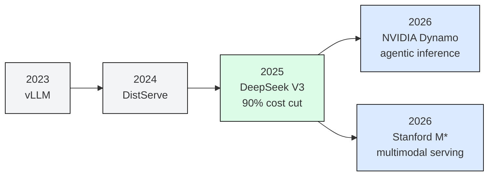

> "This workshop gives you the foundations to evaluate any new paper or tool. Let's start by experiencing the problem."

---

### Slide 5: What We Cover
**Foundations → Attention → KV Cache → Optimizations → Engines**

Chapters 00-06 of the book. Chapters 07-11 (multimodal, K8s, Ray) are in the repo for you to explore.

---

### Slide 6 → DEMO A: Feel the Pain
**Let's load Mistral-7B and see what happens.**

> `demos/demo_a_feel_the_pain.ipynb` (5 min)
> 
> What the audience sees:
> 1. "14.5 GB consumed just by weights"
> 2. "TTFT: 250ms. That's how long before the user sees ANYTHING."
> 3. "Longer prompt → 1200ms TTFT. It gets WORSE."
> 4. "Throughput: 40 tok/s. One user saturates the entire GPU."
>
> End with: "Why? Let's find out."

---

## PART 1: "Where did all my memory go?" (20 min)

> **Transition:** "We just saw 14.5 GB vanish and terrible latency. Let's understand why."

### Slide 7: One Transformer Layer
**Input → Attention → FFN → Output. Repeat 32 times.**

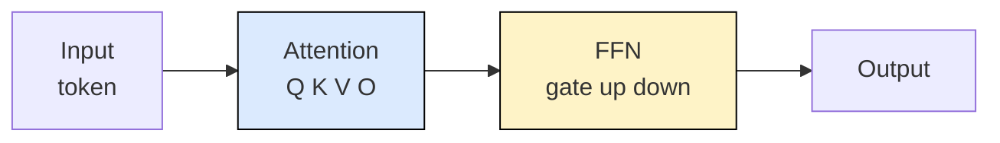

Each layer has weights: attention weights + FFN weights.
32 layers × weights per layer = 14.5 GB in FP16.

> "OK so weights are fixed at 14.5 GB. But we had 65 GB left on the A100. Should be plenty, right?"

**→ Wrong. Here's why.**

---

### Slide 8: The KV Cache Grows With Every User
**Weights are fixed. KV cache is not.**

Every token a user has in their conversation costs:
`2 × 32 layers × 8 KV heads × 128 dim × 2 bytes = 131 KB`

One user at 4K context: 131 KB × 4096 = **524 MB**
80 users at 4K context: 524 MB × 80 = **42 GB**

> "You had 65 GB free. 42 GB is now KV cache. Plus 8 GB overhead. You're at 64.5 / 80 GB."

**→ So memory is tight. But why does that make each token SLOW?**

---

### Slide 9: Prefill vs Decode
**Two phases. One is fast. One is the bottleneck.**

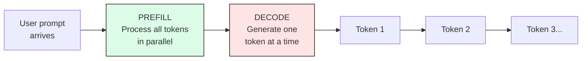

Prefill: compute-bound (parallel, uses GPU compute fully).
Decode: memory-bound (sequential, reads all weights + KV cache per token).

> "Decode reads 14.5 GB of weights + 42 GB of KV cache from memory. Every. Single. Token."

**→ How fast can we read that?**

---

### Slide 10: The Bandwidth Wall
**GPU memory hierarchy determines your speed.**

| Level | Size | Bandwidth |
|-------|------|-----------|
| SRAM | 20 MB | 19 TB/s |
| L2 | 40 MB | — |
| HBM | 80 GB | **2 TB/s** |

Decode reads 14.5 GB from HBM every step.
At 2 TB/s: `14.5 GB / 2 TB/s = 7.25 ms per token = 138 tokens/sec max`

> "The GPU has 312 TFLOPS of compute. We're using almost none of it."

**→ Can we fix this with a faster GPU?**

---

### Slide 11: The Roofline Says No
**You're 80x below peak compute.**

Arithmetic intensity of decode: `2 FLOP/byte`
Ridgeline: `156 FLOP/byte`

More FLOPS won't help. You're stuck at the memory bandwidth ceiling.

> "The only ways out: read LESS data, or serve MORE users per read."

---

### 🎯 DEMO B: Memory Equation (5 min)
> `demos/demo_b_memory_equation.ipynb`
> Derive: weights, KV per token, max users. Plot KV growth curve.
> End with: "Now you can calculate exactly how many users any GPU supports."

---

### Slide 12: The Batch-Latency Tradeoff
**Batching amortizes the weight read. But there's a catch.**

Batch=1: read 14.5 GB, produce 1 token. Wasted bandwidth.
Batch=80: read 14.5 + 42 GB, produce 80 tokens. Better utilization.

But: more users = more KV to read = slower per user.
Your SLO determines the actual max batch.

---

### Slide 13: The Capacity Equation
**Three numbers. That's all you need.**

```
Available VRAM = GPU_total − weights − overhead
Max users = Available / (131 KB × context_length)
```

For Mistral-7B on A100-80GB:
`(80 − 14.5 − 8) / (0.131 × 4096) = 107 users`

---

### Slide 14: Which GPU?
**More VRAM + more bandwidth = cheaper per token.**

| GPU | VRAM | Max Users | $/hr | $/M tokens |
|-----|------|-----------|------|-----------|
| A100-40 | 40 GB | 32 | $2.50 | $0.45 |
| A100-80 | 80 GB | 107 | $3.50 | $0.28 |
| H100-80 | 80 GB | 107 | $4.00 | $0.16 |
| H200-141 | 141 GB | 237 | $5.50 | $0.13 |

---

### 🎯 DEMO C: Capacity Calculator (5 min)
> `demos/demo_c_capacity_calculator.ipynb`
> Slide users, watch memory fill, see GPU comparison chart.
> End with: "Now we know the limits. Can we push them?"

---

## PART 2: "The first free lunch: attention architecture." (12 min)

> **Transition:** "We're stuck at 107 users on A100-80. The 131 KB per token is the bottleneck. Can we reduce it?"

### Slide 15: GQA Already Saved You
**Without GQA, that 131 KB would be 524 KB.**

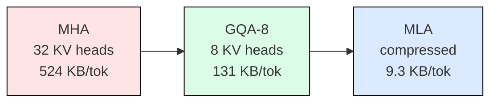

GQA groups 4 query heads per KV head. 4x savings. Already in every modern model.

> "This was free. You didn't have to do anything. But can we go further?"

---

### Slide 16: FlashAttention
**Same math. 6x less memory traffic.**

Standard attention writes N² scores to HBM. FlashAttention tiles in SRAM.
Never materializes the full attention matrix. Exact same output.

> "Also free. Enabled by default. What about the KV cache itself?"

---

### Slide 17: MLA (DeepSeek)
**Compress before caching. 56x savings.**

Store a 512-dim latent instead of full K (128d) + V (128d) per head.
Decompress at attention time. Why DeepSeek-V3 runs at 90% lower cost.

> "GQA is today. MLA is tomorrow. Both: same quality, less memory."

---

### 🎯 DEMO D: Attention Comparison (4 min)
> `demos/demo_d_attention_comparison.ipynb`
> Bar chart: MHA 524 KB vs GQA 131 KB vs MLA 9.3 KB.
> End with: "OK, we've reduced the per-token cost. Now: can we reduce the number of tokens stored?"

---

## PART 3: "Four ways to fix the KV cache." (20 min)

> **Transition:** "Attention architecture determines cost per token. These four techniques reduce what's actually stored."

### Slide 18: Four Levers

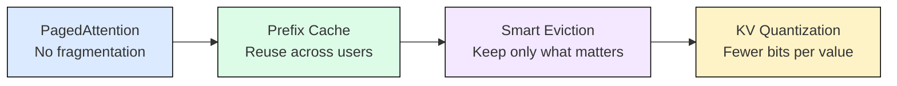

> "Each gives 2-10x. They're orthogonal. Stack all four."

---

### Slide 19: PagedAttention
**Like virtual memory for your GPU.**

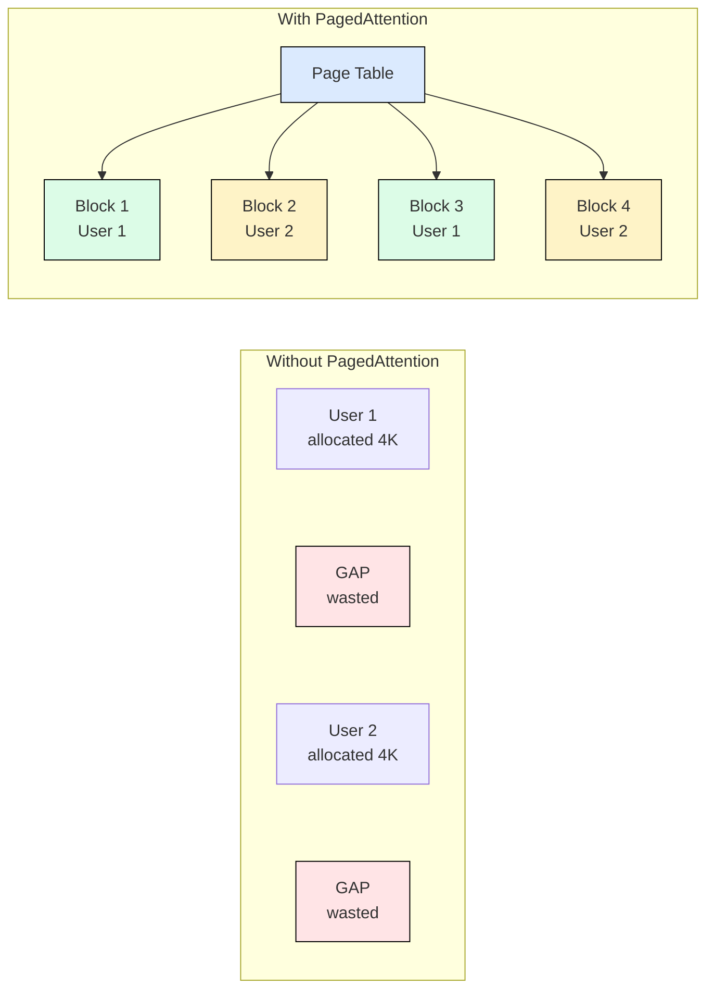

Problem: pre-allocating contiguous KV blocks wastes 50-70% to fragmentation.
Solution: page table with small blocks. Non-contiguous. Allocated on demand.

Result: **4x more concurrent users** on same hardware.
Built into vLLM. Zero code change.

> "Fragmentation fixed. But every user still pays full prefill. Can we avoid that?"

---

### Slide 20: Prefix Caching
**System prompt: computed once. Reused forever.**

Request 1: [system prompt 2000 tokens] → prefill (200ms) + decode
Request 2-N: [system prompt] → CACHE HIT (0ms) + decode only

Anthropic charges 10% for cached tokens. They save 90%.
Stripe agents: 85-97% cache hit rate.

> "From 200ms to 0ms for returning users. But what about the tokens we ARE caching? Do we need all of them?"

---

### 🎯 DEMO E: Prefix Caching (5 min)
> `demos/demo_e_prefix_caching.ipynb`
> 10 requests cold (all ~200ms) → warm (requests 2-10 at ~12ms).
> Bar chart showing the 15x improvement.

---

### Slide 21: NVIDIA Dynamo's Agentic Pattern
**Cache as a distributed session store.**

Agent: tool call → SUSPEND (KV cached with TTL) → resume → tool call → SUSPEND

11.7x read/write ratio. KV-aware routing. Priority eviction.
The frontier: treating KV cache like a database, not a buffer.

---

### Slide 22: Smart Eviction (H2O)
**90% of tokens contribute almost nothing.**

Attention follows a power law: 5% of tokens get 80% of the attention weight.
Heavy Hitter Oracle: keep those + a recent sliding window. Evict the rest.

Budget = 10-20% of full cache. Fits 5-10x longer context.

> "Kept 10% of the cache, lost <2% quality. But what about the values themselves? Can we make them smaller?"

---

### 🎯 DEMO F: Smart Eviction (5 min)
> `demos/demo_f_smart_eviction.ipynb`
> Real attention heatmap showing power law. H2O quality comparison.

---

### Slide 23: KV Quantization
**FP16 → INT8: 2x more users. One config flag.**

`--kv-cache-dtype fp8` in vLLM. Done.
Quality loss < 0.1% on most tasks (KV values are less sensitive than weights).

> "OK. We've squeezed the KV cache 4 ways. What about the model weights and the decode loop itself?"

---

## PART 4: "Three more levers beyond the KV cache." (18 min)

> **Transition:** "KV cache is one axis. These three optimize the model weights and the generation loop."

### Slide 24: Weight Quantization
**Same model. 4x less memory. Minor quality loss.**

FP16: 14.5 GB (baseline)
INT8: 7.2 GB (2x compression)
INT4 (NF4): 3.6 GB (4x compression)

More room for KV cache = more users.
Minor quality loss at INT4 on reasoning. For serving: quantize.

> "Smaller weights. But we're still generating one token at a time in a loop. Can we break that?"

---

### Slide 25: Continuous Batching
**Static batching wastes 50%+ of GPU time.**

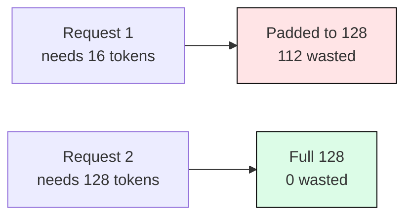

Static: all requests padded to max length. Short ones waste compute on padding.
Continuous: each request finishes independently. Slot in new ones immediately.

Result: 2-3x throughput improvement. Built into vLLM/SGLang.

> "No more padding waste. But decode is still sequential. One token per step. Can we go faster?"

---

### Slide 26: Speculative Decoding
**Draft fast. Verify cheap.**

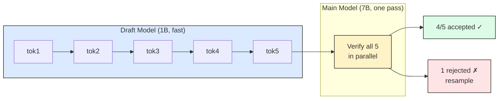

- Draft model generates 5 candidates sequentially (cheap, ~1ms total)
- Main model verifies all 5 in ONE forward pass (same cost as generating 1 token)
- Accepted tokens: free. Rejected: fall back to normal decode from that point.
- Acceptance rate: 70-85%. Net speedup: 2-3x. **Same output quality** (mathematically guaranteed).

> "Three more levers, all orthogonal. Let's prove them live."

---

### 🎯 DEMO H: Quantization + Batching (8 min)
> `demos/demo_h_quantization_batching.ipynb`
> 1. Real FP16 vs INT8 vs INT4: memory + throughput side by side
> 2. Real static vs continuous batching: measure padding waste
> 3. Speculative decoding (vLLM if available, AWS alternative otherwise)

---

## PART 5: "Who implements all of this?" (12 min)

> **Transition:** "You've seen 7 optimizations. The good news: you don't implement them yourself. Engines do."

### Slide 27: Three Engines, One Decision

| Engine | Implements | Best For |
|--------|-----------|----------|
| **vLLM** | PagedAttention + continuous batching + KV quant | General purpose |
| **SGLang** | RadixAttention (tree prefix cache) + structured output | Agents, multi-turn |
| **TensorRT-LLM** | AOT compilation + CUDA graphs + XQA kernels | Max throughput |

> "All three implement everything we discussed. They differ in what they're best at."

---

### Slide 28: vLLM Architecture
**The default choice. One command.**

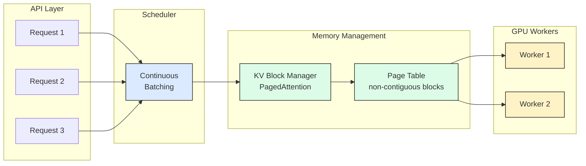

- Requests arrive asynchronously → scheduler forms dynamic batches
- KV Block Manager allocates/frees pages as requests start/finish
- No fragmentation, no padding, continuous insertion of new requests
- 24x throughput over HuggingFace

---

### Slide 29: SGLang Architecture
**RadixAttention: a tree of cached prefixes.**

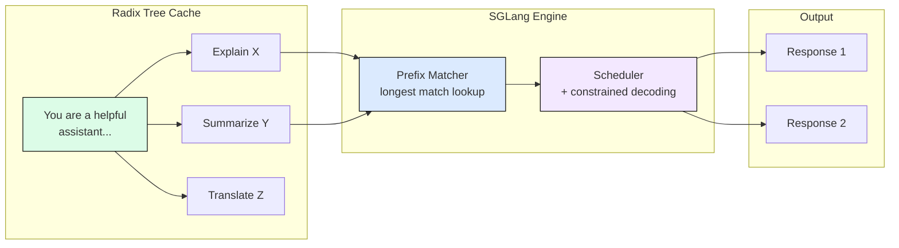

- All requests with shared system prompt share ONE cached prefix (green)
- New request: find longest matching prefix in tree → skip that prefill
- 5x cache hit rate over vLLM's hash-based approach
- Also: constrained decoding for structured output (JSON, regex)

Best for: agents with system prompts, multi-turn conversations, structured output.

---

### Slide 30: TensorRT-LLM Architecture
**Compile once. Run at hardware peak.**

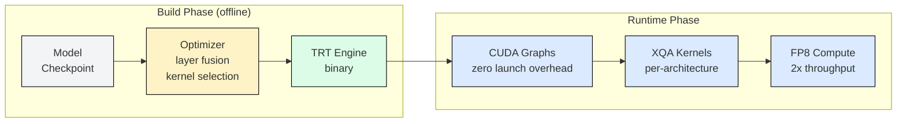

- Build: fuses layers, selects optimal kernels for YOUR specific GPU
- Runtime: CUDA graphs eliminate kernel launch overhead entirely
- XQA: custom attention kernels per architecture (Hopper, Ada, Ampere)
- FP8: native on H100/H200, 2x throughput over FP16
- Tradeoff: compile step (minutes), NVIDIA-only

---

### Slide 31: Decision Flow

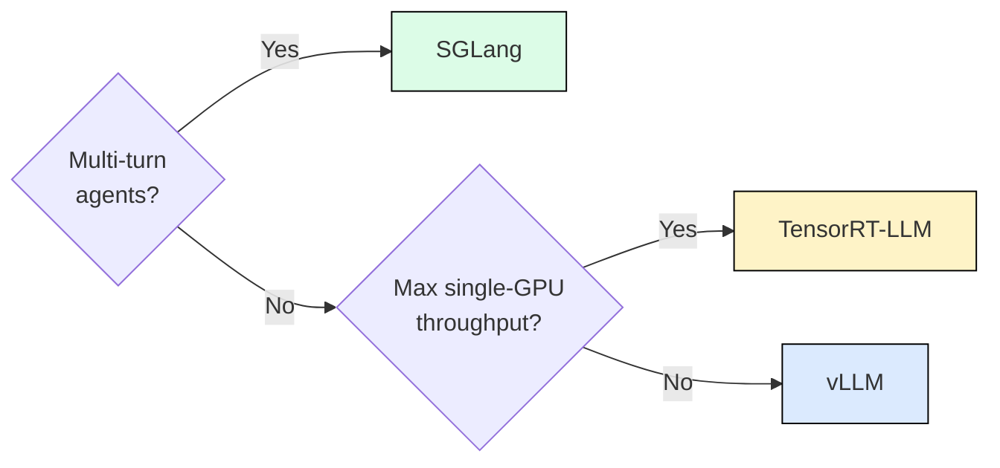

> "Most teams start with vLLM. Switch to SGLang if you're building agents."

---

### 🎯 DEMO G: Engine Benchmark (5 min)
> `demos/demo_g_engine_comparison.ipynb`
> Same model, same prompt: HF → vLLM → SGLang. Chart + cost table.
> End with: "Same hardware. 20x cheaper per token."

---

## CLOSING: "You now know the full stack." (13 min)

### Slide 32: Stack Everything
**Waterfall: baseline to 20x.**

| Optimization | Cumulative Improvement |
|---|---|
| Baseline (HF, FP16) | 1x |
| + GQA (4x less KV) | ~1x (already in model) |
| + INT4 weights | ~4x (more users fit) |
| + PagedAttention | ~8x (no fragmentation) |
| + Prefix cache | ~8x + 15x TTFT |
| + Continuous batching | ~16x throughput |
| + Speculative decode | ~20x |

> "Same GPU. Same model. 20x more capacity."

---

### Slide 33: The Decision Framework
**What you take home.**

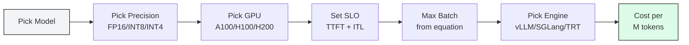

---

### Slide 34: What's Next (In the Repo)
**Chapters 07-11. Explore on your own.**

- Multimodal serving (Stanford M*, Walk Graphs, VoxServe)
- Kubernetes (KServe, llm-d, KAI Scheduler)
- Ray Serve, disaggregated serving (DistServe, Mooncake)
- Custom silicon (Groq LPU, Cerebras WSE-3)

---

### Slide 35: Numbers You Proved Today

| Number | What It Is |
|--------|-----------|
| 14.5 GB | Mistral-7B FP16 weight memory |
| 131 KB | KV cache cost per token |
| 80x | How far decode sits below compute peak |
| 4x | GQA savings over MHA |
| 4x | INT4 weight compression |
| 15x | Prefix caching TTFT improvement |
| 2-3x | Speculative decoding speedup |
| 24x | vLLM throughput over HuggingFace |

> "Every number was computed live. Reproducible in the notebooks."

---

### Slide 36: Resources + Q&A
**Go build.**

- GitHub: `github.com/harshuljain13/llm-inference-at-scale` (QR code)
- Molab: links for all 8 demo notebooks
- Book: Manning "LLM Inference in Action" (2027)

> "55+ modules, 12 chapters. Every concept has a lab. Questions?"

---

## Narrative Thread Summary

The story in one paragraph:

> We loaded a model and it was slow (Demo A). We learned it's because inference is memory-bound, not compute-bound (Part 1). We saw that attention architecture determines the KV cost per token, and modern models already give us 4x savings for free (Part 2). We discovered 4 techniques to optimize what's stored in the cache: page it, reuse prefixes, evict useless tokens, quantize values (Part 3). We found 3 more levers for the weights and decode loop: quantize weights, batch continuously, and decode speculatively (Part 4). And we saw that production engines implement ALL of this in one package, giving 20x improvement over naive HuggingFace (Part 5).

Each transition answers: "OK, but..." 
- "OK memory is used. But why is it SLOW?" → bandwidth wall
- "OK it's slow. But can we reduce what's stored?" → attention optimizations  
- "OK per-token cost is lower. But can we cache smarter?" → KV engineering
- "OK cache is optimized. But what about weights and the loop?" → quant + batching + speculative
- "OK there are 7 techniques. Do I implement them?" → engines do it for you
